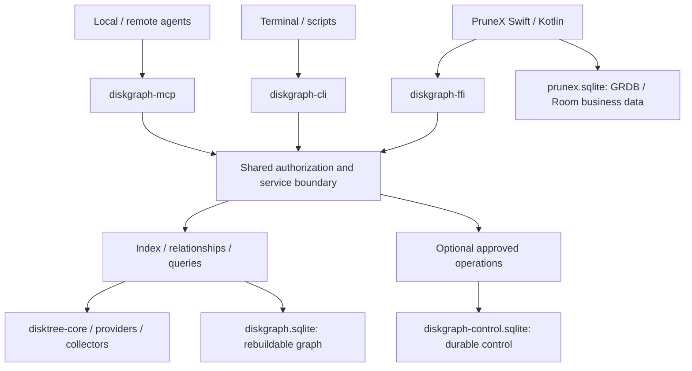

# DiskGraph

[English](README.md) | [简体中文](README.zh-CN.md)

A Rust file-relationship engine for AI agents and PruneX: understand disk usage, ownership, evidence, and historical growth through a reusable local index.

**Early library foundation, not a released cleanup application.** Development remains private by project policy; public distribution is deferred. Workspace version: `0.1.0`. Documentation baseline: `a89e57a`, verified on 2026-09-28.

```text
Today:   trusted Rust / UniFFI host → four library crates → native scan + SQLite + five queries
Target:  agents → CLI / MCP ─┐
         PruneX → FFI ──────┴→ shared engine → graph + evidence + optional authorized operations
```

## 1. What DiskGraph is

DiskGraph is intended to install independently, like a code graph tool for filesystem relationships. Persistent snapshots and bounded queries should reduce repeated traversal and oversized agent context. This efficiency is a design objective, not a measured performance claim.

PruneX is the product/UI layer, analogous in responsibility to disktree-app. DiskGraph is its shared engine, analogous to disktree-core but with graph history, evidence, agent access, and controlled operations planned. The DiskGraph project is not the single internal `diskgraph-core` crate.

DiskGraph reuses [DiskTree](https://github.com/tobi/disktree) scanning rather than replacing it. AgentScope-Swift/Kotlin orchestration, model selection, and PruneX business data belong to the host application. No LLM is required for the Rust foundation.

## 2. Current status and limits

| Area | Implemented foundation | Not yet implemented/verified |
| :--- | :--- | :--- |
| Models and queries | DiskSnapshot, DiskNode, EvidenceEdge; top, children, growth, explain, candidates | Typed ownership graph, service authorization, bounded graph traversal |
| Storage | Transactional SQLite snapshots, indexed nodes/evidence, paged children | Separate control database, target migrations, retention, WAL lifecycle |
| Scanning | Read-only native-path bridge to pinned disktree-core | Lossless end-to-end locators, app/project/process collectors, URI providers |
| Language bridge | UniFFI JSON v1 exports and binding-generation tooling | Packaged XCFramework/AAR and verified PruneX/device integration |
| Agent delivery | Formal OpenSpec plan and command catalog | Standalone CLI, MCP server, client installation/configuration |
| File operations | None | Approval, move/copy/trash/restore/purge, Cargo/Docker cleanup |

The current native scan produces no relationship evidence; conservative candidates therefore normally returns an empty list for a freshly scanned directory. Classification and candidates are not deletion permission.

The current library accepts caller-selected database/root paths. It is intended for a trusted host, not exposure to untrusted remote callers. The planned server's scope/authorization controls are not already present in this API.

CI is configured for macOS, Linux, and Windows. On this task's local macOS host, Rust 1.98.1 passed 9 existing unit tests, fmt, and Clippy. Remote CI, minimum Rust version, Swift/Kotlin compilation/runtime, and mobile-device behavior were not separately verified.

## 3. Build and verify today

Use an authorized checkout and run from its repository root. The manifest requires Rust 1.97 or newer, Edition 2024, and native build tooling for bundled SQLite. The verified toolchain was 1.98.1; obtain pinned dependencies before using offline mode.

```bash
cargo test --workspace --locked
cargo fmt --all --check
cargo clippy --workspace --all-targets --locked -- -D warnings
```

A small existing end-to-end library test creates a temporary directory/database and exercises scanning, querying, and JSON responses:

```bash
cargo test -p diskgraph-ffi read_only_bindings_scan_and_query_native_directory --locked
```

Expected result: the named test passes. This is not a CLI installation or cleanup demonstration. Tests use temporary fixtures; the scanner does not delete source files. It does write snapshot metadata to the chosen SQLite database.

There is no supported `cargo install diskgraph`, published-package installation, or runnable `diskgraph serve` quick start documented yet. Planned commands below are contracts, not executable instructions for this checkout.

## 4. Existing Rust and FFI surface

| Crate | Responsibility |
| :--- | :--- |
| [diskgraph-core](crates/diskgraph-core) | Serializable models and read-only query semantics |
| [diskgraph-store](crates/diskgraph-store) | SQLite snapshot persistence and indexed queries |
| [diskgraph-disktree](crates/diskgraph-disktree) | Native read-only scanner adapter |
| [diskgraph-ffi](crates/diskgraph-ffi) | UniFFI exports, JSON envelope, binding generator |

The existing [FFI source](crates/diskgraph-ffi/src/lib.rs) exports:

| Function | Purpose |
| :--- | :--- |
| capabilities_json | Report current platform capabilities; URI scanning and cleanup are false |
| scan_native_json | Scan a native root and persist its snapshot |
| latest_native_snapshot_json | Look up the latest snapshot for a native root |
| top_json | Rank children within a snapshot |
| children_json | Page children using offset/limit and next_offset |
| explain_json | Return the selected node and available evidence |
| growth_json | Compare a locator across two compatible snapshots |
| candidates_json | Return conservative review candidates toward a byte target |

All return JSON strings: `{"schema_version":1,"ok":true,"data":...}` or `{"schema_version":1,"ok":false,"error":"..."}`. top/children accept limits from 1 through 1000. Growth's signed delta_bytes is a decimal string; unavailable/incompatible comparisons return null data. JSON v2 in the technical design is planned, not the current envelope.

On macOS, generate Swift and Kotlin source bindings:

```bash
cargo build -p diskgraph-ffi --lib --locked
cargo run -p diskgraph-ffi --bin uniffi-bindgen -- generate \
  target/debug/libdiskgraph_ffi.dylib \
  --language swift --language kotlin --no-format --out-dir ./generated-bindings
```

This is a binding-generation recipe, not proof of native application integration. Generated source is not an XCFramework/AAR. Other platforms need their own library artifact and packaging validation. Hosts should run scanning off the UI thread.

## 5. Target architecture and storage ownership



CLI, MCP, and FFI share the Rust engine; MCP does not shell out to CLI, and PruneX does not require an MCP subprocess. Separate crates may ship in one executable distribution.

Rust owns graph and control schemas. PruneX owns UI preferences and model sessions in its own database. Separate databases do not by themselves solve native SQLite linking conflicts; Swift/Kotlin integration must test coexistence.

Remote agents query the server's authorized scopes through protocols. They do not mount SQLite or reinterpret server paths as local paths. ResourceRef identifies an observation; it grants no permission.

## 6. Planned commands and MCP transports

The [command reference](docs/command-reference.md) defines 29 command families:

| Group | Command families |
| :--- | :--- |
| Scope/index/history | scope, index, sync, status, snapshots, changes, growth |
| Navigation and evidence | explore, search, node, children, top, related, explain, impact |
| Review and content | candidates, duplicates, read |
| Planned actions | move, copy, trash, restore, purge |
| Execution records | plan, apply, operations |
| Delivery and diagnostics | serve, install, doctor |

Queries are read-only by default; indexing updates the index, content access needs separate permission, and action commands create plans rather than immediately changing files. See the catalog for exact stage, permission, and MCP mappings.

Target transports:

- stdio for local agent hosts; stdout contains protocol messages only.
- Streamable HTTP for server deployment with authentication, scope isolation, budgets, and encrypted transport.
- Legacy HTTP+SSE as a separate, optional compatibility adapter, disabled by default.

Modern HTTP streaming SSE is not evidence of legacy protocol compatibility. All transports require independent client testing and share the same authorization semantics.

## 7. Safety and privacy boundaries

Rebuildable evidence is not permission to delete. Protection, current process-use coverage, exact identity, directory descendants, and approval must be revalidated before mutations. Unknown is not safe. Untrusted filenames/manifests cannot become agent instructions.

The target workflow is inspect → immutable plan → trusted approval → live revalidation → recorded execution → reconciliation. The agent cannot issue its own arbitrary approval. No generic shell-execution tool or default global Docker prune is planned.

Prefer reversible trash/quarantine where supported, but same-volume trash does not itself release occupied blocks. Purge is irreversible without backups. Restore does not overwrite conflicting destinations. Report measured free-space deltas separately from logical bytes and disclose concurrent/system effects.

The foundation needs no model service. Planned content reading/hashing requires explicit permission, avoids cloud-placeholder hydration by default, and does not retain full content by default. PruneX Lite cloud export is separately controlled; Pro local operation does not depend on cloud models.

Do not publish tokens, personal paths, databases, or file contents in diagnostics. A dedicated vulnerability-reporting policy/channel is still to be established; use an existing trusted private maintainer channel for sensitive reports.

## 8. Platforms and roadmap

| Stage | Deliverable and acceptance boundary |
| :--- | :--- |
| P0 | Baseline, contracts, identity, scope and compatibility decisions |
| P1 | Snapshot/evidence storage and migration |
| P2 | Bounded structured queries and historical comparison |
| P3 | macOS standalone CLI/stdio delivery; real tasks in at least two agent hosts |
| P4 | Linux remote read-only service; Streamable HTTP and separate legacy compatibility |
| P5 | Recoverable approved operations and durable records |
| P6 | Higher-risk actions, exact ecosystem cleanup, irreversible permission |
| P7 | Content inspection, duplicates, Windows/desktop validation; mutations depend on P5/P6 |
| P8 | PruneX FFI integration; mutation UI depends on P5 |
| P9 | Android URI providers and restricted iOS document capabilities |
| P10 | Evaluation, packaging, licensing/signing checks, private delivery |

Android cannot inspect other apps' private directories merely because Rust is used. iOS is scoped to app-owned/user-selected documents, not whole-device cleanup or arbitrary app removal.

The [OpenSpec change](openspec/changes/implement-diskgraph-platform/proposal.md) contains 14 capability specs, 77 requirements, 100 scenarios, and 121 unchecked implementation tasks. Planning is not completion. No public release date, benchmark result, or cross-platform runtime claim is implied.

## 9. Documentation and contribution

| Document | English | 简体中文 |
| :--- | :--- | :--- |
| Architecture | [Architecture](docs/DiskGraph-Architecture.md) | [架构设计](docs/DiskGraph-Architecture.zh_CN.md) |
| Technical design | [Technical design](docs/DiskGraph-Technical-Design.md) | [技术方案](docs/DiskGraph-Technical-Design.zh_CN.md) |
| Project guide | [README](README.md) | [README](README.zh-CN.md) |

Additional references: [command catalog](docs/command-reference.md), [OpenSpec decisions D1–D15](openspec/changes/implement-diskgraph-platform/design.md), [tasks P0–P10](openspec/changes/implement-diskgraph-platform/tasks.md), and [historical source study](docs/reference-study.md). These supporting documents currently use Chinese. OpenSpec is the sole formal requirements/acceptance source; bilingual guides explain it.

Before changes, read the applicable specifications, preserve current v1 behavior, add behavior-focused tests, and run fmt/Clippy/tests. Do not mark tasks complete from compilation alone. Use isolated fixtures for destructive tests; do not test against user data. Keep translation pairs, commands, and capability-status claims synchronized.

## 10. License and provenance

[MIT](LICENSE), copyright 2026 Loong Wan. disktree-core is a Git dependency pinned to `158f9cc2f0b332194a3ffc5acec47760c99146d8`, not copied into this repository. Preserve upstream attribution and review licenses when packaging. Private development policy and the source license are separate matters.

---

Documentation version 1.1 · Updated 2026-09-28 · Design pending review; current implementation evidence is stated above.
