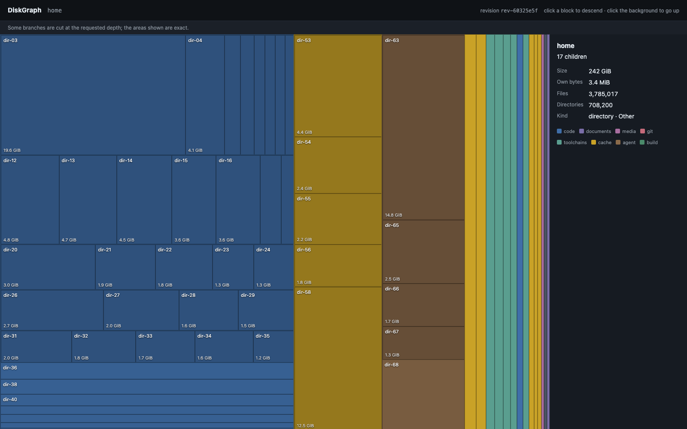
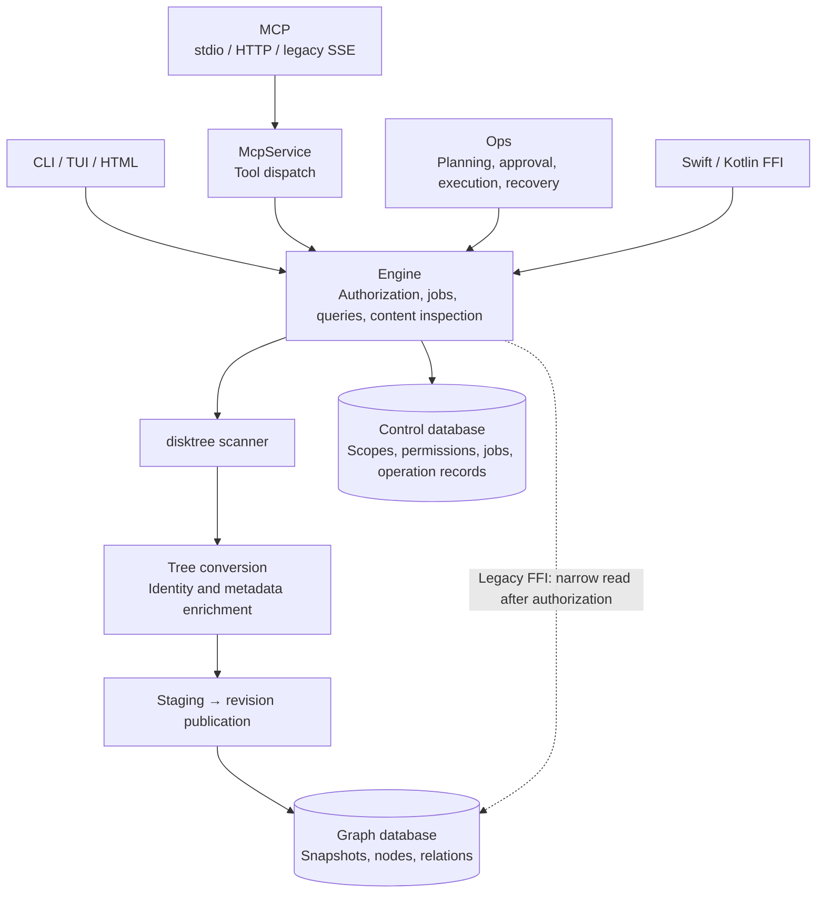

<div align="center">


# DiskGraph

**A file-relationship engine for AI agents — disk usage, ownership, evidence, and history, indexed locally**

`npx -y diskgraph --help` needs nothing on your machine. Everything stays in one directory on your disk.

[English](README.md) | [简体中文](README.zh-CN.md)

[](https://crates.io/crates/diskgraph-cli)
[](https://www.npmjs.com/package/diskgraph)
[](https://github.com/loong10k/homebrew-diskgraph)
[](LICENSE)

[](#install) [](#install) [](#install)
[](#connect-an-agent) [](#connect-an-agent)

</div>

---

## See it

Disk usage is a picture, not a number. Three surfaces draw the same map from the same index, so what you see in a terminal, a browser, or an agent's reply never disagrees.

<table>
<tr>
<td width="62%"></td>
<td valign="top" width="38%">

**Browser** — one self-contained file, no CDN, no build step. Above: a real
home directory, 3,782,118 files indexed (242 GiB), rendered at depth 4.
`--anonymize` is on, so every directory reads as `dir-01`, `dir-02` — the
picture is real, the names are not.

```bash
diskgraph tree --scope <id> --anonymize --html usage.html
```

Click a block to descend, click the background to go up. Hue is the category a collector assigned; brightness is the share of the parent.

</td>
</tr>
<tr>
<td valign="top" width="62%">

**Terminal** — walks one directory level at a time, so a four-million-node index opens instantly:

```bash
diskgraph tui --scope <id> --anonymize
```

<pre>
 home   242 GiB  3782118 files   ↑↓ move · enter descend · esc/backspace up · s sort · m threshold ·
┌ disk usage · rev-68989ca6-4d43-4d8a-8d37-be9564920a30────────────┐┌ selection ───────────────────┐
│ ┌dir-300 …────────────────────────┐dir-02 37…dir-03 3…           ││dir-01                        │
│ │                                 │                              ││size       123 GiB            │
│ │                                 │                              ││files      2618294            │
│ │                                 │                              ││kind       directory          │
│ │                                 │                              ││category   Code               │
│ │                                 │                              ││children   true               │
│ │                                 │                              ││                              │
│ └─────────────────────────────────┘                              ││                              │
│                                                                  ││                              │
└──────────────────────────────────────────────────────────────────┘└──────────────────────────────┘
</pre>

</td>
<td valign="top" width="38%">

**Agent** — the same map as text, inside the conversation:

```text
diskgraph_top {"scope":"…","format":"treemap"}
```

<pre>
      SIZE      TOTAL    FILES
──────────────────────────────────────────────
▎workspaces ███████████████████████████   310 MiB      3  Code
 Library    ████████▌                  55.0 MiB      1  Cache
 Media      ████▎                      25.0 MiB      1  Other

3 entries · 390 MiB in 5 files
</pre>

</td>
</tr>
</table>

## Why

| You have | Its limit | DiskGraph |
| :--- | :--- | :--- |
| `du`, `ncdu` | one tree, no history, re-walks every run | persistent snapshots; compare two points in time |
| Finder / Explorer | pretty, but not queryable by an agent | bounded JSON that the same engine answers from |
| disktree | beautiful, human-only | the same squarified map, plus CLI / MCP / FFI over one index |
| An agent with a shell | burns context listing directories | typed relations, evidence, and a map in one call |

DiskGraph is a **graph, not a viewer**. Every directory is a node with typed relations — owned by a project, rebuilt by a tool, protected — and every answer points at the evidence that produced it.

## Install

```bash
# macOS
brew install loong10k/diskgraph/diskgraph

# anywhere, no toolchain needed
npx -y diskgraph --version

# Debian / Ubuntu  (from the GitHub release)
sudo dpkg -i diskgraph_0.2.1_amd64.deb

# Fedora / RHEL    (from the GitHub release)
sudo dnf install diskgraph-0.2.1-1.x86_64.rpm

# Windows
winget install loong10k.DiskGraph          # or: scoop install diskgraph

# from source
cargo install diskgraph-cli
```

The CLI and the MCP server (`diskgraph-mcp`) install together. Prebuilt binaries need no Rust; building from source needs 1.97+.

## Get started

```bash
cd ~/projects/somewhere && diskgraph init
```

`init` indexes the directory you are standing in, writes the index to
`./.diskgraph`, and — with `--yes` — drops a marked block into the
instruction file each agent on this machine reads (`AGENTS.md`, `.claude/CLAUDE.md`).
Your own lines in those files are never touched, and running `init` again
refreshes the index instead of starting over. `--uninstall` takes the blocks
back out; `--print-only` shows you the text first.

To drive it by hand instead:

```bash
# 1. register a directory to watch (prints a scope id)
diskgraph scope add --root ~/projects --data-dir ~/.diskgraph

# 2. index it and wait for the walk to publish a revision
diskgraph index --scope <scope-id> --data-dir ~/.diskgraph --wait

# 3. look at it
diskgraph top  --scope <scope-id> --data-dir ~/.diskgraph
diskgraph tree --scope <scope-id> --data-dir ~/.diskgraph --depth 4 --html usage.html
diskgraph tui  --scope <scope-id> --data-dir ~/.diskgraph
```

Every command answers with a machine-readable envelope under `--json`, and every error carries a stable code (see [`RELEASING.md`](RELEASING.md) and `diskgraph --help`).

## Connect an agent

```bash
# Codex CLI
codex mcp add diskgraph -- diskgraph-mcp --data-dir ~/.diskgraph --profile all

# Claude Code, Cursor, or any MCP host
claude mcp add diskgraph -- diskgraph-mcp --data-dir ~/.diskgraph --profile all
```

Eighteen read tools today; profiles (`read-minimal`, `read-full`, `manage`, `all`) decide which are listed. Every HTTP/SSE bind, including loopback, requires a signed token, and every connection is body-, rate-, and quota-limited.

## Measured

On an Apple Silicon host, against a real home directory (4,526,858 files, 261 GiB observed):

| Measurement | |
| :--- | :--- |
| Full index: walk, stage, publish | 4 m 17 s |
| Tree render, `--depth 3`, structured read path | 10.1 s |
| Load path after the v4 structured-column change | 2.4× faster |
| Peak memory during a tree render | bounded by the rendered depth, not the index size |

These are measurements from this repository's acceptance records ([`docs/acceptance/`](docs/acceptance/)), not targets or estimates.

## Safety

- **Read-only by default.** The catalog commands that could move or delete a file answer `unsupported` until the review surface ships; nothing is quietly enabled.
- **Local only.** Everything happens inside `--data-dir` (two SQLite files). Nothing phones home, and the HTML report has no external references at all.
- **Honest coverage.** A walk that hits a budget, a depth limit, or an unreadable directory says so; a truncated view never renders like a complete one.
- **Separate data and control.** The graph database is rebuildable by rescanning; the control database holds scopes, policies, and operation history and is never touched by retention.
- **Unsigned today.** macOS Gatekeeper and Windows SmartScreen will warn until signing is configured — a recorded gap, not an oversight.

## Under the hood

Ten crates, one engine. `core` holds the model, the bounded queries, and the squarified layout the three surfaces share; `store` keeps snapshots and control data apart; `engine` orchestrates durable jobs and the authorized surface; `ops` plans and executes approval-gated operations; `mcp` speaks the protocol over stdio, Streamable HTTP, and legacy SSE; `ffi` reaches Swift and Kotlin.

The scanner is [disktree](https://github.com/tobi/disktree)'s, vendored at a pinned revision whose per-file digests are verified on every build — reused, not reimplemented.



Legacy FFI signatures remain compatible. Engine now checks actual snapshot/revision ownership and live authorization before opening a read connection. Raw store APIs remain trusted internal compatibility entry points. The hardening record below separates implementation from platform acceptance.

Store and Engine entry files now contain declarations and stable reexports. Real implementations are grouped by responsibility, with each production object in its own file. Engine remains the single owner of connection and task state; this source organization adds no runtime service layer. See the [Engine source boundaries](crates/diskgraph-engine/README.md#source-boundaries--源码边界) and [store boundaries](crates/diskgraph-store/README.md#source-boundaries--源码边界).

### Security and performance hardening (2026-10-01)

HTTP and both SSE transports require authentication, including loopback, and validate Origin. Request permissions intersect token capabilities with live database grants; remote startup grants no local administration. Revision access checks actual server/scope ownership. Issuer + subject now map to a SHA-256 principal, so old remote grants must be reissued. Ambiguous legacy ownership is denied until an administrator reindexes.

For a deployed listener, pass `--auth-key-file ISSUER AUDIENCE PATH` to `diskgraph-mcp` or `diskgraph serve`; keep the key file private to the service identity. The older inline `--auth` form exposes the verifier key in process arguments and is retained only for compatibility.

Common MCP node, children, top, search and positive-target candidate queries use narrow reads. Impact traversal reuses one authorized reader per request. Candidates return selected bytes, the remaining target and truncation status; they remain review-only. Unicode lowercase substring search is preserved; new keyset search cursors bind principal, scope, revision, filters, sorting and policy version. Old cursors require a fresh query. Trees and history report truncation. Jobs use 30-second leases, 5-second renewal and fencing. Scanner budgets are checked cooperatively every 20 ms; strict RSS bounds are not promised. `--max-staging-bytes` counts encoded metadata, defaults to 2 GiB, and does not charge source file capacity.

Trees and CLI/MCP history share one deadline across preparation, bounded reads,
encoding and terminal authorization. History counts both sides' decoded nodes;
all capability checks finish before both sides' persisted grants are rechecked.
Late reports identify partial statistics; late sync plans return an error.
CLI JSON errors and MCP business diagnostics also bound actual JSON escaping.
These checks preserve numeric minimum-size filtering and do not promise hard
wall-clock or RSS limits. Full-platform acceptance remains tracked separately.

```bash
diskgraph snapshots prune --scope SCOPE_ID --keep-last 3          # preview
diskgraph snapshots prune --scope SCOPE_ID --keep-last 3 --apply  # explicit reclamation
```

Pruning protects latest, pins and operation/recovery references; ambiguous old references retain the whole scope. Logical SQLite deletion does not immediately shrink database files. Dangerous CLI/MCP file tools remain disabled. See the [acceptance and performance record](docs/security-performance-hardening-2026-10-01.md) and [raw measurements](docs/benchmarks/hardening-2026-10-01.json). Local macOS evidence does not certify Linux/Windows native writes.

The follow-up review also bounds HTTP framing and connection time, checks impact queries against the revision's actual owner, persists cross-process cancellation, and isolates FFI control data by graph database. Existing file-operation plans must be recreated because execution now requires a complete plan digest and source fingerprint. The TUI pages wide directories 512 entries at a time; its name sort applies to the visible page.

Read-only CLI/MCP binary acceptance runs in the CI matrix and native release jobs with isolated signed-token grants. Local commands are `python scripts/accept-readonly-stdio.py` and `python scripts/accept-readonly-http.py`. The [desktop readiness record](docs/production-readiness-readonly-2026-10-02.md) records the passing macOS, Linux, and Windows native package gate and its limits; production deployment has not yet occurred. The full-platform expansion is still in progress. Native FFI, mobile providers, native writes and signed distribution have separate gates; see the [full-platform status and current fixes](docs/production-readiness-full-platform-2026-10-02.md).

Windows local ordinary-file content inspection now uses retained native directory/file handles, bounded reads and complete native identity checks. NTFS CI covers mutation, writer/parent conflicts, junction refusal, byte limits and live revocation. Real cloud-provider no-download behavior, other filesystems and native writes remain separate gates; see the [native-content acceptance record](docs/production-readiness-full-platform-2026-10-02.md).

Graph schema 11 retains new scan locators as encoding-qualified raw bytes and
stores each node's own modification time alongside the v1 display projection.
Staging budgets include these fields. Authorized node reads refuse unknown,
foreign-platform or legacy display-only locators; old snapshots remain available
for display queries and need reindexing before reliable native addressing.
The pinned scanner still rejects unsupported non-Unicode names; this migration
does not establish arbitrary non-UTF-8 scan support or enable native writes.

## Documentation

| | |
| :--- | :--- |
| Command and MCP reference | [`docs/command-reference.md`](docs/command-reference.md) |
| Quick start (`--help` text) | [`crates/diskgraph-cli/QUICKSTART.md`](crates/diskgraph-cli/QUICKSTART.md) |
| Release channels and runbook | [`RELEASING.md`](RELEASING.md) |
| Acceptance records behind every number | [`docs/acceptance/`](docs/acceptance/) |
| Architecture / technical design | [`docs/DiskGraph-Architecture.md`](docs/DiskGraph-Architecture.md) · [设计](docs/DiskGraph-Architecture.zh_CN.md) |
| Requirements (the formal source) | [OpenSpec change](openspec/changes/implement-diskgraph-platform/proposal.md) — 14 specs, 84 requirements, 129 tasks |

## Contributing

Issues and pull requests are welcome. Run the gates before you push:

```bash
scripts/gates.sh
```

## License

[MIT](LICENSE), © 2026 Loong Wan. Includes a vendored copy of disktree-core (MIT, © Tobi Lütke) at revision `158f9cc` — see [`crates/diskgraph-disktree-core/VENDORED.md`](crates/diskgraph-disktree-core/VENDORED.md).
