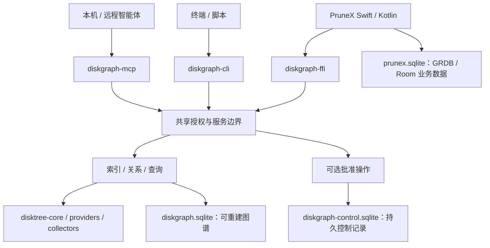

# DiskGraph

[English](README.md) | [简体中文](README.zh-CN.md)

面向智能体与 PruneX 的 Rust 文件关系引擎：通过可复用的本地索引，理解磁盘占用、文件归属、证据与历史增长。

**当前是早期库基础，不是已经发布的清理应用。** 按项目策略暂不公开，公开发行延后。workspace 版本：`0.1.0`。文档源码基线：`a89e57a`，核验日期：2026-09-28。

```text
当前：可信 Rust / UniFFI 宿主 → 四个库 crate → 原生扫描 + SQLite + 五个查询
目标：智能体 → CLI / MCP ─┐
      PruneX → FFI ───────┴→ 共享引擎 → 图谱 + 证据 + 可选授权操作
```

## 1. DiskGraph 是什么

DiskGraph 的目标是像代码关系图工具一样独立安装，为文件系统建立关系图。持久快照和有界查询用于减少重复遍历、控制智能体上下文；这是设计目标，不是已经测得的性能结论。

PruneX 是产品与界面层，职责上类似 disktree-app；DiskGraph 是共享引擎，职责上类似 disktree-core，但计划增加历史图谱、证据、智能体接入与受控操作。DiskGraph 项目不能与内部的单个 `diskgraph-core` crate 混为一谈。

DiskGraph 复用 [DiskTree](https://github.com/tobi/disktree) 扫描能力，不重新发明扫描器。AgentScope-Swift/Kotlin 编排、模型选择与 PruneX 业务数据属于宿主应用。Rust 基础能力不需要 LLM。

## 2. 当前进度与限制

| 领域 | 已有基础 | 尚未实现或验证 |
| :--- | :--- | :--- |
| 模型与查询 | DiskSnapshot、DiskNode、EvidenceEdge；top、children、growth、explain、candidates | 类型化归属图、服务授权、有界图遍历 |
| 存储 | 事务式 SQLite 快照、节点/证据索引、子节点分页 | 独立控制库、目标迁移、保留策略、WAL 生命周期 |
| 扫描 | 依赖固定版本 disktree-core 的原生路径只读桥接 | 端到端无损定位、应用/项目/进程采集器、URI provider |
| 语言桥接 | UniFFI JSON v1 导出与绑定生成工具 | XCFramework/AAR 发行包及 PruneX/真机集成验收 |
| 智能体交付 | 正式 OpenSpec 计划与命令目录 | 独立 CLI、MCP 服务、客户端安装/配置 |
| 文件操作 | 无 | 批准、移动/复制/回收/恢复/永久删除、Cargo/Docker 清理 |

当前原生扫描不产生关系证据，因此对刚扫描的目录，保守 candidates 通常返回空列表。分类与候选都不是删除许可。

现有库接受调用者选择的数据库与根路径，面向可信宿主，不可直接暴露给不可信远程调用者。目标服务的 scope/授权控制尚未存在于当前 API 中。

CI 配置覆盖 macOS、Linux、Windows。本轮在本机 macOS/Rust 1.98.1 上通过 9 个既有单元测试、fmt 和 Clippy；未单独验证远程 CI、最低 Rust 版本、Swift/Kotlin 编译运行与移动真机行为。

## 3. 现在如何构建与验证

在已授权的代码副本根目录运行。manifest 要求 Rust 1.97 或更新版本、Edition 2024，以及构建 bundled SQLite 所需的原生工具链。本轮实测为 1.98.1；offline 模式要求依赖已经缓存。

```bash
cargo test --workspace --locked
cargo fmt --all --check
cargo clippy --workspace --all-targets --locked -- -D warnings
```

一个现有的小型端到端库测试会创建临时目录和数据库，验证扫描、查询与 JSON 返回：

```bash
cargo test -p diskgraph-ffi read_only_bindings_scan_and_query_native_directory --locked
```

预期结果是该测试通过。这不是 CLI 安装或清理演示。测试使用临时 fixture；扫描器不会删除源文件，但会向指定 SQLite 数据库写入快照元数据。

当前没有可按本文执行的 `cargo install diskgraph`、已发布包安装流程或 `diskgraph serve` 快速启动。下文计划命令是目标合同，不是当前 checkout 已支持的操作指令。

## 4. 现有 Rust 与 FFI 接口

| Crate | 职责 |
| :--- | :--- |
| [diskgraph-core](crates/diskgraph-core) | 可序列化模型与只读查询语义 |
| [diskgraph-store](crates/diskgraph-store) | SQLite 快照持久化与索引查询 |
| [diskgraph-disktree](crates/diskgraph-disktree) | 原生只读扫描适配 |
| [diskgraph-ffi](crates/diskgraph-ffi) | UniFFI 导出、JSON 包装与绑定生成器 |

现有 [FFI 源码](crates/diskgraph-ffi/src/lib.rs) 导出以下函数：

| 函数 | 用途 |
| :--- | :--- |
| capabilities_json | 报告当前平台能力；URI 扫描与清理为 false |
| scan_native_json | 扫描原生根路径并保存快照 |
| latest_native_snapshot_json | 查询原生根路径的最新快照 |
| top_json | 对快照内子节点按大小排序 |
| children_json | 使用 offset/limit 和 next_offset 分页 |
| explain_json | 返回选定节点及已有证据 |
| growth_json | 比较两个兼容快照中的定位对象 |
| candidates_json | 按字节目标返回保守审阅候选 |

均返回 JSON 字符串：`{"schema_version":1,"ok":true,"data":...}` 或 `{"schema_version":1,"ok":false,"error":"..."}`。top/children 的 limit 范围为 1 到 1000。growth 的有符号 delta_bytes 使用十进制字符串；无法取得或不兼容时 data 为 null。技术方案中的 JSON v2 是目标，不是当前返回结构。

在 macOS 上生成 Swift 与 Kotlin 源码绑定：

```bash
cargo build -p diskgraph-ffi --lib --locked
cargo run -p diskgraph-ffi --bin uniffi-bindgen -- generate \
  target/debug/libdiskgraph_ffi.dylib \
  --language swift --language kotlin --no-format --out-dir ./generated-bindings
```

这是绑定生成方法，不是原生应用集成证明。生成源码不等于 XCFramework/AAR；其他平台需要各自的库文件与打包验证。宿主应在 UI 线程之外执行扫描。

## 5. 目标架构与数据库所有权



CLI、MCP、FFI 共用 Rust 引擎；MCP 不通过 shell 调用 CLI，PruneX 不需要 MCP 子进程。独立 crate 可以共同打包为一个可执行发行物。

Rust 管理图谱与控制库 schema；PruneX 在自己的数据库保存界面偏好和模型会话。数据库分开不能自动解决原生 SQLite 链接冲突，Swift/Kotlin 集成仍需验证共存。

远程智能体通过协议查询服务器授权范围，不挂载 SQLite，也不把服务器路径解释成本机路径。ResourceRef 标识一次观察，不授予权限。

## 6. 计划命令与 MCP 传输

[命令参考](docs/command-reference.md) 定义了 29 个命令族：

| 分类 | 命令族 |
| :--- | :--- |
| 范围/索引/历史 | scope、index、sync、status、snapshots、changes、growth |
| 导航与证据 | explore、search、node、children、top、related、explain、impact |
| 审阅与内容 | candidates、duplicates、read |
| 操作规划 | move、copy、trash、restore、purge |
| 执行记录 | plan、apply、operations |
| 交付与诊断 | serve、install、doctor |

查询默认只读；建立索引会更新索引数据；正文访问需要单独权限；动作命令生成计划，不立即修改文件。精确阶段、权限与 MCP 映射以命令目录为准。

目标支持三种传输：

- stdio：本地智能体宿主使用，stdout 只输出协议消息。
- Streamable HTTP：服务器部署，具备身份认证、scope 隔离、预算与加密传输。
- 旧 HTTP+SSE：单独的可选兼容适配器，默认关闭。

现代 HTTP 流式 SSE 不能证明旧协议兼容。三种传输分别做客户端实测，共享同一套授权语义。

## 7. 安全与隐私边界

可重建证据不是删除许可。修改前必须重验保护、当前进程占用覆盖、精确身份、目录后代与批准。未知不等于安全。不可信文件名、清单不能变成智能体指令。

目标流程是观察 → 不可变计划 → 可信批准 → 实时重验 → 留痕执行 → 对账。智能体不能任意批准自己的请求。不设计通用 shell 执行工具，也不默认全局 Docker prune。

能力允许时优先可恢复的回收站/隔离区，但同卷回收不会立即释放占用。purge 没有备份就不可恢复；restore 不覆盖冲突目标。实测空闲变化与逻辑处理字节分开，明确并发写入和系统因素的影响。

基础能力无需模型服务。计划中的正文读取/哈希需要明确权限，默认不触发云占位下载，不默认保存完整正文。PruneX Lite 云端导出单独控制；Pro 本地能力不依赖云模型。

诊断中不要公开令牌、个人路径、数据库或文件正文。专用漏洞报告策略/渠道仍待建立；敏感问题使用已有可信的维护者私密渠道反馈。

## 8. 平台与路线

| 阶段 | 交付内容与验收边界 |
| :--- | :--- |
| P0 | 基线、合同、身份、范围与兼容决策 |
| P1 | 快照/证据存储与迁移 |
| P2 | 有界结构化查询与历史比较 |
| P3 | macOS 独立 CLI/stdio 交付；至少两个智能体宿主真实任务 |
| P4 | Linux 远程只读服务；Streamable HTTP 与独立旧协议兼容 |
| P5 | 可恢复的批准操作与持久记录 |
| P6 | 高风险动作、精确生态清理与不可逆权限 |
| P7 | 内容检查、重复识别、Windows/桌面验证；写验收依赖 P5/P6 |
| P8 | PruneX FFI 集成；写界面依赖 P5 |
| P9 | Android URI provider 与受限 iOS 文档能力 |
| P10 | 评测、打包、许可/签名校验与私有交付 |

Android 不会因为底层使用 Rust 就能读取其他 App 私有目录。iOS 限于 App 自有和用户选择的文档，不承诺整机清理或任意卸载应用。

[OpenSpec 变更](openspec/changes/implement-diskgraph-platform/proposal.md) 包含 14 个能力规格、77 条要求、100 个场景、121 个未勾选实施任务。规划完成不等于实现完成；这里不承诺公开发布日期、基准成绩或跨平台运行结果。

## 9. 文档与贡献

| 文档 | English | 简体中文 |
| :--- | :--- | :--- |
| 架构 | [Architecture](docs/DiskGraph-Architecture.md) | [架构设计](docs/DiskGraph-Architecture.zh_CN.md) |
| 技术方案 | [Technical design](docs/DiskGraph-Technical-Design.md) | [技术方案](docs/DiskGraph-Technical-Design.zh_CN.md) |
| 项目指南 | [README](README.md) | [README](README.zh-CN.md) |

其他资料：[命令目录](docs/command-reference.md)、[OpenSpec 决策 D1–D15](openspec/changes/implement-diskgraph-platform/design.md)、[P0–P10 任务](openspec/changes/implement-diskgraph-platform/tasks.md)、[历史源码调研](docs/reference-study.md)。这些支撑资料目前使用中文。OpenSpec 是正式需求与验收的唯一事实源，双语指南负责解释。

修改前阅读适用规格，保护现有 v1 行为，补充行为测试并执行 fmt/Clippy/tests。不能仅因编译成功就勾选任务。破坏性测试使用隔离 fixture，不对用户数据执行。语言对、命令示例与能力状态需要同步维护。

## 10. 许可与来源

[MIT](LICENSE)，copyright 2026 Loong Wan。disktree-core 通过 Git 依赖固定到 `158f9cc2f0b332194a3ffc5acec47760c99146d8`，没有复制到本仓库。打包时保留上游署名并审查许可。私有开发策略与源码许可是不同事项。

---

文档版本 1.1 · 更新日期 2026-09-28 · 设计待评审；当前实现证据见上文。
