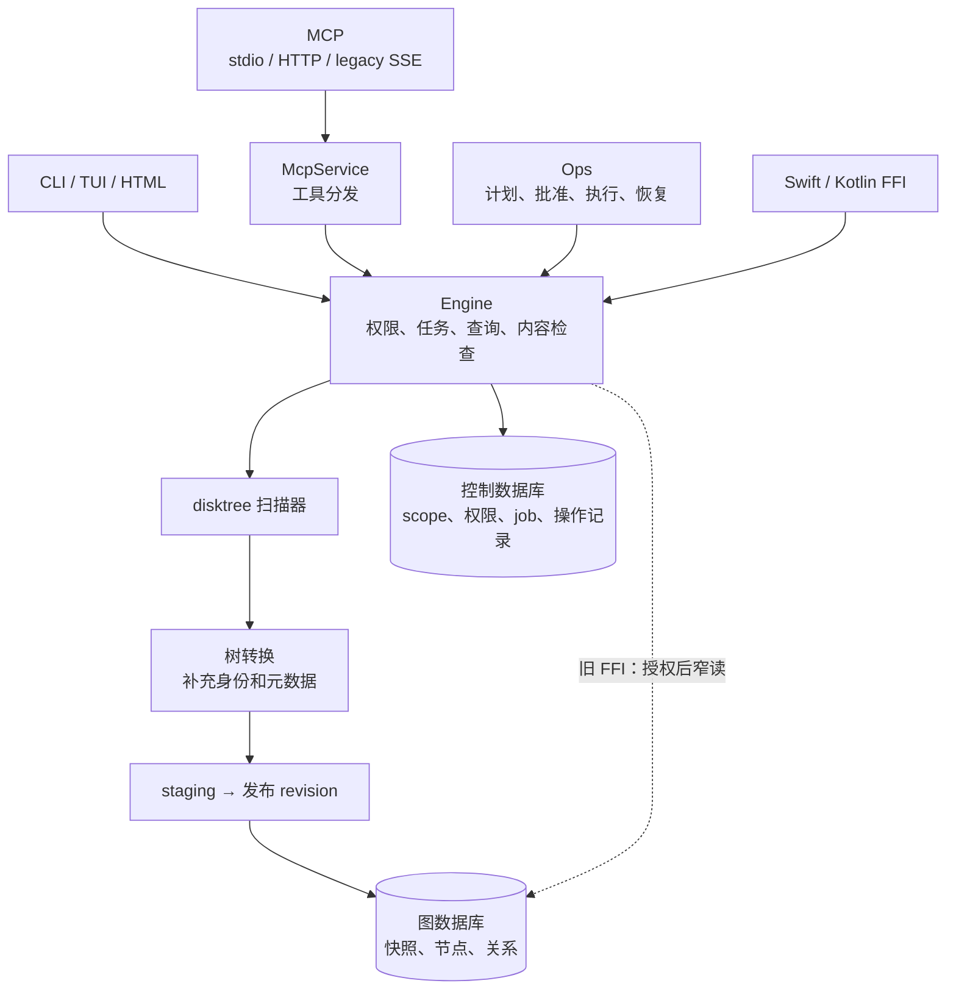

<div align="center">


# DiskGraph

**面向 AI 智能体的文件关系引擎 —— 磁盘占用、文件归属、证据与历史，全部索引在本地**

`npx -y diskgraph --help` 不需要你机器上装任何东西。所有数据都留在磁盘上的一个目录里。

[English](README.md) | [简体中文](README.zh-CN.md)

[](https://crates.io/crates/diskgraph-cli)
[](https://www.npmjs.com/package/diskgraph)
[](https://github.com/loong10k/homebrew-diskgraph)
[](LICENSE)

[](#安装) [](#安装) [](#安装)
[](#接入智能体) [](#接入智能体)

</div>

---

## 先看效果

磁盘占用是一张图，不是一个数字。终端、浏览器和智能体界面共享 Engine，在同一 scope、revision 下使用一致的语义；索引更新后，不同 revision 的视图可以变化。

<table>
<tr>
<td width="62%"></td>
<td valign="top" width="38%">

**浏览器** —— 单个自包含文件，零 CDN、零构建。上图：真实家目录，3,782,118 个文件已索引
（242 GiB），深度 4 渲染。开了 `--anonymize`，所以每个目录都叫 `dir-01`、`dir-02`
—— 图形是真的，名字不是。

```bash
diskgraph tree --scope <id> --anonymize --html usage.html
```

点击色块下钻，点击背景返回。色相是采集器给出的分类，明暗是占父目录的比例。

</td>
</tr>
<tr>
<td valign="top" width="62%">

**终端** —— 逐层按需加载，四百万节点的索引也能秒开：

```bash
diskgraph tui --scope <id> --anonymize
```

<pre>
 home   242 GiB  3782118 files   ↑↓ move · enter descend · esc/backspace up · s sort · m threshold ·
┌ disk usage · rev-68989ca6-4d43-4d8a-8d37-be9564920a30────────────┐┌ selection ───────────────────┐
│ ┌dir-300 …────────────────────────┐dir-02 37…dir-03 3…           ││dir-01                        │
│ │                                 │                              ││size       123 GiB            │
│ │                                 │                              ││files      2618294            │
│ │                                 │                              ││kind       directory          │
│ │                                 │                              ││category   Code               │
│ │                                 │                              ││children   true               │
│ │                                 │                              ││                              │
│ └─────────────────────────────────┘                              ││                              │
│                                                                  ││                              │
└──────────────────────────────────────────────────────────────────┘└──────────────────────────────┘
</pre>

</td>
<td valign="top" width="38%">

**智能体** —— 同一张地图的文本形态，直接出现在对话里：

```text
diskgraph_top {"scope":"…","format":"treemap"}
```

<pre>
      SIZE      TOTAL    FILES
──────────────────────────────────────────────
▎workspaces ███████████████████████████   310 MiB      3  Code
 Library    ████████▌                  55.0 MiB      1  Cache
 Media      ████▎                      25.0 MiB      1  Other

3 entries · 390 MiB in 5 files
</pre>

</td>
</tr>
</table>

## 为什么

| 你现在用的 | 它的边界 | DiskGraph |
| :--- | :--- | :--- |
| `du`、`ncdu` | 只有一棵树、没有历史、每次都要重扫 | 持久快照，能比较两个时间点 |
| Finder / 访达 | 好看，但智能体没法查询 | 同一引擎给出的有界 JSON |
| disktree | 漂亮，但只给人看 | 同样的 squarified 地图，外加 CLI / MCP / FFI |
| 给智能体一个 shell | 列目录就把上下文烧光了 | 类型化关系 + 证据 + 一次调用出图 |

DiskGraph 是**图谱，不是查看器**：每个目录都是一个带类型化关系的节点（属于某个项目、由某个工具重建、被标记为保护），每个答案都能指回产生它的证据。

## 安装

```bash
# macOS
brew install loong10k/diskgraph/diskgraph

# 任意平台，不需要工具链
npx -y diskgraph --version

# Debian / Ubuntu（从 GitHub Release 下载）
sudo dpkg -i diskgraph_0.2.1_amd64.deb

# Fedora / RHEL（从 GitHub Release 下载）
sudo dnf install diskgraph-0.2.1-1.x86_64.rpm

# Windows
winget install loong10k.DiskGraph          # 或：scoop install diskgraph

# 从源码构建
cargo install diskgraph-cli
```

CLI 与 MCP 服务端（`diskgraph-mcp`）一起安装。预编译二进制不需要 Rust；从源码构建需要 1.97+。

## 上手

```bash
cd ~/projects/某个目录 && diskgraph init
```

`init` 会索引你当前所在的目录，把索引写到 `./.diskgraph`，并在加上 `--yes`
之后，往本机每个智能体读取的说明文件（`AGENTS.md`、`.claude/CLAUDE.md`）里
写入一段带标记的说明。**这些文件里你自己写的内容一个字都不会动**；再跑一次
`init` 是刷新索引，不是重来。`--uninstall` 把说明段取回来，`--print-only`
先把内容打出来给你看。

想手动驱动的话：

```bash
# 1. 注册要观察的目录（会打印 scope id）
diskgraph scope add --root ~/projects --data-dir ~/.diskgraph

# 2. 建立索引，等扫描发布一个 revision
diskgraph index --scope <scope-id> --data-dir ~/.diskgraph --wait

# 3. 看
diskgraph top  --scope <scope-id> --data-dir ~/.diskgraph
diskgraph tree --scope <scope-id> --data-dir ~/.diskgraph --depth 4 --html usage.html
diskgraph tui  --scope <scope-id> --data-dir ~/.diskgraph
```

所有命令在 `--json` 下都返回机器可读的信封，所有错误都带稳定错误码（见 [`RELEASING.md`](RELEASING.md) 与 `diskgraph --help`）。

## 接入智能体

```bash
# Codex CLI
codex mcp add diskgraph -- diskgraph-mcp --data-dir ~/.diskgraph --profile all

# Claude Code、Cursor 或任意 MCP 宿主
claude mcp add diskgraph -- diskgraph-mcp --data-dir ~/.diskgraph --profile all
```

当前提供 18 个只读工具；profile（`read-minimal`、`read-full`、`manage`、`all`）决定列出哪些。HTTP/SSE 绑定（包括回环地址）需要签名令牌，每个连接都有限制请求体大小、速率与配额。

## 实测数据

在 Apple Silicon 机器上，对真实家目录（4,526,858 个文件、观测 261 GiB）实测：

| 测量项 | |
| :--- | :--- |
| 完整索引：扫描、暂存、发布 | 4 分 17 秒 |
| 树渲染（`--depth 3`，结构化读取路径） | 10.1 秒 |
| v4 结构化列改造后的加载路径 | 快 2.4 倍 |
| 渲染与导航资源约束 | 深度、分页、节点、字节及期限预算；已测工作集不构成严格 RSS 保证 |

这些数字来自本仓的验收记录（[`docs/acceptance/`](docs/acceptance/)），是实测而非目标或估算。

## 安全边界

- **默认只读。** 可能移动或删除文件的目录命令，在审阅界面交付之前一律返回 `unsupported`；不会悄悄启用。
- **完全本地。** 所有事情都发生在 `--data-dir`（两个 SQLite 文件）里，不向任何地方上报；生成的 HTML 报告里没有任何外部引用。
- **诚实的覆盖度。** 触发预算、深度上限或遇到不可读目录时都会明说；被截断的视图绝不会被渲染成完整视图的样子。
- **数据与控制分离。** 图谱库可重扫重建；控制库存放 scope、策略与操作历史，永不被清理流程触碰。
- **当前未签名。** 在签名配置之前，macOS Gatekeeper 与 Windows SmartScreen 会警告 —— 这是已记录的缺口，不是疏漏。

## 内部结构

十个 crate，一个引擎。`core` 持有模型、有界查询，以及三个界面共用的 squarified 布局；`store` 把快照库与控制库分开；`engine` 编排持久作业与授权面；`ops` 规划并执行需批准的受控操作；`mcp` 用三种传输讲协议；`ffi` 触达 Swift 与 Kotlin。

扫描器来自 [disktree](https://github.com/tobi/disktree)，以固定 revision 引入并在每次构建中逐文件校验摘要 —— 是复用，不是重写。



此图概括当前组件调用路径。旧 FFI 签名保留，读取前先由 Engine 核验 snapshot/revision 归属与实时授权，再使用只读连接。底层 store API 属于可信内部兼容入口。平台能力与验证边界见下方加固记录。

Store 与 Engine 入口现只保留声明和稳定导出，实际实现按职责组织，每个生产对象独立文件。Engine 继续唯一持有连接与任务状态，源码拆分没有增加运行时服务层。详见 [Engine 源码边界](crates/diskgraph-engine/README.md#source-boundaries--源码边界)与 [store 源码边界](crates/diskgraph-store/README.md#source-boundaries--源码边界)。

### 安全与性能加固（2026-10-01）

HTTP 与两种 SSE 均要求认证（包括 loopback），并校验 Origin；请求权限为 token 能力与实时数据库授权的交集。远程启动不授予本地管理员，revision 按实际 server/scope 授权。旧远程主体标识已改为 issuer + subject 的 SHA-256 映射，需要重新授予授权；无法唯一绑定 scope 的旧 revision 拒绝外部读取，需由管理员重新索引。

部署监听服务时，使用 `diskgraph-mcp` 或 `diskgraph serve` 的 `--auth-key-file ISSUER AUDIENCE PATH`，只允许服务身份读取密钥文件。旧内联 `--auth` 会把验证密钥放进进程参数，仅为兼容保留，不用于部署。

常用 MCP 节点、目录、top、搜索与正目标候选走窄读；影响遍历每次请求复用一个已授权读连接。候选返回已选字节、目标缺口与截断状态，仍仅供审阅。搜索保留 Unicode 小写子串匹配，新 keyset 游标绑定主体、scope、revision、过滤、排序和策略版本，旧游标需重新查询。树与历史比较返回截断诊断。任务使用 30 秒租约、5 秒续租和 fencing；扫描预算每 20 ms 协作检查，不承诺严格 RSS 上限。`--max-staging-bytes` 计编码元数据，默认 2 GiB，不按源文件容量计费。

树与 CLI/MCP 历史查询从准备、窄读、编码到末段授权共用一个期限，历史按双侧
实际解码节点累计计费。全部能力检查完成后，再复核双方持久授权。晚到报告明确
局部统计，晚到同步计划直接拒绝；CLI JSON 错误及 MCP 业务诊断也计实际转义
字节。保留数值 minimum 过滤语义，不承诺严格墙钟或 RSS 上限；全平台验收
仍按独立门禁推进。

```bash
diskgraph snapshots prune --scope SCOPE_ID --keep-last 3          # 仅预览
diskgraph snapshots prune --scope SCOPE_ID --keep-last 3 --apply  # 显式回收
```

回收保护 latest、pin 和操作/恢复引用；旧引用不精确时保留整个 scope。SQLite 逻辑删除不保证文件立即缩小。CLI/MCP 危险文件工具继续关闭。详见[验收与性能对比](docs/security-performance-hardening-2026-10-01.zh-CN.md)和[原始数据](docs/benchmarks/hardening-2026-10-01.json)。本机 macOS 测试不代表 Linux/Windows 原生写能力验收。

后续复审还限制 HTTP 帧与连接时间，impact 查询按 revision 实际归属鉴权，跨进程取消持久生效，FFI 控制数据按图库隔离。文件操作执行现要求完整计划摘要和源指纹，旧计划需重新生成。TUI 对宽目录每页显示 512 项；按名称排序只作用于当前页。

只读 CLI/MCP 二进制验收已接入 CI 矩阵及原生 release 构建，使用隔离的签名 token 与数据库授权。本地可运行 `python scripts/accept-readonly-stdio.py` 和 `python scripts/accept-readonly-http.py`。[桌面生产就绪记录](docs/production-readiness-readonly-2026-10-02.zh-CN.md)记录了 macOS、Linux、Windows 原生制品门禁通过的证据与适用边界；尚未实际部署到生产环境。 全平台扩展仍在实施；原生 FFI、移动 provider、原生写操作和签名发行分别验收，见[全平台状态与本轮修复](docs/production-readiness-full-platform-2026-10-02.zh-CN.md)。

Windows 本地普通文件内容检查已采用保留的原生目录/文件句柄、有界读取和完整原生身份复核。NTFS CI 覆盖修改、writer/父目录冲突、junction 拒绝、字节预算与实时撤权；真实云 provider 不下载、其他文件系统及原生写操作仍分别验收，见[原生内容验收记录](docs/production-readiness-full-platform-2026-10-02.zh-CN.md)。

图库 schema 12 保存新扫描定位的明确编码、原始字节和节点自身修改时间，
同时保留 v1 展示字段；暂存预算包含新增字段。授权节点窄读拒绝未知、外平台
编码及旧展示定位。旧快照仍可展示，需要可靠原生寻址时应重新索引。
固定上游扫描器仍拒绝无法支持的非 Unicode 名称；此迁移不代表已支持任意
非 UTF-8 完整扫描，也不启用原生写操作。

Windows 补充扫描观测通过独立版本记录保存完整 128 位文件 ID、原生卷序号与属性时间。
采样采用保留根链上的相对属性打开，上游树遍历仍按路径进行；旧行保持未捕获，
缺失或冲突明确表达。实现和平台验收边界见[全平台状态](docs/production-readiness-full-platform-2026-10-02.zh-CN.md)。

FFI 已按 API、realm、扫描与作业状态拆分真实实现文件。两份固定包含文件保留旧 UniFFI 词法路径，源码门禁解析其真实实现并拒绝其他 include。注册根重新绑定回归已在 `c8ff781` 的22/22 CI中通过两个Windows Rust版本；剩余能力门禁见上述全平台记录。

历史增长要求双方节点类型相同且大小已观察。完整覆盖还要求不可读节点为零且没有深度缺口；矛盾的完整标志不能使增长、变化或审阅候选成立。未知大小、读取失败不返回数值增量，比较行中不可用的一侧保留为 `null`；类型替换仍是路径差异。`changes.size_changed == 0` 只表示未观察到符合资格的尺寸变化，不能证明所有对象未变。Core 查询和比较对象已真实分文件，保留既有公开导出。

Engine 与 FFI 增长还要求实际 server/scope 归属相同，显示路径相等不能证明可比。变化保留 `different_root`，并对 scope 差异新增 `scope_changed: true`；通用比较仍允许双侧已授权的跨根查询。授权与预算边界见[架构续篇](docs/DiskGraph-Architecture-Hardening.zh_CN.md)。

D34 命名空间增量在 `407125f62fda994826a7858737b22fa95efe4cb4` 的[原生 CI 中 22/22 通过](https://github.com/loong10k/diskgraph/actions/runs/37161135994)，20 项已审源码摘要均与该提交一致。Windows、Linux ARM 和 macOS Intel 实际执行了新增回归；[验收回执](docs/benchmarks/historical_namespace_acceptance_2026_10_04.json)记录具体用例及尚未完成的 Q-04 兼容矩阵，全平台生产就绪仍未完成。

D35[输入预算与历史矩阵回执](docs/benchmarks/native_input_history_matrix_acceptance_2026_10_04.json)记录读取前预算修复、六项扫描设置兼容矩阵和本机验收。`2450ab1`同源码[原生CI已22/22通过](https://github.com/loong10k/diskgraph/actions/runs/37164196395)，四份选定原生日志各实际通过26项新用例。当时授权Git入口仍未完成，D39随后实现该入口，并由下方D40完成增量验收；平台/provider门禁继续独立验收。

D36[受约束 Git 捕获](docs/benchmarks/scoped_git_capture_acceptance_2026_10_04.json)与 [TUI／查询预算](docs/benchmarks/tui_budget_acceptance_2026_10_04.json)回执记录当前增量。可信 Git 采样先捕获 scope 内普通输入再执行固定命令，D36 验收范围是捕获库，持久产品入口见下方 D39；TUI 准备在原期限内准入所需原始字段，交付前复核实时授权。候选响应新增 `coverage_observed`，区分到期未读取覆盖头与实际观测的覆盖缺口。本机最终验证和同源码原生验收分别记录，本增量尚不能证明全平台生产就绪。

## 当前源码的 Git 证据采集（D39）

对已索引的普通 Git 目录，明确授予本地正文访问，并指定实际 revision/node：

```bash
diskgraph grant --scope <scope-id> --content-read --data-dir ~/.diskgraph
diskgraph sync --scope <scope-id> --revision <revision-id> --node-id <directory-node-id> --collector git --wait --data-dir ~/.diskgraph --json
```

MCP `diskgraph_sync` 使用相同的 `scope`、`revision`、`node_id` 和 `collector: "git"`。省略 collector 保持普通重扫。远程任务同时要求 token 上限与实时 `metadata:read`、`index:write`、`content:read` 授权；续租不延长原始到期。固定命令只使用 scope 内私有捕获。默认15秒、输出1 MiB、输入64 MiB/32,768项、私有对象原生报告分配额度128 MiB及当次卷余量检查64 MiB，不预留空间或承诺严格磁盘/RSS上限；超限或不支持输入明确拒绝。

CLI 状态 data 将身份绑定真实任务与不可变回执，保留既有外层 scope/revision 字段为空的协议；MCP 状态的外层身份与 data 来自同一授权投影。排队状态需要 `operations:view`，完成结果另需 `metadata:read`。安全数量与可空的本地跟踪差分不含正文或引用原文，不能证明远端已发布。[全平台记录](docs/production-readiness-full-platform-2026-10-04.zh-CN.md)区分验证阶段；原生写、设备和生产验收仍未完成。

## MCP 服务源码边界（D40）

MCP 库入口现为55行模块声明与明确导出。配置、共享服务、分发、请求身份/范围解析、工具适配与stdio各自承载真实职责；67个原函数正文和21个测试断言保留，公开导入路径与默认值兼容。结构门禁解析实际挂载文件，拒绝隐藏实现与未挂载源码。原有auth/http/protocol大文件尚未纳入本次拆分，整crate规范和全平台验收仍未完成。[架构文档](docs/DiskGraph-Architecture-Hardening.zh_CN.md)说明保留的授权链，[就绪记录](docs/production-readiness-full-platform-2026-10-04.zh-CN.md)分别记录本机、原生与生产证据。

`fd9330e`同源码[CI37187379023](https://github.com/loong10k/diskgraph/actions/runs/37187379023)第二次attempt终态为**22/22 success**：保留21项先前成功，仅Kotlin Intel实际重跑。[D40回执](docs/benchmarks/mcp_service_layout_acceptance_2026_10_04.json)支持Git任务8.7与持久请求授权任务15.20验收；当前清单为**139完成／28开放／167总项**，全平台生产就绪仍未完成。

### 查询准备（D41，本机检查通过，原生验收待完成）

TUI 与 Engine 历史查询先借用准入必需的 revision 归属和 snapshot ID，再将同一读取账本传给全部消费者。初始准备失败不绘制或提交缓存帧；双方已授权后的历史准备失败仍执行双侧授权末检。整请求 Rust 分配观察不代表 SQLite C 分配、文件系统 I/O 或 RSS。修正源码本机 workspace 1401/0/18、质量／构建／release 门禁、stdio 18/18、HTTP/SSE 13/13、实际 ABI 19/19 及 macOS ARM Kotlin 宿主检查通过；新源码原生验收尚未完成，任务 13.6 继续开放，见[最新就绪阶段](docs/production-readiness-full-platform-2026-10-04.zh-CN.md)。

## 文档

| | |
| :--- | :--- |
| 命令与 MCP 参考 | [`docs/command-reference.md`](docs/command-reference.md) |
| 快速上手（`--help` 全文） | [`crates/diskgraph-cli/QUICKSTART.md`](crates/diskgraph-cli/QUICKSTART.md) |
| 发布渠道与操作手册 | [`RELEASING.md`](RELEASING.md) |
| 每个数字背后的验收记录 | [`docs/acceptance/`](docs/acceptance/) |
| 架构 / 技术方案 | [架构](docs/DiskGraph-Architecture.zh_CN.md) · [design](docs/DiskGraph-Technical-Design.md) |
| 需求（正式来源） | [OpenSpec 变更](openspec/changes/implement-diskgraph-platform/proposal.md) —— 规格、设计决策与验收任务 |

## 参与贡献

欢迎 issue 与 PR。推送前请跑门禁：

```bash
scripts/gates.sh
```

## 许可证

[MIT](LICENSE)，© 2026 Loong Wan。内含 disktree-core 的 vendored 副本（MIT，© Tobi Lütke），固定在 revision `158f9cc` —— 见 [`crates/diskgraph-disktree-core/VENDORED.md`](crates/diskgraph-disktree-core/VENDORED.md)。
