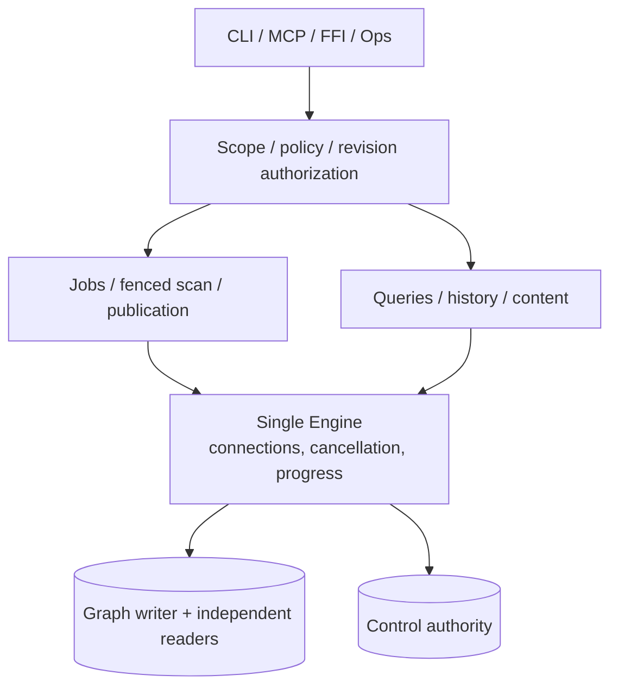

# diskgraph-engine

Job orchestration and the authorized service layer of
[DiskGraph](https://github.com/loong10k/diskgraph): scope registration,
durable index jobs with leases, staging with atomic publication, capacity
watermarks, and the tree/read narrow paths.

## Install

```toml
[dependencies]
diskgraph-engine = "0.2"
```

## What it enforces

- **Scopes** are registered against a canonical root and revocable; a
  revoked scope yields no plan and accepts no job.
- **Jobs** are leased with owner fencing: a queued or running job merges
  rather than duplicating, and a terminal job is never re-claimed.
- **Budgets** stop a walk for a named reason (`NodeLimit`, `StagingLimit`,
  `TimeLimit`, `Cancelled`) instead of returning less data silently, and a
  stopped walk publishes nothing.
- **Capacity** watermarks refuse new work past a threshold and never
  delete anything to make room.
- **Cancellation** is observed between observation boundaries, so a
  cancelled scan leaves no half-published revision.

## Bounded content reads

`read_bounded` and `digest_bounded` run under a separate `content:read`
grant, a byte budget, and an identity contract: observed identity/version
changes report `Unstable` and void the digest. This is not an atomic snapshot.

Windows content acquisition uses a local absolute drive path and one
component at a time relative to retained directory handles. It requests
attributes before data, exposes placeholder attributes on the calling
thread, and refuses reparse/offline/recall objects before reading. The
read retains a data handle denying ordinary write/delete sharing and checks the full 128-bit
file ID, volume ID, length and native write/change timestamps. ADS,
parent traversal, UNC/device paths and unknown volume/identity support
are refused. The registered root's component spelling is required;
lexical checks do not guess case/alias equivalence. Attribute acquisition
does not freeze new writers: changes are rejected as conflict before
data access. Native timestamp units do not guarantee filesystem precision.

Sharing excludes ordinary write/delete handles, not every writable
mapping, kernel or filter mutation. Version checks are not an atomic
content snapshot. Windows `FILE_OPEN_NO_RECALL` constrains opening;
real provider no-download acceptance remains separate, as does Linux
placeholder protection. The optional thread API (Windows 10 1709+) is
dynamically resolved and missing support refuses inspection. Deadline and
cancellation checks are cooperative and cannot preempt synchronous native
opens or reads. Native evidence covers CI NTFS fixtures, not every local
filesystem. See the [full-platform acceptance record](../../docs/production-readiness-full-platform-2026-10-02.md).

## Qualified scan locators / 扫描定位的编码来源

Schema 11 persists a fresh scan node's raw locator bytes, explicit Unix/Windows
encoding and own modification time through the same staging/publication
transaction. `revision_node_locator` reads one node under the actual revision
owner, a shared deadline/field budget and terminal live authorization checks.
Native validation borrows the saved fields rather than allocating a path that
would immediately be discarded. This metadata does not itself authorize file
access or replace live root/file handle identity checks.

历史节点缺少编码来源时明确返回 unsupported，需要重新索引；不把展示字符串
或目录聚合时间补成原始身份。旧可信 `Locator` 接口继续兼容，注册 scope 根定位
的跨平台编码来源还需单独落地。上游扫描器仍拒绝不能无损表示的名字；这项持久化
不宣称完整非 UTF-8 扫描、严格 RSS 上限或 provider/写操作验收完成。

## Complete Windows scan observations / Windows 完整扫描观测

Schema 12 stores a separate 80-byte versioned `WindowsFileObservation`, keeping
full volume/file identity, EOF and raw native creation/write/change times.
`WindowsNativeScanRoot` retains drive-to-root attribute handles before the walk;
relative attribute opens and before/after native checks run outside database
write locks. The upstream path-based tree remains a separate observation.
Unverified tree alignment and fixed gaps preserve that distinction.

`revision_windows_observation` reuses actual revision ownership, shared deadline,
borrowed byte admission and terminal MetadataRead authorization. It reads pure
metadata on any host; it does not convert foreign paths or authorize content.
Legacy rows are NotCaptured. Scan metadata budgets include the actual blob/label
cost. Durable checks may be cached for at most 20ms; staging/publication fences
and original clock/local cancellation are checked again after lock waits.
The existing five-second keeper covers all scan phases. Native synchronous I/O
is cooperative, with no hard latency/RSS claim.

Windows 本地 NTFS 原生门禁须以本批同源码 CI 为证据；ReFS 真实高位 ID、云 provider、
移动/写/宿主门禁各自开放。完整原生时间不是原子内容版本；v1 与 UniFFI 签名保持兼容。

## Source boundaries / 源码边界

`lib.rs` only declares modules and preserves public exports. `Engine` remains
the sole owner of its connections, cancellation flags and progress state;
responsibility modules supply implementations on that same object. No new
service or repository owners are introduced. Public `content`, `live_evidence`
and `verify` paths remain compatible through declaration/reexport façades.

| Responsibility / 职责 | Real implementation / 实际实现 |
| :--- | :--- |
| State, startup, capacity / 状态、初始化、容量 | `engine.rs`, `engine_startup.rs`, `engine_capacity.rs` |
| Scopes, policy, authorization / 范围、策略、授权 | `scope_service.rs`, `policy_service.rs`, `revision_authorization.rs` |
| Jobs, scan, publication / 任务、扫描、发布 | `scan_jobs.rs`, `scan_execution.rs`, `runner.rs` |
| Reader, queries, history / 读连接、查询、历史 | `revision_reader.rs`, `revision_queries.rs`, `relation_access.rs`, `relation_queries.rs`, `tree_queries.rs`, `revision_history.rs`, `revision_comparison.rs`, `sync_plan.rs` |
| Retention / 历史回收 | `snapshot_retention.rs` |
| Content, collectors, live evidence, verification / 内容、采集、实时证据、核验 | `content/`, `collectors/`, `live_evidence/`, `queries/`, `verify/` |



授权入口与可信内部兼容入口仍有明确区别：`revision_reader`、原始窄读方法和
`control_store` 不自行授权请求，远程适配器必须先经过资源授权。发布和历史回收
保留 graph→control 锁顺序；已有 control guard 使用 `require_with_control`，避免重入。
类型（含私有记录、trait 和 alias）独立文件，公共方法中文注释说明参数、返回和实际原生来源。

`tests/source_layout.rs` parses all platform modules and checks entry façades,
one object per production file, fewer than 500 physical lines, snake_case
paths, Chinese contracts, no wildcard imports or placeholder/empty functions,
and no unmounted source files. It supplements behavioral and native-platform
tests; source organization alone does not prove production readiness.


`sample_process_usage` preserves visible positive observations with `Partial`
coverage: successful exit does not verify permission scope or PID start identity.
Byte parsing rejects malformed records; potentially escaped/annotated path names
remain unknown instead of being guessed into native identities. Empty-query
`Full` is only a compatibility result for zero objects. `ProbeLimits` and the
additive `sample_process_usage_bounded` / `sample_git_bounded` entries share one
absolute deadline, cancellation flag and cumulative stdout/stderr limit across
the entire sample. Existing entries default to 15 seconds and 1 MiB. Fixed pipe
buffers still verify actual EOF at the exact limit; an extra byte, abnormal exit
or failed cleanup cannot become a completed observation. Cleanup can exceed the
cooperative deadline and does not establish a strict RSS or latency ceiling.

Unix retains the leader until group termination and reaping. Hosts must not
auto-reap or independently wait for this child; those conditions fail closed.
Ordinary descendants remain in the owned group; descendants that actively leave
it are outside this containment. Windows requires Windows 10+, a trusted absolute
`.exe` or simple executable name in explicit absolute PATH entries, and an
absolute project directory; relative program paths and scripts are refused.
Native execution uses creation-time Job/standard-handle attributes and owned
overlapped pipes. Job accounting has a separate one-second observation window;
unknown or nonzero state refuses completed evidence. An externally held process
handle does not itself imply a nonzero Job count; the actual query decides. Leader waits and safe pending-I/O completion
can exceed that window. Its final native acceptance is recorded in
the [full-platform evidence](../../docs/production-readiness-full-platform-2026-10-02.md).
Git sampling requires Git 2.46+ and distinguishes missing references from broken
references and failed commands. Unborn repositories retain actual dirty files;
NUL status records count each untracked file and one entry per rename/copy.
Invalid OIDs and commit counts fail the sample. Existing stash history requires
the `files` reference backend: bounded raw reflog reads, retained commit checks
and exact reverse-order comparison detect records silently omitted by Git.
The common metadata directory is located by Git; its fixed log suffix is opened
without following links. This location is not scope or configuration isolation.
Legitimate drop/delete/expiry and absent logs preserve visible-list semantics.
Both raw reads share the sample byte/deadline/cancellation budget; reftable stash
enumeration is explicitly unsupported. Terminal reference/version checks detect
changes but do not form an atomic Git snapshot. Native acceptance for this
semantic increment is recorded separately in the full-platform evidence.
Supported full-index repositories now execute through private configuration,
index, reference and bounded object copies. External filter/fsmonitor drivers,
split/sparse indexes and unsupported metadata semantics are rejected; commands
disable pager, lazy fetching and optional locks. Missing objects fail without
a promisor fetch. The trusted sampler is not a scope-authorized service entry;
real collector-task integration and provider acceptance remain open.
Skipping persisted stat refreshes can repeat content checks in later samples;
no performance improvement is claimed for this policy.

占用采样保留正向观察并报告 partial；空结果、转义/标注名称或无法确认的身份不说明无人使用。
原生字节键不等于文件句柄/PID 启动身份。新增有界采样入口共用整次期限、取消和
stdout/stderr 累计字节，兼容入口默认 15 秒/1 MiB；预算耗尽仍核验实际 EOF，
异常退出与清理失败不能变成完整样本。清理可能超过协作期限，不承诺严格 RSS/SLA。
Unix 宿主不得 auto-reap 或外部回收该 child，主动脱离组的后代不受组约束。
Windows 要求 Windows 10+、受信 .exe 和绝对项目目录，拒绝相对程序路径及脚本；
平台原生验收见上述记录。Git 采样要求 2.46+，明确区分缺失、损坏及执行失败；
unborn 仍报告实际修改，NUL 原生记录按文件及 rename/copy 计数，非法 OID/数量报错。
stash 存在时仅支持可核验的 files 后端：共用整次预算读取原始日志、核验留存 commit
及完整逆序列表；reftable 明确拒绝。日志路径来自 Git common 根与固定后缀，
合法 drop/delete/expiry 和明确缺日志保留可见列表语义。末段版本复核不是 Git 原子快照。
支持的完整 index 仓库现在使用私有配置、index、引用及有界对象副本；外部
filter/fsmonitor、split/sparse index 和不能保真的语义明确拒绝。每条命令禁用
pager、懒取和可选锁，缺对象不触发 promisor fetch。受信采样接口不自行授权
scope，实时任务接入及真实 provider 验收仍未完成。
源 stat 缓存不落盘可能增加后续重复内容检查，此策略不声明提速。

## Multi-target evidence budgets / 多目标证据预算

`live_evidence::EvidenceProbeSession` owns one deadline, cumulative output quota
and cancellation state for successive Git/process observations. Its Git metadata
quota is cumulative across projects (64 MiB / 32768 entries). The deadline starts
when the session is created and includes idle time between calls. Successful Git
cleanup and the final deadline/cancellation check return the actual remaining
metadata quota; failure never replenishes it. Any Git error or process
`Unobservable` closes the session, including for later empty-path requests.
Normal positive `Partial` observations remain partial and allow further probes.

The existing `sample_*_bounded` functions keep independent per-call budgets.
Use one session for a multi-target task. This trusted library interface does not
replace program/target validation, scope authorization, durable job fencing or
revocation checks. Private allocation checks apply to each live view; no strict
RSS or synchronous-I/O latency ceiling is claimed. Native acceptance remains
separate from the local tests in the full-platform record.

同一多目标任务使用一个不可克隆的会话，累计输出、Git 输入字节/条目，并从
创建时起计时。成功清理和末检后才归还真实余额；任意 Git 错误或进程
Unobservable 锁存首次错误，后续空请求也不能绕过。正常 Partial 保留正向
观察且可继续。旧独立入口不改变语义；授权任务、撤权、fencing 和真实平台
验收仍需由对应服务与门禁完成，不以本接口关闭全平台任务。

## License

MIT

## Trusted macOS installer API / macOS 可信安装入口

External Rust installers can call `MacosInstallationPublisher::prepare`,
`publish`, and `recover` on macOS. Both real and effective UID must be root.
`prepare` validates or creates the fixed protected layout; `publish` accepts a
held source image, independent `ScanWorkerHostConfig`, trusted Ed25519 signing
key, increasing epoch and nonzero installation ID. `recover` completes only
the generation already committed by the persistent epoch floor. All calls
preserve the caller's deadline and cancellation checkpoint. They never elevate
privileges or accept request-selected installation paths.

这些入口供可信安装程序调用，CLI/MCP 不暴露安装工具。普通用户、原检查点
错误和过期期限的外部调用回归已经通过；本机未执行 root 安装。实际发行、
签名启动、升级恢复及默认 Engine 扫描仍需原生 CI，不能据此声明生产就绪。
