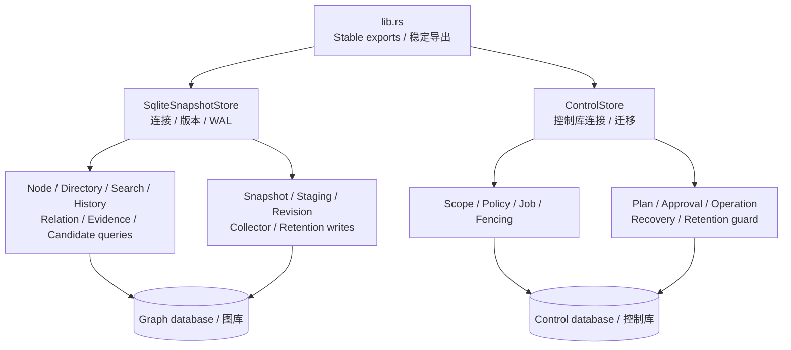

# diskgraph-store

The persistence layer of [DiskGraph](https://github.com/loong10k/diskgraph):
immutable SQLite snapshots on one side, an authoritative control database on
the other, with versioned migrations between them.

The two databases are deliberately separate. The graph database is
rebuildable by scanning; the control database holds server identity, scope
registrations, policies, jobs and operation history, and must survive the
graph being deleted.

## Install

```toml
[dependencies]
diskgraph-store = "0.2"
```

## Usage

```rust
use diskgraph_store::SqliteSnapshotStore;
use std::path::Path;

let mut store = SqliteSnapshotStore::open(Path::new("/tmp/diskgraph/diskgraph.sqlite"))?;
# Ok::<(), diskgraph_store::StoreError>(())
```

- Migrations run on open: v1 → v2 (revisions, staging, pins) → v3
  (typed entities and relations) → v4 (structured node columns so
  multi-million-row loads never need a full JSON parse per row), then through
  v9 (owned history, bounded-query indexes and exact directory aggregates).
- `open_with_backup` writes a pre-migration copy first, and a failed
  migration leaves the original readable.
- Publication is one transaction: snapshot rows, the revision, the latest
  pointer, and staging cleanup either all land or none do.

## Guarantees

- A snapshot is immutable once published; corrections publish a new one.
- Retention refuses to remove a pinned snapshot, a snapshot backing a
  published revision, or the current latest pointer.
- Deleting graph history never touches the control database.

## Source boundaries / 源码边界

`lib.rs` is 93 lines, down from 3,247, and only declares modules and reexports
the existing API. Each record,
enum and row type has its own file. The two original stores still own their
connections; implementation modules share that ownership and preserve the
existing SQL, transaction boundaries, wire fields and error behavior.



真实实现按职责拆分，未增加空壳仓储或公开包装类型。`lib.rs` 和 `mod.rs`
只声明/导出；类型各有独立文件，中文注释标明原生 Rust 来源及参数/返回含义。
没有 Java 来源的类型不虚构 Java 映射。新结构不代表平台写操作已验收。

`cargo test -p diskgraph-store --test source_layout` parses production ASTs
to enforce entry/type/import/documentation boundaries and reject stubs.
Existing isolated tests continue to verify migrations, atomic publication,
fencing, ownership, retention and bounded queries.

## License

MIT
