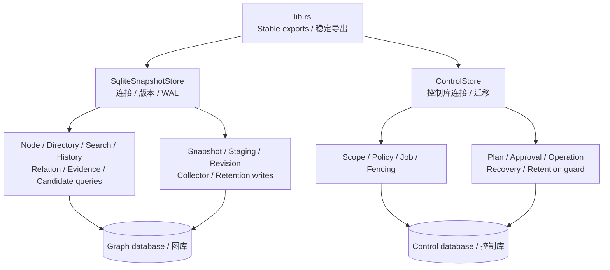

# diskgraph-store

The persistence layer of [DiskGraph](https://github.com/loong10k/diskgraph):
immutable SQLite snapshots on one side, an authoritative control database on
the other, with versioned migrations between them.

The two databases are deliberately separate. The graph database is
rebuildable by scanning; the control database holds server identity, scope
registrations, policies, jobs and operation history, and must survive the
graph being deleted.

## Install

```toml
[dependencies]
diskgraph-store = "0.2"
```

## Usage

```rust
use diskgraph_store::SqliteSnapshotStore;
use std::path::Path;

let mut store = SqliteSnapshotStore::open(Path::new("/tmp/diskgraph/diskgraph.sqlite"))?;
# Ok::<(), diskgraph_store::StoreError>(())
```

- Migrations run on open: v1 → v2 (revisions, staging, pins) → v3
  (typed entities and relations) → v4 (structured node columns so
  multi-million-row loads never need a full JSON parse per row), then through
  v9 (owned history, bounded-query indexes and exact directory aggregates),
  v10 (revision-scoped collector membership and sealed selection), and v11
  (encoding-qualified raw node locators and each node's own modification time).
- `open_with_backup` writes a pre-migration copy first, and a failed
  migration leaves the original readable.
- Publication is one transaction: snapshot rows, the revision, the latest
  pointer, and staging cleanup either all land or none do.

## Guarantees

- A snapshot is immutable once published; corrections publish a new one.
- Retention refuses to remove a pinned snapshot, a snapshot backing a
  published revision, or the current latest pointer.
- Deleting graph history never touches the control database.

## Source boundaries / 源码边界

`lib.rs`, reduced from 3,247 lines, only declares modules and stable
API reexports. Each record,
enum and row type has its own file. The two original stores still own their
connections; implementation modules share that ownership and preserve the
existing SQL, transaction boundaries, wire fields and error behavior.

D24 adds bounded tree windows and an ordered history cursor that admits raw
fields before Rust allocation and counts actual decoded nodes on both sides.
Minimum-size tree counts continue to use the existing numeric size-prefix
index; unknown nodes retain explicit `size_known=false` diagnostics. The
200k-child VM regressions cover sparse and dense unknown entries. These source
boundaries and query budgets do not establish a strict process RSS limit.

D24 的树窗口与历史游标先检查原始字段预算，再分配或解码；历史按双方实际
读取节点累计计费。树 minimum 继续使用现有数值尺寸累计索引，未知节点明确
标记 `size_known=false`。20 万子项的 VM 门禁覆盖稀疏及密集未知项；源码拆分
和查询预算不能单独证明进程 RSS 有严格上限。

Control schema 6 adds a separate `authorization_generation()` counter maintained
transactionally by policy/grant/scope triggers. It changes on individual grant
revocation even when the policy epoch is unchanged; job heartbeat writes leave
it alone. `authorization_generation_until()` bounds SQLite lock/execution time,
restores the actual `busy_timeout` and owns/clears its internal progress callback.
Stop old services before migration; existing old connections are not upgraded
transport implementations. v5 upgrades have a consistent pre-v6 backup, and
failed migration rolls back the new objects without enabling a v6 store.



真实实现按职责拆分，未增加空壳仓储或公开包装类型。`lib.rs` 和 `mod.rs`
只声明/导出；类型各有独立文件，中文注释标明原生 Rust 来源及参数/返回含义。
没有 Java 来源的类型不虚构 Java 映射。新结构不代表平台写操作已验收。

`cargo test -p diskgraph-store --test source_layout` parses production ASTs
to enforce entry/type/import/documentation boundaries and reject stubs. It also
rejects production files with 500 or more lines; the current maximum is the
410-line job store. The limit supports responsibility review rather than
replacing transaction, compatibility or performance verification.
Existing isolated tests continue to verify migrations, atomic publication,
fencing, ownership, retention and bounded queries.

Schema 11 does not backfill raw bytes, platform encoding or own mtime from old
display paths and aggregate timestamps. `append_staging_located_iter` retains
qualified observations in the same staging/node row and publication transaction.
`staging_node_encoded_cost` includes JSON, folded search fields, raw bytes,
encoding/kind labels and observed timestamps; it excludes SQLite page overhead.
`native_locator_bounded` admits borrowed fields against the request budget before
allocation and resolves only `(snapshot_id,node_id)`. Legacy locator absence is
distinct from a missing node; foreign encoding, corrupt fields and limits fail
explicitly. The independent locator writer generation rejects obsolete revision
writers without changing schema9 directory count or schema10 collector markers.

schema 11 不从历史展示路径或聚合时间推断原始定位与自身时间。新节点的明确
编码、原始字节和时间随同一批暂存和发布事务保存；原始字段先按预算准入再
分配，按快照/节点 ID 精确读取。旧定位不可用与节点不存在分别处理，不回退
展示路径。原有可信 v1 Store 接口保持兼容，原生访问仍需调用方授权及句柄验证。

schema 12 在同一节点/暂存行增加完整 Windows 观测的格式标签、固定 80 字节 BLOB
与互斥缺失原因。`append_staging_observed_iter` 和
`staging_observed_node_encoded_cost` 共用编码与实际字段成本；定位必须是明确的
Windows 原生编码才接受完整观测。旧 append/save 接口保持全空，历史记录读取为
`NotCaptured`，迁移备份保留 v11，不用旧身份、显示路径或秒时间补出原生观测。

`windows_observation_bounded` 按快照/节点主键读取，在拥有或解码前累计借用字段
的节点、字节及绝对期限预算；跨宿主可读纯元数据，不执行路径转换。协议版本、
长度、字段类型、半字段和互斥冲突明确失败。独立 observation writer generation 12
阻止已打开的旧发布写者，目录 9、collector 10、locator 11 代次保持原义。暂存、
项目批次、发布、latest 和清理仍在原事务内。该持久化接口不证明真实 Windows
捕获、云占位不下载、身份长期稳定或原生写能力已经验收。

## License

MIT
