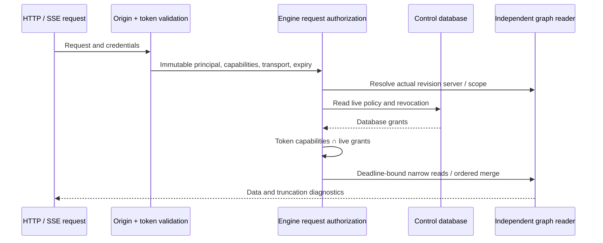
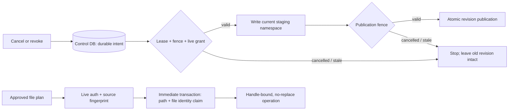
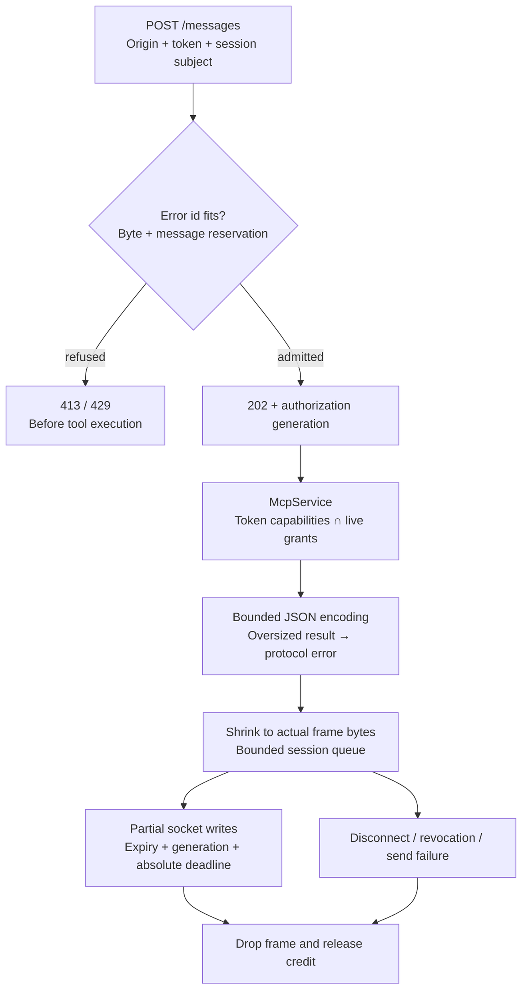
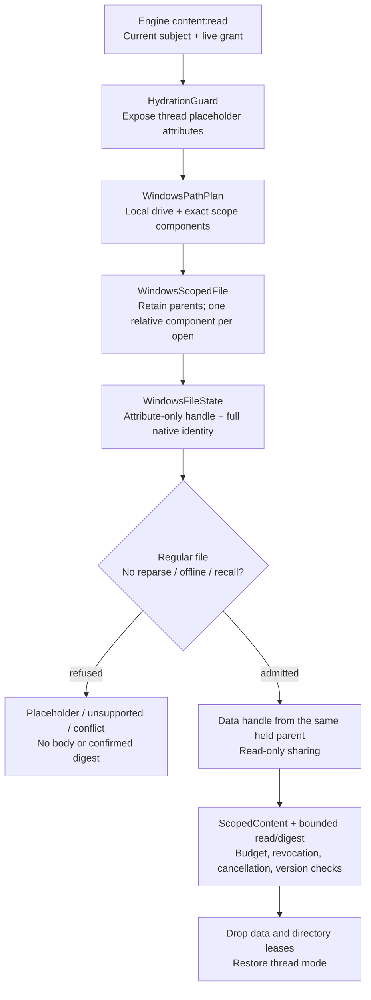
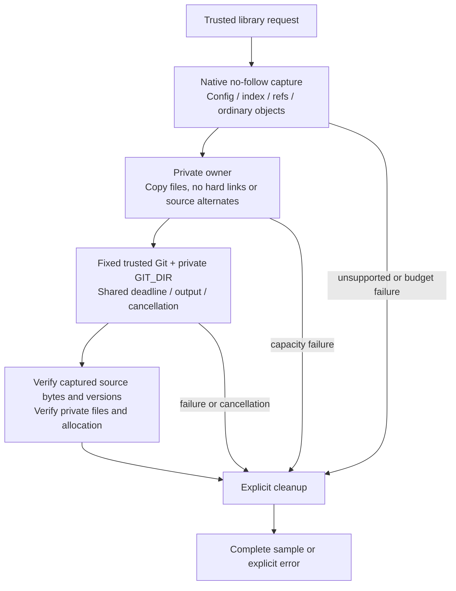
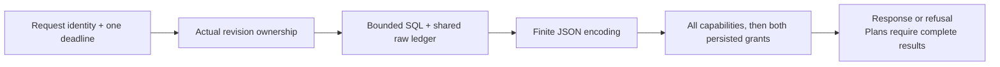
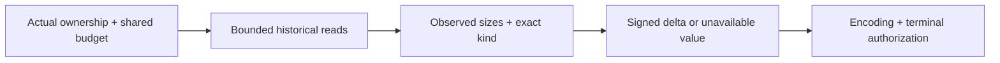
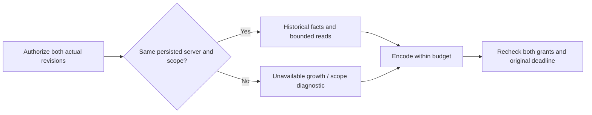

# DiskGraph implemented security and query boundaries

Continuation of the [architecture](DiskGraph-Architecture.md). Earlier design sections retain their platform acceptance gates.

## 2026-10-01 hardening implementation boundary

The following flow is implemented in this change. Earlier sections marked Target remain subject to platform acceptance.

A serial graph writer handles mutations. Conditional job claims increment fencing; a control transaction validates lease, fence, scope and live IndexWrite before staging batches, revision publication and collector writes. Expired claims rescan in a new staging namespace. The upstream scanner pin, source and digests remain unchanged. Conversion traverses iteratively; publication generates formal rows from staging.

SQLite consistent backups, including committed WAL, precede migrations in `migration_backups/`. Graph schema 6 adds ownership and normalized search; schema 7 adds sparse unknown-size, relation-page and ordered-path indexes; schema 8 adds review-candidate size and evidence-relation indexes. Schema 9 maintains exact snapshot/directory counts and size-prefix counts in each publication transaction; migration backfills them atomically. Snapshot writer markers reject already-open obsolete writers, and missing count metadata fails closed. Known/unknown pages retain legacy JSON fallback semantics and matching partial indexes. Explicit OFFSET still costs O(offset+page). Aggregation increases storage and publication/migration costs; measured backup/WAL/temporary-file costs are in the [full-platform record](production-readiness-full-platform-2026-10-02.md). Candidate selection and impact traversal use request-scoped readers with deadlines and explicit truncation. Control schema 4 adds leases/fencing, and schema 5 persists cancellation. Control schema 6 adds a transactionally maintained authorization generation for policy/grant/scope changes; it is separate from the policy epoch, and job heartbeats do not change it. v5 migration has a consistent pre-v6 backup and atomic rollback on failure. Stop old services before upgrading; already-open old connections do not gain the new transport behavior. Old running jobs wait for heartbeat + 30 seconds instead of being stolen at startup. Graph WAL/NORMAL preserves transaction consistency but may lose recent reconstructible index commits on power loss. Control FULL preserves the required operation-record durability. There is still no cross-database atomic transaction guarantee.

FFI derives its control-data realm from the lossless graph database path; ambiguous legacy shared control data is rejected. Operation plans require a complete digest and fresh source evidence, so old plans must be recreated. Positive-target candidate selection now uses bounded preparation, and relation impact shares one authorized read connection across pages and directions. Explicit offset compatibility still incurs offset traversal; scanner cancellation does not provide a strict RSS limit.

See the [acceptance record](security-performance-hardening-2026-10-01.md) for compatibility, fidelity checks, cancellation overshoot, physical retention costs and local measurements. CLI/MCP dangerous tools remain closed; Linux/Windows native writes and strict scanner RSS bounds are not accepted capabilities.

## Legacy result delivery boundary

Legacy sessions use a private registry rather than the public trusted-compatibility raw sender. Limits are 64 messages/16 MiB per session and 64 MiB per listener, including pending execution, encoding and sending; admission reserves `max_response_bytes + 22` and encoding shrinks it. The default 4 MiB response budget admits three simultaneous worst-case reservations per session and fifteen per listener. Oversized correlated errors and reservations are refused before 202; congestion returns 429. The bounded writer also serves modern HTTP while preserving its response fields and error status. These are delivery-buffer limits, not tool `Value`, allocator, kernel-buffer or strict RSS bounds.

Every data chunk checks expiry and the narrow persistent generation under the same absolute deadline as writing, including nonblocking control-lock admission and bounded SQLite execution. Generation changes conservatively terminate older results even for an unrelated subject or newly added grant; job/operation writes do not change it. Bytes already in the kernel cannot be recalled. Outer idle liveness can wait on shared policy access and has no strict one-second cleanup SLA. Receiver closure frees queued frames; still-running tools keep their global reservation until exit. A disconnect after 202 closes/logs failed delivery and leaves durable jobs queryable. This migration requires stopping old hosts before upgrading, rather than relying on schema rejection to terminate already-open old processes.

### Windows ordinary-file content acquisition

This addition preserves public result fields and the Unix path. The path plan refuses ADS, parent traversal, UNC/device namespaces and oversized inputs without canonicalizing the client path. Full 128-bit file IDs and native write/change versions stay private rather than being truncated to the existing snapshot ID field. Attribute acquisition does not freeze new writers: changes are rejected as conflict before data access. The data handle then denies ordinary write/delete sharing, while retained parents prevent replacement. This is not an atomic snapshot or a freeze of all mappings/kernel/filter activity; 100ns is a representation unit, not guaranteed filesystem precision or a monotonic version. The optional thread API (Windows 10 1709+) is dynamically resolved and missing support returns the public unsupported code. Thread mode does not cover scanner workers, and the open no-recall flag does not certify a real provider's subsequent reads. Deadline/cancellation are cooperative and cannot preempt synchronous native I/O. Native regression evidence covers CI NTFS fixtures, separately from other filesystems/provider acceptance in the [full-platform record](production-readiness-full-platform-2026-10-02.md); public file writes remain disabled.

## Git evidence input isolation (EC-04 / D20)

The trusted library sampler uses a private configuration, index, references and flat object view. Its current callers are library/tests, with no production CLI/MCP/FFI sampler integration established. Objects are ordinary no-follow loose files or paired pack/index files copied through the same private allocation owner; source alternates/promisor and unsupported inputs are refused. Ignored accelerators are not supplied to Git. Captured objects and metadata share a cumulative 64 MiB/32k allowance across preparation and terminal verification; the private owner separately checks 128 MiB reported allocation and 64 MiB volume headroom. The unchanged ProbeLimits default is a cooperative 15-second sample with 1 MiB cumulative output.

The private view closes recursive source-object inputs; it is not an atomic repository snapshot or a full filesystem/RSS sandbox. Copies and verification add byte-dependent cost; retained initial buffers and terminal reads increase memory. Larger packs or status output may exceed defaults and return explicit errors. Local regressions, raw copy-cost measurements and native acceptance are recorded separately in the [full-platform record](production-readiness-full-platform-2026-10-02.md). Public write tools remain disabled and the remaining device/provider/production gates are unchanged.

## Tree and history request boundary — D24

The Store entry contains only declarations and reexports. Tree windows and
ordered history cursors borrow raw SQLite fields before admission and decoding;
history shares one ledger across both sides and any sync-plan rereads. Both
actual revision owners are rechecked after encoding, including persisted grants
after the last capability callback. Numeric minimum-size counts keep their
existing prefix index and unknown-size diagnostics. Late reports are partial;
late plans are refused. Failure diagnostics preserve business codes while
bounding actual JSON escaping. Content reads check scope, grants and cancellation
after EOF/exact-range and final identity checks; the legacy read wrapper now
uses a cooperative 30-second default, and `read_bounded_until` inherits the caller's
deadline. This establishes neither atomic cross-connection authorization nor
strict I/O time or RSS bounds. [Acceptance boundaries](production-readiness-full-platform-2026-10-02.md) remain separate.

## Historical size eligibility — D33

Core owns two pure eligibility functions used by growth, changes and comparison. A size is observed only when `size_known && !read_error`; a numeric delta additionally requires the same exact node kind. Engine keeps independent nullable sizes on comparison rows and counts only observed `Size` or `Contents` changes. Cross-root metadata comparison retains its existing relative-path contract. SQL admission, shared budgets and terminal authorization stay outside the eligibility check; `None` cannot replace a cancellation, deadline or authorization error. Existing public query/compare exports and serialized types are preserved in individual source files.

A zero size-change count is not proof that unknown objects are unchanged. Same-scope history compatibility, Windows historical identity continuity and historical content-version binding remain separate open requirements.

## Historical namespace eligibility — D34

Engine growth and changes compare persisted revision ownership on the existing readers. Both revisions must belong to this server and the same valid scope; registration keeps each scope's lossless root immutable. A display string never establishes namespace identity. Different scopes produce unavailable growth or the existing `different_root` changes tag with additive `scope_changed: true`. Missing ownership, foreign servers, revocation and storage errors remain errors. The trusted helper grants no authority: each entry still performs its original authorization and response-budget checks, including checks after encoding. Legacy FFI growth uses the same helper and retains its export contract. Generic metadata comparison remains available across roots when both sides are authorized.

Namespace eligibility does not prove historical file identity continuity or content-version equality. Native CI and those remaining requirements are recorded independently.
