# DiskGraph implemented security and query boundaries

Continuation of the [architecture](DiskGraph-Architecture.md). Earlier design sections retain their platform acceptance gates.

## 2026-10-01 hardening implementation boundary

The following flow is implemented in this change. Earlier sections marked Target remain subject to platform acceptance.

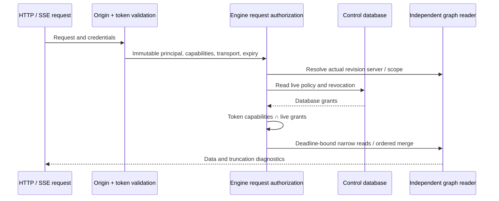

A serial graph writer handles mutations. Conditional job claims increment fencing; a control transaction validates lease, fence, scope and live IndexWrite before staging batches, revision publication and collector writes. Expired claims rescan in a new staging namespace. The upstream scanner pin, source and digests remain unchanged. Conversion traverses iteratively; publication generates formal rows from staging.

SQLite consistent backups, including committed WAL, precede migrations in `migration_backups/`. Graph schema 6 adds ownership and normalized search; schema 7 adds sparse unknown-size, relation-page and ordered-path indexes; schema 8 adds review-candidate size and evidence-relation indexes. Schema 9 maintains exact snapshot/directory counts and size-prefix counts in each publication transaction; migration backfills them atomically. Snapshot writer markers reject already-open obsolete writers, and missing count metadata fails closed. Known/unknown pages retain legacy JSON fallback semantics and matching partial indexes. Explicit OFFSET still costs O(offset+page). Aggregation increases storage and publication/migration costs; measured backup/WAL/temporary-file costs are in the [full-platform record](production-readiness-full-platform-2026-10-02.md). Candidate selection and impact traversal use request-scoped readers with deadlines and explicit truncation. Control schema 4 adds leases/fencing, and schema 5 persists cancellation. Control schema 6 adds a transactionally maintained authorization generation for policy/grant/scope changes; it is separate from the policy epoch, and job heartbeats do not change it. v5 migration has a consistent pre-v6 backup and atomic rollback on failure. Stop old services before upgrading; already-open old connections do not gain the new transport behavior. Old running jobs wait for heartbeat + 30 seconds instead of being stolen at startup. Graph WAL/NORMAL preserves transaction consistency but may lose recent reconstructible index commits on power loss. Control FULL preserves the required operation-record durability. There is still no cross-database atomic transaction guarantee.

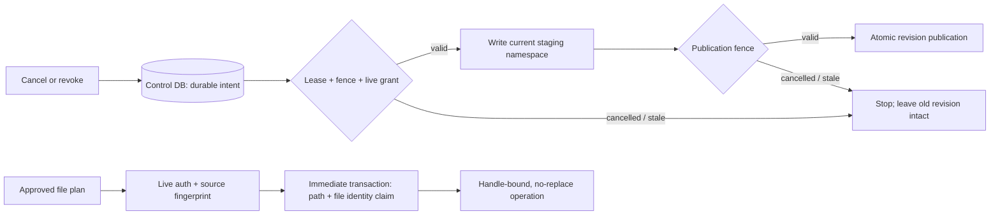

FFI derives its control-data realm from the lossless graph database path; ambiguous legacy shared control data is rejected. Operation plans require a complete digest and fresh source evidence, so old plans must be recreated. Positive-target candidate selection now uses bounded preparation, and relation impact shares one authorized read connection across pages and directions. Explicit offset compatibility still incurs offset traversal; scanner cancellation does not provide a strict RSS limit.

See the [acceptance record](security-performance-hardening-2026-10-01.md) for compatibility, fidelity checks, cancellation overshoot, physical retention costs and local measurements. CLI/MCP dangerous tools remain closed; Linux/Windows native writes and strict scanner RSS bounds are not accepted capabilities.

## Legacy result delivery boundary

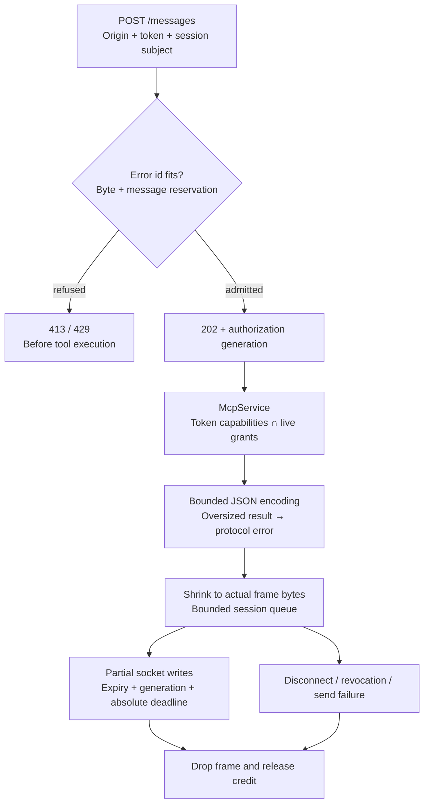

Legacy sessions use a private registry rather than the public trusted-compatibility raw sender. Limits are 64 messages/16 MiB per session and 64 MiB per listener, including pending execution, encoding and sending; admission reserves `max_response_bytes + 22` and encoding shrinks it. The default 4 MiB response budget admits three simultaneous worst-case reservations per session and fifteen per listener. Oversized correlated errors and reservations are refused before 202; congestion returns 429. The bounded writer also serves modern HTTP while preserving its response fields and error status. These are delivery-buffer limits, not tool `Value`, allocator, kernel-buffer or strict RSS bounds.

Every data chunk checks expiry and the narrow persistent generation under the same absolute deadline as writing, including nonblocking control-lock admission and bounded SQLite execution. Generation changes conservatively terminate older results even for an unrelated subject or newly added grant; job/operation writes do not change it. Bytes already in the kernel cannot be recalled. Outer idle liveness can wait on shared policy access and has no strict one-second cleanup SLA. Receiver closure frees queued frames; still-running tools keep their global reservation until exit. A disconnect after 202 closes/logs failed delivery and leaves durable jobs queryable. This migration requires stopping old hosts before upgrading, rather than relying on schema rejection to terminate already-open old processes.

### Windows ordinary-file content acquisition

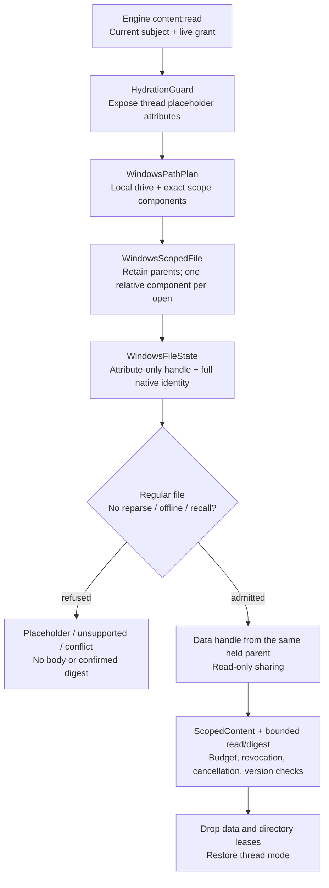

This addition preserves public result fields and the Unix path. The path plan refuses ADS, parent traversal, UNC/device namespaces and oversized inputs without canonicalizing the client path. Full 128-bit file IDs and native write/change versions stay private rather than being truncated to the existing snapshot ID field. Attribute acquisition does not freeze new writers: changes are rejected as conflict before data access. The data handle then denies ordinary write/delete sharing, while retained parents prevent replacement. This is not an atomic snapshot or a freeze of all mappings/kernel/filter activity; 100ns is a representation unit, not guaranteed filesystem precision or a monotonic version. The optional thread API (Windows 10 1709+) is dynamically resolved and missing support returns the public unsupported code. Thread mode does not cover scanner workers, and the open no-recall flag does not certify a real provider's subsequent reads. Deadline/cancellation are cooperative and cannot preempt synchronous native I/O. Native regression evidence covers CI NTFS fixtures, separately from other filesystems/provider acceptance in the [full-platform record](production-readiness-full-platform-2026-10-02.md); public file writes remain disabled.

## Git evidence input isolation (EC-04 / D20)

The trusted library sampler uses a private configuration, index, references and flat object view. At the D20 baseline its callers were library/tests; the D39 CLI/MCP product entry is described below, while FFI sampler integration remains separate. Objects are ordinary no-follow loose files or paired pack/index files copied through the same private allocation owner; source alternates/promisor and unsupported inputs are refused. Ignored accelerators are not supplied to Git. Captured objects and metadata share a cumulative 64 MiB/32k allowance across preparation and terminal verification; the private owner separately checks 128 MiB reported allocation and 64 MiB volume headroom. The unchanged ProbeLimits default is a cooperative 15-second sample with 1 MiB cumulative output.

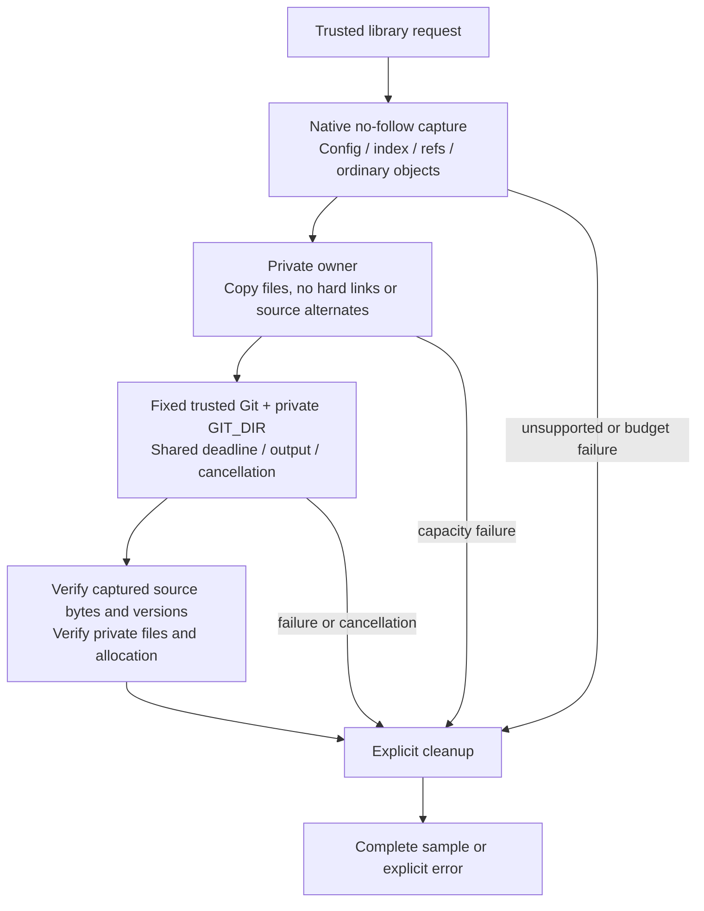

The private view closes recursive source-object inputs; it is not an atomic repository snapshot or a full filesystem/RSS sandbox. Copies and verification add byte-dependent cost; retained initial buffers and terminal reads increase memory. Larger packs or status output may exceed defaults and return explicit errors. Local regressions, raw copy-cost measurements and native acceptance are recorded separately in the [full-platform record](production-readiness-full-platform-2026-10-02.md). Public write tools remain disabled and the remaining device/provider/production gates are unchanged.

## Tree and history request boundary — D24

The Store entry contains only declarations and reexports. Tree windows and
ordered history cursors borrow raw SQLite fields before admission and decoding;
history shares one ledger across both sides and any sync-plan rereads. Both
actual revision owners are rechecked after encoding, including persisted grants
after the last capability callback. Numeric minimum-size counts keep their
existing prefix index and unknown-size diagnostics. Late reports are partial;
late plans are refused. Failure diagnostics preserve business codes while
bounding actual JSON escaping. Content reads check scope, grants and cancellation
after EOF/exact-range and final identity checks; the legacy read wrapper now
uses a cooperative 30-second default, and `read_bounded_until` inherits the caller's
deadline. This establishes neither atomic cross-connection authorization nor
strict I/O time or RSS bounds. [Acceptance boundaries](production-readiness-full-platform-2026-10-02.md) remain separate.

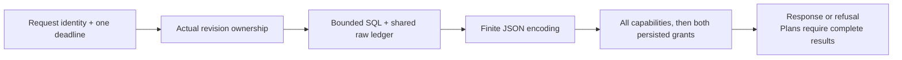

## Historical size eligibility — D33

Core owns two pure eligibility functions used by growth, changes and comparison. A size is observed only when `size_known && !read_error`; a numeric delta additionally requires the same exact node kind. Engine keeps independent nullable sizes on comparison rows and counts only observed `Size` or `Contents` changes. Cross-root metadata comparison retains its existing relative-path contract. SQL admission, shared budgets and terminal authorization stay outside the eligibility check; `None` cannot replace a cancellation, deadline or authorization error. Existing public query/compare exports and serialized types are preserved in individual source files.

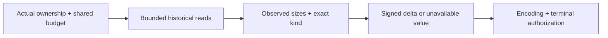

A zero size-change count is not proof that unknown objects are unchanged. The same-scope Q-04 compatibility matrix and canonical complete-coverage semantics were accepted in D35 task 3.9 at the same-source `2450ab1` native CI. Windows historical identity continuity and historical content-version binding remain separate open requirements.

## Historical namespace eligibility — D34

Engine growth and changes compare persisted revision ownership on the existing readers. Both revisions must belong to this server and the same valid scope; registration keeps each scope's lossless root immutable. A display string never establishes namespace identity. Different scopes produce unavailable growth or the existing `different_root` changes tag with additive `scope_changed: true`. Missing ownership, foreign servers, revocation and storage errors remain errors. The trusted helper grants no authority: each entry still performs its original authorization and response-budget checks, including checks after encoding. Legacy FFI growth uses the same helper and retains its export contract. Generic metadata comparison remains available across roots when both sides are authorized.

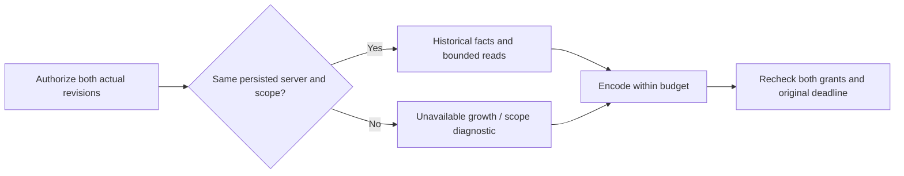

Namespace eligibility does not prove historical file identity continuity or content-version equality. Native CI and those remaining requirements are recorded independently.

## Scoped Git capture and TUI admission — D36

The trusted `sample_git_scoped` library entry takes a registered root and an explicit lossless repository locator. A held root and component-relative native opens constrain every worktree and Git dependency before a subprocess starts. An independent private capture supplies ordinary files, metadata, attributes and object dependencies; supported commands never reopen the live worktree. Capture and revalidation share input, entry, cancellation and time budgets. Final checks reject source or root-route replacement. Nested repositories and scope-external dependencies are explicitly unsupported. The caller still must authorize content access: the separate D39 product entry adds durable jobs and CLI/MCP collection, described below.

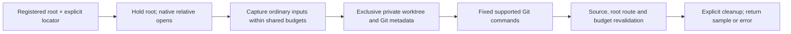

TUI navigation and frame preparation use the dedicated display reader. Initial control-lock contention is refused without waiting. Actual revision ownership and current grants are checked within the original read deadline. Navigation projects only needed fields, admits borrowed raw data before decoding, and uses a payload-free continuation probe. All frame levels share the read ledger; retained display data has a separate budget. A prepared complete page is returned only after terminal authorization and the original deadline succeed. An explicitly truncated frame may preserve already painted data after successful terminal authorization; revocation and real storage faults remain errors.

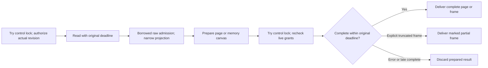

Candidate preparation also admits the snapshot header before decoding it, using the same raw-byte ledger as the selected nodes and required evidence. An expired request retains the typed empty `Deadline` result and explicitly reports `coverage_observed: false`; this cannot be interpreted as an observed coverage gap. Admitted headers report their actual coverage. A raw-byte refusal, invalid header or missing index remains an error. CLI, MCP and FFI preserve existing wire fields and add this diagnostic; Rust callers constructing `CandidateSelection` literals must supply the new field.

The TUI entry file now contains module declarations and exports, with its real objects and rendering logic in separate files. The synchronous authorizer remains cooperative; no hard interruption of arbitrary callbacks, SQLite C allocation limit or strict RSS bound is claimed. Explicit navigation offsets still cost O(offset + page). D36 source and actual platform acceptance are tracked in the [Git capture](benchmarks/scoped_git_capture_acceptance_2026_10_04.json) and [TUI budget](benchmarks/tui_budget_acceptance_2026_10_04.json) receipts.

## Durable Git collection — D39

CLI C03 and MCP share immutable job input and Engine authority. Control schema8 stores original input and bounded diagnostics; graph schema13 atomically publishes a collector revision and unique receipt. Actual server/scope determines the base, independently of another owner’s legacy root pointer. Missing selected sources fail closed. Recovery reconciles an existing receipt without resampling. Queued state lives in SQLite; cancellation flags belong only to local running generations, released by Arc identity. CLI status data uses the common authorized projection while retaining its existing outer scope/revision fields. MCP status binds envelope IDs to that projection and refuses inconsistent scope hints. The observation fingerprint covers safe summary and fixed request, not every source byte.

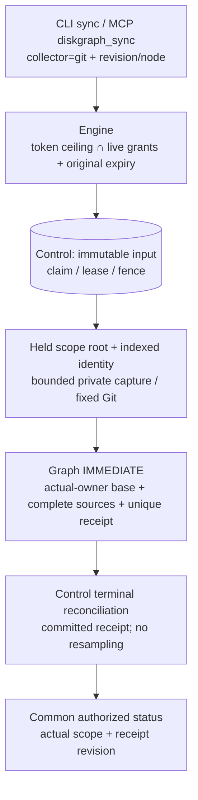

Final local and same-source native acceptance are separate; full-platform tasks remain open.

## MCP service source boundaries — D40

The55-line library entry contains standard module declarations and explicit root reexports. `mcp_config.rs` owns configuration/defaults; `mcp_service.rs` retains the single shared Engine and request context. Dispatch, identity/scope access, actual tool handlers and stdio framing reside in their own modules without another authorization or scheduling owner. Internal visibility preserves the original crate collaborators; no public fields are added. All67 original callable bodies and21 original tests retain their effective tokens, including status projection and terminal authorization.

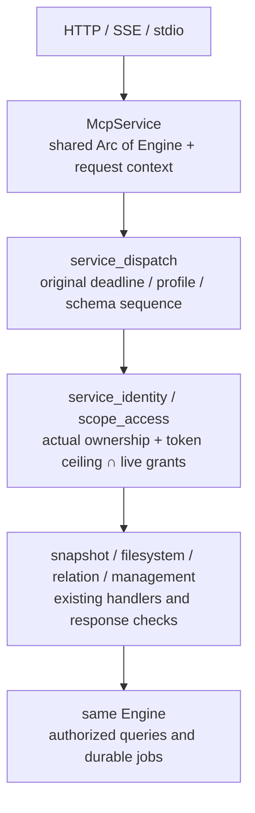

The incremental AST gate checks actual standard module files, orphan sources, object/line/documentation/import/body rules and direct or conditional path overrides. Unchanged legacy modules are explicitly registered exemptions: auth709lines, http2657 and protocol538 are not certified by a thin entry. The [D40 acceptance receipt](benchmarks/mcp_service_layout_acceptance_2026_10_04.json) records structural negative controls, execution results and native status separately. This organization preserves enabled capabilities and does not enable dangerous filesystem tools or complete platform/provider/host/device/release gates.

Same-source `fd9330e44318c15db7a9a3ea0cb34e6da2b0e81d` completed [CI37187379023 attempt2](https://github.com/loong10k/diskgraph/actions/runs/37187379023) at **22/22 success**. The 21 earlier successes were carried forward; only Kotlin Intel actually reran. Its first attempt failed during Maven plugin descriptor resolution before the host calls, with no proven network/cache root cause. The four original workspace logs individually confirm Git157 cases on each Windows Rust version (two Unix-only cases not executed), Git159 on Linux ARM and macOS Intel, authority39, prior query32, moved MCP21 and source gate9. These groups overlap. This closes the existing Git8.7 and request-authority15.20 acceptance; the checklist is139 complete/28 open/167 total. The broader production goal remains open.

## Query target preparation — D41, local checks passed; native acceptance pending

The earlier TUI/history consumer budgets did not cover owning a necessary `RevisionRecord.snapshot_id` before the consumer started. A legal2MiB snapshot ID reproduced that preparation cost through the actual public request. The17-source increment separates borrowed owner and snapshot projections: admit the actual owner fields, authorize the real server/scope, then admit the necessary snapshot ID. One `QueryReadBudget` and its original deadline continue through both historical sides, metadata, nodes, ordered merge and sync-plan rereads. Namespace eligibility uses the already authorized scope IDs without another owner read.

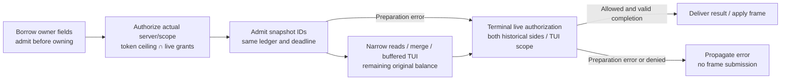

Once both historical owners are authorized, target/consumer failures still pass dual-side terminal checks before their errors are returned. Encoding retains the existing grouped live-grant checks. TUI moves the already charged ledger into navigation/frame reads. Failed initial target preparation never invokes painting or converts cached data into a partial frame. The existing separate 50 ms terminal-control window applies to Complete, Truncated and consumer-error outcomes. Complete results, including navigation, must remain within the original read deadline; only an already painted, explicitly marked Truncated canvas may be delivered after that graph deadline. The control window does not renew graph reads. The generic trusted reader and public compatibility wrappers retain their contracts; no second Engine, owner, thread or schema is introduced.

Whole-request tests cover each large historical side, cumulative preparation, ordinary/adequate-budget success, initial denial and terminal revocation. TUI tests inspect the real backend and require no painting/submission on initial failure. The first target run passed Store 3, Engine 10 and CLI 7; the subsequent full build exposed a test-conditional import used by production, corrected only by making that explicit import unconditional. The corrected 17-source freeze passed local workspace 1401/0/18 across 60 suites, fmt/include fmt, strict all-target Clippy/build, OpenSpec and release; vendor 124/0/2 passed. Separate release checks passed stdio 18/18, HTTP/SSE 13/13 and 19/19 actually invoked UniFFI ABI checks. The JDK 21 macOS ARM Kotlin host passed session/paging/poll/v1/release/reopen checks with the new Maven `--errors` diagnostics. Its separately built FFI library and the protocol/ABI library use the same reviewed source, with distinct binary hashes recorded in the [D41 receipt](benchmarks/query_target_preparation_acceptance_2026_10_04.json). New-source native acceptance is pending; task 13.6 remains open.

For requests whose read budgets cannot cover legal 2 MiB snapshot IDs, whole-call Rust requested allocation changed from 2,102,370–2,131,834 to 4,528–4,541 bytes for history, from 2,101,248 to 2,521 bytes for navigation, and from 2,184,272 to 2,521 bytes for a frame. Initial frame refusal no longer invokes paint or submits data. Ordinary and adequately budgeted requests still return successful results. These isolated cumulative allocation observations do not prove throughput gains, peak live memory, a SQLite C allocation, filesystem I/O or RSS cap; synchronous authorization and native I/O remain cooperative. Historical identity/content binding and provider/mobile/write/signing/deployment gates remain separate in the [latest readiness record](production-readiness-full-platform-2026-10-04.md).
