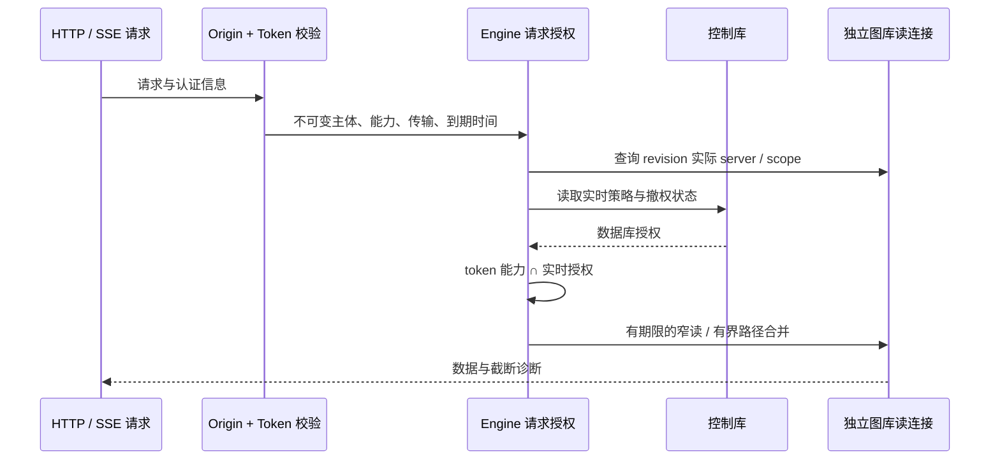
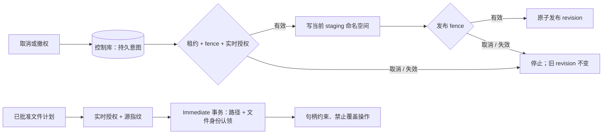
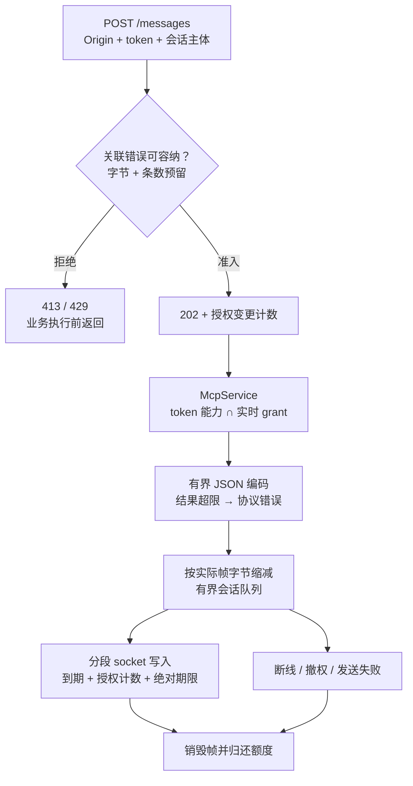
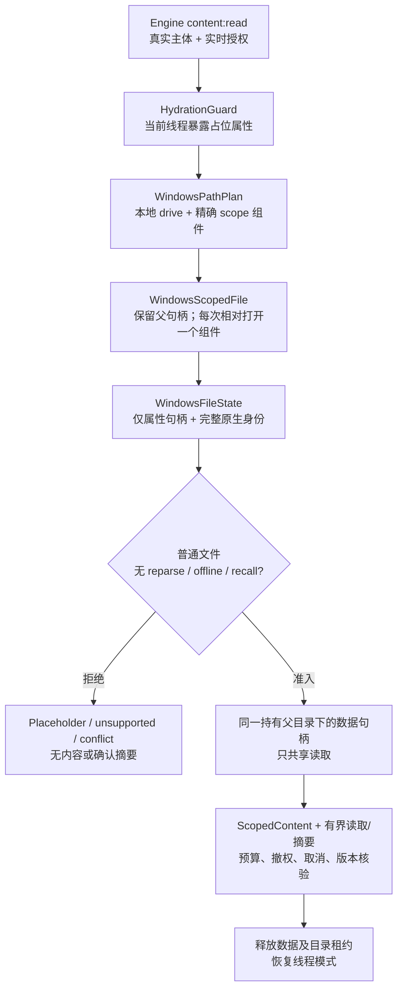
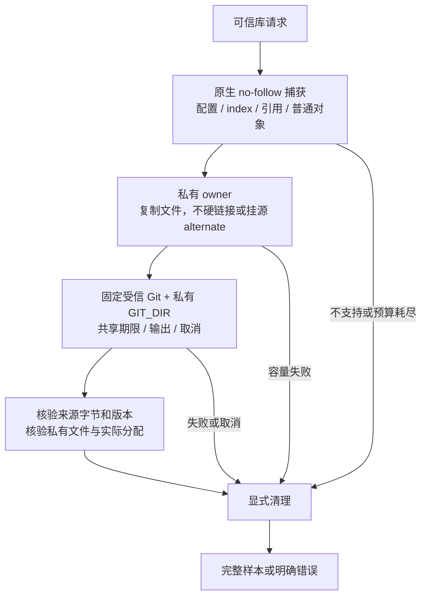

# DiskGraph 已实现的安全与查询边界

本文延续[总体架构](DiskGraph-Architecture.zh_CN.md)，设计目标仍须对应平台验收。

## 2026-10-01 加固实现边界

以下为本轮已落地调用链；前述标记 Target 的总体路线仍需对应平台验收。

写入由串行图库连接执行。job 以条件 UPDATE 认领，控制库事务内校验租约、fencing、scope 和实时 IndexWrite，保护 staging 批次、revision 发布和 collector 写入。过期认领使用新 staging 命名空间并重扫。上游扫描器源和摘要保持原 pin；转换使用迭代遍历，发布从 staging 生成正式节点。

迁移前使用 SQLite 一致性备份（包含已提交 WAL）至 `migration_backups/`；图库 schema 6 记录归属及规范化搜索字段，schema 7 增加未知大小稀疏索引、关系分页与有序路径索引，schema 8 增加候选目录大小与证据关系索引。Schema 9 在每次发布事务内维护精确快照/目录计数及尺寸累计计数，升级事务回填；snapshot writer 标记拒绝仍打开的旧程序写入，计数元数据缺失时拒绝查询。Known/unknown 页保留旧 JSON fallback 语义并走对应 partial index，显式 OFFSET 仍需 O(offset+page)。聚合增加存储和发布/迁移成本，备份/WAL/临时文件测量见[全平台记录](production-readiness-full-platform-2026-10-02.zh-CN.md)。候选选择和影响遍历使用请求专用读连接、期限与明确截断诊断。控制库 schema 4 记录租约/fencing，schema 5 持久化取消意图。控制库 schema 6 使用事务触发器记录独立授权变更计数，覆盖 policy/grant/scope，单条 grant 撤销也会变更；任务心跳不变更该计数。v5 升级前进行一致性 pre-v6 备份，失败原子回滚；升级前先停止旧服务，已经打开的旧连接不会自动取得新传输行为。旧 running job 等待 heartbeat + 30 秒租约到期，不在启动时抢占。图库 WAL/NORMAL 保证事务一致性，但断电可能丢失最近提交的可重建索引；控制库 FULL 保持操作记录持久性要求。两库仍无跨库原子事务承诺。

FFI 从无损图库路径派生控制数据隔离域；归属不明的旧共享控制数据拒绝复用。操作计划要求完整摘要和新鲜源证据，因此旧计划须重新创建。正目标候选现已采用有界准备，关系 impact 在分页和方向之间共享同一授权读连接。显式 offset 兼容输入仍需要遍历偏移；扫描取消不提供严格 RSS 上限。

兼容入口、保真检查、扫描超限余量、历史物理容量及本机测量详见[中文验收记录](security-performance-hardening-2026-10-01.zh-CN.md)。CLI/MCP 写工具关闭；Linux/Windows 原生操作与严格扫描 RSS 上限不在已完成能力中。

## Legacy 结果投递边界

远程 legacy 使用私有预算注册表，公开裸 sender 仅保留为可信内部兼容接口。每会话 64 条/16 MiB、每监听实例合计 64 MiB，包含待执行、编码及发送中的预留；准入先按 `max_response_bytes + 22` 认领，编码后缩为实际帧。默认 4 MiB 允许每会话三个、全实例十五个同时执行的最坏预留。无法容纳关联错误或单条预留时先返回 413，拥塞先返回 429；共用有界编码器保留现代 HTTP 的字段与超限状态。它约束投递缓冲，不约束工具 Value、分配器、内核缓冲或严格 RSS。

数据帧每次分段写检查到期与持久授权计数；非阻塞控制锁准入、SQLite 等待/执行和 socket 写入共用同一绝对期限。任何授权相关变更（包括无关主体、新增 grant）都会保守关闭旧结果，任务/操作表不触发；已经交给内核的字节无法撤回。外层闲置存活检查仍可能等待共享策略访问，没有严格一秒撤权/清理 SLA。接收端关闭释放排队帧，仍在运行的业务继续占用全局预留直到退出。202 后若断线则明确关闭并记录，持久 job 可重查。升级必须先停止旧宿主，不能用 schema 重开门禁冒充对存活旧进程的修复。

### Windows 普通文件内容获取

此增量保留公开结果字段及 Unix 路径。路径规划直接拒绝 ADS、父级跳转、UNC/设备命名空间及过长输入，不对客户端路径执行 canonicalize。完整 128 位 file ID 与原生写入/变更版本保持私有，不截断填入现有快照 ID 字段。属性获取不冻结新 writer：变化在数据访问前以 Conflict 拒绝；数据句柄随后拒绝普通写入/删除共享，持有父目录防止替换。这不构成原子快照或对所有 mapping/kernel/filter 活动的冻结；100ns 是表示单位，不保证文件系统实际精度或单调版本。可选线程 API（Windows 10 1709+）动态解析，缺能力返回公开 unsupported 错误码。线程模式不覆盖 scanner worker，打开时 no-recall 标志也不能证明真实 provider 后续读取不下载。取消/期限是协作式，不能抢占同步原生 I/O。原生回归证据限 CI 的 NTFS 夹具，其他文件系统/provider 验收分别记录于[全平台记录](production-readiness-full-platform-2026-10-02.zh-CN.md)；公开文件写能力继续关闭。

## Git 实时证据输入隔离（EC-04 / D20）

可信库采样使用私有配置、index、引用及扁平对象视图。当前调用来自库/测试，尚未建立生产CLI/MCP/FFI采样接线。普通loose对象和配对pack/index经no-follow捕获及同一私有分配owner复制；源alternates/promisor和不支持输入明确拒绝，忽略的加速文件不交Git。来源对象和元数据在准备与终检共享累计64 MiB/32k额度，私有owner另核128 MiB对象报告分配与64 MiB卷余量；ProbeLimits仍默认整次协作式15秒和累计输出1 MiB。

私有视图关闭递归源对象输入，但不是原子仓库快照或完整文件系统/RSS沙箱。复制和复核增加随字节量变化的成本，初始buffer保留及终检读取会增加内存；大pack或status输出可能明确超过默认额度。本机回归、复制成本原始测量与原生验收分别记于[全平台记录](production-readiness-full-platform-2026-10-02.zh-CN.md)。公开危险写工具仍关闭，其余设备/provider/生产门禁保持原要求。

## 树与历史请求边界 — D24

Store 入口只声明模块与导出。树窗口和历史有序游标先借用 SQLite 原始字段、
检查预算后再分配/解码；历史双侧及同步计划必要的窄重读共用一个账本。编码后
复核双方实际 revision 归属，最后能力回调结束后再检查所有持久授权。数值
minimum 计数保留既有累计索引和未知大小诊断。晚到报告明确局部统计，晚到计划
直接拒绝；错误诊断计入实际 JSON 转义且保留原业务错误码。正文读取在 EOF、
精确范围及身份末检之后检查 scope、授权和取消；旧读取包装新增 30 秒协作默认，
`read_bounded_until` 继承调用方期限。这些检查不承诺跨连接授权原子性、严格 I/O
时间或 RSS 上限。[全平台验收边界](production-readiness-full-platform-2026-10-02.zh-CN.md)
仍分别记录。

## 历史尺寸资格 — D33

Core 统一维护增长、变化与比较使用的纯函数。仅 `size_known && !read_error` 表示尺寸已观察；数值增量还要求准确节点类型相同。Engine 比较行按每侧独立保留未知值，只统计实测 `Size` 或 `Contents` 尺寸变化；跨根元数据比较保留原有相对路径契约。SQL 准入、共享预算及授权末检位于资格判断之外，`None` 不能替代取消、到期或权限错误。查询/比较对象真实分文件，保留既有公开导出与序列化类型。

尺寸变化数为零不能证明未知对象未变。同scope历史兼容、Windows历史身份连续性及历史正文版本绑定仍是独立未完成项。
