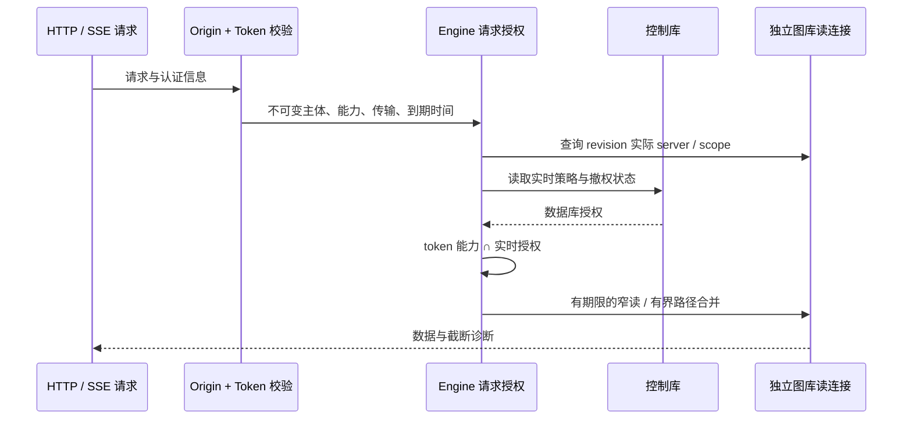
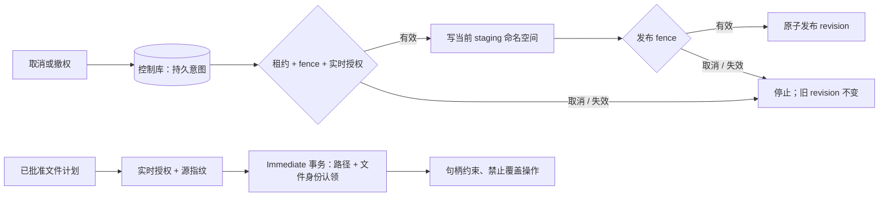
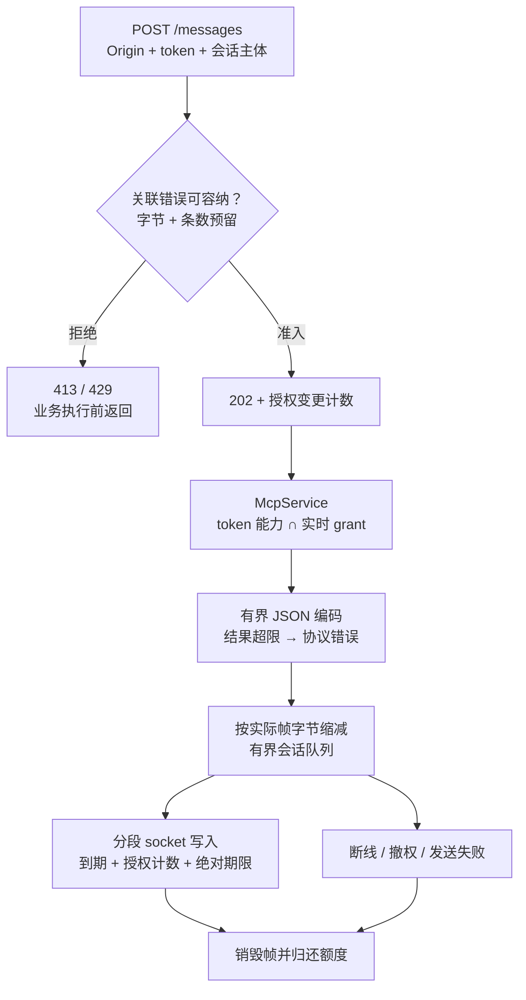
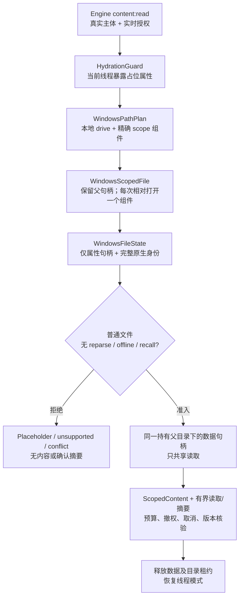
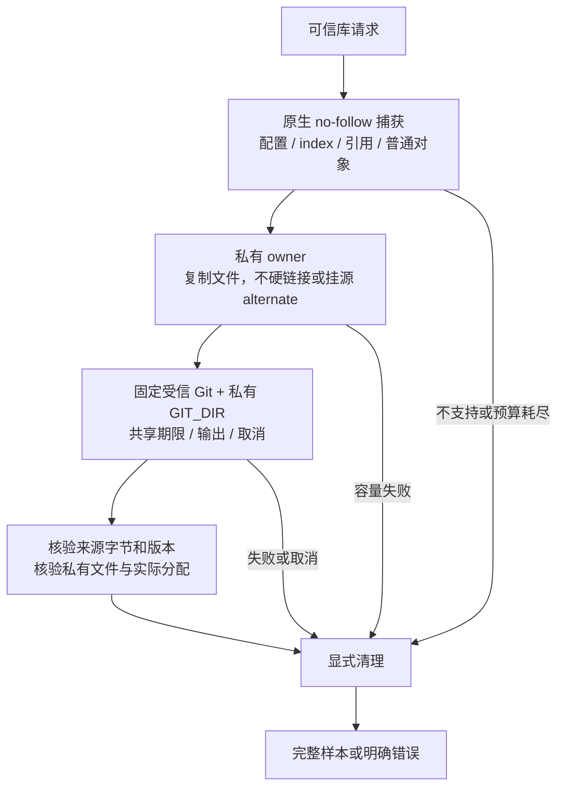
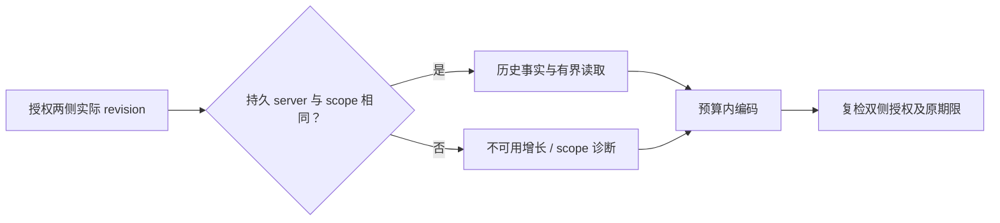
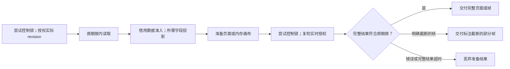
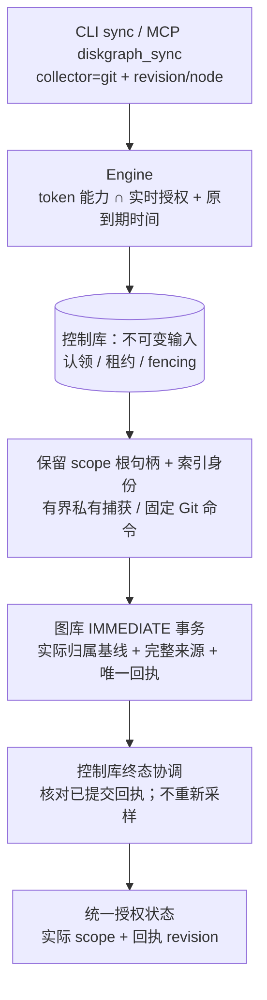
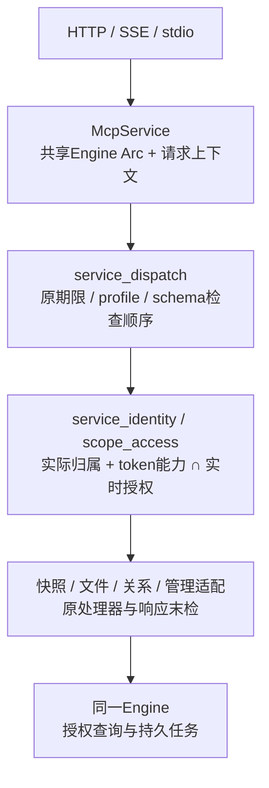
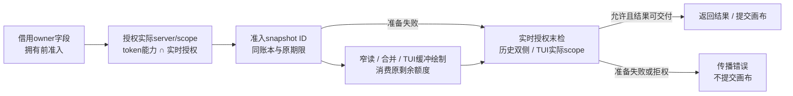

# DiskGraph 已实现的安全与查询边界

本文延续[总体架构](DiskGraph-Architecture.zh_CN.md)，设计目标仍须对应平台验收。

## 2026-10-01 加固实现边界

以下为本轮已落地调用链；前述标记 Target 的总体路线仍需对应平台验收。

写入由串行图库连接执行。job 以条件 UPDATE 认领，控制库事务内校验租约、fencing、scope 和实时 IndexWrite，保护 staging 批次、revision 发布和 collector 写入。过期认领使用新 staging 命名空间并重扫。上游扫描器源和摘要保持原 pin；转换使用迭代遍历，发布从 staging 生成正式节点。

迁移前使用 SQLite 一致性备份（包含已提交 WAL）至 `migration_backups/`；图库 schema 6 记录归属及规范化搜索字段，schema 7 增加未知大小稀疏索引、关系分页与有序路径索引，schema 8 增加候选目录大小与证据关系索引。Schema 9 在每次发布事务内维护精确快照/目录计数及尺寸累计计数，升级事务回填；snapshot writer 标记拒绝仍打开的旧程序写入，计数元数据缺失时拒绝查询。Known/unknown 页保留旧 JSON fallback 语义并走对应 partial index，显式 OFFSET 仍需 O(offset+page)。聚合增加存储和发布/迁移成本，备份/WAL/临时文件测量见[全平台记录](production-readiness-full-platform-2026-10-02.zh-CN.md)。候选选择和影响遍历使用请求专用读连接、期限与明确截断诊断。控制库 schema 4 记录租约/fencing，schema 5 持久化取消意图。控制库 schema 6 使用事务触发器记录独立授权变更计数，覆盖 policy/grant/scope，单条 grant 撤销也会变更；任务心跳不变更该计数。v5 升级前进行一致性 pre-v6 备份，失败原子回滚；升级前先停止旧服务，已经打开的旧连接不会自动取得新传输行为。旧 running job 等待 heartbeat + 30 秒租约到期，不在启动时抢占。图库 WAL/NORMAL 保证事务一致性，但断电可能丢失最近提交的可重建索引；控制库 FULL 保持操作记录持久性要求。两库仍无跨库原子事务承诺。

FFI 从无损图库路径派生控制数据隔离域；归属不明的旧共享控制数据拒绝复用。操作计划要求完整摘要和新鲜源证据，因此旧计划须重新创建。正目标候选现已采用有界准备，关系 impact 在分页和方向之间共享同一授权读连接。显式 offset 兼容输入仍需要遍历偏移；扫描取消不提供严格 RSS 上限。

兼容入口、保真检查、扫描超限余量、历史物理容量及本机测量详见[中文验收记录](security-performance-hardening-2026-10-01.zh-CN.md)。CLI/MCP 写工具关闭；Linux/Windows 原生操作与严格扫描 RSS 上限不在已完成能力中。

## Legacy 结果投递边界

远程 legacy 使用私有预算注册表，公开裸 sender 仅保留为可信内部兼容接口。每会话 64 条/16 MiB、每监听实例合计 64 MiB，包含待执行、编码及发送中的预留；准入先按 `max_response_bytes + 22` 认领，编码后缩为实际帧。默认 4 MiB 允许每会话三个、全实例十五个同时执行的最坏预留。无法容纳关联错误或单条预留时先返回 413，拥塞先返回 429；共用有界编码器保留现代 HTTP 的字段与超限状态。它约束投递缓冲，不约束工具 Value、分配器、内核缓冲或严格 RSS。

数据帧每次分段写检查到期与持久授权计数；非阻塞控制锁准入、SQLite 等待/执行和 socket 写入共用同一绝对期限。任何授权相关变更（包括无关主体、新增 grant）都会保守关闭旧结果，任务/操作表不触发；已经交给内核的字节无法撤回。外层闲置存活检查仍可能等待共享策略访问，没有严格一秒撤权/清理 SLA。接收端关闭释放排队帧，仍在运行的业务继续占用全局预留直到退出。202 后若断线则明确关闭并记录，持久 job 可重查。升级必须先停止旧宿主，不能用 schema 重开门禁冒充对存活旧进程的修复。

### Windows 普通文件内容获取

此增量保留公开结果字段及 Unix 路径。路径规划直接拒绝 ADS、父级跳转、UNC/设备命名空间及过长输入，不对客户端路径执行 canonicalize。完整 128 位 file ID 与原生写入/变更版本保持私有，不截断填入现有快照 ID 字段。属性获取不冻结新 writer：变化在数据访问前以 Conflict 拒绝；数据句柄随后拒绝普通写入/删除共享，持有父目录防止替换。这不构成原子快照或对所有 mapping/kernel/filter 活动的冻结；100ns 是表示单位，不保证文件系统实际精度或单调版本。可选线程 API（Windows 10 1709+）动态解析，缺能力返回公开 unsupported 错误码。线程模式不覆盖 scanner worker，打开时 no-recall 标志也不能证明真实 provider 后续读取不下载。取消/期限是协作式，不能抢占同步原生 I/O。原生回归证据限 CI 的 NTFS 夹具，其他文件系统/provider 验收分别记录于[全平台记录](production-readiness-full-platform-2026-10-02.zh-CN.md)；公开文件写能力继续关闭。

## Git 实时证据输入隔离（EC-04 / D20）

可信库采样使用私有配置、index、引用及扁平对象视图。D20时点调用来自库/测试；下文D39记录CLI/MCP产品接线，FFI采样集成仍是独立事项。普通loose对象和配对pack/index经no-follow捕获及同一私有分配owner复制；源alternates/promisor和不支持输入明确拒绝，忽略的加速文件不交Git。来源对象和元数据在准备与终检共享累计64 MiB/32k额度，私有owner另核128 MiB对象报告分配与64 MiB卷余量；ProbeLimits仍默认整次协作式15秒和累计输出1 MiB。

私有视图关闭递归源对象输入，但不是原子仓库快照或完整文件系统/RSS沙箱。复制和复核增加随字节量变化的成本，初始buffer保留及终检读取会增加内存；大pack或status输出可能明确超过默认额度。本机回归、复制成本原始测量与原生验收分别记于[全平台记录](production-readiness-full-platform-2026-10-02.zh-CN.md)。公开危险写工具仍关闭，其余设备/provider/生产门禁保持原要求。

## 树与历史请求边界 — D24

Store 入口只声明模块与导出。树窗口和历史有序游标先借用 SQLite 原始字段、
检查预算后再分配/解码；历史双侧及同步计划必要的窄重读共用一个账本。编码后
复核双方实际 revision 归属，最后能力回调结束后再检查所有持久授权。数值
minimum 计数保留既有累计索引和未知大小诊断。晚到报告明确局部统计，晚到计划
直接拒绝；错误诊断计入实际 JSON 转义且保留原业务错误码。正文读取在 EOF、
精确范围及身份末检之后检查 scope、授权和取消；旧读取包装新增 30 秒协作默认，
`read_bounded_until` 继承调用方期限。这些检查不承诺跨连接授权原子性、严格 I/O
时间或 RSS 上限。[全平台验收边界](production-readiness-full-platform-2026-10-02.zh-CN.md)
仍分别记录。

## 历史尺寸资格 — D33

Core 统一维护增长、变化与比较使用的纯函数。仅 `size_known && !read_error` 表示尺寸已观察；数值增量还要求准确节点类型相同。Engine 比较行按每侧独立保留未知值，只统计实测 `Size` 或 `Contents` 尺寸变化；跨根元数据比较保留原有相对路径契约。SQL 准入、共享预算及授权末检位于资格判断之外，`None` 不能替代取消、到期或权限错误。查询/比较对象真实分文件，保留既有公开导出与序列化类型。

尺寸变化数为零不能证明未知对象未变。同 scope 的 Q-04 兼容矩阵与一致完整覆盖语义已在 D35 任务3.9、`2450ab1` 同源码原生 CI 中验收；Windows 历史身份连续性及历史正文版本绑定仍是独立未完成项。

## 历史命名空间资格 — D34

Engine 增长与变化复用已有 reader 核对 revision 持久归属。两侧须属于本服务器及同一有效 scope；注册 API 保证每个 scope 的无损根不可变。显示文本不能证明命名空间相同。不同 scope 返回不可用增长，或保留 `different_root` 变化标签并新增 `scope_changed: true`；未绑定、异服务器、撤销及存储失败仍是错误。可信资格辅助方法不授予权限，各入口保留原授权与响应预算，包括编码后的双侧复检。旧 FFI growth 使用同一资格判断，保留导出契约；通用元数据比较在双侧授权后仍允许跨根。

命名空间资格不能证明历史文件身份连续或正文版本相同；原生 CI 与这些剩余要求独立记录。

## 受约束 Git 捕获与 TUI 准入 — D36

可信库入口 `sample_git_scoped` 接受已注册根和明确的无损仓库定位。保留根句柄、原生相对组件打开在启动子进程前约束工作树及 Git 依赖；独立私有捕获提供普通文件、元数据、属性和对象依赖，支持的命令不再打开实时工作树。捕获和复验共用输入、条目、取消及时间预算，终检拒绝源变化和根路径链替换。嵌套仓库、scope 外依赖明确不支持。调用者仍须授权正文访问：独立 D39 产品入口接入持久 collector job 与 CLI/MCP 命令，见下文。

TUI 导航与整帧准备采用专用 display reader。初始控制锁争用及时拒绝，实际 revision 归属和实时授权在原读取期限内检查。导航只投影所需字段，借用原始数据先准入再解码，续页探针不读取 payload。整帧各层共用读取账本，保留的展示数据另计预算；完整页须通过末段授权及原期限检查才返回。明确截断的帧可在末检成功后保留已绘数据，撤权及真实存储故障仍返回错误。

候选准备也在解码前准入快照覆盖头，与被选节点和必需证据共用原始字节账本。原请求已到期时保留类型化空 `Deadline` 结果，并明确返回 `coverage_observed: false`，不能解释为已经观测到覆盖缺口；成功准入的头保留真实覆盖状态。原始字节不足、坏头或缺索引仍返回错误。CLI、MCP 和 FFI 保留旧 wire 字段并新增该诊断；直接构造 `CandidateSelection` 字面量的 Rust 调用者需要补充新字段。

TUI 入口现只包含模块声明和导出，真实对象与绘制逻辑各自分文件。同步 authorizer 仍采用合作检查，不承诺任意回调硬抢占、SQLite C 分配上限或严格 RSS 上限；显式导航 offset 仍需 O(offset + page) 工作。D36 源码及实际平台验收分别记录在 [Git 捕获回执](benchmarks/scoped_git_capture_acceptance_2026_10_04.json)和 [TUI 预算回执](benchmarks/tui_budget_acceptance_2026_10_04.json)。

## 持久 Git 采集 — D39

CLI C03 与 MCP 共用不可变输入和 Engine 授权。控制库 schema8 保存原始输入和有限诊断；图库 schema13 原子发布 collector revision 与唯一回执。基线按实际 server/scope 判断，不采用另一 owner 的 legacy 根指针；丢失选中来源时拒绝。恢复只核对已有回执，不重新采样。排队状态保存在 SQLite，取消标志只属于本机运行代次并按 Arc 身份释放。CLI 状态 data 使用共同授权投影，保留既有外层 scope/revision 字段；MCP 状态内外身份来自同一投影，拒绝不一致 scope 提示。观测指纹覆盖安全摘要和固定请求，不表示全部来源字节的内容哈希。

本机最终验证与同源码原生验收分别记录，全平台任务保持开放。

## MCP 服务源码边界 — D40

55行库入口仅包含标准模块声明与明确根导出。`mcp_config.rs`保存配置和默认值，`mcp_service.rs`保留共享Engine与请求上下文；分发、身份/范围解析、真实工具处理及stdio各自分文件，没有新增授权或调度owner。内部可见性维持原crate协作者访问，不增加公开字段。67个原函数正文和21个原测试的有效token一致，包含状态投影和末段授权。

增量AST门禁检查真实标准模块文件、未挂载源、对象/行数/注释/导入/函数正文规则及直接或条件路径覆盖。既有模块明确列为豁免，auth709行、http2657行、protocol538行不因入口变薄而算合规。[D40验收回执](benchmarks/mcp_service_layout_acceptance_2026_10_04.json)分别记录结构负控、实际执行和原生状态。本次整理保留已启用能力，不启用危险文件工具，也不完成平台/provider/宿主/设备/发布门禁。

`fd9330e44318c15db7a9a3ea0cb34e6da2b0e81d`同源码[CI37187379023第二次attempt](https://github.com/loong10k/diskgraph/actions/runs/37187379023)终态为**22/22 success**。保留21项先前成功，仅Kotlin Intel实际重跑；其首次失败发生在宿主调用前的Maven插件描述解析，不能据此推断网络或缓存根因。四份原始workspace日志逐案确认：两个Windows Rust版本各Git157项（2个Unix-only未执行），Linux ARM与macOS Intel各Git159项，以及持久授权39、既有查询32、迁移MCP21、源码门禁9项。这些分组存在重叠。现有Git8.7与请求授权15.20已验收，清单为139完成／28开放／167总项，完整生产目标仍未完成。

## 查询目标准备 — D41，本机检查通过，原生验收待完成

此前TUI／历史消费者的预算没有覆盖其启动前拥有必要`RevisionRecord.snapshot_id`的成本，合法2MiB snapshot ID经真实公开请求复现了该问题。17源增量将归属与snapshot投影分离：先借用准入实际owner字段，核验真实server/scope授权，再准入必要snapshot ID。双侧历史、快照元数据、节点、有序合并及同步计划窄重读继续使用同一`QueryReadBudget`与原期限；命名空间资格直接使用已授权的scope ID，不另读归属。

双方历史 owner 均已授权后，目标／消费者失败也先执行双侧末检再返回原错误，编码后的成组实时 grant 复验保留。TUI 把已计费账本移入导航／整帧读取；初始目标准备失败不调用 paint，不将缓存伪装为部分帧。既有独立 50 ms 控制终检窗口适用于 Complete、Truncated 与消费者错误结果；Complete（包括导航）必须遵守原读取期限，只有已经绘出明确截断提示的 Truncated 画布可在原图库期限后交付。控制窗口不能续租图库读取。通用可信 reader 及公开兼容包装保持原合同，没有新增 Engine、owner、线程或 schema。

整请求测试覆盖左右大头、累计准备、普通／足额真实成功、初次拒权及末段撤权；TUI 检查实际后端，初始失败必须不绘制／提交。首轮目标 Store 3、Engine 10、CLI 7 通过，随后完整构建发现生产调用的显式导入误受 test 条件限制，仅将该导入改为无条件。修正后 17 源冻结的本机 workspace 1401/0/18、60 suites，fmt／include fmt、严格 all-target Clippy／build、OpenSpec 及 release 通过，vendor 124/0/2 通过。单独执行的 release stdio 18/18、HTTP/SSE 13/13 及真实调用的 UniFFI ABI 19/19 通过；JDK 21 macOS ARM Kotlin 宿主实际通过会话／分页／轮询／v1／release／重开检查，并执行新增 Maven `--errors` 诊断。Kotlin 单独构建的 FFI 库与协议／ABI 库来自同一审查源码，二进制摘要不同，均记录在 [D41 回执](benchmarks/query_target_preparation_acceptance_2026_10_04.json)。新源码原生验收尚未完成，任务 13.6 继续开放。

对额度不足、使用合法 2 MiB snapshot ID 的请求，历史整调用 Rust requested 累计分配从 2,102,370–2,131,834 降至 4,528–4,541 字节，导航从 2,101,248 降至 2,521 字节，整帧从 2,184,272 降至 2,521 字节；初始整帧拒绝不再调用 paint 或提交数据。普通及足额请求仍实际成功。这些隔离分配观察不证明吞吐提升、峰值存活内存、SQLite C 分配、文件系统 I/O 或 RSS 上限；同步授权及原生 I/O 仍为协作检查。历史身份／正文绑定与 provider／移动端／原生写／签名／部署门禁见[最新就绪记录](production-readiness-full-platform-2026-10-04.zh-CN.md)。
