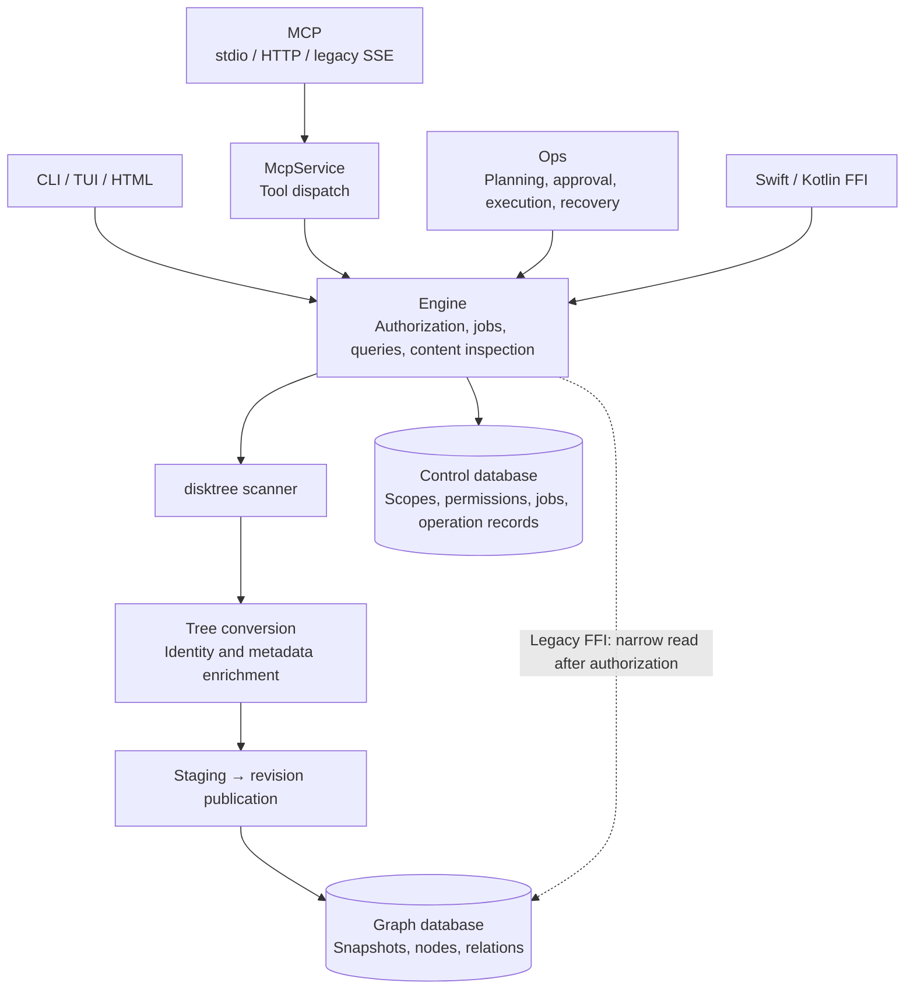
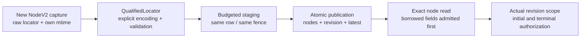
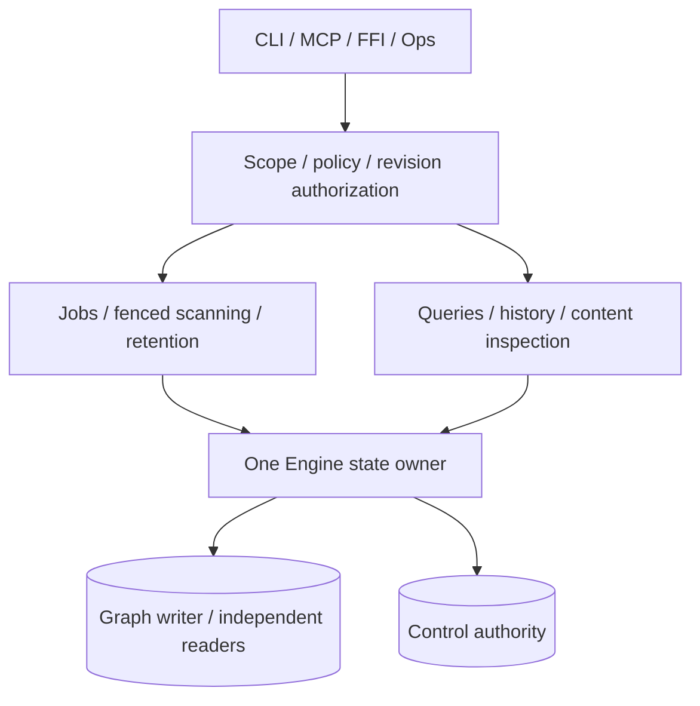
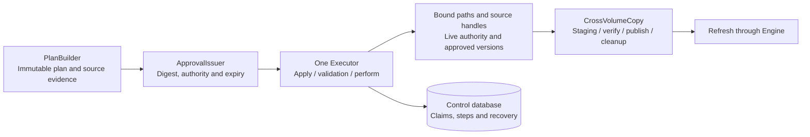
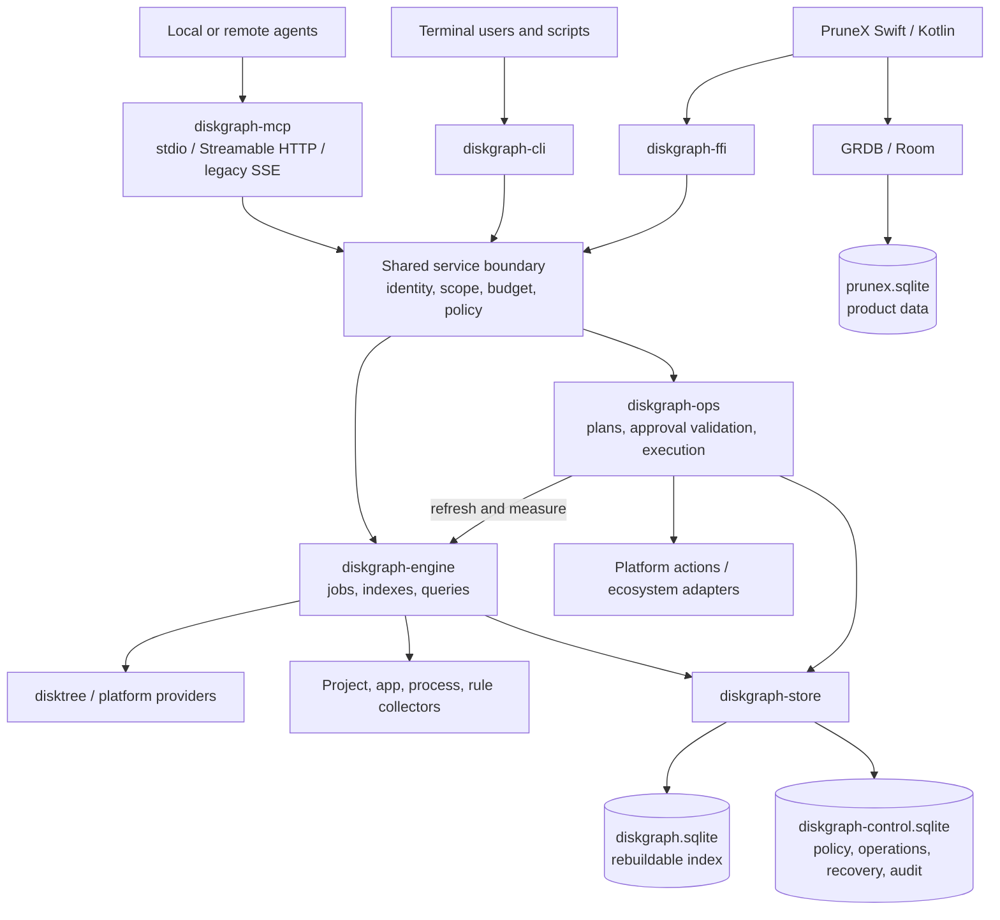
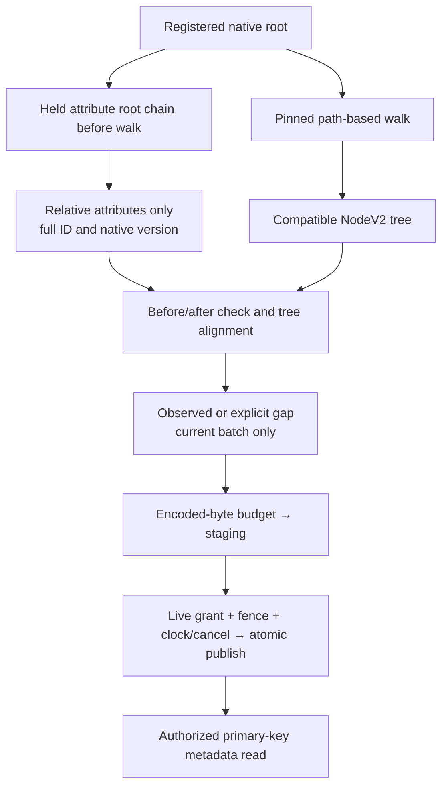
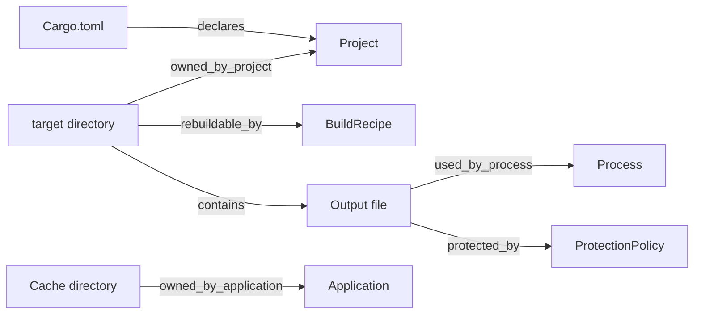
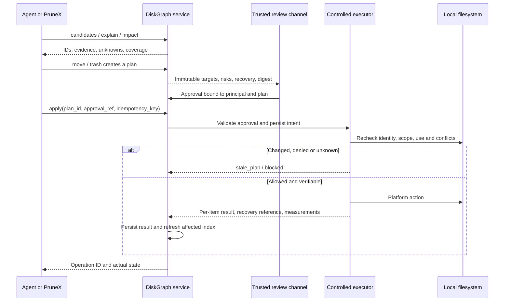
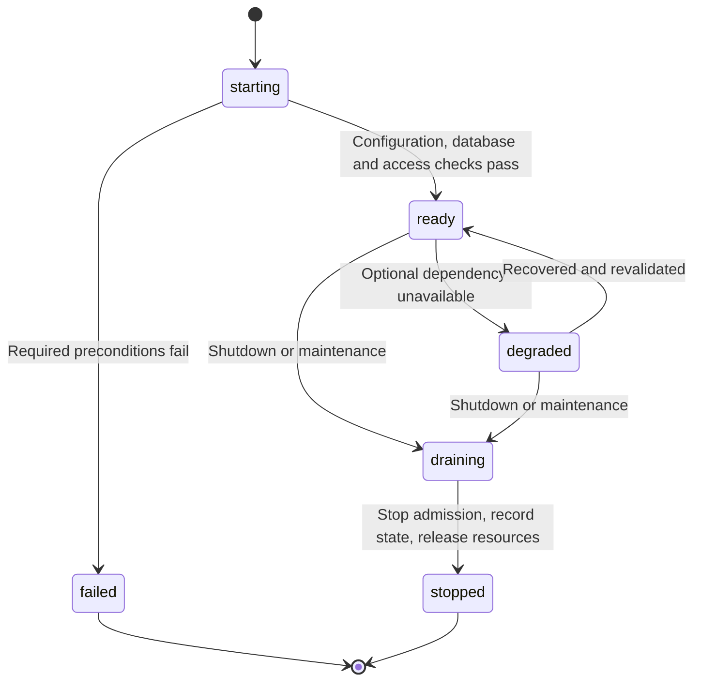

# DiskGraph Architecture

[English](DiskGraph-Architecture.md) | [简体中文](DiskGraph-Architecture.zh_CN.md)

> **Purpose**: Define the shared engine's boundaries, components, flows and acceptance criteria for maintainers, native developers, agent integrators, testers and operators.
>
> **Document version**: 1.1, independent of software and schema versions\
> **Source baseline**: `a89e57a`; workspace `0.1.0`\
> **Owner**: DiskGraph maintainers; individual reviewers remain to be assigned\
> **Verified**: 2026-09-28; **Status**: pending review\
> **Deployment scope**: existing embedded libraries; planned local tools, single-host servers and restricted mobile hosts. Keep the project private under the agreed release policy.

```text
Authorized directories / platform observations
        |
        v
[DiskGraph: scan -> snapshot -> evidence graph -> bounded query]
        |                                             |
        v                                             v
Rust / FFI / CLI / MCP                         candidates + reasons
                                                      |
                                            plan -> approve -> act
```

**Existing foundation** means source exists and baseline tests passed locally, not that the product is stable. **Target** means planned OpenSpec behavior. **Unverified** means target-environment evidence is missing. Unless explicitly marked current, runtime, authorization and execution mechanisms below describe the target architecture.

The [OpenSpec change](../openspec/changes/implement-diskgraph-platform/proposal.md) owns requirements and acceptance. The [technical design](DiskGraph-Technical-Design.md) owns engineering detail; the [command reference](command-reference.md) owns the interface catalog; [tasks](../openspec/changes/implement-diskgraph-platform/tasks.md) own implementation sequencing. Formal specifications and the command reference currently remain in Chinese.

## 1. Positioning: an independent tool and PruneX foundation

DiskGraph is a Rust engine for relationships among files, directories, applications, projects, processes and generation rules. Its target capabilities include persistent indexes, history, bounded queries and optional controlled operations. It can be installed independently for agents or embedded beneath PruneX.

- `PruneX ≈ disktree-app`: user experience, interaction, product workflows and model orchestration.
- `DiskGraph shared engine ≈ disktree-core`: shared lower-level capabilities, not feature equivalence.
- DiskGraph is the entire project; `diskgraph-core` is only its model/contract crate.
- `diskgraph-mcp` is a Rust protocol adapter, not a second scanner or graph store.
- A prebuilt binary can include its scanning dependency; end users need not install disktree-app, PruneX or a Rust toolchain.

The engine should answer what consumes space, who owns it, what changed, what uses it, whether it is rebuildable, what an operation might affect, and how an authorized operation can be verified.

Efficiency comes from index reuse across sessions, compact relational context, stable pagination and targeted updates. Wrapping ls/du/find alone is insufficient. Cold indexing, freshness and accuracy count alongside warm-query latency.

**Change from the initial design: queries remain read-only, but execution no longer belongs exclusively to PruneX.** Optional `diskgraph-ops` enables authorized actions on headless servers. PruneX supplies a trusted review experience; the server validates approvals, rechecks live resources and records effects.

The core does not require AgentScope or a model. Planned PruneX macOS/iOS orchestration uses Swift and AgentScope-Swift; Android uses Kotlin and AgentScope-Kotlin. Lite cloud models and Pro local models are PruneX choices, not sources of authority inside DiskGraph.

## 2. Existing foundation and gaps

| Area | Current source evidence | Target |
| :--- | :--- | :--- |
| Crates | core/store/disktree/ffi | Add engine/collectors/ops/cli/mcp |
| Models | DiskSnapshot, DiskNode, EvidenceEdge with textual subject | Lossless locators, typed entities, versioned evidence and coverage |
| Scan | Native-path bridge; empty evidence; absent FileIdentity; lossy conversion | Lossless identity, scoped errors, project/app/process collectors |
| Sizes | direct/subtree bytes under one selected measurement | Separate apparent/allocated sizes and unknown values, not guaranteed reclaim |
| History | v1 growth requires complete scans, identical settings and known equal volumes | Explicit comparability and partial coverage; no default rename inference |
| Storage | Immutable transactional SQLite v1 snapshots and paging | Migrations, graph revisions, control records, retention and quotas |
| Queries | top/children/growth/explain/candidates | 29 command families and shared service methods |
| Adapters | Read-only UniFFI JSON v1 | CLI, three MCP transports and versioned native APIs |
| Platforms | Desktop native scan entry points; no mobile URI scanner | Capability-based releases and restricted mobile providers |

Current candidates require explicit Rebuildable evidence; classification hints alone do not grant eligibility. Directory modification time is aggregated from the subtree, not necessarily the directory's own mtime. The Windows bridge lacks volume identity.

Evidence: [models](../crates/diskgraph-core/src/model.rs), [queries](../crates/diskgraph-core/src/query.rs), [store](../crates/diskgraph-store/src/lib.rs), [bridge](../crates/diskgraph-disktree/src/lib.rs), [FFI](../crates/diskgraph-ffi/src/lib.rs). On 2026-09-28, nine existing unit tests, fmt and Clippy passed locally on macOS with Rust 1.98.1. This does not verify remote CI, the declared Rust 1.97 minimum, installation packages or mobile devices.

## 3. Overall structure

### Current implementation call paths (2026-10-01)



Legacy FFI signatures remain compatible. Engine now checks actual snapshot/revision ownership and live authorization before opening a read connection. Raw store APIs remain trusted internal compatibility entry points. The hardening record below separates implementation from platform acceptance.

### Qualified scan locators (D30, 2026-10-04)

New scan observations retain explicit native encoding, original bytes and own
mtime in schema11 staging and nodes. Display paths remain the v1 compatibility
projection. The same publication transaction moves all fields, binds ownership
and updates latest; an independent locator generation rejects obsolete writers.
Exact node reads check borrowed-field budgets before allocation and require the
revision's actual scope authorization again before returning. Legacy rows are
not reconstructed from display text and require reindexing for native addressing.



The old trusted Locator/Store APIs remain compatible. Pinned scanner limitations,
legacy scope encoding provenance, file-handle authorization, live collector jobs,
provider and native write acceptance remain independent obligations.

### Current Engine source boundaries (RT-09, 2026-10-02)

The entry only declares modules and preserves exports. Types, including private records, traits and aliases, have separate files; production modules contain fewer than 500 physical lines. Scope/policy/revision authorization, job scheduling and fenced scanning, retention, bounded queries/history, content and live evidence retain real implementations on one shared Engine. Public `content`, `live_evidence` and `verify` module paths remain stable through façades. Trusted raw readers and control access still require authorization at the caller.



Modules preserve graph→control lock order, same-guard authorization, per-generation cancellation and RAII cleanup. This is a source-boundary change, not a new runtime service layer or an atomic transaction across databases. The [Engine README](../crates/diskgraph-engine/README.md#source-boundaries--源码边界) maps each responsibility; its AST gate supplements the existing behavior and native-platform gates.

### Current Ops source boundaries (OP-14, 2026-10-03)

The entry and the public `specialist`/`docker` façades declare modules and preserve exports. Plan creation, approval issuance, execution validation, transfer, path checks, queries and adapters each retain their actual implementations. Execution methods share one `Executor`; cross-volume transfer retains one `CrossVolumeCopy` resource owner. The following diagram describes the operation sequence and ownership boundaries.



The split preserves public paths, normalized function bodies, platform conditions, transaction/lock order and explicit cleanup. It adds no runtime service or resource owner. The existing unsupported-platform `CrossVolumeCopy::discard` remains a documented empty cleanup for a zero-resource type; its constructors and publication still refuse execution. Dangerous CLI/MCP tools remain closed, and native write fidelity requires its separate platform acceptance. The [Ops README](../crates/diskgraph-ops/README.md#source-boundaries--源码边界) maps files to responsibilities; source-layout gates and native CI verify this structural increment.

### Target architecture



Arrows show runtime calls. Compile-time dependencies use core ports. CLI, MCP and FFI are peers: MCP does not shell out to the CLI, and PruneX does not require an MCP subprocess.

| Module | Status | Responsibility |
| :--- | :--- | :--- |
| diskgraph-core | Existing, extend | Models, IDs, relations, DTOs and ports; no SQLite/UI dependency |
| diskgraph-store | Existing, extend | Schemas, transactions, migrations, paging and retention for Rust-owned stores |
| diskgraph-disktree | Existing, extend | Pinned scanning bridge; no upstream removal calls |
| diskgraph-engine | Planned | Scan/collector jobs, revision publication, queries and budgets |
| diskgraph-collectors | Planned | Project/app/process/rule evidence and validity, not model instructions |
| diskgraph-ops | Planned | Immutable plans, approval validation, execution, idempotency and recovery |
| diskgraph-cli | Planned | Local/remote commands, service bootstrap and client registration |
| diskgraph-mcp | Planned | Three transports, tool schemas, identity context and service adaptation |
| diskgraph-ffi | Existing, reorganize | Swift/Kotlin APIs, job handles, background work and cancellation |
| Platform providers | Modules or host code | NativeFs, Android URIs, iOS documents and capability limits |

ops requests refresh through a port; engine and ops must not form a dependency cycle. Split additional platform crates only when packaging or maintenance warrants it.

### Complete Windows attribute observations (D31, 2026-10-04)

Schema 12 stores full 128-bit file IDs, u64 volume serials, EOF and raw native
creation/write/change times as an independent fixed-version observation. A held
root chain constrains attribute-only relative opens; the pinned walk still uses
paths. Per-node before/after state and comparison with available old tree facts
produce either an observation (Matched/Unverified) or an explicit gap. No old
size/time field is overwritten or promoted to an atomic content version.

Native I/O occurs outside graph/control write locks. Every native query checks
the original monotonic deadline and local cancellation; durable authorization
and fencing are refreshed within 20ms and forced before staging/publication.
The write callbacks also check clock/cancel after lock waits. Schema migration
keeps legacy columns NULL, consistent backups precede upgrade, and an independent
writer generation prevents old open writers from dropping the new fields.
`revision_windows_observation` reads one authorized node using borrowed byte
admission and terminal authorization, without converting foreign paths.




## 4. Reuse, CodeGraph and operating-system commands

Keep `disktree-core` pinned behind a bridge. A small source-file count does not remove platform, safety and upstream maintenance costs. Consider patches, a fork or vendoring only when demonstrated requirements cannot be met by adaptation, preserving provenance, licenses and a change ledger.

| Reference | Reuse | Do not copy |
| :--- | :--- | :--- |
| disktree | Scanning, size handling, hard links, classification | Classification as approval or removal authorization |
| PureMac | Application IDs, container association and protection experience | Deleting every name match |
| mac-cleanup-sh | Ecosystem categories and rule examples | Full cleanup scripts or arbitrary Shell |
| CodeGraph | Persistent indexing, explore, exact relations, tool profiles, invalidation | AST semantics, code ignore lists or advertised efficiency numbers |

target, node_modules, hidden directories and caches are valuable scan inputs. A compact default MCP tool list is not a four-capability ceiling: service APIs and tool-list presentation are separate choices.

Basic enumeration, find/du/stat/df/read/move/copy-like behavior uses Rust/platform APIs, not mandatory system commands. Git, lsof-like observations, Cargo and Docker are optional adapters. Missing dependencies disable that capability; they do not permit raw-directory deletion.

The [reference study](reference-study.md) preserves historical investigation. Its earlier test results, upstream state and execution boundaries are not current acceptance evidence; this OpenSpec change governs newer requirements.

## 5. Data: an evidence graph over a directory tree

| Object | Meaning |
| :--- | :--- |
| DiskSnapshot | Root/volume/provider, options, time window, coverage and errors; not an atomic filesystem snapshot |
| DiskNode / Resource | Snapshot-local ID, parent, lossless locator, type, sizes and timestamps |
| CollectorRun | Method/rule versions, fingerprints, access coverage, time and failures |
| GraphRevision | Immutable composition of a file snapshot and selected collector runs |
| EvidenceEdge / Record | Typed assertions, supporting/contradicting evidence, provenance, freshness and dependencies |

ResourceRef contains server, scope, revision and node. It is a reference, not an access token. Paths, volume/inode IDs and hashes are not permanent identities on their own. Display strings and operational locators are separate.



A relationship is an assertion, not permission. Ownership does not imply deletability; rebuildability does not guarantee acceptable reconstruction costs; lack of observed use does not prove inactivity. Multiple owners and conflicts remain visible. Confidence is not a probability or an authorization score.

Freshness is fresh/stale/invalidated/unknown, with conflict recorded independently. Expired use evidence does not become “idle”; unavailable protection does not revoke protection. Candidates report eligible_for_review/blocked/unknown, never safe_to_delete.

Unknown sizes are not zero. Hard links, shared blocks, sparse files, system snapshots and open handles can change reclaim behavior. Observed size and measured free-space changes remain separate.

## 6. Storage ownership and server locality

Preserve the Rust graph/PruneX business-data separation, adding a Rust control store for standalone execution.

| Data | Owner | Lifecycle |
| :--- | :--- | :--- |
| diskgraph.sqlite | Rust diskgraph-store | Rebuildable file/relationship index and retained history |
| diskgraph-control.sqlite | Rust diskgraph-store | Scopes, policies, jobs, plans, approvals, operations, recovery and audit; survives index rebuild |
| prunex.sqlite | PruneX GRDB / Room | Sessions, preferences, UI and workflow projections; not remote execution authority |

Swift/Kotlin do not independently implement DiskGraph schema management. Native SQLite versions, symbols, linking and connection lifetimes still require validation; different database filenames do not remove linking conflicts.

Scanning, databases and effects remain on the server containing the resources. A local agent accesses authorized results through the protocol, without mounting SQLite or treating remote paths as local. Server recovery does not depend on a PruneX installation.

The storage source follows ST-06: `lib.rs` declares modules and preserves root exports; each type has its own file. Connection/version/WAL ownership stays with `SqliteSnapshotStore`, and durable authority stays with `ControlStore`. Node/directory/search/history/relationship reads, staging/publication, graph retention, and scope/policy/job/operation/recovery persistence have separate implementation modules. Control retention guards live separately from the job queue. These are real implementations on the existing connections, not new wrapper layers or a cross-database transaction. See the [source-boundary diagram and gate](../crates/diskgraph-store/README.md#source-boundaries--源码边界).

## 7. Complete command surface and three MCP forms

The target has **29 commands or command families**:

| Category | Commands |
| :--- | :--- |
| Scopes and indexes | scope, index, sync, status, snapshots |
| History | changes, growth |
| Graph queries | explore, search, node, children, top, related, explain, impact, candidates |
| Content | duplicates, read |
| Controlled file actions | move, copy, trash, restore, purge |
| Execution governance | plan, apply, operations |
| Deployment/diagnostics | serve, install, doctor |

CLI/MCP/FFI share DTOs and services. A minimal read profile may expose common tools, while complete exact queries remain configurable. manage/write permissions are separate. serve/install configure the local host and are not remote tools for modifying an agent's machine.

| Transport | Use | Boundary |
| :--- | :--- | :--- |
| stdio | A local host launches a process | Protocol-only stdout; local identity still obeys scope policy |
| Streamable HTTP | Local agents query a server | Authentication, encryption, Origin checks, budgets and version compatibility |
| legacy HTTP+SSE | Older clients | Isolated adapter, disabled by default, actual legacy-client tests |

An SSE response inside Streamable HTTP does not establish legacy HTTP+SSE support. SDK and compatibility paths need separate validation; one feature flag must not be described as universal compatibility.

Separate metadata, content, index administration, scope administration, individual file actions and approval issuance. Remote subjects access preregistered scopes; queries never silently index the whole machine. Do not expose arbitrary SQL/Shell, automatic privilege escalation or unlimited path access.

## 8. Operations and honest recovery



- move/copy/trash/restore/purge create plans by default; only apply can execute.
- approved=true, free text, a TTY or --yes cannot let the agent approve itself. Approval comes from a trusted channel or a bounded administrator policy.
- Plans bind directory membership. Revalidate new protected descendants, mount changes, identity, occupancy coverage and destination conflicts.
- Same-volume moves and cross-volume copy/verify/publish/delete-source are different workflows, not one global atomic transaction.
- Trash failure never falls back to permanent deletion. Restore never silently overwrites. Purge is separately authorized and cannot be undone by a graph snapshot.
- Same-volume trash/quarantine does not generally free those bytes. Report processed bytes, retained bytes and measured volume free space separately.
- Persist intent first; use idempotency; uncertain post-crash outcomes become needs_attention. Cancellation does not undo completed items.
- Rebuilding the index must not delete recovery records, nor may those records be discarded to create space.

Cargo/Docker adapters use exact project/object plans and domain APIs. Do not delete Docker VM/volume directories as ordinary caches or broaden one approved object into global prune.

## 9. Cross-platform boundaries and PruneX

| Platform | Input and boundary | Release evidence |
| :--- | :--- | :--- |
| macOS | Native paths, permissions, placeholders, trash capabilities | First standalone package and real Swift calls |
| Linux | Server-local scopes, low privilege and platform recovery | Remote transports and restart/recovery |
| Windows | Native encoding, volume/file IDs, reparse points and locks | Real-machine queries and per-action verification |
| Android | Kotlin SAF / applicable media provider URIs | Device grants, unknown sizes, paging and revocation |
| iOS | App-owned/user-selected documents and scoped access | Device coordination, revocation and cancellation |

Mobile restrictions exist in P0 contracts, not as a late porting fix. Android does not promise access to every app's private data; iOS does not promise whole-device cleanup or cross-app uninstall.

Target FFI supports background jobs, paging, cancellation and structured errors. PruneX owns views, intent and AgentScope orchestration. Cloud models receive no unauthorized content; model output cannot change observed facts or mint approval.

## 10. Delivery stages and acceptance

| Phase | Dependencies | Exit gate |
| :--- | :--- | :--- |
| P0 Baseline/contracts | None | Existing behavior, lossless identity, authorization and compatibility fixtures |
| P1 Snapshots/storage | P0 | Scopes, reliable scans/migrations, capacity and jobs |
| P2 Queries/CLI | P1 | Project evidence, history, exact read-only queries and budgets |
| P3 Local agents | P2 | stdio, private macOS package, two real hosts |
| P4 Remote read-only | P3 | Linux, identity, HTTP/legacy SSE, disconnect and isolation |
| P5 Recoverable execution | P4 | Plans/approval, same-volume actions, trash/restore and failure gates |
| P6 High-risk actions | P5 | Cross-volume work, purge, Cargo/Docker and measured space |
| P7 Content/desktop | P2; write verification also P5/P6 | read/duplicates, richer evidence, watch, Windows |
| P8 PruneX embedding | P3; write UI also P5 | FFI, database coexistence, trusted review |
| P9 Restricted mobile | P8 | Android/iOS device provider validation |
| P10 Full private delivery | P6/P7/P9 | Commands/transports/platforms, efficiency and upgrade drills |

Completing P3 yields an independent read-only product without waiting for mobile. Linux is brought forward in P4 for server use. P5 must implement its own minimum live safety checks rather than wait for P7's richer collectors.

Use the same models/data and repeated trials to measure correctness, tool calls, returned bytes/tokens, retained context, cold/warm/sync time, peak memory and DB/WAL/log cost. Test denial, races, crashes, full disks, concurrency, partial completion and recovery conflicts. Compilation, HTTP 200 and tool discovery are not complete acceptance.

SDK versions, TTL/capacity defaults, signing identities and device resources need phase-specific evidence. Publication, production deployment and actual cleanup require separate authorization.

## 11. Processes, concurrency and lifecycle

At the 2026-09-28 source baseline, FFI functions were synchronous, some queries loaded whole snapshots, and no service scheduler existed. Subsequent implementations and their acceptance boundaries are recorded in the architecture continuation.

| Target mode | Process/state owner | Shutdown/failure contract |
| :--- | :--- | :--- |
| Local CLI / stdio | CLI or host-launched process; shared index within an authorization domain | Exiting a connection does not delete shared indexes; leases coordinate duplicate requests |
| HTTP service | Long-running low-privilege process on the resource server | Disconnect does not imply cancellation; original job/operation remains queryable |
| Embedded PruneX | Rust engine inside the UI process; host owns native grants | No blocking scan on the UI thread; release handles and provider access |

Use bounded queues and scan/hash/copy pools, coordinated SQLite writes and independent query read transactions. Keep blocking work off the async transport loop. Coalesce scope scans and serialize overlapping source/destination/ancestor actions. Thread counts and queue limits require benchmarks.



Drain stops admission, cancels or waits for safely interruptible steps, records unfinished work and releases resources. A deadline cannot pretend to roll back all effects. Uncertain effects retain needs_attention; reconcile control records and real resources before re-enabling affected write capabilities.

## 12. Configuration and security controls

There is no standalone configuration loader today; callers pass library arguments. The proposed configuration in the technical design is not a runnable format.

| Configuration domain | Authority | Override boundary |
| :--- | :--- | :--- |
| Listener, database location, transports, budgets | Validated deployment configuration | Requests may tighten budgets, never expand scope roots |
| Scopes, policy, approval, revocation | Control store and trusted policy sources | Ordinary clients/models cannot write them directly |
| Secrets/native document access | System secret store or trusted host | No printable secrets in logs or graph data |
| Tool presentation profile | Deployment configuration | Presentation never replaces per-request authorization |

Treat names, manifests, tool results, requests and model outputs as untrusted. Inject authenticated identity server-side. Reject cross-scope references, forged approval, path/argument injection and unbounded content export.

In-process Rust adapters are trusted code, not a claimed plugin sandbox. Start with reviewed built-in providers/collectors. Dynamic untrusted plugins, arbitrary remote Shell, direct cross-machine moves, SaaS billing and embedded RAG are outside scope.

## 13. Decisions, alternatives and reversal conditions

[OpenSpec D1–D39](../openspec/changes/implement-diskgraph-platform/design.md) remains the decision record. This table is an explanatory summary, not a second approval process.

| Decision | Choice/rationale | Alternative/cost | Revisit when |
| :--- | :--- | :--- | :--- |
| D1 Shared Rust service | Consistent semantics across adapters; separate ops | Per-host implementations drift | Proven ABI or isolation requirements change |
| D2 Pinned scanner | Reuse fixes behind a bridge | Copying transfers maintenance | Lossless/platform needs require upstream changes |
| D5 Separate graph/control stores | Rebuilds retain recovery authority | More backup and reconciliation work | A migration/recovery design is demonstrated |
| D7 Rich API, configurable presentation | Exact scripting and smaller default tool lists | explore-only limits precision | Comparative client evaluations justify change |
| D8 Separate legacy adapter | Compatibility without mixing protocol paths | Legacy maintenance cost | User approves dropping legacy clients |
| D10 Trusted approval/revalidation | Prevent model self-authorization | Interaction and latency cost | Only add approved bounded policies, not remove safeguards |
| D14 Platform capabilities | Honest URI/sandbox semantics | No universal whole-device promise | Actual OS/provider changes pass acceptance |

## 14. Observability, operations and budgets

| Signal | Target fields/metrics | Constraint/action |
| :--- | :--- | :--- |
| Logs | request/job/operation ID, component, status, code, duration | Bounded and redacted; stdio logs on stderr; no bodies/tokens |
| Metrics | Query latency, queue depth, denial rate, scanned nodes, DB/WAL/staging | Bounded component/action/result labels, not paths or user/file IDs |
| Audit | Principal, policy/approval digest, per-item intent/result/recovery | Not deleted by normal log rotation or index rebuild |
| Readiness | ready/degraded/draining, schema and required dependencies | Process liveness or HTTP 200 alone does not mean safe writes |
| doctor | Capabilities, permissions, dependencies, capacity, backlog | Read-only; no auto-install, escalation, unlock or cleanup |

Telemetry failure cannot produce unlimited buffers. Ordinary telemetry may be sampled with loss reported; execution intents and recovery audit cannot follow a lossy policy. Stop new filesystem effects when authoritative recording fails.

Plan memory as baseline + active tasks × task budget + bounded cache. Count graph, WAL, backups, staging and quarantine storage. Depth 2, 100 nodes, 300 edges, 64 KiB and a one-second query deadline are proposed starting limits, not measured SLAs. RTO/RPO, worker counts and retention days await deployment drills.

## 15. Risks, ownership and unresolved verification

Owners are maintenance roles, not invented people or calendar commitments. P0–P10 are delivery phases, not template priorities or release versions.

| Risk/gap | Responsible role | Exit evidence/phase |
| :--- | :--- | :--- |
| Lossy paths, Windows volume IDs, whole-graph v1 queries | core/scanner/store | Lossless fixtures, platform and capacity tests; P1/P2/P7 |
| MCP and legacy-client differences | Protocol maintainer | Pinned SDK/client matrix and three actual transports; P3/P4 |
| Races, incomplete occupancy, crash reconciliation | ops/security | Negative/full-disk/disconnect/recovery tests; P5/P6 |
| SQLite/GRDB/Room and mobile permissions | Native integration | Actual host loading and device revoke/cancel; P8/P9 |
| Signing, notarization, devices, budget defaults | Release/testing | Private artifacts and repeated benchmarks before P10 |

This document adapts the complete architecture template with runtime, extension, agent-tool safety and observability/control-plane profiles. Commerce, SaaS, brokers, plugin marketplaces, RAG/training and embedded hardware examples are excluded. AgentScope/Lite/Pro describe planned PruneX responsibilities, not existing DiskGraph dependencies. No formal requirements or task completion marks were added.

## 16. References and traceability

- [Technical design](DiskGraph-Technical-Design.md): schemas, migration, protocols, state, guards and tests.
- [Command reference](command-reference.md): C01–C29 CLI/MCP/permission/phase mapping, currently Chinese.
- [OpenSpec decisions](../openspec/changes/implement-diskgraph-platform/design.md): D1–D39, alternatives, risks and migration.
- [Implementation tasks](../openspec/changes/implement-diskgraph-platform/tasks.md): staged work and acceptance.
- References: [DiskTree](https://github.com/tobi/disktree), [CodeGraph CLI](https://github.com/colbymchenry/codegraph#cli-reference), [MCP Rust SDK](https://github.com/modelcontextprotocol/rust-sdk#transports).

---

**Document version**: 1.1\
**Created**: 2026-09-28\
**Updated**: 2026-09-28\
**Status**: pending review; design completeness is not implementation completion.

Implementation details and Mermaid flows: [security and query boundaries](DiskGraph-Architecture-Hardening.md).
