# DiskGraph 架构设计

[English](DiskGraph-Architecture.md) | [简体中文](DiskGraph-Architecture.zh_CN.md)

> **文档说明**：面向维护者、原生应用开发者、智能体集成者和测试/运维人员，定义共享引擎的边界、组件、流程与验收。
>
> **文档版本**：1.1（不等于软件版本或 schema 版本）\
> **源码基线**：`a89e57a`；workspace `0.1.0`\
> **负责人**：DiskGraph 维护者；具体评审人待指定\
> **最后核验**：2026-09-28；**状态**：待评审\
> **适用形态**：已有嵌入式库；目标为本地工具、单机服务器与受限移动宿主。项目按既定要求保持私有。

```text
授权目录 / 平台观察
        |
        v
[DiskGraph: 扫描 -> 快照 -> 证据图 -> 有界查询]
        |                               |
        v                               v
Rust / FFI / CLI / MCP              候选与解释
                                        |
                              计划 -> 批准 -> 可选执行
```

状态口径：**已有基础**指源码存在且本机基础测试通过，不等于稳定产品；**目标**指 OpenSpec 中待实现能力；**待验证**指缺少目标环境证据。下文未特别标明“当前”的运行时、权限和执行机制均为目标架构。

正式需求与验收以 [OpenSpec 变更](../openspec/changes/implement-diskgraph-platform/proposal.md) 内的能力规格为唯一事实源；工程细节见 [技术方案](DiskGraph-Technical-Design.zh_CN.md)，接口目录见 [命令参考](command-reference.md)，执行顺序见 [任务清单](../openspec/changes/implement-diskgraph-platform/tasks.md)。

## 1. 定位：独立工具与 PruneX 的共享底层

DiskGraph 是建立文件、目录、应用、项目、进程与生成规则关系的 Rust 引擎，提供持久索引、历史变化、有界查询和可选的受控文件操作。它既能独立安装服务各种智能体，也能作为 PruneX 底层。

- `PruneX ≈ disktree-app`：界面、交互、产品流程与模型编排。
- `DiskGraph 共享引擎 ≈ disktree-core`：公共底层能力；这是分层类比，不是功能等价。
- DiskGraph 是整个项目，`diskgraph-core` 只是内部模型/契约 crate。
- `diskgraph-mcp` 是 Rust 协议适配模块，不是另一套扫描器或图数据库。
- 独立二进制内可编译扫描依赖；用户不必另装 disktree-app、PruneX 或 Rust 工具链。

需要回答的问题包括“什么占空间”“属于谁”“为何增长”“谁在使用”“能否重建”“操作会影响谁”“如何安全执行并核对结果”。

效率来自跨会话索引复用、少量查询返回关联上下文、稳定分页及受影响范围更新。不能只把 `ls/du/find` 包装成 MCP，也不能只衡量热缓存速度而忽略首次扫描、时效和正确性。

**对早期设计的调整：查询仍只读，但文件执行不再全部留给 PruneX。** 新增可选 `diskgraph-ops`，使无图形界面的服务器也能在授权后执行移动、回收和恢复。PruneX 负责可信审阅体验；服务端负责批准校验、实时重验和执行记录。

核心不依赖 AgentScope 或任何模型。PruneX macOS/iOS 通过 Swift、AgentScope-Swift 编排；Android 通过 Kotlin、AgentScope-Kotlin 编排。Lite 云模型与 Pro 本地模型属于 PruneX 产品选择，不改变 DiskGraph 的确定性事实与授权边界。

## 2. 现有基础与差距

| 领域 | 当前源码事实 | 本计划目标 |
| :--- | :--- | :--- |
| crate | core/store/disktree/ffi 四个 | 增加 engine/collectors/ops/cli/mcp |
| 模型 | DiskSnapshot、DiskNode、文本 subject 的 EvidenceEdge | 无损定位、类型化实体、版本化证据与覆盖 |
| 扫描 | 原生路径桥接；证据为空；FileIdentity 未填；路径有损转换 | 无损身份、范围错误、项目/应用/进程采集 |
| 尺寸 | 选定口径的 direct/subtree bytes | 表观/分配大小分离，未知值单列；不是保证释放量 |
| 历史 | v1 growth 要求完整、设置相同和已知相同卷；按定位比较 | 明确可比性、变化原因、partial 语义；不默认推断重命名 |
| 存储 | SQLite v1 不可变事务快照与分页基础 | 显式迁移、图 revision、控制记录、保留/容量治理 |
| 查询 | top/children/growth/explain/candidates | 29 命令族及对应服务方法 |
| 接入 | UniFFI JSON v1 只读入口 | CLI、三种 MCP 传输、版本化原生 API |
| 平台 | 桌面原生扫描入口；Android/iOS URI 未实现 | 按实际能力发布，移动端从受限 provider 开始 |

当前 candidates 要求明确 Rebuildable 证据；扫描器的分类提示不自动生成删除资格。当前目录 mtime 来自子树聚合，不能冒充目录自身 mtime；Windows 桥接缺少卷 ID。

源码：[模型](../crates/diskgraph-core/src/model.rs)、[查询](../crates/diskgraph-core/src/query.rs)、[存储](../crates/diskgraph-store/src/lib.rs)、[桥接](../crates/diskgraph-disktree/src/lib.rs)、[FFI](../crates/diskgraph-ffi/src/lib.rs)。2026-09-28 在本机 macOS、Rust 1.98.1 下，9 个现有单元测试、fmt 和 Clippy 通过；不代表远程 CI、Rust 1.97 最低版本、原生安装或移动真机已验收。

## 3. 总体结构

### 当前实现调用路径（2026-10-01）

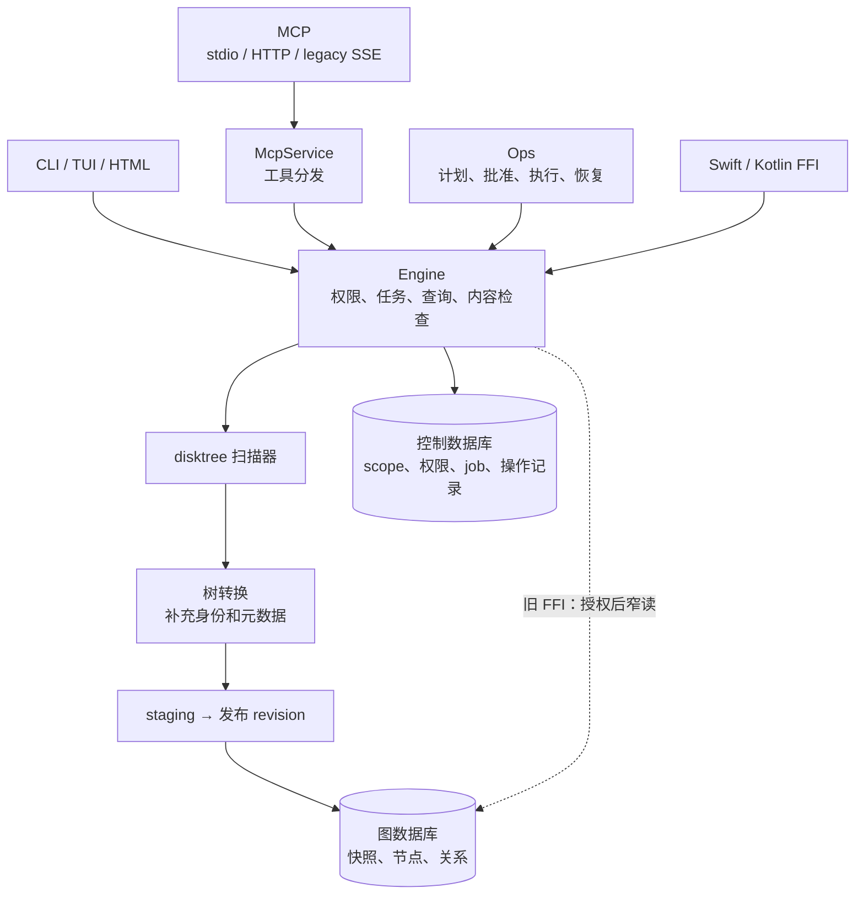

此图概括当前组件调用路径。旧 FFI 签名保留，读取前先由 Engine 核验 snapshot/revision 归属与实时授权，再使用只读连接。底层 store API 属于可信内部兼容入口。平台能力与验证边界见下方加固记录。

### 当前 Engine 源码边界（RT-09，2026-10-02）

入口只声明模块并保留导出；对象含私有记录、trait 和 alias 各自独立文件，生产模块少于 500 行。范围/策略/revision 授权、任务调度与 fenced 扫描、历史回收、有界查询/历史、内容和实时证据保留真实实现，复用唯一 Engine。公开 `content`、`live_evidence` 与 `verify` 路径通过 façade 保持兼容。可信原始 reader 与控制访问仍由调用方完成请求授权。

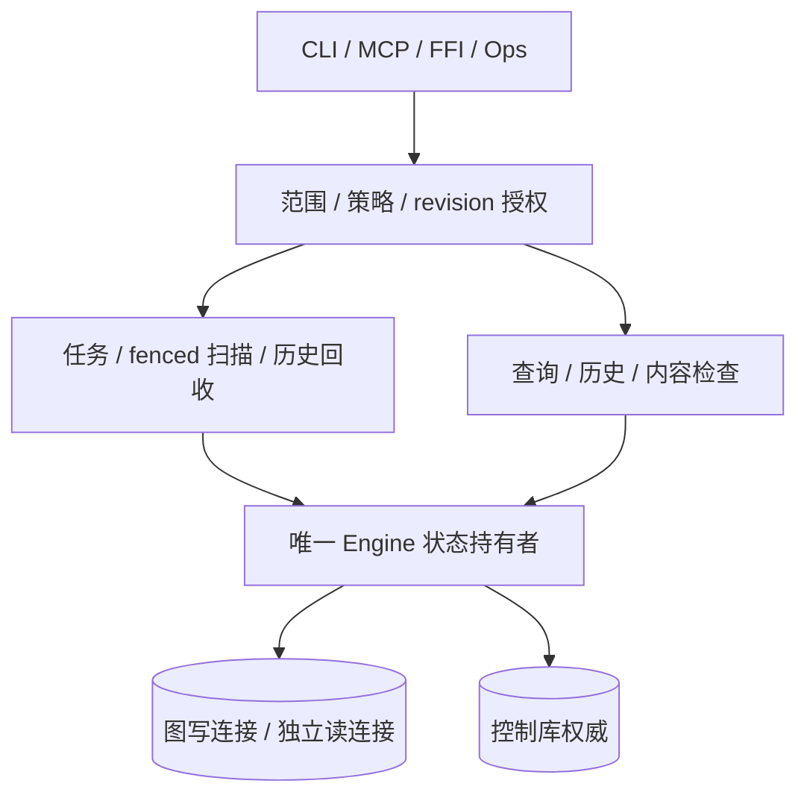

模块保留 graph→control 锁顺序、同一 guard 的授权检查、每代次取消及 RAII 清理。这是源码边界整改，没有增加运行时服务层或跨数据库原子事务承诺。[Engine README](../crates/diskgraph-engine/README.md#source-boundaries--源码边界)列出职责与对应文件；AST 门禁补充既有行为及原生平台门禁。

### 当前 Ops 源码边界（OP-14，2026-10-03）

入口及公开 `specialist`/`docker` façade 只声明模块并保留导出。计划生成、批准签发、执行校验、传输、路径核验、查询及适配器分别保留真实实现。执行方法共享唯一 `Executor`；跨卷传输保留唯一 `CrossVolumeCopy` 资源持有者。下图表示操作顺序与所有权边界。

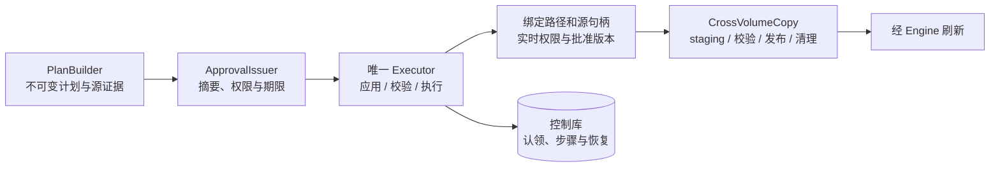

拆分保留公开路径、规范化函数体、平台条件、事务/锁顺序及显式清理，没有增加运行时服务或资源持有者。原不支持平台的 `CrossVolumeCopy::discard` 继续作为零资源对象的已注明空清理；构造与发布仍拒绝执行。CLI/MCP 危险工具保持关闭，原生写入保真仍须单独平台验收。[Ops README](../crates/diskgraph-ops/README.md#source-boundaries--源码边界)列出文件与职责；结构门禁和原生 CI 验证本次源码边界增量。

### 目标架构

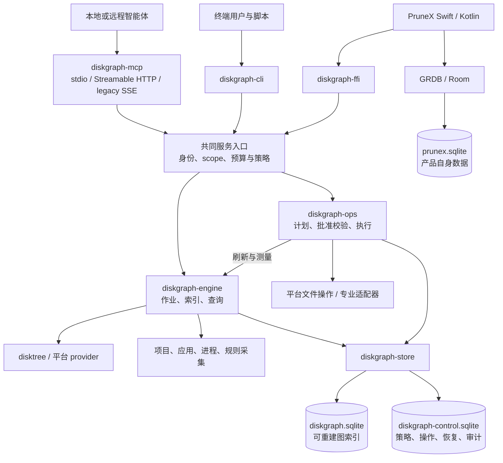

图中箭头是运行时调用；编译期以 core 中的端口解耦。CLI、MCP、FFI 并列调用 Rust 服务：MCP 不执行 CLI 再解析文本，PruneX 不必启动 MCP 子进程。

| 模块 | 状态 | 责任 |
| :--- | :--- | :--- |
| diskgraph-core | 已有，扩展 | 模型、ID、关系、查询/操作 DTO 与端口；不依赖 SQLite 或 UI |
| diskgraph-store | 已有，扩展 | 两类 Rust 数据库的 schema、事务、迁移、分页和保留 |
| diskgraph-disktree | 已有，扩展 | 固定上游版本的扫描桥接；不调用上游 removal |
| diskgraph-engine | 新增计划 | 扫描/采集作业、revision 发布、查询与预算 |
| diskgraph-collectors | 新增计划 | 项目/应用/进程/规则事实及有效性，不执行模型指令 |
| diskgraph-ops | 新增计划 | 不可变计划、可信批准验证、文件执行、幂等与恢复 |
| diskgraph-cli | 新增计划 | 本机/远程终端入口、服务启动与客户端配置 |
| diskgraph-mcp | 新增计划 | 三种传输、工具 schema、身份上下文和统一服务适配 |
| diskgraph-ffi | 已有，重组 | Swift/Kotlin 接口、作业句柄、后台调用与取消 |
| 平台 provider | 模块或宿主代码 | NativeFs、Android URI、iOS 文档与能力限制 |

ops 通过端口提交后续刷新请求，不让 engine 与 ops 相互依赖。平台代码先作为模块交付，有独立打包理由再拆 crate。

## 4. disktree、CodeGraph 与系统命令的取舍

继续依赖固定 Git revision 的 `disktree-core`，由桥接层隔离上游类型。十几个文件不等于低维护成本，安全边界、平台差异和上游修复同样需要维护。只有无损路径或目标平台等真实需求无法通过适配解决时，才评估上游补丁、fork 或 vendor，并保留许可、来源和差异记录。

| 参考 | 借鉴 | 不照搬 |
| :--- | :--- | :--- |
| disktree | 扫描、尺寸、硬链接处理、分类 | 分类不是批准；不直接复用删除许可 |
| PureMac | 应用标识、容器归属和保护经验 | 不仅凭名称删除全部匹配文件 |
| mac-cleanup-sh | 专业工具类别和规则素材 | 不嵌入全套清理脚本，不执行任意 Shell |
| CodeGraph | 持久索引、explore、精确关系查询、工具配置与增量失效 | 不照搬 AST、代码忽略规则或宣传中的效率数字 |

`target`、`node_modules`、隐藏目录和缓存恰是重要对象，不能沿用代码索引器的默认忽略集。CodeGraph 的精简默认 MCP 工具展示不等于 DiskGraph 只能提供四个能力；完整服务 API 与默认展示配置分开设计。

基础 ls/find/du/stat/df/read/move/copy 类能力用 Rust/平台 API 实现，不强制依赖系统命令。Git、lsof 等进程观察工具、Cargo、Docker 是可选适配器；依赖不存在时只禁用该项能力，不退化为强删目录。详见[技术方案](DiskGraph-Technical-Design.zh_CN.md)。

[参考项目调研](reference-study.md)保留已有研究记录，其中测试、上游进度与早期执行边界属于当时基线；新增需求以本次 OpenSpec 为准，不把历史记录冒充当前验证。

## 5. 数据：从目录树到有证据的关系图

| 对象 | 作用 |
| :--- | :--- |
| DiskSnapshot | 根/卷/provider、扫描选项、起止时间、覆盖和错误；不是原子文件系统快照 |
| DiskNode / Resource | 快照内 ID、父节点、无损定位、类型、尺寸与时间 |
| CollectorRun | 方法/规则版本、输入指纹、权限覆盖、采集时间和错误 |
| GraphRevision | 固定一个文件快照与选定证据批次，可重放、有界分页 |
| EvidenceEdge / Record | 类型化关系、支持/反驳证据、来源、时效、可信度与依赖 |

ResourceRef 包含 server、scope、revision、node。它是引用，不是权限令牌。路径、卷 ID/inode、哈希都不能单独充当永久身份；展示字符串与实际定位必须分离。

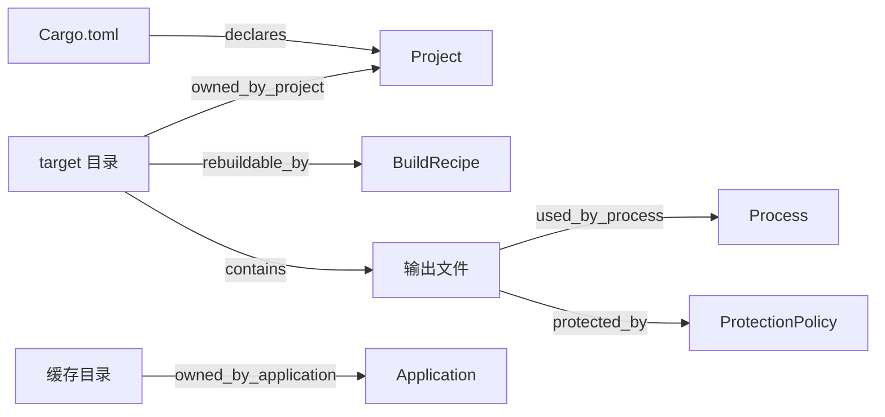

关系是主张，不是许可：归属不意味着可删除，可重建不意味着重建成本可接受，未观察到占用不意味着无人使用。允许多所有者和冲突；置信评分不是概率，不通过累加弱证据制造确定性。

证据新鲜度为 fresh/stale/invalidated/unknown，冲突独立表达。过期占用不能转成“空闲”；保护策略缺失不能自动解除保护。候选返回 eligible_for_review/blocked/unknown，而非 safe_to_delete。

扫描尺寸与释放估算分开：未知大小不填零；硬链接、共享块、稀疏文件、系统快照和打开句柄可能改变实际释放量。

## 6. 存储所有权与服务器边界

原先“Rust 图库 + PruneX 业务库”的分层保留；为独立操作增加 Rust 控制库：

| 数据 | 所有者 | 生命周期 |
| :--- | :--- | :--- |
| diskgraph.sqlite | Rust diskgraph-store | 文件/关系索引，可按策略重建和保留历史 |
| diskgraph-control.sqlite | Rust diskgraph-store | scope、策略、作业、计划、批准、操作、恢复与审计，不能随索引删除 |
| prunex.sqlite | PruneX 的 GRDB / Room | 会话、偏好、界面与工作流投影，不是远程操作权威 |

Swift/Kotlin 不直接维护 DiskGraph schema；同进程 SQLite 链接、版本和生命周期仍须真实验证，数据库文件分开不能消除符号冲突。

服务器扫描、数据库和执行都留在服务器。本地智能体经协议读取授权结果，不挂载服务器 SQLite，也不把服务器路径当成本机路径。服务端无需 PruneX 即可重启、查询操作并恢复。

存储源码按 ST-06 组织：`lib.rs` 只声明模块并保留原有导出，每个类型独立文件；连接、版本与 WAL 由 `SqliteSnapshotStore` 持有，持久权威由 `ControlStore` 持有。节点/目录/搜索/历史/关系查询、暂存发布、图历史回收，以及 scope/策略/job/操作/恢复持久化分别承担真实职责。控制库的历史引用保护独立于任务队列。这些模块使用已有连接和事务，没有增加空壳包装层或跨库原子承诺，见[源码分层图与结构门禁](../crates/diskgraph-store/README.md#source-boundaries--源码边界)。

## 7. 完整命令与三种 MCP 形态

目标包含 **29 个命令或命令族**：

| 类别 | 命令 |
| :--- | :--- |
| 范围与索引 | scope、index、sync、status、snapshots |
| 历史 | changes、growth |
| 图查询 | explore、search、node、children、top、related、explain、impact、candidates |
| 内容 | duplicates、read |
| 受控文件动作 | move、copy、trash、restore、purge |
| 执行治理 | plan、apply、operations |
| 部署诊断 | serve、install、doctor |

CLI、MCP 和 FFI 共用 DTO 与服务；默认 read profile 可以只展示常用工具，完整精确只读工具组必须可启用。manage/write 分开，隐藏工具不是权限控制。serve/install 是宿主配置入口，不开放成修改客户端宿主的远程工具。

| 传输 | 用途 | 约束 |
| :--- | :--- | :--- |
| stdio | 本地宿主启动进程 | stdout 仅协议；本机身份仍受 scope 约束 |
| Streamable HTTP | 本地智能体访问服务器 | 认证、加密、Origin、预算、版本兼容 |
| legacy HTTP+SSE | 旧客户端兼容 | 独立适配、默认关闭、真实旧客户端测试 |

Streamable HTTP 内的 SSE 响应不是旧版 HTTP+SSE 兼容实现。Rust SDK 选择和旧适配路径需分别验证，不能声称一个开关自然支持全部版本。

权限至少区分元数据、内容、索引管理、范围管理、逐项文件操作与批准签发。远程主体只能访问管理员预注册 scope；只读查询不隐式索引全盘。任何入口都不得提供任意 Shell、SQL、提权或无限路径访问。

## 8. 操作闭环与恢复的真实边界

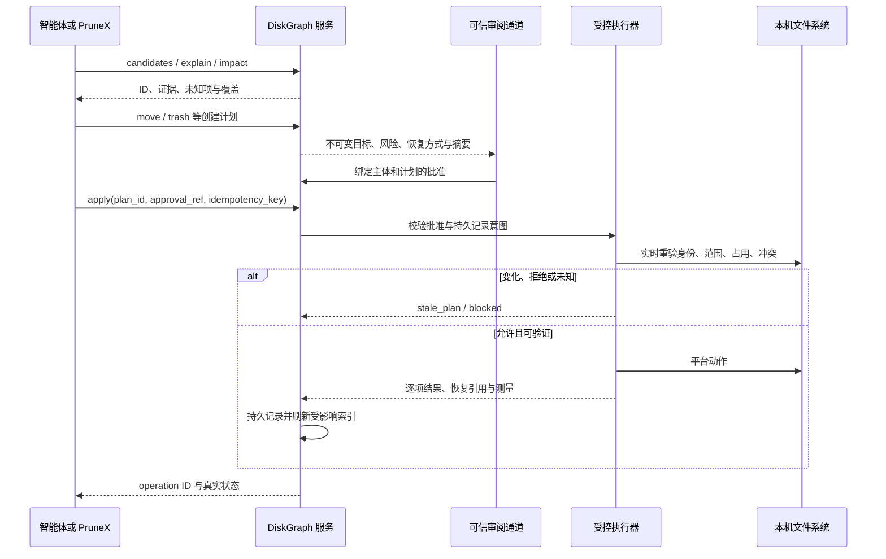

- move/copy/trash/restore/purge 默认只生成计划；apply 才能执行。
- 同一智能体不能用 `approved=true`、自由文本、TTY 或 `--yes` 自行批准。批准来自受信确认通道或管理员明确配置的有限策略。
- 计划包含目录成员边界，执行时检查新增保护后代、挂载替换、源/目标身份、占用覆盖和目标冲突。
- 同卷移动与跨卷“复制→校验→发布→删源”是不同流程；不承诺全局原子事务。
- 回收失败不退化为永久删除；恢复冲突不覆盖；purge 独立授权且无法靠图快照恢复内容。
- 同卷回收/隔离通常不释放该卷空间，报告处理字节、隔离保留和卷空闲实测分别列出。
- 执行意图先持久化，幂等键防重复；不确定的崩溃状态进入 needs_attention。取消不等于撤销已完成项。
- 图索引可重建，恢复信息不可丢；本产品不以删除自己的恢复记录腾空间。

Cargo 和 Docker 清理使用精确项目/对象计划、专用接口和版本化允许列表；不能把 Docker VM 或卷目录当一般缓存删除，不把单对象批准扩大为全局 prune。

## 9. 跨平台与 PruneX

| 平台 | 输入与边界 | 发布证据 |
| :--- | :--- | :--- |
| macOS | 原生路径、权限、云占位、回收能力 | 首批独立包与 Swift 原生调用实测 |
| Linux | 服务器本地范围、低权限运行、平台回收 | 远程三传输与服务重启/恢复 |
| Windows | 原生编码、卷/file ID、重解析点、占用差异 | 实机查询和各动作分项验证 |
| Android | Kotlin SAF / 适用媒体 provider 的 URI | 真机授权、未知大小、分页与撤权 |
| iOS | App 自有和用户选中文档；安全作用域 | 真机文档协调、授权失效与取消 |

移动端限制从 P0 模型开始，不等到移植时补救。不能承诺 Android 清理所有应用私有数据，也不能承诺 iOS 全盘清理或跨 App 卸载。

FFI 提供后台作业、分页、取消与结构化错误。PruneX 负责视图、用户意图和 AgentScope 编排；云模型默认不获得未授权正文，模型输出不能改写观察事实或生成可信批准。

## 10. 分阶段交付与验收

| 阶段 | 依赖 | 交付门禁 |
| :--- | :--- | :--- |
| P0 基线与契约 | 无 | 现有行为、无损身份、权限和兼容 fixture |
| P1 快照与存储 | P0 | 注册范围、可靠扫描/迁移、容量与作业 |
| P2 查询与 CLI | P1 | 项目证据、历史、完整只读查询与预算 |
| P3 本地智能体 | P2 | stdio、macOS 私有包、两个真实宿主 |
| P4 服务器只读 | P3 | Linux、认证、HTTP/旧 SSE、断线与隔离 |
| P5 可恢复执行 | P4 | 计划/批准、同卷操作、回收/恢复、故障门禁 |
| P6 高风险动作 | P5 | 跨卷、purge、Cargo/Docker、实测空间 |
| P7 内容与桌面增强 | P2；写验证另需 P5/P6 | read/duplicates、增强证据、watch、Windows |
| P8 PruneX 嵌入 | P3；写 UI 另需 P5 | FFI、业务库共存、可信审阅闭环 |
| P9 移动受限能力 | P8 | Android/iOS 真机 provider 验证 |
| P10 完整私有交付 | P6/P7/P9 | 命令/协议/平台矩阵、效率与升级演练 |

P3 完成后形成独立只读产品，不等待移动端；P4 前置 Linux 是为了服务器场景。P5 自身必须实现最低限度实时安全检查，不能等待 P7 的增强观察器。

评测用同模型、同数据、多次运行比较：正确率、工具调用、返回字节/Token、驻留上下文、冷索引/热查询/同步时间、峰值内存、DB/WAL/日志占用。安全门禁包含权限拒绝、竞态、崩溃、满盘、并发、部分完成与恢复冲突。构建成功、HTTP 200、工具发现均不替代实际任务验收。

待实测的 SDK 精确版本、TTL/容量默认值、签名资源和设备清单按阶段解决，不改变既定授权边界。公开仓库、公开包、生产部署和实际清理须另获授权。

## 11. 进程、并发与生命周期

当前 FFI 是同步函数调用，部分查询加载整份快照，没有已实现的服务调度器。目标拓扑区分三种运行方式：

| 方式 | 进程与状态所有者 | 关闭/故障行为 |
| :--- | :--- | :--- |
| 本地 CLI / stdio | CLI 或宿主启动的进程；同权限域共享本机索引 | 短连接退出不能删除共享索引；作业租约协调重复请求 |
| HTTP 服务 | 文件所在服务器的长期低权限进程 | 网络断线不判定业务取消；重启后查询原 job/operation |
| PruneX 嵌入 | UI 进程中的 Rust 引擎；宿主管理原生授权 | 阻塞 I/O 不占 UI 线程；释放句柄和 provider 访问资源 |

目标并发机制是有界队列、受限扫描/哈希/复制工作池、SQLite 写入协调与查询独立读事务。异步协议层不得直接长时间阻塞；同 scope 扫描合并，冲突文件动作按源/目标和祖先后代关系串行。具体线程数与队列上限通过基准确定，不承诺无限并行。

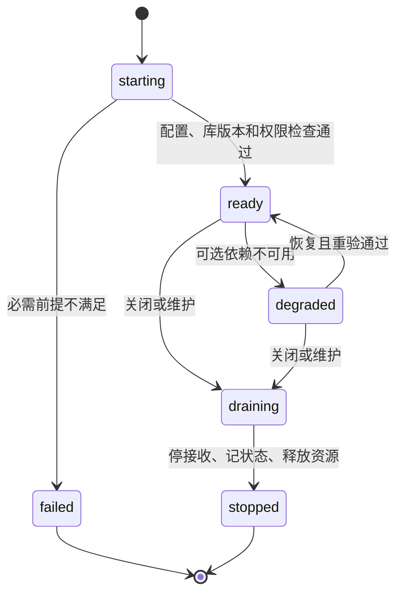

排空先停止接收新工作，再取消/等待可安全停止的步骤、记录未完成项并释放连接。超时不能假装所有操作回滚；存在不确定副作用时保留 needs_attention。恢复必须先对账控制记录和实际资源，再重新开放相应写能力。

## 12. 配置与安全控制

当前没有独立服务配置加载器，库直接接收调用参数。目标配置方案详见技术方案，尚不是可运行配置格式。

| 配置域 | 权威来源 | 可覆盖边界 |
| :--- | :--- | :--- |
| 监听、数据库位置、传输和预算 | 经部署管理员验证的配置 | 请求参数只能收紧预算，不能扩大授权根 |
| scope、策略、批准与撤销 | 控制库和可信策略来源 | 普通模型/客户端不能直接改写 |
| 凭据与原生文档访问 | 系统秘密存储/可信宿主 | 日志与图索引不保存可打印秘密 |
| 工具展示 profile | 部署配置 | 展示不替代逐请求权限检查 |

恶意文件名、清单、工具结果、网络请求与模型输出都不可信；身份从服务端认证上下文注入，不能接受模型自报主体。拒绝跨 scope 引用、伪造批准、路径/参数注入和无限正文导出。

同进程 Rust 适配器是可信代码，不宣称已具备插件沙箱。先采用受审计的内置 provider/collector；动态加载未知插件、通用远程 Shell、跨机直接移动文件、SaaS 多租户计费和内置 RAG 均不在当前范围。

## 13. 决策、替代方案与反转条件

完整决策仍由 [OpenSpec D1–D15](../openspec/changes/implement-diskgraph-platform/design.md) 管理，下表是解释性摘要，不重复建立批准流程。

| 决策 | 选择与理由 | 替代方案/代价 | 重新评估条件 |
| :--- | :--- | :--- | :--- |
| D1 共享 Rust 服务 | 多入口复用语义，ops 独立 | 各宿主各写一套易漂移 | 实际 ABI 或运行隔离要求改变 |
| D2 固定扫描依赖 | 复用上游修复，桥接隔离 | 复制源码需承担完整维护 | 无损路径/平台需求无法适配或上游补丁 |
| D5 分离图/控制库 | 索引重建不丢恢复信息 | 增加备份与跨库对账成本 | 有实测支持的存储迁移与恢复方案 |
| D7 丰富 API、可精简展示 | 兼顾精确脚本与工具列表成本 | 仅 explore 会限制可控性 | 客户端对照评测提供证据 |
| D8 独立旧 SSE 适配 | 满足兼容需求又隔离维护面 | 维护旧协议成本 | 用户批准移除旧客户端支持 |
| D10 可信批准与重验 | 不让模型自我授权 | 增加交互和执行延迟 | 仅可增加经批准的限域策略，不取消边界 |
| D14 平台能力声明 | URI 与沙箱真实建模 | 不能提供统一全盘能力 | OS/provider 真实能力变化并通过验收 |

## 14. 可观测性、运维与资源预算

| 信号 | 目标字段/指标 | 约束与动作 |
| :--- | :--- | :--- |
| 日志 | request/job/operation ID、组件、状态、错误码、耗时 | 有界脱敏；stdio 写 stderr，不记录正文/令牌 |
| 指标 | 查询延迟、队列深度、拒绝率、扫描节点数、DB/WAL/staging 容量 | 标签限于组件/动作/结果；不使用路径、用户、文件 ID 等无界标签 |
| 审计 | 主体、策略/批准摘要、逐项意图、结果、恢复引用 | 不随普通日志轮转或图索引重建删除 |
| 就绪状态 | ready/degraded/draining、库兼容与必需依赖 | 不能仅用进程存活或 HTTP 200 判断可写 |
| doctor | 能力、授权、依赖、容量、积压 | 只读诊断，不自动提权、解锁或清理 |

观测后端不可用不得导致无界缓冲；普通遥测可以按策略采样并报告丢失，执行意图/恢复审计不能套用同样的丢弃策略。控制记录不能持久化时停止新的文件副作用。

容量规划采用“基线内存 + 活跃任务 × 单任务预算 + 有界缓存”，存储同时计算图、WAL、备份、临时区和回收区。深度 2、100 节点、300 边、64 KiB 响应和 1 秒查询期限是待验证的初始建议，不是实测 SLA。RTO/RPO、线程数和保留天数尚待部署演练确定，不编造可用性百分比。

## 15. 风险、责任与待验证事项

责任以维护角色描述，不虚构人员和日历承诺；P0–P10 是实施阶段，不是模板中的优先级或软件版本。

| 风险/缺口 | 负责角色 | 退出证据/阶段 |
| :--- | :--- | :--- |
| 有损路径、Windows 卷身份、v1 大图加载 | core/scanner/store 维护者 | 无损夹具、真实平台与容量测试；P1/P2/P7 |
| MCP 版本与旧 SSE 客户端差异 | 协议维护者 | 锁定 SDK/协议矩阵，三入口独立实测；P3/P4 |
| 执行竞态、占用不完整、崩溃对账 | ops/安全维护者 | 负向、满盘、断线、恢复冲突测试；P5/P6 |
| SQLite/GRDB/Room 链接与移动权限 | 原生集成维护者 | 实际宿主加载和真机撤权/取消；P8/P9 |
| 签名、公证、测试设备与预算默认值 | 发行/测试维护者 | 私有制品与重复基准；P10 前确认 |

本次采用完整架构模板及运行时、扩展、Agent 工具安全、可观测控制面内容；删除不适用的电商、多租户 SaaS、消息代理、插件市场、RAG/模型训练和嵌入式硬件示例。AgentScope 和 Lite/Pro 是 PruneX 的计划，不是 DiskGraph 已集成依赖。没有新增正式需求或勾选实施任务。

## 16. 参考与追溯

- [技术方案](DiskGraph-Technical-Design.zh_CN.md)：数据表、迁移、协议、状态机、执行保护与测试。
- [命令参考](command-reference.md)：C01–C29 的 CLI/MCP/权限/阶段映射。
- [OpenSpec 设计决策](../openspec/changes/implement-diskgraph-platform/design.md)：D1–D15、替代方案、风险和迁移。
- [OpenSpec 实现任务](../openspec/changes/implement-diskgraph-platform/tasks.md)：分阶段工作包和验收要求。
- 上游依据：[DiskTree](https://github.com/tobi/disktree)、[CodeGraph CLI](https://github.com/colbymchenry/codegraph#cli-reference)、[MCP Rust SDK](https://github.com/modelcontextprotocol/rust-sdk#transports)。

---

**文档版本**：1.1\
**创建日期**：2026-09-28\
**最后更新**：2026-09-28\
**文档状态**：待评审；设计完整性不代表实现完成。

## 2026-10-01 加固实现边界

以下为本轮已落地调用链；前述标记 Target 的总体路线仍需对应平台验收。

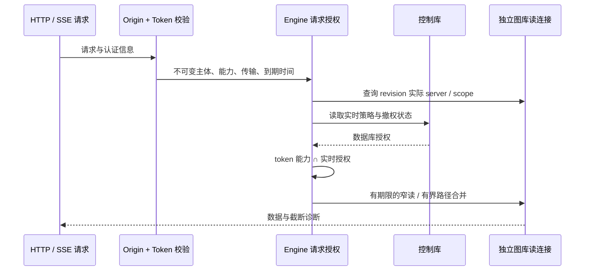

写入由串行图库连接执行。job 以条件 UPDATE 认领，控制库事务内校验租约、fencing、scope 和实时 IndexWrite，保护 staging 批次、revision 发布和 collector 写入。过期认领使用新 staging 命名空间并重扫。上游扫描器源和摘要保持原 pin；转换使用迭代遍历，发布从 staging 生成正式节点。

迁移前使用 SQLite 一致性备份（包含已提交 WAL）至 `migration_backups/`；图库 schema 6 记录归属及规范化搜索字段，schema 7 增加未知大小稀疏索引、关系分页与有序路径索引，schema 8 增加候选目录大小与证据关系索引。Schema 9 在每次发布事务内维护精确快照/目录计数及尺寸累计计数，升级事务回填；snapshot writer 标记拒绝仍打开的旧程序写入，计数元数据缺失时拒绝查询。Known/unknown 页保留旧 JSON fallback 语义并走对应 partial index，显式 OFFSET 仍需 O(offset+page)。聚合增加存储和发布/迁移成本，备份/WAL/临时文件测量见[全平台记录](production-readiness-full-platform-2026-10-02.zh-CN.md)。候选选择和影响遍历使用请求专用读连接、期限与明确截断诊断。控制库 schema 4 记录租约/fencing，schema 5 持久化取消意图。控制库 schema 6 使用事务触发器记录独立授权变更计数，覆盖 policy/grant/scope，单条 grant 撤销也会变更；任务心跳不变更该计数。v5 升级前进行一致性 pre-v6 备份，失败原子回滚；升级前先停止旧服务，已经打开的旧连接不会自动取得新传输行为。旧 running job 等待 heartbeat + 30 秒租约到期，不在启动时抢占。图库 WAL/NORMAL 保证事务一致性，但断电可能丢失最近提交的可重建索引；控制库 FULL 保持操作记录持久性要求。两库仍无跨库原子事务承诺。

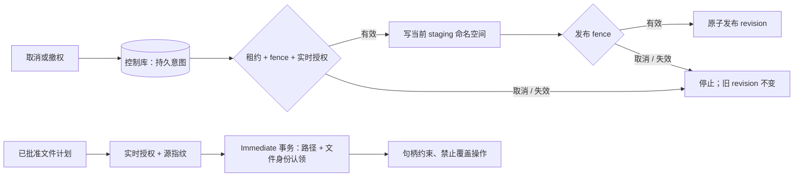

FFI 从无损图库路径派生控制数据隔离域；归属不明的旧共享控制数据拒绝复用。操作计划要求完整摘要和新鲜源证据，因此旧计划须重新创建。正目标候选现已采用有界准备，关系 impact 在分页和方向之间共享同一授权读连接。显式 offset 兼容输入仍需要遍历偏移；扫描取消不提供严格 RSS 上限。

兼容入口、保真检查、扫描超限余量、历史物理容量及本机测量详见[中文验收记录](security-performance-hardening-2026-10-01.zh-CN.md)。CLI/MCP 写工具关闭；Linux/Windows 原生操作与严格扫描 RSS 上限不在已完成能力中。


## Legacy 结果投递边界

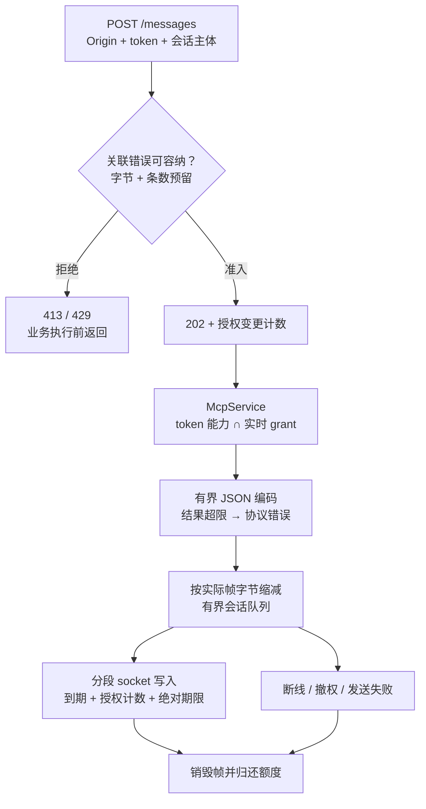

远程 legacy 使用私有预算注册表，公开裸 sender 仅保留为可信内部兼容接口。每会话 64 条/16 MiB、每监听实例合计 64 MiB，包含待执行、编码及发送中的预留；准入先按 `max_response_bytes + 22` 认领，编码后缩为实际帧。默认 4 MiB 允许每会话三个、全实例十五个同时执行的最坏预留。无法容纳关联错误或单条预留时先返回 413，拥塞先返回 429；共用有界编码器保留现代 HTTP 的字段与超限状态。它约束投递缓冲，不约束工具 Value、分配器、内核缓冲或严格 RSS。

数据帧每次分段写检查到期与持久授权计数；非阻塞控制锁准入、SQLite 等待/执行和 socket 写入共用同一绝对期限。任何授权相关变更（包括无关主体、新增 grant）都会保守关闭旧结果，任务/操作表不触发；已经交给内核的字节无法撤回。外层闲置存活检查仍可能等待共享策略访问，没有严格一秒撤权/清理 SLA。接收端关闭释放排队帧，仍在运行的业务继续占用全局预留直到退出。202 后若断线则明确关闭并记录，持久 job 可重查。升级必须先停止旧宿主，不能用 schema 重开门禁冒充对存活旧进程的修复。

### Windows 普通文件内容获取

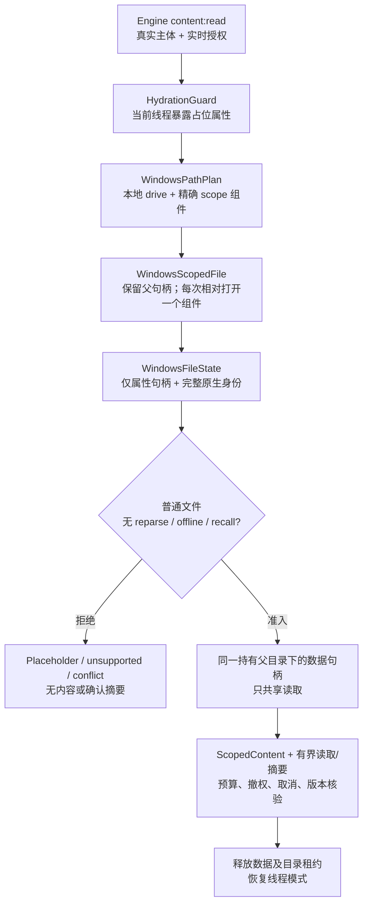

此增量保留公开结果字段及 Unix 路径。路径规划直接拒绝 ADS、父级跳转、UNC/设备命名空间及过长输入，不对客户端路径执行 canonicalize。完整 128 位 file ID 与原生写入/变更版本保持私有，不截断填入现有快照 ID 字段。属性获取不冻结新 writer：变化在数据访问前以 Conflict 拒绝；数据句柄随后拒绝普通写入/删除共享，持有父目录防止替换。这不构成原子快照或对所有 mapping/kernel/filter 活动的冻结；100ns 是表示单位，不保证文件系统实际精度或单调版本。可选线程 API（Windows 10 1709+）动态解析，缺能力返回公开 unsupported 错误码。线程模式不覆盖 scanner worker，打开时 no-recall 标志也不能证明真实 provider 后续读取不下载。取消/期限是协作式，不能抢占同步原生 I/O。原生回归证据限 CI 的 NTFS 夹具，其他文件系统/provider 验收分别记录于[全平台记录](production-readiness-full-platform-2026-10-02.zh-CN.md)；公开文件写能力继续关闭。


## Git 实时证据输入隔离（EC-04 / D20）

可信库采样使用私有配置、index、引用及扁平对象视图。当前调用来自库/测试，尚未建立生产CLI/MCP/FFI采样接线。普通loose对象和配对pack/index经no-follow捕获及同一私有分配owner复制；源alternates/promisor和不支持输入明确拒绝，忽略的加速文件不交Git。来源对象和元数据在准备与终检共享累计64 MiB/32k额度，私有owner另核128 MiB对象报告分配与64 MiB卷余量；ProbeLimits仍默认整次协作式15秒和累计输出1 MiB。

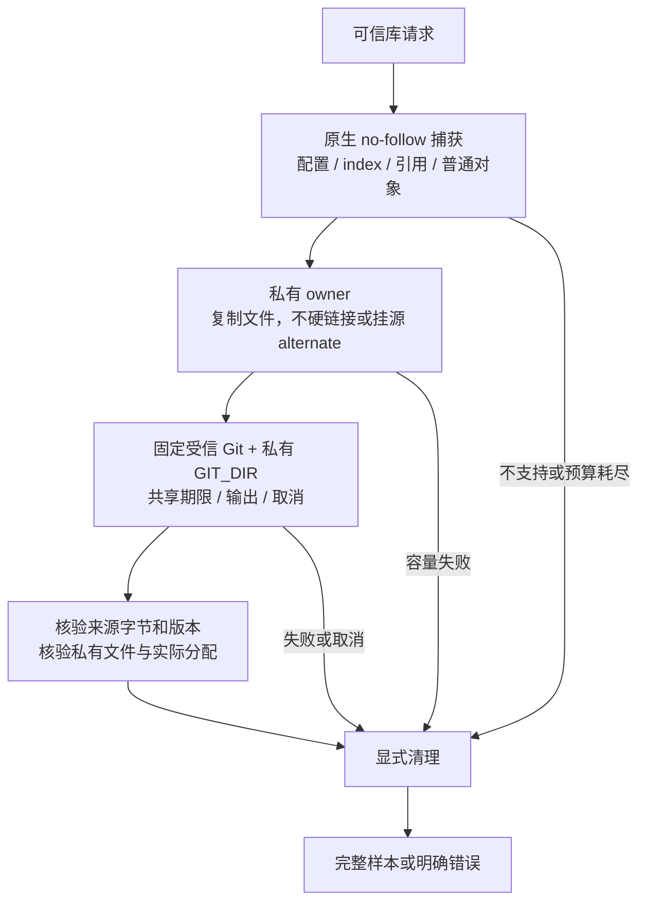

私有视图关闭递归源对象输入，但不是原子仓库快照或完整文件系统/RSS沙箱。复制和复核增加随字节量变化的成本，初始buffer保留及终检读取会增加内存；大pack或status输出可能明确超过默认额度。本机回归、复制成本原始测量与原生验收分别记于[全平台记录](production-readiness-full-platform-2026-10-02.zh-CN.md)。公开危险写工具仍关闭，其余设备/provider/生产门禁保持原要求。
