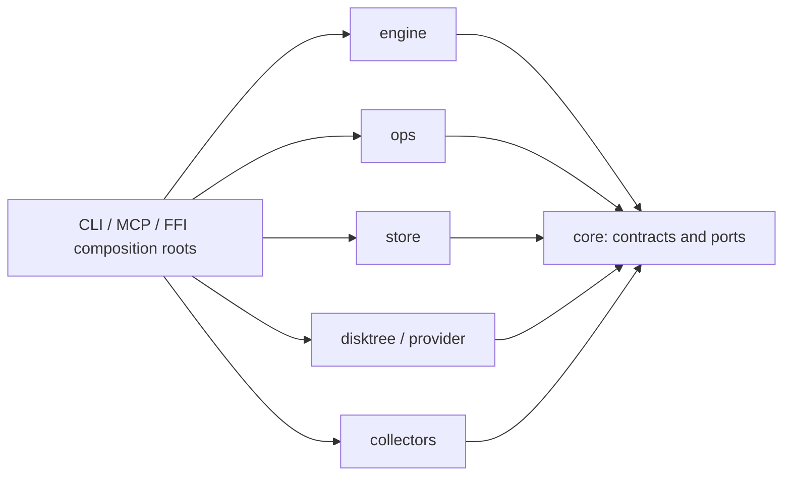
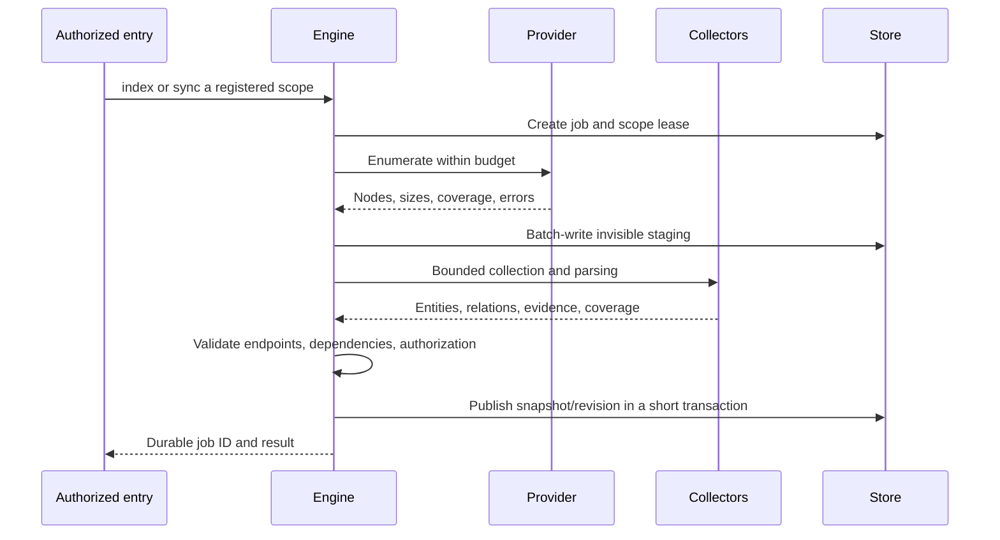
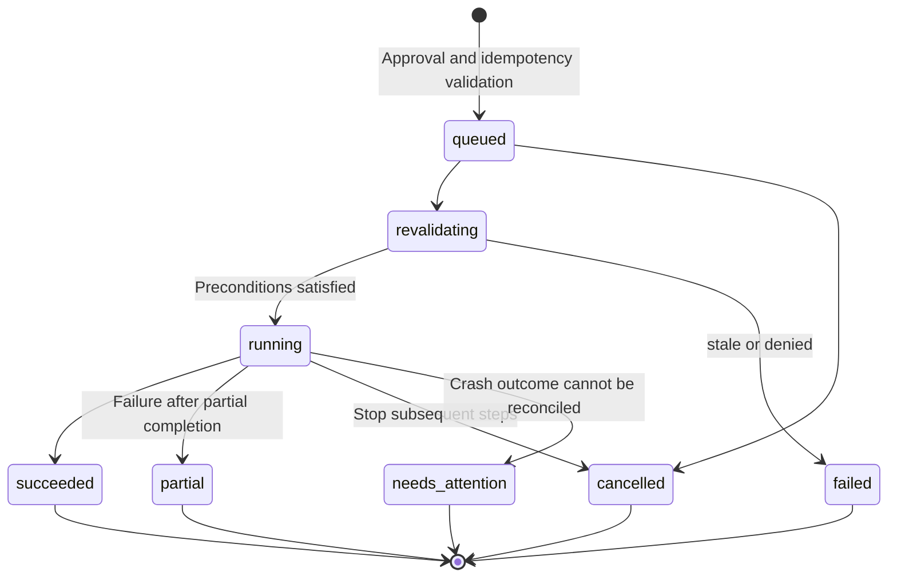

# DiskGraph Technical Design

[English](DiskGraph-Technical-Design.md) | [简体中文](DiskGraph-Technical-Design.zh_CN.md)

> **Purpose**: translate the architecture and OpenSpec requirements into data structures, protocols, execution, operations, and verifiable work packages.
>
> **Document version**: 1.1; **Updated**: 2026-09-28; **Status**: pending review\
> **Source baseline**: `a89e57a`, workspace `0.1.0`\
> **Owner**: DiskGraph maintainers; module owners are assigned by phase. Target DTOs, tables, and configuration examples are not existing APIs.
>
> [Architecture](DiskGraph-Architecture.md) defines boundaries; [OpenSpec](../openspec/changes/implement-diskgraph-platform/proposal.md) defines requirements and acceptance; [D1–D15](../openspec/changes/implement-diskgraph-platform/design.md) record decisions; [P0–P10 tasks](../openspec/changes/implement-diskgraph-platform/tasks.md) govern implementation. This document is not a second specification.

## 1. Workspace and dependencies

Entry points assemble `core + engine + store + scanner + collectors`, enabling ops only through capability configuration. CLI/MCP/FFI share one query implementation. The engine does not depend on MCP, models, PruneX, or a specific database.



Proposed ports: SnapshotReader/Writer, ControlStore, ScopeAuthorizer, ResourceProvider, EvidenceCollector, FileOperator, VolumeMeter, and ApprovalVerifier. Define minimal interfaces around real behavior; do not create a crate for every function. Platform SDKs remain in adapters/hosts. Ops requests index refresh through a RefreshScheduler port to avoid a cycle with the engine.

Preserve the existing five queries and JSON v1. The v2 service adds named requests/responses; organize core types by domain rather than accumulating models, platform behavior, and compatibility branches in lib.rs. Push synchronous queries into indexes; represent long scans, hashing, and copying as jobs rather than loading the entire graph.

Keep `disktree-core` pinned to Git revision `158f9cc2f0b332194a3ffc5acec47760c99146d8`. Consume scanning/tree/size interfaces, not removal. Upstream upgrades require path, permission, link, placeholder, and size-semantics regressions. Forking/vendoring requires a separate decision and provenance record; this documentation task copies no upstream code.

## 2. Identity, location, and observations

| Field/object | Target contract |
| :--- | :--- |
| server_id | Persistent service-instance identity; never trust a client-supplied value as authority |
| scope_id | Administrator-registered root/volume/provider/policy boundary; aliases resolve only within the selected service |
| ResourceRef | server_id, scope_id, revision_id, node_id; not an access token |
| ResourceLocator | Raw Unix path bytes, Windows code units, or provider URI; display path stored separately |
| FileIdentity | Volume/provider identity, file identifier, and available generation information; an alignment aid only |
| DiskSnapshot | Scan start/end, options fingerprint, scanner version, coverage, and errors |
| DiskNode | Same-snapshot parent, type, lossless locator, identity, distinct size and timestamp fields |

Audit the current scanning chain's `to_string_lossy()` end to end: changing the final DTO cannot recover encoding already lost upstream. Until repaired, mark lossy_locator and prohibit lossy display strings as file-operation targets. Do not lowercase all names, deduplicate by display name, or guess a filesystem path for a URI.

Keep apparent_bytes, allocated_bytes, their subtree aggregates, measurement_kind, and unknown_size_count. Unknown is null, not zero or a substituted measurement. Separate a file's own mtime from the newest subtree mtime. Deduplicate hard links within their identity domain and disclose limitations when shared blocks cannot be attributed precisely.

Directory traversal is a best_effort observation window, not an atomic snapshot. Record permission failures, exclusions, and mount changes separately; “not observed” does not mean “deleted.” Initial history alignment uses exact lossless locators within compatible scopes. Rename inference is outside initial acceptance.

Android URIs and iOS documents are valid resource types from the outset. Platforms without an implemented provider return unsupported rather than converting them into ordinary path strings.

## 3. Relationships, evidence, and invalidation

Entities include Resource, Application, Project, Process, BuildRecipe, and ProtectionPolicy. Bundle ID alone cannot distinguish application instances. Process identity includes host/boot session, PID, and start time where available; do not reuse PID identity across restarts.

| Relationship | Endpoints | Interpretation |
| :--- | :--- | :--- |
| contains | Resource → Resource | Same-snapshot parent/child enumeration |
| declares | Resource → Project | Manifest declaration; does not imply rebuildability |
| owned_by_project | Resource → Project | Nested projects, workspaces, and multiple owners are supported |
| owned_by_application | Resource → Application | Distinguish exact metadata from heuristics |
| used_by_process | Resource → Process | Observed coverage only, not proof of all system dependencies |
| rebuildable_by | Resource → BuildRecipe | Rule version and tool/network/environment prerequisites |
| protected_by | Resource → ProtectionPolicy | Authoritative source; weak rules cannot remove protection |
| same_content_as | Resource → Resource | Verified content relationship, not deletion permission |

A scope-authorized symlink_to relationship may follow later; it must not extend scanning across boundaries. Each relation defines direction, propagation depth, and interpretation. Impact is not an unrestricted undirected traversal.

```text
CollectorRun:
  run_id, snapshot_id, collector_id/version, rule_version
  scope, observed_at, finished_at, coverage, errors, input_fingerprint

EvidenceRecord:
  evidence_id, run_id, basis, source_ref
  observed_at, expires_at?, confidence?, upstream_evidence_ids[]

EvidenceEdge:
  edge_id, source_entity_id, relation, target_entity_id
  assertion_kind: observed | derived | heuristic | user_policy
  evidence_refs: [{ evidence_id, polarity: supports | contradicts }]

GraphRevision:
  revision_id, snapshot_id, selected_runs, resolver_version, published_at
```

Evidence dependencies are acyclic; derived evidence expires no later than its inputs. Manifest, rule, or identity changes invalidate affected evidence. Represent fresh/stale/invalidated/unknown separately from conflict. Confidence is a method-specific ranking, not a statistical probability; summing weak matches never raises permission.

Expired process observations mean current state is unproven, not unused. Protection remains effective until revoked by an authoritative source; temporarily unreadable policy does not remove it. Historical explanations bind revision and evaluated_at. Live risk evaluation recomputes freshness using current time.

## 4. Scanning and collection pipeline



Job states: queued → scanning → collecting → resolving → publishing → completed, plus cancelled/failed. Cancellation does not advance default latest. Partial observations may be retained only with explicit labeling and query selection. Report filesystem and individual collector completeness separately.

Initial rules identify Cargo, Java, and Node projects and provable build layouts. Test Cargo workspaces, custom/shared targets, Maven multi-module projects, ordinary directories with matching names, and configuration references outside the scope. A directory named target/cache alone does not establish rebuildability.

Metadata policy may independently permit bounded reads of allowlisted project manifests; this is not arbitrary content permission. Limit length, parsing depth, and reference resolution; disable XML external entities. Never execute manifest scripts, plugins, macros, Git hooks, or builds. Out-of-scope references remain unresolved and cannot expand authority. Unknown environment variables/build arguments remain unknown.

Application collection prefers bundle/package/container metadata. Process collectors report method, coverage, and permissions. Git examines locally known refs without fetching by default. Collectors report supported/unsupported/denied/partial/complete independently.

Deliver explicit sync and controlled rescanning before watchers. Events are invalidation hints, not authoritative state. Lost events, wake-up, mount changes, and permission changes require observation again. Failures retain risks and mark old evidence stale. Frequent evidence refreshes publish new revisions without requiring a full-disk rescan.

## 5. SQLite: graph and control data

### 5.1 Lifecycle and deployment

Rust owns local `diskgraph.sqlite` and `diskgraph-control.sqlite`. GRDB/Room own PruneX's `prunex.sqlite`; it cannot be the server's sole approval or recovery record.

The graph can be rebuilt. Control data requires backups and reconciliation with real filesystem state after recovery. Scope registration, policy revocation, and recovery entries must survive reindexing. There is no cross-database atomic-commit promise. Plans retain review-time fingerprints and evidence summaries, not only graph foreign keys that may expire.

Use local storage for SQLite. Remote clients use protocols rather than sharing a WAL database on a network filesystem. Target settings include foreign keys, WAL, bounded busy timeout, a write queue, migration locking, and checkpoint policy. These remain implementation work; see [SQLite WAL constraints](https://sqlite.org/wal.html).

### 5.2 Target logical tables

| Database | Table | Key constraints |
| :--- | :--- | :--- |
| Graph | snapshots | Scope, observation window, settings, coverage, publication state |
| Graph | resource_nodes | (snapshot_id, node_id); same-snapshot parent; lossless locator and sizes |
| Graph | entities | (snapshot_id, entity_id); kind, structured identity, source run |
| Graph | collector_runs | Snapshot, method/version, scope, coverage; immutable after completion |
| Graph | relations | Run, source, target, relation; valid same-snapshot endpoints |
| Graph | evidence_records | Provenance, basis, timestamps, expiry, input fingerprint |
| Graph | relation_evidence | Multiple supporting/contradicting records for an assertion |
| Graph | evidence_dependencies | Same-snapshot acyclic dependencies |
| Graph | graph_revisions / revision_runs | Snapshot/run composition; run role=active/dependency |
| Graph | scan_issues / reconciliations | Bounded errors; cross-snapshot alignment method and basis |
| Control | servers / scopes / principals / grants | Identity, registered boundaries, principal mapping, permissions |
| Control | policy_versions | Source, version, revocation, approval policy; secret references only |
| Control | jobs / leases | Scan/hash jobs, ownership, heartbeats, expiry, fencing |
| Control | plans / plan_items | Immutable digest, exact object boundaries, requirements |
| Control | approvals | Approval provenance, signature/verification reference, binding, expiry, revocation |
| Control | operations / operation_items | Idempotency keys, per-item intent/steps/results, revalidation |
| Control | recovery_entries | Recovery/original location, identity, restoration capability, retention |
| Control | audit_events | Approval, denial, execution, recovery; bounded and redacted |

Native credentials, security bookmarks, and OAuth secrets belong in platform/secret storage under policy. Store necessary references or protected material, not printable plaintext credentials. Scope/policy fields are trusted server data; a model cannot write them directly.

Queries select only a revision's active runs. Dependency runs explain evidence but do not reactivate old relationships. Resources map one-to-one to nodes; other entity observations append by run. Eviction retains transitive evidence dependencies or explicitly invalidates affected revisions.

Prioritize indexes for parent+size+node_id, locator encoding+lossless key, source/relation/run, target/relation/run, revision/run, and evidence expiry. FTS5 may index names/display paths but never determines identity. Use JSON for evolving evidence details and separate columns for common filters.

### 5.3 Publication, pagination, migration, and capacity

Long scans batch-write invisible staging. A short publication transaction validates integrity and switches latest. After a crash, old revisions remain queryable; reclaim unfinished staging according to job state. Use keyset cursors bound to principal/permission version, revision, filters, and ordering, without holding read transactions across pages. Eviction returns revision_expired rather than silently switching latest.

Before migration, verify versions, capacity, and a consistent backup. Keep fixtures for old schemas, ID mapping, and v1 behavior. Missing historical identity/size/coverage becomes unknown. Preserve old subject strings as legacy rather than promoting them to trusted relations. Old binaries reject newer schemas. Recover failures from backups; never automatically downgrade production databases.

Preserve historical v1 candidates semantics without treating its output as v2 execution authority. Version public APIs, database schemas, rules, and MCP protocols separately.

Account separately for DB, WAL, staging, logs, backups, and recovery storage. Exclude index storage from its own scan by default. Retention is scope-, anchor-, and pin-aware. At capacity, reclaim only unreferenced temporary data and evictable history under policy, then stop new jobs if necessary. Never automatically reclaim control/recovery records or user files. Estimate migration/compaction headroom.

## 6. Query algorithms and response contracts

- children/top use indexed SQL ordering with stable tie-breakers; unknown sizes remain distinct, and responses do not contain whole trees.
- explore aggregates bounded directory/project/relationship summaries. The host handles natural language; ambiguity returns candidate IDs.
- related/impact traverse by relationship type, direction, and propagation rules, deduplicating by snapshot/entity.
- changes/growth first validate server/scope, volume/provider, settings, measurement semantics, and coverage; explain incompatibility.
- candidates require explicit rebuildability, current protection/usage coverage, and descendant checks. Unknown blocks eligibility. An unmet target never expands authority or weakens rules.
- Ordinary queries never implicitly scan the entire disk. Distinguish not_indexed, needs_sync, empty, denied, and fault.

Proposed initial engineering budgets: depth 2, 100 nodes, 300 edges, 64 KiB responses, and a 1-second query deadline. These are limits to calibrate, not performance promises. Return truncated, reason, and a continuation cursor when applicable. Only scanning/administrative operations change the index.

The following fictitious v2 response is not current code output:

```json
{
  "api_version": 2,
  "ok": true,
  "server_id": "server-example",
  "scope_id": "scope-example",
  "revision_id": "revision-example",
  "evaluated_at": "2026-09-28T08:00:00Z",
  "coverage": {"filesystem": "complete", "process": "unsupported"},
  "data": {
    "node_id": "node-example",
    "allocated_bytes": "1073741824",
    "apparent_bytes": null,
    "review_status": "unknown",
    "reasons": ["process_observation_unavailable"]
  },
  "warnings": [],
  "truncated": false,
  "next_cursor": null
}
```

IDs, byte counts, and cross-language unsafe integers use strings. Unknown values are null with reasons. Filenames, manifests, and evidence text are untrusted data, never tool instructions. Do not silently change v1 field types. See the [command reference](command-reference.md) for parameters, errors, and tool names.

## 7. MCP and service deployment

Prefer the official Rust SDK rmcp for stdio and Streamable HTTP; pin its exact version during implementation. The SDK's [transport documentation](https://github.com/modelcontextprotocol/rust-sdk#transports) does not prove legacy HTTP+SSE support. legacy-sse requires a separate adapter/gateway and old-client validation, including its endpoint contract.

Modern HTTP returning text/event-stream does not establish legacy compatibility. All three entry points share services, authorization, and audit. Legacy transport is disabled by default with explicit capability reporting. Tool profiles reduce displayed tools without removing service capabilities. Per-request authorization is independent of MCP tool annotations.

Reserve stdio stdout for protocol messages and stderr for logs. HTTP follows the selected protocol version's lifecycle; do not assume initialization/session rules are identical across versions. Record the client/version matrix. Long tasks return durable job/operation IDs; connection closure, request cancellation, and business terminal state are separate.

Remote services validate OAuth resource-server credentials from an external authorization service, including issuer/audience/expiry. TLS or a trusted encrypted tunnel, Origin validation, default loopback binding, explicit proxy trust, and principal mapping are required. A tunnel does not grant whole-disk access. References: [MCP HTTP transport](https://modelcontextprotocol.io/specification/2026-07-28/basic/transports/streamable-http) and [HTTP authorization](https://modelcontextprotocol.io/specification/2026-07-28/basic/authorization).

Budget request/response sizes, concurrent connections, query time, and jobs per principal. Reject unverified proxy identity headers. Never log tokens. Servers operate inside their own authorized scopes, use low privilege by default, and never automatically sudo/root.

One binary may host CLI/MCP; distribution must not require users to install Rust. install registers an existing binary into explicitly selected client configuration. Binary download, host configuration, and server deployment are different actions. Preview configuration changes, preserve other entries/comments, support idempotency and reversal, and never select a new data directory merely because stdio cwd changed.

## 8. Content access and specialized adapters

read requires separate content permission, an exact ResourceRef, and a byte range. Bound streaming and allow only ordinary files by default. Reject devices, sockets, FIFOs, and escaping links. Do not hydrate cloud placeholders by default; return unsupported if this cannot be guaranteed. Recheck identity/version before and after reading; mark concurrent changes unstable.

duplicates proceeds through metadata suspect groups, permission- and budget-constrained hashing, then content/stability confirmation. Hard links are not independent copies. Separate shared blocks from reclaim estimates. Equal names/sizes do not prove duplicates. Policy controls hash/content retention; do not retain full content by default or delete automatically.

| Capability | Implementation | Not a mandatory dependency |
| :--- | :--- | :--- |
| Enumeration, location, metadata | disktree + Rust/platform APIs | ls, find, stat |
| Sizes and available volume space | Scan measurements + platform volume APIs | du, df |
| Bounded reading, copying, moving | Rust/platform providers | cat, cp, mv, rm |
| Git/process evidence | Specialized libraries or optional controlled programs | Missing Git/lsof affects only that observation |
| Cargo/Docker cleanup | Specialized plans and validated programs/APIs | Never substitute generic directory deletion |

Consult [Rust fs](https://doc.rust-lang.org/std/fs/) and [Command arguments](https://doc.rust-lang.org/std/process/struct.Command.html), but ordinary rename/copy does not automatically provide no-overwrite, full metadata fidelity, or race freedom.

External adapters constrain executable provenance, argv, cwd, environment, deadlines, output, and retry budgets. Never execute shell strings. Check argument injection, Cargo aliases/configuration, Git hooks, and remote Docker contexts. Reject environments/configurations that escape intended behavior; a legitimate executable is not sufficient scope validation.

Cargo plans show the exact project, resolved target, shared directories, and active-build risks. Docker first enumerates ecosystem objects and obtains approval for exact IDs. Never directly delete VM/database/volume directories. Global prune is not a default action. An adapter must not use a broad command that cannot be narrowed to approved objects.

## 9. File operations: plans, approval, and state

### 9.1 Plans and approval

Plans bind server/scope/principal, revision, source/destination IDs, fingerprints, directory membership boundaries, action, policy version, count/byte budgets, expiry, metadata fidelity, and recovery conditions. Generate a digest from canonical serialization. Approving a directory path alone is insufficient; control descendant changes and overlapping targets.

A trusted UI, independent confirmation channel, or bounded administrator preauthorization policy issues approval. Bind it to the plan digest, principal, action, scope, and expiry. MCP exposes no arbitrary approval-signing tool to the same agent. Free text, approved=true, --yes, and TTY presence are not independent approval evidence. A compromised approval service/trusted host is an explicit trust-boundary failure, not something model prompt compliance solves.

apply accepts only an exact plan_id, approval_ref, and idempotency_key. Changed permissions/policies, expiry, or objects require replanning/reapproval. Metadata access never implies content or mutation permission.

### 9.2 Jobs and operation records

Separate plan and execution lifecycles: plans may be validated/expired/revoked; operations record actual effects.



Idempotency keys bind service/principal to an immutable plan. Identical requests return the existing operation; conflicting reuse is rejected. Lock conflicting source/destination and ancestor/descendant resources. Leases include owner generation/fencing, not only PID.

For every filesystem step, persist intent, perform the action, then persist its result. After a crash, reconcile source/destination/staging identities. Uncertain irreversible steps become needs_attention; do not promise global exactly-once. Cancellation stops future steps only and retains completed results/recovery_ref. Retrying is not rollback; compensation/restoration requires another plan.

### 9.3 Live revalidation and platform actions

Before execution, recheck source/destination authorization, identity, membership, protection, usage coverage, mounts, collisions, and capacity. Reduce TOCTOU with available directory/file handles, no-follow/no-replace semantics, and component-level validation. Canonicalizing then mutating by string is insufficient. Reject when required guarantees cannot be met; do not claim absolute race freedom.

| Action | Commit conditions and failure semantics |
| :--- | :--- |
| Same-volume move | No overwrite; atomic rename where supported; reject changed identity |
| copy | Write staging, verify content/required metadata, synchronize, publish without replacement; retain traceable staging on failure |
| Cross-volume move | Confirm copy before approved source deletion; failure may leave both copies |
| trash | Verifiable system trash backend or same-volume quarantine; preserve original location, identity, recovery mapping |
| restore | New plan; reject original-location collisions, or approve a different authorized destination |
| purge | Separate irreversible permission/approval; content cannot be restored without a backup |

Specify permissions, ACLs, xattrs, sparse/link semantics by platform capability. Unsupported fidelity requirements block execution or require approval of a downgraded plan. [FreeDesktop Trash](https://specifications.freedesktop.org/trash/latest/) is a reference, not proof that macOS/Windows/providers behave identically.

Record logical bytes processed, quarantine retention, available volume space before/after, and measurement times. Disclose effects of external writes, open handles, hard links, shared blocks, and system snapshots; do not attribute every observed delta exclusively to the operation. Same-volume trash does not free the directory's measured size.

## 10. Native and mobile integration

FFI preserves versioned DTOs, stable errors, background-job handles, pagination, cancellation, and explicit release. Return large results in batches; hosts do not scan on the UI thread. Test unknown/large integer round-trips in Swift/Kotlin. Direct core integration does not require MCP.

Validate symbol/linking strategy, versions, threading, connection closure, and migration sequencing when Rust bundled SQLite coexists with GRDB/Room. Separate database ownership does not prevent in-process library conflicts. PruneX owns UI/model sessions; server control storage remains execution authority.

Android uses host-authorized SAF/applicable media URIs. Provider capabilities govern enumeration, sizes, reading/writing, movement, and restoration. Revocation, offline providers, and unknown sizes are normal outcomes. Other apps' private data is inaccessible. See [Android document access](https://developer.android.com/training/data-storage/shared/documents-files).

iOS is restricted to app-owned and user-selected documents. Swift manages security scopes, bookmarks, and document coordination with paired access lifecycles. Do not promise whole-device cleanup or arbitrary app uninstallation. See [Apple URL APIs](https://developer.apple.com/documentation/Foundation/NSURL).

AgentScope-Swift/Kotlin belongs in product-host orchestration. DiskGraph embeds no LLM, vector database, or training pipeline. Lite cloud export defaults to minimal metadata with separate content permission; Pro local mode can use foundational capabilities entirely offline.

## 11. Verification, release, and evidence

| Capability specification | Implementation evidence |
| :--- | :--- |
| [Scope authorization](../openspec/changes/implement-diskgraph-platform/specs/scope-authorization/spec.md) | Same paths across servers, forged IDs, revocation, filtering before aggregation |
| [Snapshots](../openspec/changes/implement-diskgraph-platform/specs/filesystem-snapshots/spec.md) | Links, placeholders, non-UTF-8, denied access, volume changes, unknown sizes |
| [Relationships](../openspec/changes/implement-diskgraph-platform/specs/relationship-evidence/spec.md) | Multiple owners, contradictions, TTL, input changes, low-privilege coverage |
| [Storage](../openspec/changes/implement-diskgraph-platform/specs/snapshot-storage/spec.md) | v1 migration, full disk, publication crashes, pagination, recovery records surviving reindexing |
| [Queries](../openspec/changes/implement-diskgraph-platform/specs/bounded-queries/spec.md) | Bounded graphs, comparable growth, protected descendants, precision, freshness |
| [Content](../openspec/changes/implement-diskgraph-platform/specs/content-inspection/spec.md) | Ranged reads, placeholder protection, concurrent changes, duplicate confirmation, content-free logs |
| [Commands](../openspec/changes/implement-diskgraph-platform/specs/command-surface/spec.md) | 29 command families, help/exit codes, CLI/MCP/FFI consistency |
| [Transports](../openspec/changes/implement-diskgraph-platform/specs/mcp-transports/spec.md) | Independent clients for all three protocols, identity isolation, disconnect/reconnect |
| [File execution](../openspec/changes/implement-diskgraph-platform/specs/safe-file-operations/spec.md) | Forged approval, races, idempotency, partial failure, restore collisions, space measurement |
| [Ecosystem](../openspec/changes/implement-diskgraph-platform/specs/ecosystem-adapters/spec.md) | Minimal environments, argument injection, missing dependencies, precise Cargo/Docker scope |
| [Agents](../openspec/changes/implement-diskgraph-platform/specs/agent-integration/spec.md) | Real tasks in at least two hosts, configuration preservation, index reuse |
| [Platforms](../openspec/changes/implement-diskgraph-platform/specs/platform-ffi/spec.md) | Three desktop OSes, Swift/Kotlin, Android/iOS devices |
| [Runtime governance](../openspec/changes/implement-diskgraph-platform/specs/runtime-governance/spec.md) | Concurrency/leases, backpressure, cancellation, capacity, control-record reconciliation |
| [Release evaluation](../openspec/changes/implement-diskgraph-platform/specs/release-evaluation/spec.md) | Repeated comparisons, traceable versions, signing/checksums/licenses, private distribution |

For each requirement, construct a failing test before minimal implementation and regression testing. Destructive safety tests use isolated resources only. Large-scale benchmarks cover at least 100,000/1,000,000 nodes and record hardware, versions, scan time, P50/P95, peak RSS, and DB/WAL usage. These are dataset targets, not measured performance.

Agent evaluation distinguishes cold indexing, warm queries, and synchronization, measuring correctness, calls, response bytes/tokens, resident context, cumulative time, and disk cost. Do not copy CodeGraph efficiency numbers. One warm query does not prove total workflow improvement.

Enable only accepted capabilities in each release. Before upgrades, back up and freeze mutation jobs. Control recovery reconciles real effects; database rollback is not filesystem rollback. Private packages carry versions/checksums/licenses. Public release and production deployment require separate authorization.

This task changes documentation only and reverified 9 existing unit tests, fmt, and Clippy on macOS/Rust 1.98.1. It did not implement target modules, clean user files, or change remote state. Exact SDK versions, TTL/budgets, signing identity, and device resources are established in their respective tasks.

## 12. Technology baseline and configuration

### 12.1 Existing dependencies and candidates

| Technology | Current evidence/selection status | Trade-off |
| :--- | :--- | :--- |
| Rust / Cargo | Manifest: 0.1.0, Edition 2024, resolver 3, rust-version 1.97 | Tested toolchain 1.98.1; minimum version not separately tested |
| serde / serde_json | Existing dependencies, manifest major version 1 | Explicit JSON versions avoid cross-language integer loss |
| rusqlite | Manifest 0.40.2, bundled, default-features=false | Unified Rust storage; native-link coexistence still needs verification |
| UniFFI | Manifest 0.32.2 with cli | Existing JSON bindings are not XCFramework/AAR distribution |
| disktree-core | Pinned Git revision, not vendored | Preserve adapter boundary and upstream license |
| rmcp / HTTP host | Candidate, not yet in Cargo.toml | Pin during implementation; verify legacy-sse separately |
| Native file/volume/provider APIs | Existing scanning foundation; operation adapters planned | No ls/du/rm dependency; reject unsupported capabilities |

There is no project-defined Cargo feature matrix or workspace-wide forbid(unsafe_code) declaration. Do not claim the entire dependency graph is unsafe-free or document installation commands using nonexistent features. Review FFI/native SQLite risks per target platform.

### 12.2 Draft configuration contract

The following TOML is **a review example only**; no loader currently exists. These numbers are neither approved defaults nor runnable commands. Security policy always constrains entry-point parameters.

```toml
config_version = 1
mode = "local"
data_dir = "./diskgraph-data"

[transport]
kind = "stdio"
legacy_sse_enabled = false

[capabilities]
content_read = false
file_operations = false

[query_budget]
max_depth = 2
max_nodes = 100
max_edges = 300
max_response_bytes = 65536
timeout_ms = 1000
```

Target precedence, within policy: explicit arguments, supported environment settings, selected configuration file, then safe defaults. No override expands authorized roots, weakens approval, or raises administrator ceilings. Reject unknown keys, conflicting paths, and unsupported versions at startup/update instead of silently ignoring security fields.

HTTP deployment additionally requires real authentication, listener, Origin, encryption, and budget configuration. Provide no anonymous public-server quick start. Secrets are references only; select secret backends, environment keys, and reloadable fields in P0/P4 contracts. Validate configuration before atomic activation, retain the last valid version on failure, and record policy-version changes.

## 13. Startup, diagnostics, and recovery runbook (target)

| Scenario | Check sequence | Safe action/acceptance |
| :--- | :--- | :--- |
| Startup | Configuration → directory permissions → schema → control records → dependencies → transport | Reject incompatible databases; reconcile uncertain operations; report capabilities |
| Graceful stop | Stop intake → drain/cancel → record item states → release connections | Disconnection is not global cancellation; no unrecorded effects |
| Graph corruption | Isolate database → retain control data → inspect backup/rebuild scope | Report index unavailable without losing approval/recovery records |
| Control corruption | Disable mutation → preserve evidence → restore backup → reconcile filesystem | Never blindly replay purge; resolve uncertain items before reopening |
| Low disk | Measure DB/WAL/staging/recovery → stop new effects | Evict only disposable indexes under policy; never empty recovery storage automatically |
| Service disconnect | Retrieve original job/operation and idempotency key | Reconnection creates no second action |
| Upgrade | Freeze writes → budget/backup → migrate → validate → read-only trial → enable writes | Database rollback cannot undo completed filesystem actions |

Target telemetry includes queue depth, scan/query latency, state/denial counts, database/WAL/staging usage, and lost-observation counts. Paths, node_id, and user identities must not become unbounded metric labels. Logs contain bounded summaries. Authoritative audit records are not disposable telemetry.

Readiness means the capability can accept work, not merely that a process exists. Missing optional Git/Docker degrades only that adapter. Failed authorization or control persistence blocks mutations. Test draining, full disk, invalid configuration, and lease expiry.

## 14. Delivery and evidence boundaries

Retain architecture/OpenSpec P0–P10: P0 baseline/contracts, P1 storage, P2 queries, P3 stdio, P4 remote service, P5 recoverable execution, P6 high-risk actions, P7 content/desktop, P8 PruneX, P9 mobile, P10 private delivery. P7 mutation acceptance depends on P5/P6; P8 mutation UI depends on P5. No new calendar commitments or release dates are introduced.

Existing verification commands ran offline with cached dependencies. On a clean machine, omit offline and obtain dependencies through an approved connection:

```bash
cargo test --workspace --locked --offline
cargo fmt --all --check
cargo clippy --workspace --all-targets --locked --offline -- -D warnings
```

Local result: 9 unit tests passed, 0 doc tests, fmt/Clippy passed. Remote CI, target-platform installation, Swift/Kotlin compilation/runtime, mobile devices, and planned service capabilities were not verified in this task. Existing tests do not establish implementation of the 77 new requirements.

MCP Rust SDK, Streamable HTTP, and SQLite WAL documentation were checked on 2026-09-28. They support dependency/protocol constraints, not completed DiskGraph integration. Other links remain design references to pin and recheck during implementation. Exact SDK version, approval issuance, capacity defaults, signing resources, and device conditions have phase-specific verification work; they cannot bypass safety gates.

This document applies the technical template's technology choices, ADRs, components, roadmap, deployment, and observability structure. It excludes unrelated commerce agents, browser automation, SaaS tenancy, billing, brokers, and fictitious Gantt dates. Bilingual documents are not independent requirement sets.

---

**Document version**: 1.1\
**Created**: 2026-09-28\
**Updated**: 2026-09-28\
**Status**: pending review; implementation and platform acceptance require OpenSpec evidence.
