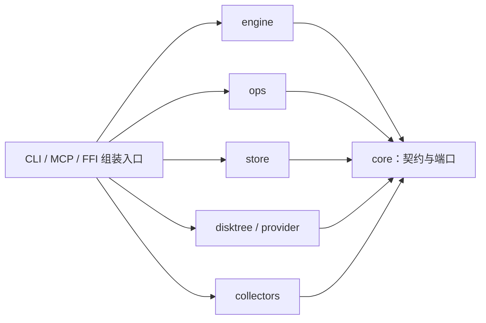
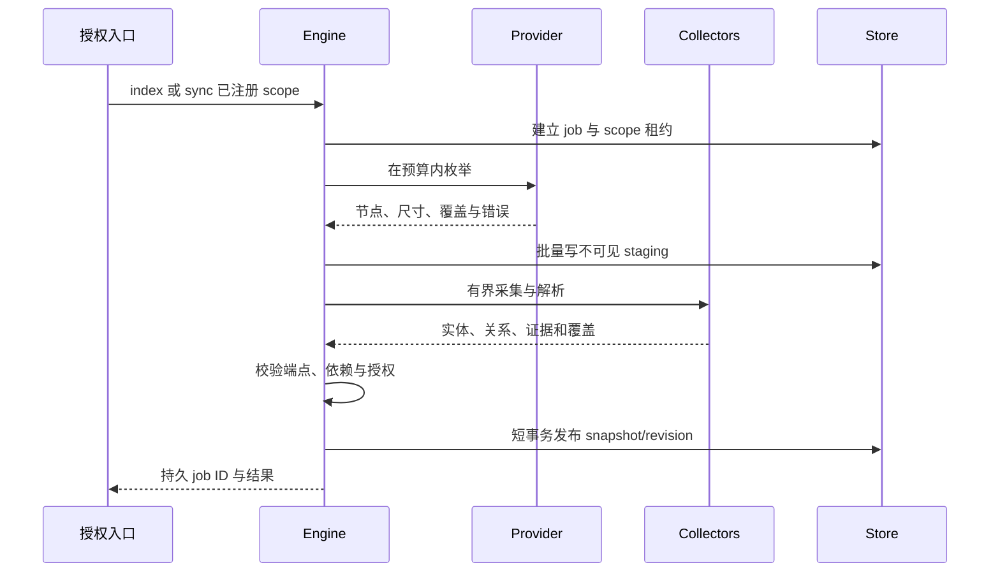
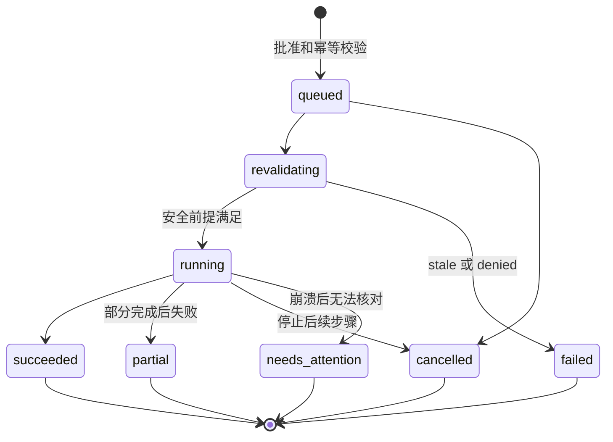

# DiskGraph 技术方案

[English](DiskGraph-Technical-Design.md) | [简体中文](DiskGraph-Technical-Design.zh_CN.md)

> **文档说明**：将架构与 OpenSpec 要求映射到数据结构、协议、执行、运维和可验证工作包。
>
> **文档版本**：1.1；**最后更新**：2026-09-28；**状态**：待评审\
> **源码基线**：`a89e57a`，workspace `0.1.0`\
> **责任方**：DiskGraph 维护者；模块负责人按阶段指定。目标 DTO/表/配置示例不是现有 API。
>
> [架构](DiskGraph-Architecture.zh_CN.md)负责边界；[OpenSpec](../openspec/changes/implement-diskgraph-platform/proposal.md)负责需求与验收；[D1–D15](../openspec/changes/implement-diskgraph-platform/design.md)负责决策；[P0–P10 任务](../openspec/changes/implement-diskgraph-platform/tasks.md)负责实施。本文不创建第二套规格。

## 1. 工程组织与依赖

运行入口组装 `core + engine + store + scanner + collectors`；按能力配置启用 ops。CLI/MCP/FFI 不另建查询实现，engine 不依赖 MCP、模型、PruneX 或具体数据库。



建议端口：SnapshotReader/Writer、ControlStore、ScopeAuthorizer、ResourceProvider、EvidenceCollector、FileOperator、VolumeMeter、ApprovalVerifier。先围绕真实行为定义最小接口，不为每个函数拆 crate。平台 SDK 留在适配器/宿主；ops 通过 RefreshScheduler 端口申请索引更新，避免与 engine 循环依赖。

保留已有五查询与 JSON v1。v2 服务新增具名请求/响应，core 中的类型分领域组织，不把所有模型、平台逻辑或兼容分支塞进 lib.rs。同步查询下推索引；长扫描/哈希/复制作为作业，不一次加载整张图。

固定现有 `disktree-core` Git rev `158f9cc2f0b332194a3ffc5acec47760c99146d8`。只依赖扫描/树/尺寸接口，不调用 removal；更新上游先跑路径、权限、链接、占位和大小口径回归。确需 fork/vendor 时建立独立决策和来源记录，不在此次文档工作复制源码。

## 2. 身份、定位与观察

| 字段/对象 | 目标契约 |
| :--- | :--- |
| server_id | 服务实例身份；持久化，不由客户端指定可信值 |
| scope_id | 管理员注册的根/卷/provider/策略范围；别名只在限定服务内解析 |
| ResourceRef | server_id、scope_id、revision_id、node_id；不能当访问令牌 |
| ResourceLocator | Unix 原始路径字节、Windows 代码单元或 provider URI；展示路径单列 |
| FileIdentity | 卷/provider 身份 + 文件标识及可用世代信息；仅辅助对齐 |
| DiskSnapshot | 扫描开始/结束、选项指纹、扫描器版本、覆盖和错误 |
| DiskNode | 同快照 parent、类型、无损定位、身份、各尺寸与独立时间字段 |

当前扫描链路的 `to_string_lossy()` 必须端到端检查：只改最后一个 DTO 不能找回上游丢失的编码。未修复时标记 lossy_locator，并禁止用有损展示串做文件操作目标。不能统一 lowercase、以展示名去重或猜测 URI 对应路径。

尺寸保留 apparent_bytes、allocated_bytes、subtree 对应汇总、measurement_kind 和 unknown_size_count。未知为 null，不用 0 或另一口径补齐；文件自身 mtime 与子树最新 mtime 分离。硬链接按身份域去重，共享块无法精确归因时说明限制。

目录遍历采用 best_effort 时间窗口，不声称原子快照。权限失败、排除、挂载变化分别记录覆盖，不将“未观察”解释为“删除”。首版历史对齐以兼容范围内精确无损定位为主，重命名推断不列入初始验收。

Android URI/iOS 文档从一开始是有效资源类型；在未实现 provider 的平台返回 unsupported，而不是转成字符串文件路径继续操作。

## 3. 关系模型、证据和失效

实体包括 Resource、Application、Project、Process、BuildRecipe、ProtectionPolicy。应用实例不能仅用 bundle ID 区分；Process 需要主机/启动会话、PID 和可得的启动时间，不能跨重启按 PID 复用。

| 关系 | 端点 | 解释规则 |
| :--- | :--- | :--- |
| contains | Resource → Resource | 来自同快照父子枚举 |
| declares | Resource → Project | 清单声明；不推出可重建 |
| owned_by_project | Resource → Project | 支持嵌套项目、workspace、多所有者 |
| owned_by_application | Resource → Application | 精确元数据与启发式分开 |
| used_by_process | Resource → Process | 仅观察覆盖，不证明全部系统依赖 |
| rebuildable_by | Resource → BuildRecipe | 带规则版本、工具/网络/环境前提 |
| protected_by | Resource → ProtectionPolicy | 来源有权威性，不能被弱规则解除 |
| same_content_as | Resource → Resource | 内容核验结论，不是删除许可 |

授权范围内的 symlink_to 可作为后续关系；不跟随其跨界目标扩展扫描。每种关系规定方向、可传播深度和解释方式，impact 不无差别无向遍历。

```text
CollectorRun:
  run_id, snapshot_id, collector_id/version, rule_version
  scope, observed_at, finished_at, coverage, errors, input_fingerprint

EvidenceRecord:
  evidence_id, run_id, basis, source_ref
  observed_at, expires_at?, confidence?, upstream_evidence_ids[]

EvidenceEdge:
  edge_id, source_entity_id, relation, target_entity_id
  assertion_kind: observed | derived | heuristic | user_policy
  evidence_refs: [{ evidence_id, polarity: supports | contradicts }]

GraphRevision:
  revision_id, snapshot_id, selected_runs, resolver_version, published_at
```

证据依赖无环，推导有效期不超过上游；输入清单、规则或身份变化使相应证据失效。fresh/stale/invalidated/unknown 与 conflict 分别表达。评分是方法内的可信度分级，不是统计概率，不能通过累加弱命中提高许可等级。

进程观察过期仍是“未能证明当前状态”，不变成无人使用。保护策略在有权来源撤销前有效，暂时无法读取策略不解除保护。历史解释固定 revision 和 evaluated_at；实时风险判断以当前时间重算新鲜度。

## 4. 扫描与采集流水线



作业状态：queued → scanning → collecting → resolving → publishing → completed，另有 cancelled/failed。取消不推进默认 latest；允许保存 partial 观察，但须显式标识并由查询选择。文件扫描完整与各 collector 完整分别报告。

第一批规则识别 Cargo、Java、Node 项目及可证明的构建布局；测试 Cargo workspace、自定义/共享 target、Maven 多模块、同名普通目录与越界配置引用。仅名称命中 target/cache 不足以产生可重建证据。

元数据采集策略可单独允许有界读取白名单项目清单；它不是任意正文访问权。限制长度、解析深度和引用解析，禁用 XML 外部实体，不执行清单脚本、插件、宏、Git hook 或构建。配置指向 scope 外只保存未解析引用，不能扩权；环境变量/构建参数未知时保留未知。

应用采集优先 bundle/package/container 元数据；进程采集报告方法、覆盖与权限；Git 只看本地已知引用，不默认 fetch。不同 collector 以 supported/unsupported/denied/partial/complete 报告能力。

增量先交付显式 sync 与受控重扫，再接 watcher。事件只是失效提示；丢事件、休眠恢复、挂载或权限变化需要重新观察。失败不抹掉风险，旧证据保留但标 stale。高频证据刷新发布新 revision，无须每次扫描全盘。

## 5. SQLite：图数据和控制数据

### 5.1 生命周期与部署

Rust 管理本机 `diskgraph.sqlite` 和 `diskgraph-control.sqlite`。PruneX 自身的 `prunex.sqlite` 由 GRDB/Room 管理，不能作为服务器唯一批准或恢复记录。

图库可重建；控制库必须备份并在恢复时与真实文件状态对账。scope 注册、策略撤销、恢复条目不能随索引重建丢失。跨数据库没有原子提交承诺；计划保存审阅时必要指纹和证据摘要，而非仅存可能过期的图外键。

SQLite 使用本地存储；远程客户端只走协议，不能共享网络文件系统中的 WAL 数据库。目标设置外键、WAL、有界 busy timeout、写队列、迁移锁与 checkpoint 策略；这些是待实施配置，依据 [SQLite WAL 约束](https://sqlite.org/wal.html)。

### 5.2 目标逻辑表

| 库 | 表 | 关键约束 |
| :--- | :--- | :--- |
| 图 | snapshots | scope、扫描窗口、设置、覆盖、发布状态 |
| 图 | resource_nodes | (snapshot_id, node_id)；同快照 parent；无损 locator、尺寸 |
| 图 | entities | (snapshot_id, entity_id)；kind、结构化身份、来源 run |
| 图 | collector_runs | snapshot、方法/版本、范围、覆盖；完成后不可变 |
| 图 | relations | run、source、target、relation；合法同快照端点 |
| 图 | evidence_records | 来源、依据、时间、有效期与输入指纹 |
| 图 | relation_evidence | 一条主张的多个支持/反驳证据 |
| 图 | evidence_dependencies | 同快照无环依赖 |
| 图 | graph_revisions / revision_runs | 快照与批次组合；run role=active/dependency |
| 图 | scan_issues / reconciliations | 有界错误；跨快照对齐方法与依据 |
| 控制 | servers / scopes / principals / grants | 身份、注册范围、主体映射和权限 |
| 控制 | policy_versions | 来源、版本、撤销与批准策略；秘密只保管引用 |
| 控制 | jobs / leases | 扫描、哈希等作业、所有者、心跳、期限与 fencing |
| 控制 | plans / plan_items | 不可变摘要、精确对象边界与要求 |
| 控制 | approvals | 批准来源、签名/核验引用、绑定、期限、撤销 |
| 控制 | operations / operation_items | 幂等键、逐项意图/步骤/结果、重验信息 |
| 控制 | recovery_entries | 回收位置、原位置、身份、恢复能力、保留状态 |
| 控制 | audit_events | 批准、拒绝、执行和恢复审计；有界脱敏 |

原生权限凭据、安全书签和 OAuth 秘密由平台/密钥存储按策略保管，库内保存必要引用或受保护材料，不记录可打印明文凭据。scope/策略字段是服务端可信数据，模型不能直接写表。

查询只选择 revision 的 active run；依赖批次只用于解释，不重新激活旧关系。Resource 与 node 一一对应；其他实体观察按批次追加。淘汰必须保留传递证据依赖或明确使相关 revision 失效。

优先索引 parent+size+node_id、locator 编码+无损 key、source/relation/run、target/relation/run、revision/run、证据有效期。名称/展示路径全文检索可用 FTS5，但不能参与身份判定。JSON 留给可演化依据，常用筛选键独立建列。

### 5.3 发布、分页、迁移和容量

长扫描分批写不可见 staging，发布短事务检查完整性并切 latest。进程崩溃后旧 revision 可查，未完成 staging 按作业状态回收。分页是绑定主体/权限版本、revision、过滤器和排序的 keyset 游标，不跨页长期占读事务；revision 被淘汰返回 revision_expired，不切换 latest。

迁移先验证版本、预算与一致性备份；旧 schema、ID 映射和 v1 行为有 fixture。历史未记录的身份/尺寸/覆盖标 unknown；subject 文本保留 legacy，不自动升级为可信关系。旧二进制遇新 schema 拒绝，失败使用备份恢复，禁止自动降级正式库。

v1 candidates 保持历史语义，但不能作为 v2 执行授权依据。公开 API、数据库 schema、规则及 MCP 协议分别版本化，不以一个版本号掩盖兼容变化。

容量分别统计 DB、WAL、staging、日志、备份、回收区。索引目录默认排除自身扫描。历史保留按 scope、锚点和 pin；达到预算先处理无引用临时数据与允许淘汰的历史，仍不足就停止新任务。控制/恢复记录和用户文件不参与自动空间回收；迁移/压缩预估额外空间。

## 6. 查询算法与返回契约

- children/top 使用 SQL 排序与稳定 tie-breaker；未知大小单列，不输出整树。
- explore 聚合有限目录/项目/关系摘要，宿主完成自然语言理解；歧义返回候选 ID。
- related/impact 按类型、方向和传播规则有界遍历，按 snapshot/entity 去重。
- changes/growth 先验证 server/scope、卷/provider、设置、口径和覆盖；不兼容说明原因。
- candidates 要有明确重建依据、当前保护/占用覆盖及后代检查；未知阻断资格，目标不足不扩大授权或放宽规则。
- 普通查询不会隐式扫描全盘；not_indexed、needs_sync、empty、denied、fault 分别表达。

初始工程预算建议：深度 2、节点 100、边 300、响应 64 KiB、查询期限 1 秒；这是待基准校准的上限，不是性能承诺。超限返回 truncated、reason 和可继续游标，只有扫描/管理操作可改变索引。

示例为 v2 虚构数据，非现有代码返回：

```json
{
  "api_version": 2,
  "ok": true,
  "server_id": "server-example",
  "scope_id": "scope-example",
  "revision_id": "revision-example",
  "evaluated_at": "2026-09-28T08:00:00Z",
  "coverage": {"filesystem": "complete", "process": "unsupported"},
  "data": {
    "node_id": "node-example",
    "allocated_bytes": "1073741824",
    "apparent_bytes": null,
    "review_status": "unknown",
    "reasons": ["process_observation_unavailable"]
  },
  "warnings": [],
  "truncated": false,
  "next_cursor": null
}
```

ID、字节数及跨语言不安全整数使用字符串，未知为 null 并附原因。文件名、清单、证据文本都是不可信数据，不得成为工具指令。v1 不无声改变字段类型。完整参数/错误/工具名见 [命令参考](command-reference.md)。

## 7. MCP 与服务部署

优先使用官方 Rust SDK rmcp 实现 stdio 与 Streamable HTTP；精确版本在实施时锁定。SDK 的 [传输说明](https://github.com/modelcontextprotocol/rust-sdk#transports)不能作为旧 HTTP+SSE 已支持的证明：legacy-sse 需要独立适配或网关，并用旧客户端验证双端点等契约。

不要将“现代 HTTP 返回 text/event-stream”算作旧协议兼容。三个入口调用同一服务、授权和审计，旧入口默认关闭且有明确能力标识。工具 profile 精简展示不删服务能力；逐请求强制授权独立于 MCP 工具注解。

stdio stdout 仅协议，stderr 写日志。HTTP 遵循选定版本的生命周期，不能假设所有版本都采用相同初始化/会话规则；记录客户端版本矩阵。长任务返回持久 job/operation ID，连接关闭、请求取消与业务终态分离。

远程服务采用外置授权服务支持的 OAuth 资源服务器验证，明确 issuer/audience/expiry；TLS 或可信加密隧道、Origin 校验、默认 loopback、显式代理信任和主体映射不可省略。隧道本身不授予全盘权限。进一步规范依据：[MCP HTTP 传输](https://modelcontextprotocol.io/specification/2026-07-28/basic/transports/streamable-http)、[HTTP 授权](https://modelcontextprotocol.io/specification/2026-07-28/basic/authorization)。

请求体、响应、并发连接、查询时间和每主体作业数均有预算。未经验证的代理身份头拒绝；令牌不进入日志。服务器始终在自身授权目录操作，默认低权限，不自动 sudo/root。

统一二进制可包含 cli/mcp；发行包不要求用户安装 Rust。install 仅注册已有程序到明确客户端配置，下载二进制、宿主配置、服务器部署是不同动作。配置写入须预览、保留其他条目/注释、幂等、可撤销；不因 stdio cwd 变化换数据目录。

## 8. 内容读取与专业适配

read 要求单独内容授权、精确 ResourceRef 和读取范围，流式受限，默认只允许普通文件。设备、socket、FIFO、越界链接拒绝；云占位不默认下载，无法保证则 unsupported。读取前后核验身份/版本，发生写入则标 unstable。

duplicates 分三步：元数据疑似组 → 有内容权限的预算内哈希 → 再确认内容及稳定性。硬链接不计为独立副本，共享块与可回收估计分开；不能用大小或文件名相同证明重复。哈希/正文保留受策略控制，默认不保存完整正文，结果不自动执行删除。

| 基础能力 | 实现方式 | 不作为必需依赖 |
| :--- | :--- | :--- |
| 枚举、定位、元数据 | disktree + Rust/平台 API | ls、find、stat |
| 尺寸与卷可用量 | 扫描尺寸 + 平台卷 API | du、df |
| 有限读取、复制、移动 | Rust/平台 provider | cat、cp、mv、rm |
| Git/进程证据 | 专用库或可选受控程序 | Git/lsof 缺失只影响对应观察 |
| Cargo/Docker 清理 | 专用计划与验证后的程序/API | 不转换为通用目录删除 |

实现可参考 [Rust fs](https://doc.rust-lang.org/std/fs/) 和 [Command 参数接口](https://doc.rust-lang.org/std/process/struct.Command.html)，但普通 rename/copy 不自动满足“不覆盖/完整元数据保真/无竞态”。

外部适配固定可执行来源、argv、cwd、环境、时限、输出与重试预算，不执行 shell 字符串。参数注入、用户 cargo alias/config、Git hooks、远程 Docker context 等均要检查；环境或配置会突破预期行为时拒绝，不以“工具合法”代替范围校验。

Cargo 计划显示精确项目、实际 target、共享目录和活跃构建风险。Docker 先列生态对象，再批准精确 ID；禁止直接删除 VM/数据库/卷目录。全局 prune 不作为默认动作；如果命令无法收窄至批准对象，适配器不得使用该宽泛命令。

## 9. 文件操作：计划、批准与状态

### 9.1 计划与批准

计划固定 server/scope/principal、revision、源/目标 ID、指纹、目录成员边界、动作、策略版本、数量/字节预算、期限、元数据保真及恢复条件；规范化序列化后生成摘要。目录不能仅批准一个路径字符串，必须控制后代成员变化和重叠目标。

批准由可信 UI/独立确认通道或管理员有限预授权策略签发，绑定计划摘要、主体、动作、范围和有效期。MCP 不提供可由同一智能体任意签发批准的工具；自由文本、approved=true、--yes、TTY 都不是独立批准证据。审批服务或可信宿主若失陷属于显式信任边界，不能靠模型“遵守提示”解决。

apply 只接受精确 plan_id、approval_ref、idempotency_key。权限/策略/期限/对象变化要求重新计划或批准；元数据访问权限不能推导出内容或修改权限。

### 9.2 作业与操作记录

计划生命周期与执行生命周期分开：计划可 validated/expired/revoked；operation 才记录真实副作用。



幂等键按服务/主体绑定不可变计划；相同键同请求返回原 operation，冲突请求拒绝。冲突资源按源/目标及祖先/后代关系加锁，租约含所有者世代/fencing，不能只依赖 PID。

每个文件步骤先写 intent，再操作文件，再写结果。崩溃后根据源、目标、staging 身份对账；无法确认不可逆步骤时停在 needs_attention，不宣称全局 exactly-once。取消只能阻止后续步骤，已完成结果与 recovery_ref 保留。失败重试不是自动回滚；补偿/恢复必须另外计划。

### 9.3 实时重验与平台动作

执行前重查源/目标授权、身份、目录成员、保护、占用覆盖、挂载、目标冲突及容量；使用平台可用的目录/文件句柄、不跟随链接、no-replace 语义和逐组件验证降低 TOCTOU。canonicalize 后按字符串修改并不充分。无法保证安全前提则拒绝，不能声称绝对无竞态。

| 动作 | 提交条件与失败语义 |
| :--- | :--- |
| 同卷 move | 不覆盖；能力允许时原子 rename；对象身份变化失败 |
| copy | staging 写入、校验内容及所需元数据、同步并不覆盖发布；失败保留可追踪暂存 |
| 跨卷 move | copy 确认成功后再按批准删除源；中途失败可能同时存在两份 |
| trash | 可验证系统回收后端或同卷 quarantine；保存原位置、身份与恢复映射 |
| restore | 新计划；原位置冲突不覆盖，可重新批准其他授权目标 |
| purge | 独立不可逆权限和批准；没有备份就不能恢复内容 |

复制要求的权限、ACL、xattr、稀疏/链接语义按平台能力明确，不支持的保真要求阻断或重新批准降级计划。回收规范可参考 [FreeDesktop Trash](https://specifications.freedesktop.org/trash/latest/)，但 macOS/Windows/provider 行为分别实测，不能假定统一支持。

操作后记录逻辑处理字节、quarantine 保留、卷空闲前后值及测量时间。报告实测差值时注明外部写入、打开句柄、硬链接、共享块和系统快照影响；不承诺所有差值都是本操作造成。同卷回收不宣称按目录大小释放空间。

## 10. 原生与移动集成

FFI 保留版本化 DTO、稳定错误、后台作业句柄、分页、取消与显式释放。大结果批量返回；宿主不在 UI 线程扫描。Swift/Kotlin 对未知/超大数值往返测试，不要求通过 MCP 才能调用核心。

Rust bundled SQLite 与 GRDB/Room 共存需验证符号、链接策略、版本、线程、连接关闭和迁移时序；三份数据库的所有权不同，但同进程库冲突仍可能发生。PruneX 管理用户界面和模型会话，服务端控制库保留执行权威。

Android 使用宿主授权的 SAF/适用媒体 URI；provider 能力决定列举、大小、读写、移动和恢复。撤权、provider 离线、未知大小都是正常结果，不能访问其他 App 私有数据。[Android 文档访问依据](https://developer.android.com/training/data-storage/shared/documents-files)。

iOS 限定 App 自有与用户文档；Swift 管理安全作用域、书签和文档协调，开始/结束访问有配对生命周期。不能承诺整机清理或任意应用卸载。[Apple URL API](https://developer.apple.com/documentation/Foundation/NSURL)。

AgentScope-Swift/Kotlin 仅在产品宿主编排；DiskGraph 不内置 LLM、向量库或训练管线。Lite 云模型导出默认遵循最小元数据策略，正文另授权；Pro 本地模式可完全离线使用基础能力。

## 11. 验证、发布与证据

| 能力规格 | 实现证据 |
| :--- | :--- |
| [范围授权](../openspec/changes/implement-diskgraph-platform/specs/scope-authorization/spec.md) | 同名路径跨 server、伪造 ID、撤权、聚合前过滤 |
| [快照](../openspec/changes/implement-diskgraph-platform/specs/filesystem-snapshots/spec.md) | 链接、占位、非 UTF-8、权限失败、换卷、未知尺寸 |
| [关系](../openspec/changes/implement-diskgraph-platform/specs/relationship-evidence/spec.md) | 多归属、矛盾、TTL、输入变化、低权限覆盖 |
| [存储](../openspec/changes/implement-diskgraph-platform/specs/snapshot-storage/spec.md) | v1 迁移、满盘、发布崩溃、分页、索引重建后恢复记录 |
| [查询](../openspec/changes/implement-diskgraph-platform/specs/bounded-queries/spec.md) | 有界图、可比增长、保护后代、精度和新鲜度 |
| [内容](../openspec/changes/implement-diskgraph-platform/specs/content-inspection/spec.md) | 限段读取、占位保护、文件变化、重复确认、日志无正文 |
| [命令](../openspec/changes/implement-diskgraph-platform/specs/command-surface/spec.md) | 29 个命令族、帮助/退出码、CLI/MCP/FFI 一致性 |
| [传输](../openspec/changes/implement-diskgraph-platform/specs/mcp-transports/spec.md) | 三种协议独立客户端、身份隔离、断线/重连 |
| [文件执行](../openspec/changes/implement-diskgraph-platform/specs/safe-file-operations/spec.md) | 伪造批准、竞态、幂等、部分失败、恢复冲突、空间测量 |
| [生态](../openspec/changes/implement-diskgraph-platform/specs/ecosystem-adapters/spec.md) | 最小环境、参数注入、缺依赖、精准 Cargo/Docker 范围 |
| [智能体](../openspec/changes/implement-diskgraph-platform/specs/agent-integration/spec.md) | 至少两个宿主真实任务、配置保留、索引复用 |
| [平台](../openspec/changes/implement-diskgraph-platform/specs/platform-ffi/spec.md) | 三桌面 OS、Swift/Kotlin、Android/iOS 真机 |
| [运行治理](../openspec/changes/implement-diskgraph-platform/specs/runtime-governance/spec.md) | 并发/租约、背压、取消、容量和控制记录对账 |
| [发行评测](../openspec/changes/implement-diskgraph-platform/specs/release-evaluation/spec.md) | 多次对照、可追溯版本、签名/校验和/许可、私有发布 |

实施按每项规格先构造失败测试，再最小实现和回归。安全破坏测试只用隔离资源。大规模基准至少覆盖 10 万/100 万节点，记录硬件、版本、扫描、P50/P95、峰值 RSS 与 DB/WAL；数字是数据集目标，不是已测性能。

智能体评测分别记录冷索引、热查询、同步，以及正确性、调用数、返回字节/Token、驻留上下文和累计时间/磁盘成本。不得直接套用 CodeGraph 的效率数字，单次热查询不构成整体提效证明。

每阶段发布只开启已验收能力。升级先备份并冻结写作业；控制库恢复须对账真实副作用，数据库回退不等于文件回滚。私有包附版本/校验和/许可；公开发布、生产部署另获授权。

本轮仅修改文档，并在 macOS/Rust 1.98.1 重新验证 9 个既有单元测试、fmt 和 Clippy；没有实施目标模块、清理用户文件或改变远程状态。精确 SDK 版本、TTL/预算参数、签名身份和设备资源在相应任务中实测确定。

## 12. 技术选型基线与配置设计

### 12.1 已有依赖与候选

| 技术 | 当前证据/选型状态 | 取舍 |
| :--- | :--- | :--- |
| Rust / Cargo | manifest：0.1.0、Edition 2024、resolver 3、rust-version 1.97 | 实测工具链 1.98.1；未单独验证最低版本 |
| serde / serde_json | 现有依赖，manifest 主版本 1 | 显式版本化 JSON，避免跨语言整数损失 |
| rusqlite | manifest 0.40.2、bundled、default-features=false | 统一 Rust 存储；原生链接共存仍需验证 |
| UniFFI | manifest 0.32.2，启用 cli | 现有 JSON 绑定；不等于 XCFramework/AAR |
| disktree-core | 固定 Git revision，未 vendor | 保留适配边界及上游许可 |
| rmcp / HTTP 宿主 | 候选，尚未加入 Cargo.toml | 实施时锁定版本；legacy-sse 独立验证 |
| 原生文件/卷/provider API | 已有扫描基础；操作适配为目标 | 不依赖 ls/du/rm；能力不支持则拒绝 |

当前没有项目自定义 Cargo feature 矩阵，也没有全 workspace 的 forbid(unsafe_code) 声明；不能声称全依赖图零 unsafe 或用尚不存在的 feature 命令安装。FFI 与 native SQLite 的风险按目标平台审查。

### 12.2 配置合同草案

以下 TOML **只是待评审示例**，当前没有加载器；不把示例数值当已批准默认值或运行命令。安全策略约束始终高于入口参数。

```toml
config_version = 1
mode = "local"
data_dir = "./diskgraph-data"

[transport]
kind = "stdio"
legacy_sse_enabled = false

[capabilities]
content_read = false
file_operations = false

[query_budget]
max_depth = 2
max_nodes = 100
max_edges = 300
max_response_bytes = 65536
timeout_ms = 1000
```

目标优先级：在策略允许范围内，显式参数覆盖受支持的环境配置，再覆盖指定配置文件，最后安全默认；任何覆盖都不能扩大授权根、放宽批准或提高管理员预算上限。未知配置键、路径冲突、无效版本拒绝启动或拒绝更新，不能静默忽略安全字段。

HTTP 部署必须另外配置实际身份验证、监听、Origin、加密与预算；不提供匿名公网“开箱即用”示例。秘密只提供引用，具体秘密后端、环境键和热更新字段在 P0/P4 契约中确定。配置更新先验证、再原子激活；失败保留已验证版本，并记录策略版本变化。

## 13. 启停、诊断与恢复操作手册（目标）

| 场景 | 检查顺序 | 安全动作/验收 |
| :--- | :--- | :--- |
| 启动 | 配置→数据目录权限→库版本→控制记录→依赖→传输 | 不兼容库拒绝；不确定操作先对账；输出能力报告 |
| 正常停止 | 停接收→排空/取消→记逐项状态→释放连接 | 不把连接断开视为全部取消；无未记录副作用 |
| 图库损坏 | 隔离问题库→保留控制记录→检查备份/重建范围 | 明确索引不可用，不丢批准/恢复数据 |
| 控制库损坏 | 关闭写能力→保存现场→恢复备份→与文件系统对账 | 不盲重放 purge；人工确认不确定项后再开放 |
| 磁盘不足 | 计量 DB/WAL/staging/回收区→停止新副作用 | 仅按已有策略处理自身可丢索引；不自动清空回收区 |
| 服务断线 | 查原 job/operation 与幂等键 | 重连不创建第二次动作 |
| 版本升级 | 冻结写→预算/备份→迁移→校验→只读试运行→恢复写 | 数据库回退不能撤销已发生的文件操作 |

目标监控包括队列深度、扫描/查询耗时、状态/拒绝计数、数据库/WAL/临时区用量和观测丢失计数。路径、node_id、用户标识不作为无界指标标签。日志仅有界摘要；审计保存执行权威，不与可丢遥测合并清理。

readiness 表示此能力可接收工作，不只是进程存在。可选 Git/Docker 缺失时仅对应适配器降级；授权或控制持久化失效时写能力必须拒绝。排空、满盘、配置失败与租约过期都要有测试。

## 14. 交付路线与证据边界

沿用架构与 OpenSpec 的 P0–P10：P0 基线/契约，P1 存储，P2 查询，P3 stdio，P4 远程，P5 可恢复执行，P6 高风险动作，P7 内容/桌面，P8 PruneX，P9 移动，P10 私有交付。P7 的写验收依赖 P5/P6，P8 的写界面依赖 P5。没有新增日历承诺或软件版本发布日期。

现有验证命令（本轮在依赖已缓存环境以 offline 运行；干净环境去掉 offline 并按批准获取依赖）：

```bash
cargo test --workspace --locked --offline
cargo fmt --all --check
cargo clippy --workspace --all-targets --locked --offline -- -D warnings
```

本机结果：9 个单元测试通过，doc tests 为 0，fmt/Clippy 通过。远程 CI、目标平台安装、Swift/Kotlin 编译运行、移动真机和目标服务能力尚未在本轮验证。不能把现有测试数当作 77 条新要求已实现。

外部来源于 2026-09-28 核对了 MCP Rust SDK、Streamable HTTP 和 SQLite WAL 文档；它们支持依赖/协议约束，不证明 DiskGraph 已完成集成。其他来源保留为设计参考，实施时固定版本并复核。SDK 精确版本、批准签发实现、容量默认值、签名资源与真机条件是有对应阶段的待验证事项，不允许跳过安全门禁。

本次使用技术方案模板的选型、ADR、组件、路线、部署与观测结构，移除无关电商 Agent、浏览器自动化、SaaS 租户、计费、消息代理和虚构 Gantt 日期；架构/技术方案的双语版本不是两套独立需求。

---

**文档版本**：1.1\
**创建日期**：2026-09-28\
**最后更新**：2026-09-28\
**文档状态**：待评审；实现与平台验收以 OpenSpec 证据为准。
