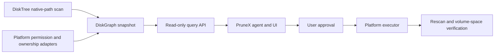

# DiskGraph architecture and roadmap

## Boundary

DiskGraph owns observations and read-only explanations. PruneX owns product interaction, user approval, platform-specific cleanup execution, recovery, and verification. Neither an agent nor `diskgraph-disktree` may turn a `reclaim_hint` into a deletion command.

## Current data contract

- `DiskSnapshot` identifies one selected scope, scan settings, time, and coverage. Partial scans are explicit.
- `DiskNode` records a snapshot-local ID, parent, locator, kind, direct/subtree bytes, counts, and scanner classification hints. IDs are not stable across scans.
- `EvidenceEdge` records a sourced, timestamped relationship such as app ownership, project ownership, process use, rebuildability, or protection. Confidence is not authorization.
- `growth` compares a matching locator only when both snapshots have complete, compatible settings and the same known volume ID. It does not infer renames or mount changes.
- `candidates` requires explicit rebuildable evidence and excludes protected/in-use descendants. Its byte sum is a review target, never promised freed space.
- SQLite stores each snapshot, node, and evidence record transactionally. Snapshot IDs cannot be overwritten; node IDs remain snapshot-local. The current schema is version 1.
- UniFFI exposes a narrow JSON-based contract for Swift/Kotlin. The response envelope distinguishes errors from empty results; no function can delete data.

The initial JSON-compatible `NativePath` representation is for analysis and display. Production execution must use a separately validated platform resource handle, not deserialize a path from a model response and delete it.

## Platform capability matrix

| Platform | Discovery strategy | First product scope |
| --- | --- | --- |
| macOS | DiskTree native paths plus macOS permission/process adapters | User-authorized directories, build outputs, app caches |
| Windows | DiskTree native paths plus Windows volume/app/process adapters | Accessible volumes and user-approved cleanup |
| Linux | DiskTree native paths plus mount/package/process adapters | Accessible mounts and user-approved cleanup |
| Android | Kotlin Storage Access Framework/MediaStore adapter; validate Rust build separately | Granted documents/shared storage only |
| iOS | Swift security-scoped document adapter | User-selected documents and this app's own data |

The same graph schema and product information architecture can be shared, but scan coverage and cleanup authority differ by platform. A missing permission produces an incomplete/unsupported capability state, not an empty result.

## Next milestones

1. Add explicit SQLite migrations beyond schema v1, retention policy, and redacted exports. Keep raw paths local.
2. Add platform capability manifests and opaque resource handles. Extend Mac filesystem identity and permission-error capture without claiming unsupported scope.
3. Add versioned ownership/process evidence collectors and stale-evidence invalidation.
4. Package generated Swift/Kotlin bindings into an XCFramework/AAR and verify end-to-end PruneX read-only integration.
5. Add a separate deterministic executor behind immutable approval, liveness checks, trash/rollback where supported, and actual volume-space verification.
6. Validate Android NDK compilation and URI scanning, then iOS security-scoped document access; verify each platform on real devices. Do not describe Android/iOS as full-disk cleaners.

## Acceptance principles

- Every result states its scan root, volume, time, settings, unreadable count, and completeness.
- Protected or active resources are never eligible for automatic recommendation.
- No agent-exposed API can delete or expand a candidate path.
- “Estimated occupied bytes” and “measured freed bytes” are reported separately.
- Cross-platform support is claimed only after platform-specific tests pass.
