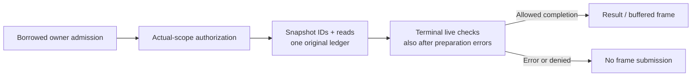

# Full-platform acceptance continuation — 2026-10-04

The staged source was separately exported from Git index tree `76b632c6`, excluding the unfinished FFI owner: full workspace **1545/0/18 (70 suites)**, nine-package fmt, strict workspace Clippy and OpenSpec passed. This is local acceptance; native CI for the new source has not run.

The scanner cache commit `f435582` completed [CI37222271476](https://github.com/loong10k/diskgraph/actions/runs/37222271476) with **22/22 successful jobs**. Its same-host, same-fixture release AB/BA comparison against fixed `2a2f828` used 12 qualified Linux measurements: 20k wide scans took 5–7% less time and 200k wide scans 6–11% less; the 300-level subtree was approximately unchanged. All 67 artifact file hashes and signed storage deltas were verified. These are paired observations, not general throughput, cold-cache, atomic-snapshot or strict RSS guarantees. The original-held-directory cache still rereads every current ancestor identity; the upstream scanner pin and bytes remain unchanged.

The subsequent diagnostic-only commit `1fa36ba` completed [CI37222674248](https://github.com/loong10k/diskgraph/actions/runs/37222674248) with **21/22 successful jobs**. The macOS stable writer probe spent 409801 µs in preparation against the original 400 ms deadline; the guard correctly refused in 2 µs without reaching BEGIN. This failure does not qualify the intended writer-lock stage and remains preserved. No original 400/550 ms assertion was relaxed.

The uncommitted FFI lifecycle candidate has a real blocking failure: a 30 ms coordinator drain waited for the TLS fixture's 60 s rescue before failing (0/1/0). `JoinHandle::is_finished()` followed by synchronous join is insufficient for deadline-safe draining. The Engine/Store bridge subsequently repaired cancellation during registration and preservation of unrelated identity conflicts: real registration RED 0/2 and qualified identity RED 1/1, then target GREEN 10/0, broader regressions **882/0/13 (36 suites)**, two-package fmt/strict Clippy and independent review success. These candidate results do not accept PF-06 or physical scanner exit. Raw evidence is separately indexed in [the lifecycle archive](benchmarks/process_job_foundation_acceptance_logs/archives_lifecycle.json); the checklist remains **140/167 complete, 27 open**.

Historical checkpoints below retain the earlier failures and pending observations; the verified state above supersedes their pending CI and cache-performance statements.

[CI37216693860](https://github.com/loong10k/diskgraph/actions/runs/37216693860) at `2a2f828` is terminal: 20/22 jobs succeeded. All three Linux Rust lanes passed workspace 1537/0/18 across 70 suites, including the unchanged ancestor-rebinding negative and sibling-change positive cases, turning the qualified `5c9985b` native RED into GREEN. macOS Intel failed its later Migration gate during fixture admission; Windows MSRV failed post-commit recovery and MCP reconnect status. Overall CI remains failing. Recovery fixtures now witness an actual authorized commit before original-token natural expiry; status reads wait for short control-lock contention within the same original deadline. Local workspace 1528/0/18 across 70 suites, nine-package formatting, strict Clippy, OpenSpec validation and independent reviews passed; new native CI remains pending. Paired release cost measurement for 20k/200k files and a 300-level subtree is prepared but has no results. A deep subtree does not increase registered-root depth; no atomic snapshot, cold-cache or strict RSS claim is made.

The macOS stable native job111472086096 for `2e33519` succeeded: workspace 1523/0/18 across 70 suites. Linux encountered a callback lifetime compilation error before tests; `5c9985b` restores the original borrowed callback constraint through a separate type alias and its native CI is running. macOS MSRV passed the original queue10 and guard4; the new host40 diagnostic expired during preparation before BEGIN. Only its preparation qualification was adjusted: local diagnostics2 and Store library283/0/1 passed, preserving the550ms total bound. Overall platform acceptance remains incomplete.

D44 boundary candidate passed local acceptance: 22 targeted tests, full workspace 1523/0/18 (70 suites), formatting and strict Clippy; independent static review approved. The prepare-time interruption regression failed against the initial candidate, passed against the old implementation, then passed after the minimal fix. Only ordinary BUSY is retried at BEGIN/COMMIT; original deadlines, live interruption errors, commit facts and single consumer execution are retained. Native CI remains pending; Linux scan ancestor-rebinding tests still require native RED and the implementation is not claimed repaired.

Continuation of the [full-platform record](production-readiness-full-platform-2026-10-02.md). The complete platform goal remains open.

## Latest stage: D42 process identity and preparation repair; native gates remain open

The checklist is **167 total / 140 complete / 27 open**, including broad parent gates, not 27 independent vulnerabilities. Git task8.7 and durable request-authority task15.20 are accepted on the implemented Index/Sync/Git paths. D41 corrected-source native acceptance is recorded below; D43 same-source native acceptance is also recorded below; task13.6 is accepted after the complete bounded-query requirement audit. Process/application collectors8.6/15.13, providers, native writes, GUI/mobile/devices, signing and production deployment retain their existing requirements.

Earlier `80d0622` native CI is terminal with eight Rust lanes failing and fourteen other jobs passing; details and preserved raw receipts are below. Process identity/preparation repair is a candidate, not accepted. Read-only local device inventory finds the selected `/Library/Developer/CommandLineTools`, no Xcode app in standard application directories, and adb with zero connected Android devices. This is an environment observation, not mobile build/device acceptance; no SDK installation or device run was performed. [Device inventory](benchmarks/full_platform_device_inventory_2026_10_04.json).

New commit `addf9a84d664225e58162295aac6dac911b045cf` [CI37210806407](https://github.com/loong10k/diskgraph/actions/runs/37210806407) is terminal with15 successes/7 failures. Windows stable full workspace1374/1/16 across70 suites fails only VM prerequisite INSERT; reconnect actually passes this time, without proving the old intermittent cause repaired. All three Linux full Test stages pass1526/0/18 across70 suites, including actual Process identity/budget/original expiry/scope regressions; the MSRV job succeeds and stable jobs fail only later Linux-specific Clippy. Three macOS serial gates still exceed original wall assertions. Windows MSRV queue10 passes, but unwind prerequisite INSERT interrupts before the intended panic/cleanup. This is qualified stage evidence, not overall acceptance; raw logs are retained in the [D42 receipt](benchmarks/process_job_foundation_acceptance_2026_10_04.json).

New public Process entry regressions actually pass2/fail3: legal scope display and volume fields of2MiB each cause62,918,098 cumulative Rust requested bytes across the call; missing IndexWrite or MetadataRead still correctly denies but requests8,389,002 or4,194,465 bytes respectively. Unnecessary full-scope ownership occurred before admission. Unchanged public tests now pass5/5, with matching whole-call requested bytes reduced to1,363/104/16. Store projection7/7, Store all-targets298/0/5 and Engine library385/0/3 pass; independent static review approves this batch. Local full workspace passes1514/0/18 (70 suites), with fmt/strict Clippy/full build/OpenSpec and14 vendor digests verified. New native CI remains pending. These are not peak RSS figures, and macOS Unsupported is not Linux native acceptance. Frozen tests and raw logs are retained in the [D42 receipt](benchmarks/process_job_foundation_acceptance_2026_10_04.json).

Same-source `fd9330e44318c15db7a9a3ea0cb34e6da2b0e81d` [CI37187379023 attempt2](https://github.com/loong10k/diskgraph/actions/runs/37187379023) is terminal **22/22 success**. Attempt1's21 successful jobs retain their original execution times; only Kotlin Intel reran as job111395457676. Its first attempt failed in Maven plugin descriptor resolution before Java/JNA host execution. The log does not prove a network/cache cause. The actual same-SHA rerun reached Maven BUILD SUCCESS and session/paging/poll/v1/release/reopen host acceptance. The [D40 receipt](benchmarks/mcp_service_layout_acceptance_2026_10_04.json) preserves both attempts, the original failure, source hashes and actual native logs.

| Actual workspace log at fd9330e | Passed / failed / ignored | Suites | Git cases observed passing |
| --- | --- | ---: | ---: |
| Windows stable | 1248 / 0 / 16 | 59 | 157 |
| Windows Rust1.97 | 1248 / 0 / 16 | 59 | 157 |
| Linux ARM64 | 1376 / 0 / 18 | 59 | 159 |
| macOS Intel | 1387 / 0 / 18 | 59 | 159 |

Each original workspace log also actually executes authority39, prior query/candidate32, moved MCP21 and structural9 cases once. These groups overlap and are not added into a unique-case total. Only two reviewed Unix-only Git cases are absent on Windows. Observations use the workspace execution phase, excluding inventories, migration repeats and sentinel repeats. This evidence supports8.7/15.20; it does not certify the new D41 source or every platform capability.

## D41 query target preparation: same-source native acceptance completed

Legal large snapshot IDs exposed owned preparation before the old TUI/history consumers began their ledger. The17-source change now borrows and admits owner fields before allocation, authorizes the actual server/scope, then admits necessary snapshot IDs. Both historical sides and subsequent snapshot/node/merge/plan reads consume one original `QueryReadBudget`. Initial TUI preparation failure never reaches paint or submits a cached partial frame. After both historical owners are authorized, target/consumer failures still execute dual-side terminal authorization; encoding retains the grouped live-grant checks. Original deadlines, Complete navigation and explicitly painted Truncated canvas contracts are preserved.

Real whole-request allocation regressions cover left/right oversized headers, combined preparation, ordinary/adequate-budget successes, initial denial and terminal revocation. TUI asserts the actual backend stays empty and paint is not invoked after initial raw-budget refusal. Store3/Engine10/CLI7 targeted cases passed. The first full build then failed E0433 because a production TuiRequest import was test-conditional; that compiler failure remains recorded and is not a behavioral RED. The only correction makes the explicit import unconditional. The final17-source manifest is `116af7b03bf7d97b152ef96dfe5a7b85b32d652b89cd726bf1ec822ffc11f80c`.

Corrected-source local workspace passed **1401/0/18 across 60 suites**. Scoped fmt, FFI include fmt, strict all-target workspace Clippy/build, OpenSpec, release CLI/MCP/FFI and unchanged vendor 124/0/2 passed. Separate release checks passed **stdio 18/18, HTTP/SSE 13/13 and 19/19 actually invoked UniFFI ABI checks**. The JDK 21 macOS ARM Kotlin host actually passed session/paging/poll/v1/release/reopen acceptance, including the new Maven `--errors` diagnostics. Its FFI library SHA is `bb4358e22cf34b025bed1c3c131745c073e5d08120b7f3b700744655ec1e72b5`; protocol/ABI used `86fb3c433d050d7ae7067700e96d2b02c7b148a8d5f0e96b44fd4419029b3fe7`. They are separate builds of the same reviewed source, not the same binary. The finalized [D41 acceptance record](benchmarks/query_target_preparation_acceptance_2026_10_04.json) retains 43 raw/QA/release/Kotlin/native archives, including the final local workspace record of 20 targeted cases passing once (14 new). The native archive below provides separate same-source evidence. D43 native acceptance is recorded below; the full task 13.6 requirement audit remains separate.

Same-source `3531943642e5d233f8b95cbd047167bc81899df6` [CI37190906485](https://github.com/loong10k/diskgraph/actions/runs/37190906485) is terminal **22/22 success**. Each of four original workspace logs executes 20 preparation cases (14 new) and 32 prior query cases once successfully; overlapping groups are not added together. All 17 reviewed-source hashes match the commit, and all 43 gzip archives have verified raw lengths and hashes. The first Linux log retrieval failed in the local gh zip cache; direct API retrieval succeeded. This was a log-collection failure, not a CI failure or rerun.

| Actual native workspace at 3531943 | Passed / failed / ignored | Suites |
| --- | --- | ---: |
| Windows stable | 1262 / 0 / 16 | 60 |
| Windows Rust1.97 | 1262 / 0 / 16 | 60 |
| Linux ARM64 | 1390 / 0 / 18 | 60 |
| macOS Intel | 1401 / 0 / 18 | 60 |

The isolated whole-call allocation window includes initial authorization and target preparation for legal, publicly published 2 MiB snapshot IDs with insufficient read budgets:

| Public request | Rust requested bytes before | After | Observed corrected behavior |
| --- | ---: | ---: | --- |
| History compare/growth/changes, either oversized side | 2,102,370–2,131,834 | 4,528–4,541 | Explicit budget refusal before owning the oversized ID |
| TUI navigation | 2,101,248 | 2,521 | No layer returned |
| TUI frame | 2,184,272 | 2,521 | Paint not invoked; actual backend remains empty |

Ordinary and sufficiently budgeted requests retain successful results. Rust cumulative requested allocation measures successful Rust allocation requests, not peak live memory, SQLite C allocation/cache, filesystem I/O or RSS; it is not causal throughput evidence. Arbitrary synchronous authorizers and native I/O are still cooperative. These observations add no strict memory or wall-clock guarantee and do not complete task 13.6.

## D43 relation, impact, candidate and tree preparation: same-source native acceptance completed

The shared request ledger now begins before actual revision-owner admission and is passed through required snapshot/revision fields and every consumer. Store exposes an admitted evidence reader and candidate query so Engine does not own a full revision or reload its target. Wrong supplied tree scope is denied before target ownership. Target/consumer errors and finish errors after initial authorization still undergo live terminal authorization; an independent connection revoking scope during finish takes precedence over the injected budget failure.

Tests-only source at 3531943, with Engine/Store explicitly cleaned and recompiled, produced integration **2 passed / 9 failed** plus a separate finish-error **0/1 RED**. The old cumulative test stopped at its first related failure, so it does not prove all seven old consumers failed that cumulative scenario. Corrected source passed integration **11/11**, helpers **8/8** and fixed-phase deadlines **9/9**. The cumulative positive/negative pairs actually execute all seven consumers. The first full workspace **1411/2/18** and all compilation, fixture and build-isolation failures remain archived; they are not replaced with the final successful record.

Final frozen-source workspace passed **1414/0/18 across 61 suites**, scoped fmt, FFI include fmt, strict all-target Clippy/build, OpenSpec, vendor **124/0/2** and release build. Real release stdio **18/18**, HTTP/SSE **13/13** and actually invoked ABI checks **19/19** passed. All 14 vendor source digests remain unchanged. The standalone ignored vendor lock was copied into the isolated fixture only. Independent review approved the final source/test delta. The [D43 receipt](benchmarks/relation_preparation_acceptance_2026_10_04.json) retains 72 raw archives and identifies which stages are acceptance.

For the legal 2 MiB target fixture, whole-call Rust requested allocation fell from **2,097,770–4,196,125 bytes** to **348–1,793 bytes**, refusing before owning the oversized field. These figures do not measure RSS, SQLite C memory or throughput. Same-source `66f2e4c` [CI37196289598](https://github.com/loong10k/diskgraph/actions/runs/37196289598) completed **22/22 success**. Each of four original workspace logs actually executes all **28 D43 cases once** (integration11, terminal helpers8, deadlines9). Workspace totals: Windows stable/MSRV **1275/0/16** each, Linux ARM64 **1403/0/18**, macOS Intel **1414/0/18**, each61 suites; migration repeats and inventories are excluded. All12 reviewed source hashes match the accepted commit. **13.6 is accepted after its complete bounded-query source and actual native-log requirement audit**, the remaining 27 full-platform gates stay open. Public wire fields and trusted compatibility signatures are preserved; the internal helper receives the original admitted reader and remaining ledger.

## D42 process jobs: local foundation accepted, native execution still pending

Typed ProcessEvidence input, original metadata/index authority, fencing, independent Unix observations and graph publication/recovery receipts are implemented. CLI/MCP route the fixed scope/revision/node through the same Engine. Missing indexed epochs and unqualified platforms refuse before enqueue. Actual Linux Unsupported execution RED has been established; an executor and 15 stage cases are now candidates awaiting acceptance. Held target/root identity after encoding, the original ancestor route, and shared preparation budgets remain incomplete. Application ownership and all three process platforms remain open.

Real regressions exposed and corrected failure latching, unwind handle reservations, late authorization callbacks and control-mutex preparation waits. Staging point identity checks now use a nonunique expression index, preserving duplicate rejection and original JSON; three public writes dropped from 360,234/3,600,234 VM instructions at20k/200k nodes to272 each. Index creation adds storage and maintenance work; this is not a full-scan/RSS claim.

The frozen local workspace passed **1474/0/18 across68 suites**. The first fmt attempt failed one assertion layout; after the whitespace-only correction, affected Git11/11, fmt, strict Clippy and build passed. Actual Linux epoch/observation/execution targets were **not run on macOS**. [Foundation receipt](benchmarks/process_job_foundation_acceptance_2026_10_04.json) retains96 archives and the measured failures. SQLite external writer waits, root ancestor binding, actual native execution and all platform parents retain separate acceptance requirements. The first native f8ed6076 CI Build failed on all three Linux lanes because the external fixture called a private Store clock; no native behavior case ran. The fixture now uses standard Unix seconds with the same +60s expiry and unchanged assertions. At corrected source 0ea5da7, three Linux native builds pass; each actually executes epoch2/2 and observer2/2, then both durable execution tests fail exactly Unsupported after real scan/holder prerequisites. This is the accepted behavior RED for implementing the executor, not native product acceptance.

The candidate macOS Engine passes **547/0/8 in 28 suites**, build, strict Clippy and the scoped workspace fmt gate. Linux-only stage cases are not run on macOS. D44 queue tests first actually report **6/4/0**; both live-deadline writer witnesses still return success after about 1.23 seconds. With the guard fix, the unchanged ten tests pass **10/0/0**; three additional commit-read-lock, witnessed SQLite VM interruption and Rust unwind cleanup cases pass **3/0/0**, with full rollback and connection restoration. The final candidate macOS workspace passes **1487/0/18 across 69 suites**, scoped fmt, strict Clippy and build. Linux now has 16 stage cases (four expected identity/preparation negatives) and one whole-call Rust allocation observation; actual native acceptance is still pending. These failures and corrected validation commands are retained; the earlier foundation baseline does not establish current completion.

Same-source `80d0622` CI37204315054 now supplies raw failures from all three Linux lanes: Engine library **392/6/3** each. Four identity/preparation gaps reproduce; two cancellation/IndexWrite-revocation cases return `StaleOwner` before subsequent terminal assertions execute. All three macOS Rust lanes also fail queue timing gates: Budget is returned with the external lock held, but wall time reaches625–961ms; one fixture expires before enqueue. Scheduler/synchronous-I/O versus implementation needs diagnosis; this is not native acceptance. Both Swift hosts, all five Kotlin hosts and all five native read-only packages pass; The run is now terminal: all eight Rust lanes fail and the remaining fourteen jobs succeed. Windows stable workspace passes1348/0/16 (69 suites), but the later migration repetition interrupts the short-deadline unwind prerequisite INSERT. MSRV additionally lacks a job_id in a reconnect response; the old log has no body, so its cause is still unproven. The receipt retains all eight Rust raw logs and phase-specific workspace totals. The tests-only MCP diagnostic enhancement passes the exact local case1/0/0 without weakening identity, completion or timeouts; four initial formatting layouts are corrected with whitespace only.

## Historical checkpoints retained below

The following D31–D40 sections preserve results, failures and pending states at their original checkpoint. Earlier checklist counts or statements that a later-implemented feature/native run was pending are historical; the latest stage above is current. Failed runs are retained rather than replaced with the later green result.

## Complete Windows attributes and post-lock staging checks (D31 prerequisite, 2026-10-04)

Schema 12 stores a separate fixed 80-byte record for full 128-bit file IDs, u64
volume serials, EOF and native creation/write/change times. A held root chain
constrains relative attribute opens; each native query checks the original
clock/cancellation. Durable grants/fencing refresh within 20ms and are forced
before staging/publication. Native I/O holds no database write lock, leaf
reparse objects are inspected without following, and old content policy stays.
Legacy rows remain uncaptured; conflicting facts produce gaps. Allocated/dedup,
directory and insufficient old identity observations remain Unverified.

Independent review reproduced two committed staging rows after an expired graph
lock wait, hidden by later cleanup. Staging/publication fence callbacks now
check clock/local cancellation after lock waits. The regression retains separate
write events: actual RED 0/1, GREEN 1/0 with expiry and cancellation branches.
[The receipt](benchmarks/windows_observation_acceptance_2026_10_04.json) contains
Core 9/9, Store observation-filter 10/10, Engine observation-filter 24/24 (including
existing cases), final workspace **1089/0/18 across 45 suites**, strict
Clippy/fmt/OpenSpec/release, 14 vendor digests, real stdio 18/18, HTTP/SSE 13/13
and executed UniFFI 19/19. Non-author code APPROVE/architecture CLEAR cover the
44-file final manifest. Ten native Windows and one Engine pipeline regression
require same-source native CI; local macOS does not provide their execution proof.

Release observation point reads executed 18 VM instructions with both 20k/200k
unselected records. Isolated macOS file loads each passed four checks: scans
**0.437/4.391 seconds**, top/children p50/p95 **6.469/8.564 ms** and **6.773/7.999 ms**,
database+WAL **43,442,176/436,916,224 bytes**, direct CLI child maximum RSS
observations **44,826,624/263,307,264 bytes**. Explicit gaps add about 2.1% storage
against D30. Separate observations do not establish paired speedups, a hard RSS
bound or Windows attribute-scan scale cost.

The pinned walk remains path-based; held roots constrain supplementary sampling.
Actual ReFS high IDs, real-provider no-download, old scope encoding provenance,
identity-sensitive history use, native writes, authorized collectors, host/mobile
and signing/deployment gates remain open. No parent checkbox is completed.

## Root namespace rebinding and FFI source boundaries (D32, 2026-10-04)

D31 native CI at `45d732c9` completed 20/22: both Windows Rust jobs showed that an attributes-only handle does not necessarily prevent directory rename. Test-first commit `5963dd0a` also completed 20/22: the renamed and rebound registered root incorrectly validated as `Ok(())`. Both failures and native logs are retained in the D31 receipt. The subsequent fix checks the current drive and each original name relative to retained parent handles against full volume, 128-bit ID, creation and safe directory state. Directory modification-time changes remain allowed. Validation is cooperative and finite, with a post-check race window; each root validation adds native work proportional to root depth. New native CI and a Windows scale measurement are still required.

FFI implementation files now separate API, realm, scanning, JobHandle, shared JobState and aliases. Two fixed real includes preserve UniFFI's old lexical root. Ordinary module extraction initially changed all 19 binding checksums; the corrected build actually restores 19/19 without checksum overrides or wrappers. Chinese contracts use exact Rustdoc-only `cfg_attr(doc, doc = literal)` supplements. The production AST gate parses the real includes and rejects includes elsewhere; two newly reproduced bypasses went RED then GREEN, with 8/8 gate tests. The final local workspace passed 1097/0/18 in 46 suites; Clippy, scoped fmt and OpenSpec strict passed. Same-source native acceptance remains pending; no full-platform parent task is closed.

Release Swift and Kotlin bindings were regenerated. The actual Swift host compiled and ran session, paging, polling, v1 and concurrent system-SQLite calls; four generated Rustdoc pages retain Chinese parameter/return contracts. The [D32 receipt](benchmarks/ffi_structure_root_binding_acceptance_2026_10_04.json) preserves raw RED/GREEN logs, executed 19/19 checksums and the final source manifest. Kotlin native execution and Windows behavior await the new same-source CI.

The first D32 native run at `ca5292b` failed both Windows Rust builds before root regressions: a test-only `path_digest` reexport was unused under `-D warnings`. The followup aligns that import with its sole Unix-test consumer; it keeps strict warnings and production behavior unchanged. All affected FFI targets pass 54/0, FFI Clippy and full-target workspace build pass. The 1097/0/18 result above belongs to the prior full run; new Windows native execution remains required.

The same `ca5292b` Windows release package did pass its 20k-file native drill: scan **15.738 s**, query p50/p95 **27.290/42.900 ms**, DB+WAL **54,067,200 bytes**, four checks passed. This observes the root fix in a real scan, but does not execute the blocked root unit regressions or establish a paired performance improvement. 200k Windows and peak RSS remain unmeasured.

Same-source `c8ff78174e7d7b3f23e8410afc3d16595a48188c` subsequently completed [all 22 CI jobs](https://github.com/loong10k/diskgraph/actions/runs/37155851104). Both Windows Rust versions actually passed all 13 selected distinct native observation/root/publication cases, including renamed root and ancestor bindings. The receipt archives terminal job state and Windows stable/MSRV, Linux ARM and macOS Intel logs. Swift/GRDB and Kotlin native host jobs also passed. This closes D32 native acceptance; namespace races, Windows 200k/RSS, provider, native-write, GUI/mobile/device/signing and production-environment gates remain open.

## Historical size eligibility and source organization (D33)

Actual baseline public APIs returned numeric growth for unknown/read-error nodes and type replacement, treated unknown directories as Same, and exposed placeholder sizes. Corrected isolated regressions at `c8ff781` recorded Core **3/8**, Engine **3/6**, FFI **2/3** (passed/failed); the initial Engine root-directory fixture errors are retained separately. Core now owns pure observation/type eligibility; Engine preserves each side's nullable size and counts only valid Size/Contents changes. Zero and negative known growth remain valid.

Query and comparison now use 17 real object files with their existing public exports and serialization. Independent review confirms 43 of 46 old function bodies unchanged; only growth, changes and compare_entry changed. A three-case AST gate checks these source subtrees, including rejection of direct production path overrides. It is not a crate-wide or macro-expansion certification.

Final local workspace: **1125 passed / 0 failed / 18 ignored in 48 suites**. New regressions: **11/9/5**, structure gate **3/3**, vendor **124/0/2** and **14 unchanged source digests**. Strict Clippy, scoped fmt, explicit include fmt, build and release passed; actual UniFFI **19/19**, stdio **18/18**, HTTP/SSE **13/13** passed. A real file-to-directory replacement also passed **3/3** CLI/MCP checks with equal changes data. Independent code APPROVE and architecture CLEAR matched the 32-file manifest.

| macOS release fixture | Scan seconds | Query p50/p95 ms | DB + WAL bytes | Maximum individual CLI child RSS bytes |
| --- | ---: | ---: | ---: | ---: |
| 20k files | 0.673 | 11.970 / 18.079 | 43,442,176 | 44,990,464 |
| 200k files | 4.371 | 8.536 / 10.459 | 436,916,224 | 263,421,952 |

Each fixture passed 4/4 checks with 32 queries and four clients. Timing includes CLI startup; RSS is measured using macOS time on each actual CLI child, not combined concurrency. These unpaired observations do not establish a speedup, hard RSS bound or history-query throughput. Windows 200k/RSS remain unmeasured. Raw failures, successful commands, protocol outputs, measurement scripts and hashes are in the [D33 receipt](benchmarks/historical_size_acceptance_2026_10_04.json).

Same-source `ca7813cba28d2abdef8309d2d3176893559d68c5` completed [22/22 CI jobs](https://github.com/loong10k/diskgraph/actions/runs/37158622289). Both Windows Rust versions, Linux ARM and macOS Intel logs each execute all 28 selected D33 regressions (Core11/Engine9/FFI5/structure3); the receipt verifies all 32 reviewed source hashes against that exact commit. This accepts the D33 increment. At that stage Q04 task3.9 remained open for actual scope compatibility (D34); historical Windows identity and content-version binding remain separate open requirements. No full-platform parent is closed and dangerous CLI/MCP write tools remain disabled.

## Actual historical namespaces (D34)

Both sides being authorized does not establish a shared namespace. Legal owned v1 records can have distinct lossless roots and identical display strings. Corrected regressions recorded Engine **7/2**, expanded isolated baseline **9/2**, and FFI **5/1** (passed/failed). The original APFS directory failure and incorrect FFI scalar assertion are explicitly excluded from defect proof.

Engine and legacy FFI growth now use persisted actual owner/server/scope on their existing readers. Different scopes yield null growth or the existing `different_root` changes tag plus `scope_changed: true`. The scope registration API keeps the root immutable. This trusted helper grants no authority; original response budgets and terminal checks remain, including Engine checks after encoding. Generic authorized cross-root comparison and known same-scope old history remain available. No schema, dependency, owner, thread or export changes were introduced.

Final-source local workspace: **1142 passed / 0 failed / 18 ignored in 49 suites**. Engine namespace **11/11**, FFI new cases **6/6** and all affected growth cases **20/20**; strict Clippy, scoped fmt, include fmt, OpenSpec, build and release passed. Actual UniFFI **19/19**, stdio **18/18**, HTTP/SSE **13/13** passed. Independent code APPROVE and architecture CLEAR matched the final 20-file manifest. See the [D34 receipt](benchmarks/historical_namespace_acceptance_2026_10_04.json) for source hashes, failed observations and raw logs.

Unix offline fixtures use natural invalid-byte display collisions; Windows-enabled fixtures use natural unpaired UTF-16 collisions. Both are synthetic legal metadata records registered through public APIs, with no invalid-directory creation or real migration claim. Linux additionally has two real raw-directory cases; those did not execute on macOS. Existing socket acceptance ran, with no new socket display-collision fixture claimed.

Same-source `407125f62fda994826a7858737b22fa95efe4cb4` completed [22/22 native CI jobs](https://github.com/loong10k/diskgraph/actions/runs/37161135994). Both Windows Rust versions and macOS Intel each executed all **17** selected cases (Engine11/FFI6); Linux ARM executed those plus **2** real filesystem cases, **19** total. All 20 reviewed source hashes match that commit. The [D34 receipt](benchmarks/historical_namespace_acceptance_2026_10_04.json) preserves terminal metadata, raw job logs, exact executed case names and earlier failed observations.

Q04 task3.9 continues with the D35 C06/C07 matrix below; its new source still requires native acceptance. D34 native acceptance closes the namespace increment, not any full-platform parent. Namespace equality does not prove historical file identity or content-version equality.

## Native input admission and full history semantics (D35, 2026-10-04)

Known oversized Git metadata/stash files are now refused before a body read. Each read is bounded by the initial unread length and the remaining shared input budget, followed by length and existing identity/version checks. Reflog resource failures retain the original latched OutputLimit classification. Exact-budget and empty files remain valid; pipe EOF and cleanup behavior is unchanged. Regression file offsets proved the original 4096-byte/zero-length overreads; the Git target progressed from 4 passed/3 failed to 8/8.

ScanCoverage now owns its real type and canonical coverage predicate in one file, with unchanged fields, serde and public export. Core growth/changes/candidates and Engine history reject a complete flag when unreadable/depth gaps are present. Public Store publication already rejected these contradictions and still does; the new Core RED is 5 passed/3 failed, followed by 8/8. The 10 Engine cases cover all six settings in both directions, signed growth, unknown/type replacement, volume/provider domain values, partial coverage, no inferred rename and a real host scan/grow/rename. Synthetic metadata and opaque URI semantics do not prove mounted-volume or provider operation.

Final local workspace **1168 passed/0 failed/18 ignored, 51 suites**; build, strict Clippy, fmt, OpenSpec and release passed. Actual UniFFI **19/19**, stdio **18/18**, HTTP/SSE **13/13**, and 14 unchanged vendored digests passed. Independent code APPROVE and architecture CLEAR matched the final 18-file manifest. The [D35 receipt](benchmarks/native_input_history_matrix_acceptance_2026_10_04.json) preserves both actual REDs, the initial diagnostic/Clippy failures and fresh final logs. No paired throughput/RSS improvement is claimed.

Task3.9 is accepted at the same-source `2450ab1` CI37164196395: terminal 22/22, with all 26 selected cases executing successfully in each of four native logs. Git8.7/15.13 still require authorized private worktree capture, durable typed job input/capability ceiling, content-aware fencing, evidence publication and CLI/MCP acceptance. The existing OpenSpec design records that next contract as pending work, not an enabled collector. Native writes, real providers, GUI/GRDB/Room, mobile/device, signing and production parent gates remain open.

Task-status audit: 137 of 167 items are complete and 30 remain open, including parent gates; this is not a count of independent vulnerabilities. Task 8.6 is reopened: trusted library process sampling does not establish an authorized product collector. Application installation collection, PID startup and resource identity binding, durable provenance, and atomic revision publication still need end-to-end acceptance. Accepted parsing, budget, and generic publication sub-capabilities remain complete.

## Scoped capture and query preparation (D36)

Git's trusted scoped entry uses held native root/component handles and an exclusive captured worktree. Scope-external dependencies, links, source modification and root-route replacement are refused. Private capture preserves the supported status command's executable-mode semantics; arbitrary commands are outside this contract. Windows implementation awaits this increment's native execution, and real provider no-download behavior remains unaccepted. The authorized durable job, capability ceiling and atomic evidence publication are still pending.

TUI raw admission uses narrow projections, cumulative frame-read budgets and a payload-free continuation probe. Initial and terminal control-lock contention is refused without an unbounded wait; original deadlines, actual ownership and live grants govern delivery. The entry file is reduced from 1182 to 43 lines, with the real objects and logic in separate modules. Candidate preparation also charges the snapshot header to the shared raw-byte budget. Expired unobserved headers return an empty typed Deadline with `coverage_observed: false`; byte refusal and real storage faults remain errors. The new public Rust field requires downstream struct literals to be updated, while existing wire fields and UniFFI signatures remain.

The first full workspace run reported 1227 passed, 2 failed and 18 ignored. Both failures were preserved: a nonstandard test-module path failed the source-layout gate, and bounded header preparation initially changed the existing expired-candidate result contract. Standard module placement passed its 3 layout and 5 file-read tests; the corrected deadline contract passed all 10 Store candidate and 8 Engine request-budget cases. Final-source workspace passed **1233/0/18 (51 suites)**; all seven quality gates and release build passed. Real release stdio **18/18**, HTTP/SSE **13/13** and UniFFI checksum **19/19** passed. Native CI is pending. [Git](benchmarks/scoped_git_capture_acceptance_2026_10_04.json) and [TUI/query](benchmarks/tui_budget_acceptance_2026_10_04.json) receipts record actual phase-specific evidence. No platform parent task is closed here.

Release load observations: 20k/200k files passed all four checks each, with 32 queries and four clients. Scan times were 0.503/5.169 seconds, query p50/p95 9.048/11.323 and 8.492/10.921 ms, database+WAL 43,442,176/436,916,224 bytes, and maximum individual CLI-child RSS 44,433,408/263,274,496 bytes. RSS is measured by macOS time per child, not concurrent total RSS; these are unpaired observations and do not prove acceleration or a strict memory cap. Final source manifest `67cbee45…` includes equivalent private-import spelling and a narrowly documented expectation for the preserved legacy legend reexport. Both strict-Clippy failures remain archived.

D36 native execution is now terminal: `e32214d` [CI37171948796](https://github.com/loong10k/diskgraph/actions/runs/37171948796) passed 20/22 jobs; both Windows toolchains failed the same two scope-boundary cases. Linux ARM64 and macOS Intel executed all 64/64 and 65/65 selected cases. The [native observation receipt](benchmarks/d36_native_observation_2026_10_04.json) preserves terminal metadata and raw logs; earlier pending statements describe the earlier phase. Diagnostic mapping and a native prevention/owner-release positive control have been edited, but corrected-source Windows acceptance remains unverified. New D37 real-socket regressions reproduce remote Index/Sync publishing after the original token expires; remediation is in progress. Production readiness remains unproven.

## Durable request authority and claim budget (D37)

Immutable request provenance, token capability ceilings and the original absolute expiry are persisted with Index/Sync jobs. Enqueue/merge, strict claim, execution, staging and the last graph SQL-to-commit boundary recheck authority; renewals do not extend the original token. Legacy unknown remote jobs fail closed; trusted local compatibility remains. Control v6→v7 migration uses a consistent backup, bounded decoding and immutable authority rows. Malformed provenance stops the tick with InvalidGraph and requires administrator repair; it is not automatically quarantined.

Three actual RED→GREEN cycles cover real-socket queued token expiry, bounded runner candidate work and claim-to-preparation elapsed time. The original 50ms job completed and published after 100ms post-claim graph-lock wait; the repaired case fails BudgetExceeded without staging, snapshot, revision or collector publication. Native/cooperative I/O can still exceed wall-clock budgets briefly; no hard RSS or cross-database atomicity guarantee is made.

The development worktree reports **1273 passed/7 failed/18 ignored,54 suites**, with all seven failures in the unimplemented CLI/MCP Git product-entry contracts. The exact staged security candidate was exported without these two never-tracked future-feature test files and passed **1270/0/18,52 suites**; all existing tests and new authority regressions were included. The future tests remain unchanged in the worktree, their failures are archived, and Git8.7/15.13 are not accepted. Candidate build, strict Clippy, package-scoped fmt, explicit FFI include formatting, OpenSpec strict and release CLI/MCP/FFI build passed; actual release stdio18/18, authenticated HTTP/SSE13/13 and19/19 invoked public UniFFI checksums passed. Independent code review cleared34 security sources plus separately reviewed2 Windows corrections, with all hashes matched.

The [D37 receipt](benchmarks/durable_job_authority_acceptance_2026_10_04.json) preserves both candidate/development results, raw logs, source hashes and limits. Release20k/200k observations passed4/4 each: scan0.477/4.396s, p50/p95 queries7.001/9.744 and6.925/8.676ms, database+WAL43,458,560/436,932,608bytes. They are unpaired observations; RSS was not measured for this increment and no acceleration is claimed. Corrected-source native CI remains pending, so15.20 and the30 open parent/implementation/acceptance items remain unaccepted. This host has Android platform/build tools but no NDK or attached device, and only macOS Command Line Tools without iOS SDK/simulator; those observations do not establish device readiness.

## D37 native result and Windows Clippy correction

Commit `b680a1ce35a118d1b5c396c046eaa9a26193978f` [CI37176087169](https://github.com/loong10k/diskgraph/actions/runs/37176087169) is terminal **21/22**. Each selected Windows stable/1.97, Linux ARM and macOS Intel workspace phase actually passed all39 required authority/boundary cases. Workspace counts were1131/0/16,1131/0/16,1259/0/18 and1270/0/18 respectively. Windows stable failed three strict Clippy lints after tests passed; this is a failed pipeline, not a fully accepted release. The D37 receipt now preserves the actual terminal metadata, four raw native logs and case inventory.

The follow-up corrects only the Windows tail expression and two equivalent divisibility checks. Exact-index local fmt,13 scope-boundary tests, strict workspace Clippy and all-target build passed. Same-source native CI for this correction remains pending. Future Git product code and CLI refactoring remain unstaged and unaccepted; task15.20 still includes their collector authorization gate. No parent task is closed.

D38 same-source commit `fb7757c3727ee9d2839b2b1a7a404d2a1f924295` finished [CI37177944062](https://github.com/loong10k/diskgraph/actions/runs/37177944062) with **22/22 success**, including Windows stable strict Clippy. Each selected Windows stable/MSRV, Linux ARM and macOS Intel workspace log again contains all39 named authority/boundary cases passing once. The existing receipt retains the D37 failure and adds D38 terminal metadata, native logs and verified source hashes. This accepts the authority foundation and equivalent-expression correction; the pending Git collector product path,15.20 and full-platform parent gates remain open.

## Durable Git collection and CLI source organization (D39)

The explicit CLI/MCP Git entry now persists the original request authority and fixed indexed target, captures bounded private inputs, and publishes graph revision/source selection/unique job receipt in one graph transaction. Recovery reconciles committed receipts without resampling. Actual server/scope owns the base; damaged selected-source references fail closed. Cancellation flags belong only to local running generations. CLI status data preserves actual IDs with its existing outer fields; MCP status envelope/data use the same authorized projection.

The fixed complete candidate includes all previously untracked product tests: **1378 passed,0 failed,18 ignored across58 reported suites**. All134 independently reviewed source hashes match. Scoped fmt, FFI include formatting, strict all-target workspace Clippy/build, OpenSpec strict, unchanged vendored scanner124/0/2 and release CLI/MCP/FFI build passed. Actual release stdio18/18, authenticated HTTP/SSE13/13 and19/19 invoked UniFFI checksums passed. Earlier true RED failures and three fixture corrections remain archived separately in the [D39 receipt](benchmarks/git_evidence_job_acceptance_2026_10_04.json). The [159-case local inventory](benchmarks/git_evidence_job_native_cases_2026_10_04.json) records actual log observations; it is not native-platform acceptance.

The unchanged release load generator passed4/4 at20k and200k files before and after. Scan times were0.546→0.470s and4.654→4.699s; query p50/p95 were8.433/10.243→8.387/9.612ms and8.627/9.791→8.829/10.261ms. Per-child peak RSS was45,154,304→45,023,232bytes and263,831,552→263,766,016bytes. Database+WAL increased36,864bytes at each size. This single ordered pair measures ordinary scan/query, not Git throughput; it does not establish causal acceleration or strict RSS. CLI main is82lines, and the new entry modules preserve18 helpers/33 command arms. Ten legacy adapters remain outside the new structure gate.

D39 commit `bac84f72ba44b3398c15de7ef19d0717f4653820` finished [CI37184551143](https://github.com/loong10k/diskgraph/actions/runs/37184551143) at **21/22 success**. Windows Rust 1.97.0 failed the original-expiry execution fixture because its post-capture publication hook was not reached; the original log does not identify the earlier returned error. Selected workspace results were Windows stable1239/0/16, Windows MSRV1238/1/16, Linux ARM1367/0/18 and macOS Intel1378/0/18. Of159 selected local cases, Windows observed157 (MSRV156 passed/1 failed); two Unix-only cases did not run there. ARM and Intel observed159/159 passing. Terminal metadata, four raw logs and individual observations are retained in the D39 receipt; a failed pipeline is not accepted as fully green.

D40 reproduces that fixture failure locally with the unchanged3-second request expiry and a4-second test-only pre-capture delay: the real persistent gate returns `Conflict("job request authority denied")`, marks Failed and never reaches publication. This demonstrates a timing failure mechanism, not the unique cause of every possible early error on the original Windows host. The corrected fixture fixes its original expiry before enqueue from the15-second default execution allowance plus5 seconds of setup margin. It then reaches actual capture, checks the unchanged authority/Running state, waits for real expiry within25 seconds, and asserts the precise persistent-authority rejection, immutable context, typed failure and absence of publication/cancellation handles. It neither renews a token nor changes production limits. This wait also exceeds the execution budget; its precise expiry assertion is not separate deadline-priority or performance evidence. Corrected-source native acceptance remains required.

No parent checklist is closed from these results; the full-platform goal, disabled write tools, provider/host/mobile and release gates remain open.

## MCP service organization and final local validation (D40)

RT-10 now has a55-line entry, real service/configuration/dispatch/identity/scope/tool/stdio modules and mounted service tests. Two independent nonauthor reviews verified the24-source manifest and67 preserved callable bodies; all36 prior non-entry sources remain byte-identical. All21 moved tests were observed passing under their new qualified paths. The large unchanged auth/http/protocol files remain outside this incremental gate.

Structural TDD recorded5/1 RED against the old entry, then7/2 RED for real direct/nested conditional path replacements. The corrected gate passed9/9, including malformed conditional refusal and an actually mounted safe-attribute positive. The corrected expiry execution suite passed9/9; its paired4-second preparation control changed the fixture result from0/1 to1/1 while keeping the original authority and exact persistent rejection assertions.

The final immutable candidate passed **1387/0/18 across59 workspace suites**, scoped fmt, FFI include fmt, strict all-target workspace Clippy/build, OpenSpec strict, vendored124/0/2 and release CLI/MCP/FFI build. All14 upstream source digests matched. Actual release stdio18/18, authenticated HTTP/SSE13/13 and invoked UniFFI checksums19/19 passed; final release hashes equal those executed binaries. These organization changes do not alter scanning/query algorithms, and no new performance or RSS result is claimed. The [D40 receipt](benchmarks/mcp_service_layout_acceptance_2026_10_04.json) archives the actual stages, source hashes, failures and limits.

**Historical D40 checkpoint before native CI:** corrected-source native CI remained pending and the checklist was167 total/137 complete/30 open. The latest stage above records the subsequent same-source acceptance and139/28 status; full-platform readiness has not been established.
