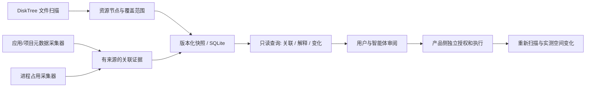

# DiskGraph 文件关联能力调研（2026-09-28）

## 结论与边界

DiskGraph 已有只读扫描、不可变快照、SQLite 持久化和查询入口，但还没有形成可回答“这个文件与哪个应用、项目或进程有关，依据是什么”的关联图。当前 `diskgraph-disktree` 写入目录树和分类提示，`evidence` 总是空的；`candidates` 需要显式 `Rebuildable` 证据，因此真实扫描后不会仅凭名字产生清理候选。这是合理的安全边界，应保留。

建议把 DiskGraph 定位为 **本地文件事实与关联证据索引**：扫描器观察资源，独立采集器提供有来源的关系，查询层展示关联和不确定性。PruneX 或其他产品负责交互、授权、执行与回收验证。文件路径、分类提示和置信度均不是删除许可。

## 四个参考项目的可借鉴机制

| 项目 | 源码中确认的机制 | 对 DiskGraph 的取舍 |
| --- | --- | --- |
| `research/disktree` | `crates/disktree-core/src/scan.rs` 并行扫描并记录错误、取消状态；`classify.rs` 根据目录名、父分类及兄弟项识别缓存或构建产物。 | 继续复用固定 Git 修订的只读扫描和尺寸事实；分类只作为提示。`target` 旁有 `Cargo.toml` 等上下文可形成“可能由项目生成”的待核实证据，不能直接推导可删除。不要调用其 `removal.rs`。 |
| `research/PureMac` | `AppPathFinder.swift` 使用 bundle ID、应用名、容器元数据、team ID 等多级匹配；`Conditions.swift` 提供针对碰撞的排除规则。 | 精确 bundle ID 和容器 metadata 可优先作为应用关联来源；名称包含匹配只能是低确定性的假设，必须展示匹配规则和反例。不要复制其清理执行或把应用关联等同于卸载清单。 |
| `research/mac-cleanup-sh` | `mac-cleanup` 用固定路径清单、`du` 估算和 `--dry-run`，默认路径可走 `rm -rf`、模拟器擦除等操作。 | 仅作目录类别与风险样本库：备份、归档、同步目录和活跃开发缓存的误删成本不同。不能引入脚本执行路径，也不能把 `dry-run` 估算写成保证可回收空间。 |
| `research/codegraph` | `src/db/schema.sql` 分开存节点、边、文件、索引和边的 `provenance`；`src/index.ts` 有增量同步和查询生命周期。 | 借鉴“节点—带来源的边—增量索引—解释查询”形态。DiskGraph 的文件身份、扫描覆盖、权限和时效性不同于源码符号解析，不能直接复用 CodeGraph 的 AST 或调用边语义。 |

以上四个本地参考仓库的 LICENSE 均为 MIT；若未来直接移植代码，需保留对应版权与许可声明。当前 DiskGraph 仅以 Git 依赖复用 DiskTree 核心，没有复制清理模块。

## 现有实现与关键缺口

| 已有能力 | 源码依据 | 尚缺的关联能力 |
| --- | --- | --- |
| 快照、目录树、尺寸、覆盖范围 | `diskgraph-core/src/model.rs`、`diskgraph-disktree/src/lib.rs` | 文件身份当前为路径字符串；Unix 路径经过 `to_string_lossy()`，非 UTF-8 名称可能碰撞。Windows `volume_id` 为空，跨快照增长查询不可用。 |
| 不可变事务写入、按父节点分页 | `diskgraph-store/src/lib.rs` | Schema v1 的证据只指向 `node_id`，`subject` 是自由文本；缺乏可查询的应用/项目/进程实体和文件到文件的带类型关系。`growth`、`candidates` 会加载整张图。 |
| `top`、`children`、`growth`、`explain`、`candidates` | `diskgraph-core/src/query.rs`、`diskgraph-ffi/src/lib.rs` | 没有“查某应用相关文件”“查某文件的所有上游依据”“按证据状态过滤”的查询。没有 CLI 或 MCP。 |
| 只读 Swift/Kotlin UniFFI 入口 | `diskgraph-ffi/src/lib.rs` | 生成源码不等于 XCFramework/AAR，也未验证产品集成；JSON 响应没有流式分页或大图查询预算。 |

`EvidenceEdge` 目前只有关系、自由文本 `subject`、`source`、采集时间和 0–100 置信度。生产关联至少需要 **来源规则/采集器版本、作用域、证据原文或摘要、观察时间、有效期或失效条件、确定/推断标记**。文件与实体的稳定身份应单独设计；快照内的递增 `node_id` 不能跨扫描复用。进程 PID 也不能脱离启动时间当作稳定身份。

## 建议的首个可验收增量

1. 在现有模型上定义版本化关系契约：资源节点、应用/项目/进程主体、关系类型和证据来源分开；保留 v1 读取能力，通过显式 SQLite 迁移加入新表和索引。准确关系与启发式关系必须可区分，冲突关系应并存并可解释，不自动裁决。
2. 先做 **macOS 本地目录 + 开发项目** 的只读关联：项目清单（如 `Cargo.toml`、`package.json`）到项目根目录，构建输出到所属项目；再做基于 bundle ID/容器 metadata 的应用关联。名字相似、公司名或 team ID 单独命中时标为假设，不产生 `Rebuildable` 证据。
3. 提供有界查询：`status`、`scan`、`related <path>`、`explain <path>`、`changed <snapshot-a> <snapshot-b>`。CLI 可先复用 Rust 核心；MCP 在关系精度和查询预算验证后接入。所有返回包含快照 ID、范围、时间、覆盖状态和证据来源。
4. 用临时目录与伪造元数据验证：同名应用冲突、符号链接、硬链接、非 UTF-8 文件名、权限拒绝、活跃进程、重命名、快照间元数据变化。缺失权限或不完整扫描必须返回“未知/不完整”，不能返回“没有关联”。

首版验收问题应是：“为什么认为此文件属于某项目或应用？依据何时采集？还可能属于谁？若扫描不完整，哪些结论不能下？” **不以清理掉多少 GB 作为图索引的验收指标。** 若将来加入推荐，仍须有明确可重建证据、无受保护或占用的后代、执行前重新验证，并用卷空闲空间的前后差额报告实测结果。

## 本次核查

在当前 macOS 工作区，`cargo test --workspace --locked` 的 9 个单元测试通过；`cargo fmt --all --check` 与 `cargo clippy --workspace --all-targets --locked -- -D warnings` 通过。这证明现有基线可构建，尚不证明关联采集器、跨平台真实扫描或产品级清理能力。
