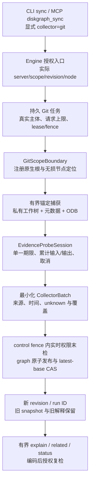

## Context

动机与完整范围见 [proposal](proposal.md)。源码基线 `a89e57a` 已包含 core/store/disktree/ffi 四 crate、v1 快照和五种只读查询；没有 CLI、MCP、远程身份或文件执行模块。当前扫描桥接的证据为空、文件身份未填充、路径存在有损转换，Windows 卷身份缺失。

本变更是整个产品路线的分阶段规划，不是一轮即可完成的实现。需求和验收以本目录 `specs/*/spec.md` 为唯一事实源；任务编号见 [tasks](tasks.md)，解释文档为 [架构](../../../docs/architecture.md)、[技术方案](../../../docs/technical-design.md)、[命令参考](../../../docs/command-reference.md)。

## Goals / Non-Goals

**Goals:**

- 独立安装的共享 Rust 引擎，同时服务 PruneX、CLI、本机与远程智能体。
- 版本化目录关系、准确覆盖和时效说明、有界查询与可量化效率收益。
- 丰富业务命令、三种 MCP 传输、一套权限与执行语义。
- 默认只读，可选启用经过批准和重验的操作，具备可审计的失败与恢复边界。
- 从一开始表达移动 URI 和受限能力，分阶段取得真实平台证据。

**Non-Goals:**

- 不构建通用远程 Shell、任意 SQL 控制台、自动提权或全盘无人确认删除器。
- 不让模型成为核心必需依赖，不训练/部署 PruneX Lite/Pro 模型，不建设云端多租户 SaaS。
- 不以图索引代替文件备份；不承诺永久删除恢复、全局文件系统事务或绝对无竞态。
- 不跨机器直接迁移文件，不在移动端承诺系统级清理或其他应用卸载。
- 2026-10-01 按批准计划实现加固代码，仅使用隔离数据库/文件夹具；不迁移真实数据、不清理用户磁盘、不安装宿主配置、不公开发布。

## Decisions

### D1 共享引擎与可选执行分离

core 定义模型/契约/端口，engine 提供查询与索引服务，ops 提供计划与执行；store、scanner、collectors 和平台实现通过端口接入。FFI、CLI、MCP 是并列组装入口，不能相互调用 Shell 或重复实现查询。对照 `PruneX ≈ disktree-app`、`DiskGraph 引擎 ≈ disktree-core`，但不声称功能完全一致。

替代：所有动作留在 PruneX 会使无 GUI 服务器无法独立完成授权后操作；把动作塞进 core/MCP 则扩大只读消费者依赖和风险。因此新增 ops，但按功能配置默认关闭。

### D2 复用 disktree-core，不将系统命令作为基础运行条件

维持固定 Git rev，经 diskgraph-disktree 适配上游类型；修改上游的需求有实际证据后才 fork/vendor，保留 MIT 来源和差异记录。基础枚举、元数据、卷信息、读取和文件操作由 Rust/平台 API 提供。Git、进程工具、Cargo、Docker 走可选适配器。

替代：直接复制十几个文件会接管扫描、安全与平台维护；调用 ls/du/find 会重复遍历并增加文本解析和部署差异。独立二进制交付不要求“零编译期依赖”。

### D3 身份、观察与授权不混用

使用 `ResourceRef(server_id, scope_id, revision_id, node_id)`；无损定位与展示路径分离，卷/file ID 辅助对齐但不作为永久 ID。服务端通过授权范围解析引用，路径或 ID 本身不是能力令牌。文件枚举按时间窗口观察，记录覆盖而非假定原子快照。

替代：路径字符串永久主键会遇到重命名、编码碰撞及挂载替换；全盘可信路径会让远程查询变成权限放大器。

### D4 文件快照、证据批次与查询 revision 分离

DiskSnapshot 描述文件观察，CollectorRun 记录方法、版本、覆盖和时效，GraphRevision 固定组合。关系端点有类型、证据可支持或反驳；变化发布新批次。高频进程观察不要求全盘重扫，保护撤销必须来自合法来源。

替代：单一 mutable 当前图不能重放批准依据；一个永久布尔 safe 字段无法表达时效和未知。

### D5 图数据与控制数据采用不同生命周期

Rust store 管理本机 `diskgraph.sqlite`（索引）和 `diskgraph-control.sqlite`（scope/策略、计划、批准、操作、恢复、审计）。两库无跨库原子承诺：操作计划保存必要证据与指纹，文件副作用前持久意图，执行后再刷新图。图索引是可重建的；控制数据必须备份和保留。

PruneX 的 `prunex.sqlite` 只持有会话、偏好、UI 状态和经验证的批准来源投影，不能作为服务器执行权威。SQLite 文件留在各自机器；远程只通过服务访问。

替代：把恢复表放进可整体删除的索引会造成数据丢失；只放 PruneX 数据库会使独立服务不能恢复。

### D6 v1 保留与显式 v2

数据库、公共 API、规则和协议分别版本化。迁移前备份和空间预检，失败保留旧库；旧程序拒绝新 schema。v1 字段和五查询的结果保持兼容，legacy 证据保留原语义。v2 用字符串表达不透明 ID/字节数等跨语言风险数值，未知不填零。

替代：原地改变数字类型或将历史文本自动升格为已验证关系，都会破坏消费者与安全判断。

### D7 丰富能力与精简展示可以并存

按命令参考实现 29 个命令族和稳定 DTO。MCP 支持完整 read/manage/write 工具组，默认可采用精简 explore/status/explain/changes；权限主体可发现并使用已启用的精确工具。原生 UI 直接使用同一服务。自然语言由宿主转成显式模式/定位，DiskGraph 不新增模型路由。

替代：只有一个模糊工具会损失脚本精确性；默认把所有管理/写工具暴露给所有主体又增加误选和攻击面。默认展示策略用 A/B 验证，不作为永久能力上限。

### D8 三种传输，共用一个服务与权限入口

Rust rmcp 作为 stdio 和 Streamable HTTP 的优先 SDK，HTTP 宿主采用可挂载的服务适配。旧版 HTTP+SSE 在 `legacy-sse` 可选适配模块或受控网关实现，默认关闭但属于交付范围。SDK/协议版本在实施时锁定并做目标客户端矩阵；现代 SSE 流不计作旧版兼容证明。

替代：为每种传输独立开发工具会产生安全分叉；锁死旧 SDK 只为旧传输会阻碍现代安全修复。兼容适配不得绕过统一授权。

### D9 网络身份与目录权限分开

HTTP 采用 MCP HTTP 授权兼容的 OAuth 资源服务器模式，授权服务外置；开发/专用部署可使用已认证的加密隧道，但仍需明确主体到 scope 的映射，不把代理可伪造头当身份。默认 loopback、显式监听、Origin 校验、TLS/隧道、限流与大小预算。stdio 绑定本机用户身份并仍执行 scope/策略检查。

替代：仅要求知道服务 URL 或持有一个全盘共享密钥不能满足细粒度资源和写操作授权。

### D10 计划、批准、执行是不同权限动作

动作命令默认创建计划；plan show/validate 提供审阅，apply 接受精确 plan ID、可信批准引用和幂等键。批准由受信宿主确认通道或管理员预配置的限域策略产生，绑定摘要、身份、预算和期限；MCP 不提供可由同一智能体自由调用的自我批准工具。不能仅凭 TTY 或 `--yes` 判定人类同意。

执行重验文件身份、目录成员边界、策略版本、源目标权限和活动风险。平台安全句柄/不跟随链接/不覆盖操作用于降低竞态；不满足前提则拒绝。普通路径 canonicalize 后再修改不是充分防护。

替代：裸 delete(path) 或模型传 approved=true 无法证明用户批准的对象与实际操作一致。

### D11 诚实的恢复与空间语义

同卷移动优先原子不覆盖；跨卷复制采用 staging、校验、发布后再删除源，并有独立的批准范围。回收使用可验证的系统回收后端或卷内受控隔离区，保存恢复条目。restore 的冲突要求重新计划；purge 独立批准且不可恢复。不承诺跨资源原子回滚。

替代：回收失败退化为删除会突破授权；同卷隔离不是释放磁盘。分别报告逻辑处理、回收区保留和卷空闲实测，注明共享块/快照/并发活动影响。

### D12 可靠作业与保守失败

扫描按 scope 租约合并；修改按资源冲突序列化。持久操作意图先于副作用，幂等键绑定主体和计划，断线重连查询原 operation。崩溃后逐项对账，无法确认的不可逆状态转 needs_attention，禁止盲重试。取消仅阻止后续步骤。

替代：依赖 MCP 连接状态或内存会话来判定操作结果，会在超时、重连和服务重启时造成重复删除。

### D13 内容读取、去重与生态清理分别授权

默认元数据索引可有界解析允许的项目清单，不读取任意文档。read 有字节范围与类型限制；duplicates 先元数据候选，再内容授权下核验，避免占位下载。Git 检查不默认 fetch；Cargo/Docker 的清理用精确对象和专用策略，缺依赖不降级为直接删除目录。

替代：索引时全盘哈希会提高 I/O 和泄露成本；Docker 数据库/卷目录不能用通用文件大小推导安全清理。

### D14 平台宿主能力而非假想统一路径

macOS/Linux/Windows 使用原生路径适配；Android 由 Kotlin SAF/适用 MediaStore 提交 URI 观察；iOS 由 Swift 管理安全作用域和文档协调。FFI 批量交付事实、后台作业和可取消句柄。SQLite bundled 与 GRDB/Room 链接和生命周期逐目标验证。

替代：URI 转假路径、统一 root 权限、把编译通过称为真机支持均不可接受。移动端只开放 provider 真正支持且经过验收的操作。

### D15 私有发行与证据分层

内部发行物按平台包含校验和、版本、许可证和能力表；签名、公证与包管理分发在相应阶段验证。至少两个真实智能体宿主、三种传输、目标 OS 和移动真机分别验收。模型成本不套用参考项目数字。

## Risks / Trade-offs

- [全产品计划过大] → P0–P10 分阶段，阶段门禁独立；未验收平台/动作保持 disabled，不能一次性勾选全部任务。
- [上游路径已损失编码] → P0 源码与 fixture 核验，P1 先修复扫描链路或明确拒绝有损修改；必要时提出有证据的补丁，不静默复制。
- [低权限无法完整观察进程] → 输出 partial/unknown；P5 所需执行前安全检查不等待 P7 的富展示采集器，未知阻断操作。
- [SQLite 与文件系统无法同事务] → 控制记录先记意图、逐项状态与对账；图延迟刷新明确显示，不宣称全局 exactly-once。
- [索引、暂存或回收区挤满磁盘] → 分预算、满盘注入、预留控制日志空间；不足停止，禁止自动 purge 用户数据。
- [远程路径和内容泄露] → 主体授权过滤先于聚合、最小导出、日志脱敏、反向代理身份防伪。
- [旧协议增加维护面] → 隔离适配、独立兼容测试与能力开关；停用需另经需求变更，不把困难当作已支持。
- [两套文档与规格漂移] → specs 唯一需求源，命令编号 C01–C29 与任务/阶段矩阵校验，同步更新解释文档。

## Migration Plan

| 阶段 | 依赖 | 交付与退出门禁 |
| --- | --- | --- |
| P0 基线与契约 | 无 | 重跑既有测试；锁定 v1 fixture、能力模型、威胁模型和 ADR；不改用户数据 |
| P1 快照与存储 | P0 | 无损扫描、v2/控制库迁移、容量与恢复；旧接口回归 |
| P2 查询与 CLI | P1 | 项目证据、历史、有界查询和首批 CLI；未索引/未知不误导 |
| P3 本地智能体 | P2 | stdio、配置安装、私有 macOS 包、至少两个宿主与效率基线 |
| P4 远程只读服务 | P3 | Linux 服务、身份/范围、Streamable HTTP、旧 HTTP+SSE 兼容及断线测试 |
| P5 可恢复执行 | P4 | 计划/批准、控制日志、同卷移动/回收/恢复；安全与故障门禁 |
| P6 高风险及专业动作 | P5 | 跨卷复制/移动、purge、Cargo/Docker 精确计划；全链路测量 |
| P7 内容与桌面增强 | P2；写验证另需 P5/P6 | read/duplicates、应用/进程证据、watch、Windows 实机；不阻塞早期只读包 |
| P8 PruneX 嵌入 | P3；写 UI 另需 P5 | XCFramework、Swift/Kotlin/AgentScope、Rust 双库与 PruneX 业务库共存、受信批准通道 |
| P9 移动受限能力 | P8 | Android NDK/AAR/SAF、iOS 文档真机；P0 即预留 URI 类型，不等到此时改模型 |
| P10 完整私有交付 | P6/P7/P9 | 29 命令矩阵、三传输、平台安全门禁、性能/效率、升级/回退与支持矩阵 |

P4 将 Linux 服务器验证前置，是为了覆盖新确认的远程清理场景；移动契约仍从 P0 设计。P7/P8 可在各自依赖满足后并行实施，不等于授权当前启动多智能体或执行代码。

每个阶段先在专用 fixture/测试卷实施，随后只读试运行，再显式启用已验收动作。升级先备份两类数据库并冻结写作业；图库失败可恢复备份，控制库恢复必须先与文件系统对账，不能把回退数据库当成撤销已发生操作。旧版不能读取新库时使用备份实例或只读导出，不对正式库自动降级。

## Open Questions

- 已决定保留三种传输；实施时选择的 rmcp 精确版本、旧版适配依赖和客户端版本矩阵通过 P0/P4 spike 固定，不改变范围与授权要求。
- 采集器 TTL、默认索引/回收预算和查询时限由 P2/P7 的代表性基准校准；必须有上限，具体数值不作为未经实测的性能承诺。
- macOS 签名身份、Windows 签名资源及移动测试设备在打包阶段选定；缺少它们时只标对应验收未完成，不将编译替代实机证据。

### D13 2026-10-01 安全与性能加固

SC-06、CT-05、Q-08、RT-06/07、OP-10、ST-05 为本轮验收依据。请求上下文与共享 Engine 分离，token 能力只缩小实时数据库授权；revision 归属由持久记录确定。读连接独立，写连接串行；Unicode 规范化字段及搜索 keyset 游标保持既有语义。有序历史 merge 与按层树返回明确局部结果，SQL 超时也不得报告完整统计。

扫描保持 vendor pin，以既有 progress/cancel 每 20 ms 合作止损；staging 按实际编码计费、批次写入、SQL 发布。30 秒租约/5 秒续租及递增 fencing 贯穿写阶段。runner 严格认领，同名 owner 不复用尚未过期执行；取消标志按认领代次隔离，过期 owner 不能取消或清理新代次状态。目录/文件句柄与原子 no-replace 发布约束操作，复制在独占 staging 校验摘要与元数据，验证条件不足即拒绝。危险对外文件工具保持关闭。

取舍与限制：扫描仍先收集完整上游树，不承诺流式扫描或严格内存上限；规范化字段/索引及实时门禁增加扫描和物理数据库成本，收益主要是窄读和并发查询。旧操作引用无法精确到 revision 时保留整个 scope，逻辑 prune 不等于 SQLite 文件压缩。Linux/Windows、移动 provider 与真实宿主能力不以 macOS 夹具测试替代。完整证据见仓库双语加固记录及 benchmark JSON。

图库 schema 9 为不可变快照增加节点总数、目录总数/未知数、按不同 subtree_bytes 的降序累计计数。save、可信 publish 与 staging publish 在原发布事务内共用 SQL 聚合；v8 升级在一致性备份后事务回填，删除随 snapshot 外键级联。snapshot 的 writer 标记与 INSERT trigger 拒绝升级后仍打开的旧 writer；查询发现计数元数据缺失时 fail-closed，不能将缺失当成空快照。任意 minimum 的树计数仍包含未知大小节点的现有数值字段，children 的 known/unknown 谓词与 partial index 共用旧 JSON fallback。计数为索引探针；显式 OFFSET 页仍需 O(offset+page) 跳读。聚合与额外排序索引增加 O(N) 存储及发布/迁移耗时，并延长发布的控制库 fencing 锁；release 数据记录完整发布阶段而非精确持锁增量，1 ms 采样空间峰值不是上界。已有授权按完整 principal/permission/scope/policy_version 键只读返回，新增授权仍 INSERT ON CONFLICT；撤权 epoch 语义不变，避免只读 CLI 初始化重复授权写入。

### D14 Windows 本地普通文件内容句柄

15.11 保留 read/digest 的 wire 字段与 Unix 行为，将 Windows 获取步骤放入私有平台模块。路径规划只接受本地绝对 drive 路径与注册根下的原始组件，不用 canonicalize 跟随客户端路径；ADS、父级跳转、UNC/设备命名空间和过长路径明确拒绝。先持有 drive 根，再用 NtCreateFile 的 RootDirectory 逐个组件打开，禁止 reparse，并保留目录句柄直到检查结束。

当前线程通过 RAII 暴露占位属性，先只请求 FILE_READ_ATTRIBUTES，再检查文件类型及 reparse/offline/recall 属性，最后才对同一被持有父目录下的普通文件请求 FILE_READ_DATA。属性访问不冻结新 writer，获取期间的改变必须在申请数据前以 Conflict 拒绝；读取时的数据句柄仅共享读取，常规 writer/删除冲突。完整 128 位文件 ID、64 位卷 ID、长度及原生写入/变更时间检查结果是否稳定，不能用截断 ID 或路径重开代替；100ns 是表示单位，不保证各文件系统的实际精度或单调版本。局部模块分别拥有路径规划、原生状态、目录租约和跨平台内容准备，入口不新增业务类型堆积。

共享限制不是对内核/filter 或已有 writable mapping 的普遍冻结；版本检查也不是原子内容快照。FILE_OPEN_NO_RECALL 约束打开步骤，不能据此保证任意真实云 provider 的后续读取无下载。线程模式只覆盖调用线程，不能代表上游 scanner 的所有 worker；动态解析该可选 API，缺导出时返回 Unsupported，避免新增静态导入导致旧宿主 loader 失败。取消/期限在同步获取后及块之间检查，不抢占内核打开/读取。Windows 普通文件与属性/junction 夹具必须在实际原生 CI 通过，真实 provider、Linux 占位保护、写操作保真及移动端继续由 15.2–15.6 单独验收。

### D16 Engine 源码与状态边界

15.12 按 RT-09 整改整个 Engine crate：入口只声明及明确导出，对象含私有记录/trait/alias 每文件一个，生产文件少于 500 行，真实行为按 scope、policy、authorization、jobs、scan execution、retention、revision/history/tree、capacity 等责任组织。保留唯一 Engine 的连接、Mutex、取消/进度状态；既有 public content/live_evidence/verify 路径通过声明与重导出保留，对应类型、真实实现及测试分别归档。原生实现标注实际 Rust 来源，不虚构 Java 对应；每个 pub 方法说明中文用途、参数与返回。

结构迁移不抽新的 Service/Repository owner，不统一不同语义的时钟，也不添加授权或改变可信兼容入口的错误行为。graph→control 持锁顺序、已有 control guard 上的 require_with_control、发布后 collector 的独立结果、每 fence 的新取消 Arc、keeper/ProgressGuard 作用域及 ptr_eq 清理按原方法体保留。必要字段/helper 限于 pub(super) 或同等祖先范围的原 crate 协作权限；子模块迁移后的 crate 内重导出不得新增外部可调用通道。

先以 AST 门禁复现入口/多类型/行数/文档违例，再迁移并复核公开路径、类型/签名/Default/序列化及方法体。结构检查不证明并发授权安全；原行为测试、release 协议与同 SHA 三桌面系统/宿主/制品门禁仍必须实际运行。完成该增量不能替代原生写、真实 provider、移动和生产环境验收。

### D17 实时探针的原生身份、覆盖与执行边界

EV-06 的占用证据首先保留原生路径身份：按 NUL 字段的字节标签解析，不对首字符做 UTF-8 字节切割；查询键保留原生路径字节，只有可确认的 ASCII 显示字段才精确匹配；lsof 的 NUL 模式仍可能转义名称，带反斜杠/caret、控制/非 ASCII 字节或 deleted 标记的字段不猜测解码/归一，保持 partial/unknown。其他平台无法无损表示查询键时拒绝。格式、PID、上下文或终止符不足时保留 unknown，不返回完整空样本。可见句柄本身是正向观察，但外部 lsof 成功退出不能证明系统权限范围或 PID 启动身份，因此普通兼容入口报告 partial。空请求没有观察对象，继续保留原有空请求行为。

解析与覆盖子项不等于 EC-04 的执行边界完成。后续 runner 必须同时排空 stdout/stderr，共用绝对期限、累计输出与取消预算，在全部失败路径清理本次采样资源。Unix 进程组仅约束未自行脱离的后代；Windows 必须在执行前建立 Job/继承句柄边界，不能以 spawn 后分配补偿竞态。异步 I/O 的取消与最终释放需要对应原生环境验收，不宣称内核 I/O 的严格墙钟上界。

Git 尚无 HEAD 时仍需报告实际修改，预算/I/O/格式失败不得被解释为无 HEAD/upstream。仓库的 clean/process filter、fsmonitor 等可以让 status 启动外部程序；仅使用固定 Git 子命令或在执行前读取一次配置不能解决竞态。实现须采用受限不可变配置边界或显式拒绝，并以隔离哨兵证明不执行外部程序/不联网/不产生可选索引写入。支持的 Git 版本、特殊仓库配置和未验收平台分别记录，不能借用本机新版 Git 的结果。

### D18 探针的共享资源执行器

15.13b 在 Engine 内建立私有执行器，避免 Engine→Ops→Engine 循环依赖；原有两个采样函数作为默认 15 秒/1 MiB 兼容入口，新增带期限、累计输出与取消配置的入口。每次采样持有独立预算，Git 多个命令复用同一绝对期限和两管道累计字节；任何资源失败立即终止，不由 `.ok()` 降级为无 HEAD/upstream。默认值不是生产 SLA，缓冲和输出有界不代表全部探针内存或内核 I/O 可被硬抢占。

Unix 使用本次子进程的独立进程组与非阻塞管道，轮询两管道及进程状态；WNOWAIT 保留 leader 身份至清理和回收完成。仍存活的 leader 即使离开原组也按自有 PID 终止，不追随新 PGID；主动 setsid 逃离的后代不在组约束内。Darwin 对仅 zombie 的组返回 EPERM 时，最多 50 ms 重试，最终要求全部 SZOMB、leader 父身份及两次完整成员集合一致，未知/变化仍失败；退出过渡本身不等于已退出。Windows 10+ 使用原生 CreateProcessW 的 JOB_LIST/HANDLE_LIST 原子绑定 KILL_ON_JOB_CLOSE Job 和三个标准句柄，禁用 breakaway；不以运行后 Assign 或缺能力 fallback 代替。父读端是自有 overlapped named pipe，每条固定缓冲与 OVERLAPPED 地址稳定，CancelIoEx 后等待最终完成再释放。终止 Job 后保留句柄，最多观察 1 秒以确认 ActiveProcesses 为零；查询失败或实际非零超期明确返回清理失败；用户 HANDLE 本身不是失败原因，不假设它必然维持非零计数。关闭 Job 提供 KILL 后备；leader 等待及自有 pending I/O 最终完成不受这一秒硬限，安全清理可能超过协作采样期限；平台行为必须在对应 CI 执行真实后代/管道与并发回归。

成功要求正常进程退出状态、stdout/stderr EOF 和末段期限/取消同时有效；信号死亡或 Windows 高位异常状态不得降级成无 HEAD/upstream。恰好耗尽字节预算仍以固定小缓冲检查 EOF，多一个字节即拒绝完整结果。stderr 同样扣预算，不因解析器未消费它而忽略。Windows 零字节成功读取不等于 EOF，意外 abort 是业务失败，仅本 owner 的清理取消可作已终止 I/O。显式清理必须保留主错误及次级清理诊断，Drop 仅作兜底。Windows 兼容入口明确要求绝对项目目录和受信 .exe，不能宣称全部旧平台行为相同。该资源子项不关闭 Git 配置、执行 filter、离线/只读保证、unborn 或引用格式语义；父项 15.13 和 8.7 继续单独验收。

### D19 — Git 可观察语义

15.13c 使用同一受限执行器与整次预算，但不声称已隔离仓库配置。采样要求 Git 2.46 或更新版本，利用 show-ref --exists 的 0/2/1 明确区分存在、缺失和查询错误；不兼容工具明确拒绝。symbolic-ref --no-recurse 保留 HEAD 的直接目标，只有直接本地分支明确不存在时才表示 unborn；已存在的悬空 symbolic branch、损坏引用、非 commit 对象、执行错误与格式错误不能降级。状态采用 porcelain v1 -z 与 untracked-files=all，按原生 NUL 记录计数，rename/copy 的第二路径不额外计数。

stash list 即使成功也可能跳过坏 reflog 或缺失旧 commit。stash 存在时完整计数仅支持 Git 明确报告的 files 引用后端，由 rev-parse --path-format=absolute --git-common-dir 定位 Git metadata common 根，再追加固定 logs/refs/stash，保留 linked worktree 共享语义。不能直接 canonicalize 完整日志路径，否则 leaf/日志目录链接已在 nofollow 之前被解析；metadata common 根自身由 Git 定位并不构成 scope 或配置隔离认证。读取在同一整次期限/取消/累计字节预算内完成，拒绝固定日志路径中的链接/reparse/非普通文件及无法无损解释的路径。校验固定 old/new OID 前缀与 committer/timestamp/timezone 格式，每个留存 new OID 必须是 commit；记录反序与固定 %H 列表逐条核对，不以集合去重。drop、无 rewrite 删除及 expire 的合法语义不要求 old/new 连续、old 对象仍存在或消息非空，有效 tip 与合法空日志或明确缺日志可计零。末段复核 tip 与日志身份/版本及完整内容，变化拒绝；reftable 或未确认日志明确拒绝，不从工具空成功推断完整。该读取及复核不提供原子 Git 快照或配置隔离保证。

upstream 从当前分支的 for-each-ref 固定 NUL 格式解析；没有可解析跟踪映射或本地跟踪引用缺失都保持 unknown，并分别说明原因，不能声称已推送。已存在但损坏/缺对象的引用报错。比较只传校验后的完整 OID 范围，提交数量必须是完整十进制 u64，格式/溢出错误传播。采样末段重新读取 HEAD/分支，变化时拒绝混合结果；这只是检测，不是原子 Git 快照。特殊 Git 配置、filter、懒取对象、可选 index 写入及不可变配置边界继续由 8.7/15.13 验收，语义子项不能关闭完整生产门禁。

### D20 — Git 私有配置和元数据视图

15.13d 首先建立本次采样独占的私有 bootstrap 与预算，再进行准备。全部工具调用固定关闭 pager、懒取与 optional locks，清空继承的 Git/loader/trace 环境；解析复制配置时显式使用私有目录、空 system/global 文件及 `config --file --no-includes --null --list`，只把配置当数据。不能在原仓库调用 `rev-parse --shared-index-path`：真实夹具已经证明它会执行 fsmonitor、刷新 shared index 时间，即使 no-lazy-fetch/no-optional-locks 也无效。其他 metadata plumbing 的安全性限定到固定参数和格式，不把默认 for-each-ref 等会解析对象的形式泛化为安全。

工具只从绝对 PATH 目录解析一次并固定绝对程序路径，私有准备和源工作树采样不得重新选择程序。目录租约仅存活于单次 no-follow 捕获/枚举，历史记录保存身份、完整版本、祖先身份和名单；最终复核重新打开，避免目录数量累积 FD/HANDLE。原生名称名单未命中时必须查证实际路径，大小写或其他别名不能被报告为缺失；无法可靠映射时明确 Unsupported。准备和公开终态显式清理私有目录，主错误与次级清理诊断均保留，清理后再次核验预算，Drop 只兜底。

由原生有界读取捕获 `.git`/gitfile/commondir、config、index、HEAD、loose/packed refs、stash 日志、shallow 与必要属性/忽略文件，拒绝链接、非普通文件、不可核验版本和超限输入。linked worktree 的 HEAD/index 与 common 根的 refs/logs/objects 分别解析，私有视图不能保留指向原元数据的 commondir/config/index/refs/reflog。元数据身份、版本和字节在末段复核，变化报错；这不是原子仓库快照。复制 index 后恢复并读回确认原高精度 mtime；较新的复制时间会改变 Git racy-index 内容复核，已在同长度改写并恢复文件 mtime 的夹具中真实产生假 clean。零时间会关闭该判定，不能作为安全备选；精度无法保真必须拒绝或另验保守重验。

配置生成采取类型校验的 allowlist，保留 filemode、ignorecase、symlinks、autocrlf/eol、必要属性/忽略/rename 与 branch/upstream 映射等状态语义；不复制外部命令、URL、helper、hook 或 pager。不能简单关闭 filter 后把透传内容当正常状态：初版可明确拒绝外部 clean/process driver；支持未使用 driver 时须以无执行命令的 required 失败兜底，另验属性替换/宏展开竞态。include/includeIf、split/sparse index、gitlink 子模块、reftable、partial/promisor、replace/grafts 和未知扩展在没有等价实现时明确 Unsupported；这些支持边界不表示永远删除相关能力，也不能把所有 Git 仓库关闭后宣称完成。普通 files/SHA-1/SHA-256/full-index、linked worktree 与 shallow 的兼容性分别通过实际差分验收。

执行时只使用私有 git-dir/index/refs/shallow/config，原 worktree 作为实时数据读取。源对象库只读借用可以降低整 pack 复制成本，但 alternate 会递归读取源 info/alternates；若采用该方案，不能宣称对象访问范围仅限原 ODB、对象快照不可变或对象输入严格有界。严格文件访问范围需要额外的扁平 ODB 视图或原生隔离能力，不能由一次预检查证明。接上源对象库后禁止写对象 plumbing，避免源对象时间刷新；所有来源元数据和对象时间、lock 文件以只读哨兵核验。

源 ODB 借用已在隔离公共库夹具复现跨目录及未计费输入，不再作为 D20 的最终实现。后续执行视图改为有界私有扁平 ODB：原生 no-follow 捕获安全十六进制 loose 路径及普通配对 `.pack/.idx`，保留 SHA-1/SHA-256、linked 与 shallow 的必要语义，明确拒绝 alternates/promisor 及不可核验路径，不复制可引入额外路径的 info 文件。源对象捕获、复制和最终内容/身份/版本复核与既有元数据共用 64 MiB/32k 累计额度及整次期限/取消；私有副本走同一 128 MiB 对象报告分配、64 MiB 卷余量 owner。Git 不持有源 ODB 目录引用，准备后的新增 alternate 因而不能成为工具输入。不得硬链接复制：nlink/ctime 会改变源对象。原始数据读取、复制和内容比较随捕获对象字节线性增加，另有目录枚举、排序、原生路径解析和记账成本；累计预算包括两次读取，大型 pack 会明确超限；既有公开 ProbeLimits 签名不变，不宣称适用于任意大小仓库、原子快照或严格 RSS。

准备、采样和终态复核共用唯一绝对期限及取消，分别明确管道/原始输入累计字节、元数据条目和临时容量上限；限制不是全部 Git RSS 或内核调度上界。先把已复现的 fsmonitor/filter/懒取/shared-index/racy-index 探针转为回归，再实现视图、运行普通状态差分与失败清理，独立复审及同源码三桌面原生 CI 后验收。15.13c 的语义测试和已有只读包 CI 都不能替代该边界，父项 15.13、8.7 与全平台其余能力继续未完成。

初始实现差距（011fe7f 阶段，不降低以上验收要求）：宿主系统 config 的编译时路径由固定 `config --system --no-includes --show-origin --show-scope --null --get-regexp '^'` 首次发现，此次 Git 读取只有共享期限、取消和管道输出额度，没有读取前的原生原始输入/RSS 上限。发现后才对唯一原始来源有界捕获、解析副本和终态复核。64 MiB/32k 元数据额度当时仅约束累计输入与复制内容，没有实际分配磁盘空间或卷剩余容量门禁。后续以固定 printer 发现、原生捕获及独立容量账本收敛，实际验证状态保留在 tasks 与双语验收记录，不能把设计视为完成。单次路径解析仍临时占用 O(depth) 句柄，源 ODB 的递归 alternates 仍不是严格输入/访问范围上限；未执行的原生平台测试阻止勾选 15.13d。

后续实现依据：Git 2.46 的 `config --system --edit` 在 `GIT_CONFIG_NOSYSTEM=1`、空私有 global/repository 配置及固定 `GIT_EDITOR="printf '%s\\0'"` 下，仅计算并规范化目标路径，system 分支不创建/读取该文件，编辑器不回读内容。Git 通过自己的受信 shell 固定调用 printf，并以独立 argv 传目标，不拼接路径为代码。该内部发现接口须以 FIFO/include/缺失文件/空格及 shell 元字符路径真实验收，严格解析单条 NUL 路径，首次内容读取改为原生捕获；不得借用未知编辑器或放开源配置。此能力依赖受信 Git 发行包及其 shell，PATH 仅保留受信绝对目录；输出为宿主物理路径，终态重发现检测别名重定向，source 仓库元数据仍执行 no-follow。跨系统实际测试前不得泛称可用。

私有容量新增每样本默认 128 MiB 对象原生报告分配额度及 64 MiB 卷可用余量，分别约束原始输入、对象分配和可用空间，不新增 ProbeLimits 公开字段。创建/写入前读取实际 available，写后增量更新叶及父目录分配（避免每次全树扫描），末段一次遍历核验所有已登记项；未知项/类型/身份/分配或原生容量查询失败拒绝。Unix blocks 与 Windows AllocationSize 只代表对象报告的分配，压缩/resident/sparse、日志及卷全局元数据未必归于对象；不能称严格总物理硬限、空间预留或外部抢占保护。

容量与内容版本分开复核：普通文件记录完整原生身份、长度和不含访问时间的高精度版本，只有 owner 写入或设置 index 时间后更新水位；Git 读取期间的同长度/同分配原地修改也必须拒绝。清理前确认账本的根身份，拒绝删除替换来的陌生根并保留主/次诊断。这是可信宿主临时路径上的变化检测，身份预查与按路径删除并非原子操作；旧兼容缺失路径只能表示该路径已消失，不能证明被重命名到其他位置的 owner 对象已清除，也不承诺抵抗同权限进程的全部交换竞态。

Windows 工具表示与原生身份路径分开：Git for Windows 2.55.0.windows.5 的真实 CI 在配置读取时拒绝 `\\?\C:\…`，`worktree add` 也报告 `//?/C:/…` 为无效路径。Git 工具环境、工作目录、`config --file`、私有属性/忽略配置及 alternates 经同一词法适配；仅对本地 drive 的无歧义名称移除 verbatim 前缀，原生 no-follow/身份路径保持不变。拒绝 UNC/设备命名空间、点步、ADS、尾点/尾空格、保留设备名、无法表示的编码及普通工具路径超过 259 UTF-16 单元；不关闭 protectNTFS、不继承宿主 Git 配置。原生夹具比较适配前后同一文件身份、实际配置与 printer 输出，普通/linked 仓库回归通过后才有 Windows 支持证据。词法验证本机通过不等于 Windows 原生验收。

宿主 shell PATH 是搜索目录列表，不替代实际执行路径的身份边界。固定 Git 程序仍先从受信绝对目录解析一次；shell PATH 仅捕获可安全表示的绝对项，不把无关且不可表示的项带入 child 或据此拒绝已定位程序。每项仍执行整次取消/期限检查；SystemRoot、worktree 和私有目录/文件依旧严格拒绝不可保真输入，缺少实际 shell 时传播启动错误。构造与 spawn 的分段诊断不输出整个宿主环境；原生测试记录被排除的 PATH 路径与具体阶段，以区分列表兼容问题和实际身份拒绝。

源 metadata 哨兵的夹具准备必须在取水位前结束自己的后台写入。Git 2.55 的 commit 会启动自动维护，默认允许 detach；维护持有 `objects/maintenance.lock` 并在后台结束后删除它。夹具通过每次准备命令的固定 `-c maintenance.auto=false` 在首个 commit 前阻止此后台任务，Trace2 回归确认实际 commit 已执行且没有启动 maintenance child。此设置仅约束临时夹具，不改变生产采样策略；完整路径名单、字节、mtime 与数量断言继续保留，原生 CI 仍须验证 SHA256 语义及源哨兵。

Git for Windows v2.55.0.windows.5 的 `core.fscache` 属于明确的布尔配置，原值依宿主/仓库的捕获顺序回放。官方 `compat/mingw.c` 通过布尔解析器处理，`compat/win32/fscache.c` 只实现每个 Git 子进程内的只读目录/stat 缓存，不调用配置程序或写回源元数据；启用期间不会反映其后工作树变化。支持此字段不得泛放未知 core 字段、fsmonitor 或 driver，不构成原子状态或严格 RSS 保证。类型/覆盖顺序、真实 dirty/stash/upstream 与跨次独立采样的缓存释放均须回归；本机 Git 能证明字段回放，缓存行为仍需 Windows 原生验收。

原生同名程序验收的编译阶段位于工作树外的专属父级目录，只复制指定可执行文件到工作树，不假定 Rust/原生 linker 只输出一个文件。取源元数据水位前，用已固定的受信绝对 Git 执行真实 NUL status，要求唯一精确未跟踪项；非预期项输出实际路径诊断并拒绝夹具。之后的工作目录搜索正控制、marker、精确 dirty 数、独立 child 完成和源水位断言保持不变。这只修正验收夹具，不改变生产工具解析和私有视图策略。

### D21 Ops 源码与副作用边界

OP-14 延续已经完成的 Store 与 Engine 结构约束，整改完整 Ops crate，而不只移动入口中的测试。当前入口 2406 行、specialist 生产段约 641 行，docker 虽生产段不足 500 行却包含多个独立对象；三者一起纳入源结构门禁。每个真实对象独立文件，函数按授权、摘要、路径编码、实时重验、容量、操作查询和刷新职责组织；specialist/docker 保留旧公开模块路径和精确根重导出。

PlanBuilder 保持原有全部行为与批准顺序。Executor 仍是唯一执行状态 owner，其既有方法按 apply、validation、perform、transfer、paths 分为实际 impl 模块，不新增 facade service、线程、锁、事务或接口。CrossVolumeCopy 保持互斥平台实现、两个 Mutex、句柄和批准 Metadata 所有权，stage/publish/discard 顺序不变，不通过自动 Drop 改变 NeedsAttention 或失败清理时序。相邻私有模块所需的可见性只扩大至 crate 内，不变为公共 API。

实现先记录公开导出、类型和方法体基线，再使 AST 结构门禁真实失败，拆分后对照规范化源码与已有安全/并发/恢复测试。中文注释使用实际 Rust 来源，不虚构 Java 类型；不借本次整理改造 specialist runner 或启用危险工具。全 workspace 与同 SHA 原生 CI 验收后才能完成结构子项，其余平台写操作、provider 和移动端门禁保持独立。

### D22 操作计划的有期限窄读

OP-15 是 OP-14 结构整理后的行为优化，不回溯更改 D21 的方法体保留结论。当前 PlanBuilder 为少量选择加载完整 revision，并对每个 ID 线性查找；本增量改为按原选择顺序复用已有授权 reader 精确查询。保留 `authorize_revision(Some(scope))` 的真实归属断言，`with_authorized_revision_reader` 在读取后再次检查实时元数据授权；同一 1000 ms 元数据期限从 revision 解析前开始，在每项读取/原路径解析和最终授权后检查。期限失败拒绝整份计划，不截断为可批准的部分计划。每个 ID 的读取→原生路径→live stat 顺序保持，后续 source evidence、重叠处理、摘要、批准和持久化顺序不改。

窄读依赖的 NodeRow 改为 fallible SQLite 列解码；合法 NULL 仍为 Option，kind=NULL 的旧 JSON/未知大小行为不变，字段类型错误不再默认为 0/空值。本阶段不增加跨文件系统长事务，固定不可变 revision/snapshot；并发历史回收或损坏导致明确失败，不宣称多语句原子快照。查找与节点分配不再随完整 revision 大小增长，但 source evidence 的实际读取、drop_nested 的 M² 比较、数据库打开/授权、同步 stat 和锁等待分别具有自身成本，不将局部优化宣传为全计划 O(M)、严格墙钟或 RSS 上限。以损坏未选行/选中行、旧行和未知大小、范围/错误顺序夹具先红后绿，再作同一隔离数据上的 release 前后测量及原生 CI。公开危险工具与未验收写平台仍关闭。

### D23 关系查询的完整请求预算

Q-02/08/09 的下一增量延续一个共享 Engine 和独立只读连接。请求局部绝对期限在最外层查询解析/首次授权前生成，贯穿真实 revision 归属、连接、数据读取、envelope 和末段授权；新的内部 until 路径传递同一 Instant，旧公开签名仍作为兼容包装。原有通用授权 reader 的 1–1000 ms 契约保留，不能将该私有限制静默施加给原本接受更大 deadline 的 typed QueryBudget。期限生成/字节相加使用 checked 运算，不允许溢出、重复计时或空结果绕过。同步控制锁、SQLite busy 与文件系统调用仍只能协作检查，不能宣称硬实时抢占。

数据后使用实际 scope 和同一 control guard 检查撤销与现有授权交集，不在 guard 内重入 policy 构造或增加新 owner、线程、事务及图写锁。授权失败拒绝数据；授权成功但返回前过期时，以现有结果形态保留有界前缀并报告 Deadline，不能容纳最小诊断则明确预算错误。consumer 的真实格式/存储错误保持原有传播。CLI、MCP 和 NativeService 对相同预算维持语义；旧 FFI 的 partial 报错与 session 的 partial 输出分别保持，UniFFI 导出路径、签名和文档校验元数据不借本次改动迁移。

证据、实体、选中节点与 impact 邻接页先对 SQLite 借用原始字段计费，再分配 Rust 拥有对象/解码；lookahead 只探存在。此约束不覆盖 SQLite 内部 JSON 求值或页缓存，不能用 SQL 丢弃大证据后将保护/占用判断标为完整。impact 的入/出边、重复和不传播项按实际解码累计；候选的节点及必需证据原子计费后才更新选中字节、缺口和重叠集合。不足时保持此前完整前缀，未知与保护条件仍保守处理。

有限计数 writer 按实际 Serialize 编码计算控制字符、引号/反斜杠、Unicode、键和分隔符成本，避免先生成巨大的完整 Vec。可以保守预留固定 envelope 余量后做最终精确验证，并明确可能提早截断；不能由适配器盲删候选而忘记重算 selected/remaining。查询数据/诊断 envelope 与外层 tools/call 文本、HTTP/SSE 传输分别有自己的预算，不把 64 KiB 查询保证称为 4 MiB 传输漏洞修复。

实施前把已复现的四种行为转为回归：40 ms 授权延迟下 1 ms 预算仍 complete（含零目标/空 impact）；max_edges=1 的候选返回两条证据；100,108 字节且 confidence=300 的证据在门禁前发生解码错误；含 11,000 NUL 的 impact 数据编码为 66,126 字节仍未截断。终态撤权/实际控制锁等待用确定性、仅 test 的读后同步点，不能在 Authorizer::decide 内重入控制锁。补精确上限/超一字节、累计短证据、坏 lookahead、Unicode/旧行与保护后代，实际 MCP/FFI envelope 及三桌面原生验收。已有 /tmp 探针是隔离公共库或重建数据 JSON，不能被描述为真实 socket 或远程写入数据能力的证明。

### D24 树、历史与内容读取的终态边界

隔离公共 API 探针在 c67d22a 实际复现：树查询的首次授权等待 1100 ms 后，默认 1000 ms 期限仍完整成功；无持久策略的通用授权 reader 在最后 authorizer 回调通过第二 ControlStore 撤销 scope 后仍返回数据；read_bounded 在最后字节额度分支已取消却没有 stopped 诊断；历史报告在一字节预算下仍成功返回约 692 字节。真实 CLI compare 的默认 65536 字节额度下 data 达 65874 字节，完整 stdout 达 66013 字节，且外层 truncated=false。这些证据分别属于库调用和 CLI 进程，不能替代未执行的 MCP socket 终态验收。

树、比较、changes 与 growth 继承最外层解析前生成的单一绝对期限。新增 until 内部路径保留旧可信公开签名；通用授权 reader 的 1–1000 ms 原契约不变。双侧历史分别解析真实 revision 归属，scope 只是断言；数据及实际编码完成后对两侧做实时末检，复用已有控制 guard。所有请求能力回调结束后，还须对双方进行不调用外部授权器的持久 scope/授权交集复检，避免第二侧回调撤销第一侧后返回数据。该复检不承诺跨连接原子快照。已撤权拒绝任何数据；过期不能成为完整成功，无法在期限内确认归属时 fail closed。HTML 树导出须在内容生成后、写文件前执行末检。不得增加共享请求状态、新 owner、后台线程、跨文件系统事务或新的控制锁重入。

树和历史的有限 JSON writer 计入实际转义、报告头、计数、键、分隔符和诊断，适配器预留 envelope 后再次精确验证。不容纳最小报告/诊断时返回预算错误。合并历史按实际双侧解码节点计费，预算耗尽后的探针只检查是否存在，不预解码下一行；部分统计不能标为完整。原始字段分配前额度和最终编码额度分别记录，不能重复扣除为同一额度，也不能据此声称 SQLite 页缓存、RSS 或同步等待有硬上限。

read_bounded 在 EOF、精确额度和最终身份检查之后再次检查实际 scope、内容授权交集和取消；授权失败不得返回正文，取消保持实际读取成本并标明停止。正文原接口没有期限参数，本次兼容包装建立 30 秒协作期限，不把它写成原有或硬实时保证；有期限路径须继承调用方同一个 Instant，不在最后阶段重置。已有 digest 终态与 Windows 原生租约保证保持。先添加真实失败回归，再实现、非作者复审并执行同源码原生门禁；provider/no-hydration、原生写和移动设备仍由未完成父项验收。

### D25 旧原生 growth 入口收口

旧 growth_json 仍通过只做初始授权的 open_store 读取两份 snapshot，未共享数据预算、编码额度及双侧末检。保留 UniFFI 根导出和旧 JSON 形态，真实逻辑移至私有 native_growth 模块；在解析 locator/打开 Engine 前建立默认绝对期限，经实际 snapshot→revision 映射授权后使用一个独立 reader 与 QueryReadBudget。精确 locator 读取复用 Store 借用列准入逻辑，两个元数据/节点累计计费；不加载全树，不修改扫描器、索引迁移或原兼容性判断。原生完整响应编码复用 native_reply 的计量，编码后通过已有 finalize_revisions_read_until 成组检查两侧，过期/撤权失败不泄露数据。边界测试同步点仅使用闭包，不增加共享请求状态。保留原 null 和字符串 delta；未验收平台能力继续关闭。

精确定位另用200k真实行回归确认原SQL约执行1,000,000个VM步。根走既有父索引、非根走schema7路径表达式部分索引，并保留locator_key精确匹配以区分定位类型；不新增迁移。目标读取含根探测低于500 VM步，并验证同value不同type不误命中。

### D26 原生目录分页预算

旧top/children使用open_store仅首检，children还解码limit+1条；持久session先拥有整页、再to_vec测量。将旧入口路由到已有native_reply::legacy；新增Store有界目录读取，共享snapshot元数据和NodeRow借用列账本，保留父索引排序及已知/未知过滤契约，额外行仅存在探测。私有native_listing模块适配旧完整列表与session带诊断部分页，session响应使用有限计量而非先序列化大Vec，并按实际返回条数推进offset。复用既有native_reply首末授权/取消，不创建新owner。旧limit仍为1–1000，显式limit定义本次有限节点上限；session保持最多100。不添加迁移，offset深页仍受执行期限约束，不声称offset为keyset或严格RSS限制。

### D27 占用记录去重与命令存储

lsof解析此前每个匹配n字段克隆当前command，最后排序去重，因此有限stdout不能限制中间字符串放大。解析期间从stdout借用命令文本，按(pid, command)保留唯一观察，同一p/c上下文只在首次匹配时加入集合；最终一次性拥有排序后的结果。保持p重置command、坏字段整体失败、歧义路径保守partial及公开ProcessHolder结构。用隔离单用例进程中的实际分配字节计数回归重复句柄，不将分配累计值冒充RSS；该修复属于15.13/EV-06子集，不替代启动身份或真实宿主集成。

### D28 实时采集接入的 revision 隔离与发布前置

实时采样接入前先兑现EV-05：目前relations/entities只按snapshot读取，revision_runs没有进入读取条件；扫描先发布revision再追加project批次会暴露半成品。新增规范化relation_run_memberships与entity_run_memberships，保留现有snapshot级Store可信API，新增明确绑定revision的关系reader。active决定断言可见性，dependency_only仅保留来源解析，不复活旧断言；既有预算、稳定顺序、JSON门禁和终态授权不放宽。歧义旧成员不可猜测，明确要求重新采集。

图库单事务保存新批次、成员、graph_revision、ownership、revision_runs及latest指针；引用已有文件snapshot而不复制树。实体不可覆盖，稳定实体复用必须验证既有值，进程/采样实体和边使用run级ID。批次run、snapshot、来源、端点、证据和role均验证；绑定不得跨snapshot或通过失败重试改写已发布旧revision。首次扫描的确定性project批次与文件revision同事务发布。迁移仍通过既有一致性备份与版本门禁，不改变vendored扫描器。

Engine继续采用graph→control锁顺序，耗时探针不持两锁；发布进入控制库fencing事务，复核真实scope、所需权限交集、取消与期限后提交图库。跨图库/控制库不伪称分布式原子性，沿用确定性revision与job fencing恢复约定。后续CLI/MCP采集入口须先约束Git发现/元数据读取到已授权原生根，不能把当前可向父目录和外部gitdir读取的可信library sampler直接开放；非UTF-8节点定位必须持久保存无损locator或要求重索引，不能从显示路径恢复。15.13及全平台父项不因本前置完成而勾选。

D28候选读取保留旧静态重建依据，同时在SQLite递归排除集合加入所选active批次的进程占用/保护资源及其祖先、后代；实体来源可来自显式dependency_only。FFI在首检后捕获一次revision，并把同一标识传给读取和终态授权，中途发布不会切换批次。歧义旧证据拒绝关系与候选，但不阻止不依赖证据的文件树；不将过期正向观察自动解释为无占用，危险写入口继续关闭。

D28复审收敛：v10增加独立writer_generation，保留目录计数count_schema=9含义；数据库触发器拒绝旧collector/revision writer。selection_sealed只能发布事务内从0封存为1，封存后批次选择和版本字段不可改写；revision_runs改为父revision删除级联，prune通过父删除回收并保留回滚。evidence_complete属于revision：迁移对旧歧义选择保守标记，新完整重采可恢复同snapshot；seal验证全部所选运行的实体来源闭包，拒绝把歧义旧run洗成完整。latest在IMMEDIATE事务中按base CAS，拒绝迟到采集回退新文件扫描。正向占用/保护必须定位到同snapshot真实node。

有界关系页采用relation_membership_adjacency按snapshot/run/方向/entity/edge建立索引，事务触发器从规范化成员生成投影；RevisionEdgeCursor只枚举active运行并按各运行keyset持有一个键，用最小堆合并、去重。运行/键及容器准入使用共享raw预算，完整枚举失败不能返回排序不确定的前缀；关系payload仅在入选后准入和解码。可信旧列表/分页Store兼容入口不声明新分页成本保证。扫描采用单调时间并在实际fence事务内提交前末检，包含暂存/项目准备/锁等待；此门禁不承诺SQL提交中抢占或严格RSS上限。

迁移完整性补充：资源节点映射与新writer共用验证；逐revision检查有效role、actual snapshot、run JSON来源、所选实体的原始来源及active边的两个端点来源。已知成员诊断只影响选择该run的旧revision，未知来源诊断仍保守作用于同snapshot历史；不替旧版本自动追加上游。迁移先确认再封存触发器，新发布使用相同来源检查并整体回滚。

### D29 多目标证据任务的共享采样预算

新增可信库内 EvidenceProbeSession，独占一个 ProbeBudget、可移动的 GitMetadataBudget 和首次失败原因；不保存 bearer，不新增授权 owner。创建时固定绝对期限，后续多个 Git/进程目标借用同一执行预算；Git 准备/对象复制/终检累计原始输入与条目。GitView 消费自身，在显式清理和清理后预算复核均成功时交回元数据余额，失败不补默认额度。任意 Git String 错误及进程 Unobservable 均关闭会话；保留正常 Partial，失败后空路径也不可返回 Full。既有独立 sample_*_bounded 公开签名与每次新预算行为不变。

本项是持久实时采集任务接入的必要前置，不代表已实现 Engine/CLI/MCP 的授权采集入口。私有对象容量仍按每个实际存活视图检查；不宣称累计临时分配、全局 RSS 或同步 I/O 的严格抢占上限。先以真实进程两次采样额度重置和失败后空请求转成功复现 RED，再验证跨 Git/进程额度、Git 元数据累计、创建期限、取消锁存、语义/复核/清理错误及旧入口兼容；各平台行为以同源码原生验收为准。

### D30 扫描定位的编码来源与原子持久化

当前 NodeV2 保存原始 Locator 和自身 mtime，但 Engine 仅将 v1 节点交给 staging，正式 nodes 没有原始定位列。新增 QualifiedLocator 保留明确的 unix_bytes/windows_utf16_le/utf8_uri 来源、原始字节与展示文本，原有 Locator/ResourceLocator 的可信兼容签名和 JSON 不变。新定位验证 kind/编码、空值、NUL、UTF-16 单元长度和展示一致性；原生寻址拒绝其他平台编码，合法未配对 UTF-16 单元作为 Windows 原生字节保留，不用展示字符串寻址。

图库 v11 在暂存和正式节点同一行增加可空 kind/encoding/raw/self_modified；迁移不推断历史平台或回填字节。扫描只为当前进程新捕获的 NodeV2 标记编码，不把同一方法用于旧数据。统一成本函数计入实际 JSON、搜索字段和定位字段；批次事务和发布搬运、清理、fencing、项目批次及 latest 继续保持原子。新增独立 locator writer generation 门禁防止已经打开的旧写者静默丢弃新列，不改变目录 count_schema=9 与 D28 writer_generation=10 的含义。

按 (snapshot_id,node_id) 精确读取使用同一请求期限与 QueryReadBudget：先准入 SQLite 借用字段再拥有或解码，区分节点不存在、旧定位不可用、编码不支持与损坏。Engine 包装通过 revision 实际归属进行首末实时授权；客户端不能提供另一快照来替代归属。旧可信 Store API 保留，写入的旧节点定位字段为空。无需定位的历史展示仍可查询。

本项不改变 pinned disktree：上游丢失原始名称后适配器仍拒绝发现的非 Unicode 名称/碰撞，不能宣称已实现任意非 UTF-8 完整扫描。注册 scope 的旧 Locator 已保存 raw，但缺编码来源；本次不能把历史 scope 自动标记为当前平台。Git 子进程读取根约束、授权采集任务、真实 provider、原生写和移动端仍分别验收，不因定位前置完成而勾选全平台父项。

### D32 FFI 入口与作业状态的源码边界

延续 RT-09 和已确认的 Rust 源码规范，FFI lib.rs 的同步导出、数据库 realm 解析、异步句柄、私有作业状态及扫描协调按真实责任移动；不新增状态 owner、不改 worker/租约/取消或授权算法。入口保留恰一次 UniFFI 必需 scaffolding，恰两份固定真实 api_exports.rs/job_handle.rs 的 include!，其余只声明和明确导出。实际 release 对比发现普通 mod 迁移及导出文档修改导致旧校验值 0/19；标准 include 保留旧词法根，不硬编码/覆盖 checksum、不增加包装函数。旧运行期 metadata 文档不变，中文契约以明确 cfg_attr(doc, doc = literal) 出现在真实 Rustdoc 中；AST 门禁只接受这两份文件和该精确条件，逐一挂载解析生产源码，任意其他 include、重复挂载或隐藏 stub 均拒绝。JobHandle 与 JobState 分文件，别名不与主对象堆积；既有测试迁为 test-only 模块，路径属性仍纳入挂载/来源检查。所有生产源逐平台 AST 检查一对象、少于 500 行、中文用途/来源和参数返回、无 wildcard/stub。先复现当前入口和文档违例，再移动；对旧 API 公开路径、真实 UniFFI 校验值及已有权限/取消/realm 回归执行兼容验证。该结构增量不关闭 GUI、静态链接、Room、真机或全平台父项。

### D31 Windows 完整原生属性的根约束捕获与持久化

选择 Engine 批次补充观测；不向公开可 struct-literal 构造的 NodeV2/ScanResultV2/FileIdentity 添加字段，不增加完整扫描 sidecar owner。新增 core WindowsFileObservation 纯值对象、固定失败原因与树对齐 enum，完整保存 volume u64、file ID 16字节、EOF u64、creation/last-write/change i64 原生ticks、attributes/type/delete以及独立捕获窗口。访问时间不进入版本；100ns为表示单位，不承诺文件系统精度、永久身份或原子内容快照。固定版本BLOB codec避免SQLite有符号整数/JSON number丢位；未知/变化不得填零。

WindowsNativeScanRoot 在上游walk前逐组件取得drive到注册root的属性句柄并保留到发布末检；原生root是本次任务能力，不新增共享Engine/授权owner。所有父/根拒绝reparse、非本地namespace和跨卷，末组件经过单组件长度/分隔/ADS校验，以RootDirectory及OPEN_REPARSE_POINT仅打开对象本身属性，末组件不设与其语义不清的DONT_REPARSE；父/root仍DONT_REPARSE。属性share READ|WRITE而不含DELETE减少活动文件冲突；它不是metadata冻结保证。保留既有content shareREAD、reparse/placeholder拒绝和open_data策略；不放宽旧入口。

每次最多持有一个观测对象的临时父链，batch只保留纯值。采样在图库/控制写锁之外，逐组件和native调用前后检查原scan_started期限及本机取消；实时scope/grant/fence至多复用20ms，并在每批暂存及发布前强制复验，阻止失效owner写入/发布。native同步调用不承诺硬期限。独立HydrationGuard及NO_RECALL属性打开不申请data；真实provider不下载仍需验收。根末检核对完整ID/volume/creation/type/reparse/delete，并从保留父句柄重新打开各原名称，验证当前命名空间仍绑定原对象；目录mtime变化允许。原生Windows回归已证明属性句柄不必然阻止目录重命名，不能把只验证held句柄视作验证注册名称。逐组件复核不是原子命名空间快照；发布前锁外末检后仍有竞态窗口。每次复核随注册根深度增加原生属性打开成本，Windows规模性能须实际测量。pinned walk仍走路径线程池，不声明整体扫描已有原生句柄约束。

同句柄前后全版本一致才保存Observed。旧树辅助identity可无损比较且一致、type一致，尺寸仅在明确apparent且非dedup的普通文件可比时参与对齐；目录聚合/allocated/dedup或128无法投影的旧未知身份保持Unverified，不由同路径/同秒mtime推断Matched。明确冲突保存固定Gap而不把后来身份配到旧尺寸；v1值不覆盖。adapter根volume独立来自真实volume字段，不依赖旧u64投影成功，旧高位非零identity仍None。

schema12在staging/nodes同一行加nullable native_observation_format/raw/gap，独立native_observation_writer_generation=12，保留count9/collector10/locator11。完整record与gap互斥，历史全null为未捕获；迁移不回填。新可信append与cost接口保留旧签名，包含实际BLOB/标签成本；INSERT SELECT/清理/fence/项目批次/latest保持原子。PK窄读先借用准入，未知、损坏、未捕获分别表达；Engine包装只读actual revision/node并首末实时授权。不接新UniFFI字段、不据此声称历史同对象/同内容或开启写能力。

先记录旧schema/持久化缺失真实RED，再测高位ID/volume、同秒不同ticks、固定codec损坏、旧结构literal consumer、v11备份与旧writer、原生hardlink/replacement、root/parent/junction负控、取消/撤权/失效fence、20k/200k窄读与最终同源码Windows NTFS。ReFS高128真实值、SMB/云provider、上游walk边界及移动/写/宿主仍独立开放。

### D33 历史节点大小的共同资格判断

沿用 Q-04/06/08：快照头可比不代表每个节点尺寸已观察。Core 提供无状态纯函数，共同判断 size_known、read_error 和同 kind 的有符号尺寸差；Core growth/changes、Engine 窄读增长和比较行共用判断，旧 FFI growth 通过既有 Core 调用继承行为。比较先拒绝未知/读取失败事实，再检查准确 kind 与目录聚合，使用现有 UnknownSize/Path verdict，不添加文件ID或根相等条件到跨根元数据比较。CompareRow 保留字段，未知尺寸编码 null；变化统计不能把 unknown 或类型替换计作 size_changed。保持默认预算、SQLite 读量、授权末检、终态错误与 UniFFI 校验值。

先用真实公共 API 复现双方 unknown/read_error、未知目录提前 Same、同路径类型替换及错误统计，再实施共享判断。当前 Core query/compare 超过项目单文件限制，涉及对象/测试提取时保留现有根导出与 compare 公共路径，真实对象分文件，入口明确导出，不使用兼容壳或 include。该批不声称解决 Windows 历史永久身份、实时正文绑定快照、不同scope兼容性、provider、写操作或移动设备验收；这些仍须按原父项闭合。

### D34 历史实际命名空间兼容性（本机实施与验收）

Q-04 已要求 server/scope 可比性。分别通过双侧授权不等于历史命名空间相同；尤其旧 v1 的两个 lossless 原始根可投影为相同 display。先用合法离线 Linux 元数据导入记录、独立注册范围和显式归属建立 RED；另在 Linux 使用真实原始目录验收，不删除唯一约束、不伪造坏 JSON，也不把外部已拒绝的 foreign server 描述为权限绕过。增长/变化额外检查实际归属；通用跨根元数据比较仍可在双侧授权后合法运行。Core 不持有实际 owner，保持既有可信纯图契约；归属检查在 Engine/FFI 授权边界落实，CLI 已有显式 scope 拒绝路径保留。诊断保留旧字段并允许新增说明，准确表达命名空间差异；不新增共享 owner、不重置期限、不以不可比覆盖终态授权、取消或预算错误。本机首次创建原始非 UTF-8 目录在 APFS 返回 OS92，9 项均是夹具错误，不计目标 RED。修正为公开 ControlStore 注册的离线 Linux 旧元数据夹具后，实际运行 7 通过 / 2 目标失败：双侧均已授权却错误返回增长及可比变化。另保留 Linux 专属真实目录测试，本机跳过不计 Linux 通过。Engine 与 FFI 已使用现有 reader 的实际 owner 核对本服务器及有效 ScopeId；同 ScopeId 由注册根不可变保证同无损命名空间。不可比结果仍走预算编码与成组终态复检，changes 保留 different_root 并新增 scope_changed。FFI 修正后的真实 RED 为5/1，GREEN为6项新增加受影响旧用例共20/0；Engine11/0，最终workspace1142/0/18，20源独立审查摘要一致，实际UniFFI19/19和stdio18/18、HTTP/SSE13/13通过。Windows离线夹具采用本平台未配对UTF16，Linux真实目录2项仅在Linux运行；本机不替代这些原生执行。同源码407125f的CI37161135994已终态22/22通过，20份来源摘要一致；Windows两工具链与macOS Intel各实际执行11个Engine及6个FFI新用例，Linux ARM另执行2个真实原始目录用例。D34子项验收已归档，但完整Q04矩阵及全平台任务仍开放。

### D35 Git 授权采集的下一实施契约（设计，产品接入待实施）

沿用 EC-02/04、EV-02/03/05、SC-02/03/04/06、CT-01/02/04、RT-01/02/04/06 与 CMD-02/04。此节记录 8.7/15.13 的下一闭环，不创建第二份变更或缩减全平台目标。库内 Git 语义、私有元数据和多目标会话已有独立验收；这不代表已实现工作树捕获、授权产品入口或持久 Git 任务。当前正式扫描只发布项目标记批次，GitSample 尚未进入该发布链。8.7 的旧 filter/unborn/config 备注不能代表当前代码差距，但任务不能仅因库内回归通过而勾选。

Git status 可重新读取 tracked 文件，现有私有 ODB 也复制正文对象；仅输出数量不改变底层内容访问性质。请求首检、实际执行及发布须检查真实 scope 的 MetadataRead、IndexWrite、ContentRead 交集，不因注册 scope、客户端传入 scope 或已有元数据权限自动授予 ContentRead。持久任务记录主体、已验证请求能力上限和服务提供的认证到期上下文，不保存 bearer；断线不丢失业务任务，失效请求能力不能被 runner 的本地身份补足。

当前可信 GitView 会向父目录发现 .git、解析外部 gitdir/commondir/属性路径，并在真实工作树运行子进程。读取前检查路径再在末段检查变化，不能阻止 Git 在目录替换期间已经读到范围外内容。因此安全捕获是开放产品入口的前置：GitScopeBoundary 绑定实际注册原生根及固定 revision/node 的 QualifiedLocator，旧节点缺少无损定位则拒绝并要求重索引，不从 display 恢复路径。产品请求只接受明确 Git 根节点，不自动向授权根外或其他 Git 根扩大。

首选 GitWorktreeCapture，在现有 GitPrivateDirectory owner 下以原生目录/文件句柄锚定、逐组件 no-follow、有界独立复制允许读取的工作树；Git 只使用私有 worktree、ODB、config/index/refs。源 gitfile、commondir、attributes/excludes、对象目录均在读取前核验实际范围，不因最后返回错误容忍先读取外部来源。可信 Git 安装包及明确配置的宿主输入单独受服务允许列表约束，不能作为仓库任意外部路径的例外。旧可信库内函数保留签名和行为，新的 scoped 路径不得回退到真实工作树采样。

第一阶段只接受能够保真捕获的普通工作树；链接/reparse、特殊文件、不可保真的路径/属性/精度及未验证的占位或禁止物化条件明确拒绝。ContentRead 不表示同意下载云端内容。捕获文件字节、原生名称、必要模式及属性/忽略语义，保留私有 index 原高精度时间，并实际验证新 dev/inode/ctime 对 Git stat 缓存的影响；不能用假 clean 或删除配置掩盖差异。源身份、版本和目录名单末检检测变化；它不是原子文件系统快照，也不抵抗全部同权限进程竞态。

另一方案是逐平台原生文件系统沙箱约束 Git 全部读取，但当前没有该已验收边界，会增加平台及宿主依赖。选择私有捕获以复用现有容量 owner 与清理机制；代价是工作树字节、条目和元数据复核成本增加，大型或特殊仓库可明确超限。若本增量只完成捕获前置，授权入口、持久任务、8.7/15.13 仍保持未完成。

准备、定位、捕获、Git 命令、终检及清理共享一次 EvidenceProbeSession 的绝对期限和取消状态。元数据与工作树的原始输入/条目累计，stdout/stderr/stash 共用输出额度；实际分配和卷余量继续分别计量，不给后续目标补额度。每次读取前按真实剩余额度限制缓冲，不以初始长度检查代替实际读取预算；无法在余量内确认完整结果时拒绝，不允许额外读取后才报超限。耗时 I/O 和子进程不持 graph/control 写锁；持久取消、撤权和 owner 失效经有界轮询通知同一取消状态。

建议入口为现有 C03 的显式模式：`sync --scope S --revision R --node-id N --collector git --wait`，MCP 对应 diskgraph_sync 的同语义参数，省略 collector 的旧 sync 保持原行为。当前 catalog/schema 尚无这些参数，实施前须在本 change 的 CMD 场景与实际工具 schema 中共同明确；模型不能提供任意程序、argv、shell、路径或网络开关。返回持久 job_id，status 查询有界终态及新 revision/run ID，具体参数和限额以实施前正式场景为准。

Engine 增加单一 collect_git_revision 管理入口及独立请求对象，解析 revision 实际 local server/scope，读取同 snapshot 的 node 原始定位和真实 ScopeRecord。任务保存固定 base revision/node/限额及请求身份。现有任务只有 Index/Sync，合并条件仅 scope/principal；不能让 Git 请求被合并成不同类型或目标的扫描。新增明确 GitEvidence 类型和持久输入，保留旧标签/API，仅相同主体、类型及目标幂等合并，其余明确排队或冲突；迁移及旧库行为须回归。对象分文件，保持单一 Engine 与状态 owner。

复用条件认领、30 秒租约、5 秒续租、真实主体配额和容量门禁，按类型分派；过期新 owner 从头捕获和采样，不复用未完成结果。现有 with_job_fence 仅检查 index:write，需要带所需权限集合的共用 fence；旧方法继续保持原契约。在实际 control IMMEDIATE 事务内检查当前 scope/grants、请求上限、lease/owner/fence/cancel，回调内再做纯时钟和本机取消末检，不重入 control。发布沿用 graph→control 持锁顺序，不能以请求开始时的允许替代终态授权。

发布复用 publish_collector_revision，单个图库事务写 batch、归属、完整运行选择、revision 与 latest；latest-base CAS 拒绝迟到采样回退新扫描。保留文件 snapshot，采样实体和边用 run 级 ID，不原地覆盖旧解释；替换同 collector 的旧 active，保留其他 active，所引用实体来源按完整闭包选入 dependency_only。run/revision 使用 job/fence 的确定性身份，核对图已提交而控制终态未保存的恢复窗口，不宣称跨库原子性。

CollectorRun 保存实际方法、collector/rule 版本、观察时间、覆盖和有界诊断。Git 根与真实资源节点确认绑定后，才建立 run 级 Project 及 Resource→Project 的 Observed 归属边；不能仅凭名称声明项目归属。EvidenceRecord 保存结构化数量、相对本地已知引用的 Option 差分、方法/范围/时间及不透明输入指纹。缺 upstream 保持 null/unknown，不能写成 0 或“已推送”；有限本地观察完成不等于已验证真实远端。采样失败不发布完整成功批次，不凭 Git 数量创建删除许可或可重建结论。

正文、patch、stash 消息/committer、raw stdout/stderr、配置秘密、HEAD/ref 原文默认不进入元数据可见的实体、basis、日志或错误。若后续保留精确引用，须有内容/导出策略保护，不能使现有 MetadataRead-only explain 成为旁路。错误采用有界分类及阶段诊断；unsupported/denied/resource/conflict 可区分，不能把资源失败当成干净仓库。查询复用现有 revision 关系窄读、预算及编码后末检，不另建授权或查询 owner。

下一轮按以下可观察场景推进 TDD，各阶段真实 RED/GREEN 和同源码原生结果分别保存：

- 普通真实 Git 仓库经授权产品请求取得任务，采样后重开数据库可查询 dirty/stash/本地跟踪差分及来源；新旧 revision 共享文件 snapshot，旧解释不变。
- 缺 ContentRead、token 能力缺项、伪造 scope/revision/node 或过期身份在源读取及入队前拒绝，不产生采集批次或额外权限。
- ancestor 仓库、外部 gitdir/commondir/属性引用及父目录替换不读取未授权来源；子进程读取只来自实际私有捕获，最终变化检测不能充当读取隔离证明。
- 捕获后源文件增长、缩短、同长度改写、空文件和精确额度验证真实读取字节，预算耗尽不额外读取或返回完整计数；原 index 时间及普通 Git 差分保持。
- 成功捕获/编码后的确定性同步点撤权、取消、到期或失效 owner 拒绝发布；确认已经进入该阶段，不能用前段资源错误代替末段守护回归。
- 双进程认领、不同请求合并、latest 已推进、迁移及提交后崩溃恢复保持 fence、来源闭包和旧 revision 不变。
- MCP 公告 schema 与真实 socket 调用、CLI JSON/退出码、status 和 explain 内容最小化一致；三桌面原生句柄/路径/清理回归单独验收。

此设计及任一前置修复不关闭 15.13 的进程启动身份/实际覆盖、provider、不物化、原生写、移动端、签名与生产运行门禁，不把本机或绿色 CI 当作全部能力批准。

### D39 持久 Git 产品入口与 CLI 职责拆分（实施与验收中）

继续 D35 的正式契约，现有 C03 增加显式 Git 模式，省略 collector 保持原扫描。请求固定实际 server/scope/base revision/node；持久输入 v1 由服务限额构造，不接收程序、argv、路径、网络或客户端预算。MetadataRead、IndexWrite、ContentRead 必须同时满足原 token 上限、绝对到期与实时数据库授权。任务类型、目标、主体及来源均参与合并；私有捕获、准备、采样和发布消耗同一运行期限与预算。

图库 schema 13 在同一 IMMEDIATE 事务写入来源、完整选择、新 revision、真实归属与不可变 JobPublicationReceipt；控制库 schema 8 保存固定输入和有限分类诊断。迁移沿用一致性备份。发布按真实 server/scope 的既有排序验证基线，不把另一个合法 scope 的同根 legacy latest 指针当作本 scope 新版本，也不覆盖该指针。更晚的未绑定历史与倒退发布时间均拒绝。丢失选中 run 的损坏历史返回 InvalidGraph，不允许 INNER JOIN 隐去来源后生成“完整”结果。

Git 的安全摘要只保存数量、可空的本地跟踪差分、方法、时间与覆盖；不持久化正文、patch、消息、HEAD/ref 或 bearer。观测指纹来自规范化摘要及固定请求，不是完整工作树内容哈希。TTL 默认30秒、上限300秒；本地已知引用不证明真实远端状态。图提交后控制终态未保存时，恢复核对原输入和唯一发布回执，不重新采样、延长认证或重复发布；两库仍无跨库原子承诺。

Git status 通过共同 Engine 投影，排队/运行/失败/取消状态需要真实任务 scope 的 OperationView，完成结果额外需要 MetadataRead。MCP 外层 envelope 必须使用同一任务 scope 与实际回执 revision；客户端 scope 仅可作为一致性断言，不可改写任务身份。排队任务没有已发布 revision，不能用 scope latest 补齐；历史结果已回收时保留原回执并明确 result_available=false。

取消表只承担本机执行通知，不能成为第二份任务状态。认领、取消、到期、撤权及图提交恢复均以数据库记录为准；释放句柄必须匹配执行代次，不能删除新 owner 的标志。跨 Engine 的入队/终结交错须有确定性回归，内存留存不因单 Engine 的终态清理通过而自动验收。

CLI main.rs 聚合平台启动与明确模块声明，真实解析对象和业务责任分文件。18个旧辅助函数、33个非 Git 命令分支与原扫描 fallback 按 token 校验保持，Windows 8MiB 启动栈保留。此机械证据不能代替编译、help、真实命令权限及运行结果验证；旧适配文件未纳入本次拆分范围，不能宣称整个 CLI crate 已满足每文件500行。

本增量的 RED/GREEN、完整 workspace、严格 Clippy、release 真实 CLI/MCP/FFI、性能前后观测及同源码原生 CI 分别验收。8.7、15.13、15.20 只有相关完整能力与平台证据齐备才可勾选；移动端/provider、危险写操作、宿主 UI、签名和生产运行保持原有门禁，不由本机测试替代。
