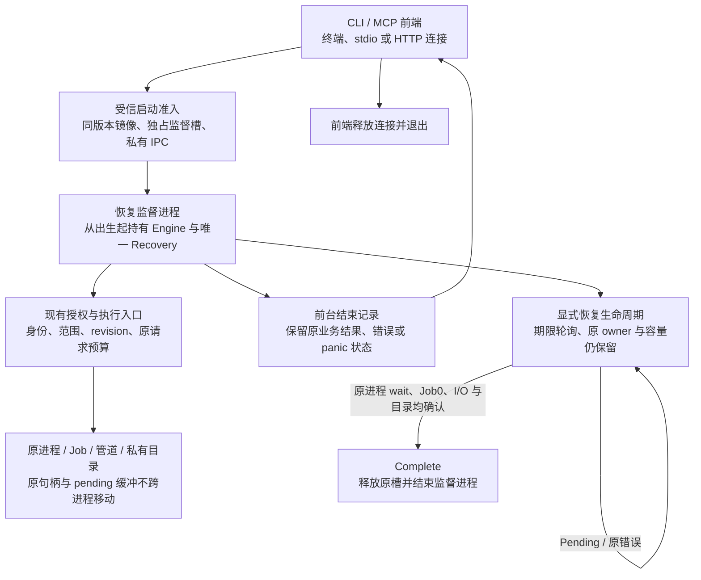

# 只读 CLI/MCP 的前端退出与恢复监督设计

状态：实施设计，未实现、未验收。属于既有 `implement-diskgraph-platform`，不建立第二套规格事实源。依照 `physical-scan-process.md` 的“有限清理与未完成恢复责任”合同；不改变原身份、期限、权限、容量或 upstream pin。

## 已确认的缺口

`CliEngineHost::execute`、`scan_worker_shutdown::finish/finish_probe` 在原 owner 无法完成清理时无限重试。`ScanWorkerRecovery::drain_until` 和 `ProbeRecovery::drain_until` 已提供保留责任的有界轮询，不能据此允许前端丢弃最后 Recovery 后退出。线程返回和 OS 进程退出是两个验收门禁。

Windows pending I/O 包含 event、OVERLAPPED 和其缓冲的原地址责任。不能在超时后序列化 owner、复制一个句柄或移动缓冲到另一个进程，声称完成原 I/O 的交接。监督进程必须在 Engine、探针会话和子进程出生之前就存在；所有原 owner 从开始到最终回收都处于同一监督地址空间。

## 目标生命周期

该图是目标设计，不是已交付架构。前端退出不会被汇报为资源全部回收。监督状态必须可观察，不能藏成无限全局 reaper。

## 安全与接口边界

1. 前端只传递经过现有解析的请求或协议帧。监督进程使用现有 CLI/MCP 业务入口，远程授权仍由不可变请求上下文、token 与数据库实时授权交集决定。内部模式不能授予远程管理员权限，也不能启用危险工具。
2. IPC 必须为出生时绑定的私有通道，使用有限帧、累计字节、原绝对期限和取消；不接受任意 helper 路径、可执行命令、对象句柄数字或扩大的容量。控制消息与 stdout/MCP wire 分离，不能把内部确认写入公开协议。
3. `ForegroundComplete`、`CleanupPending`、`CleanupComplete` 是独立状态。前台结果保留现有退出码、wire 字段、stdout/stderr 分界。CleanupPending 不改成业务成功或资源完成；原业务失败不能被清理诊断覆盖。
4. panic 的原 payload 留在监督地址空间，先记录前台失败，再继续原责任恢复和原 panic 收敛。不得通过伪造一个新 panic、吞掉原错误或 `mem::forget` 跳过恢复。
5. 监督容量在任何 Engine/子进程创建之前取得跨进程独占槽；前端断开不释放它。不能通过并发 CLI 启动无限监督进程。需要真实 macOS/Linux/Windows 跨进程原生锁及双进程准入验收，不能仅依赖进程内 Mutex、可过期 PID 字符串或心跳租约。
6. 监督异常死亡必须留下未确认状态。OS 关闭句柄或锁释放不能被写成 CleanupComplete；后续准入仍须面对未确认恢复记录，不能通过宽泛目录清理、PID 重用或同名对象替代原身份。只读查询与新出生工作的准入状态应分开。
7. GUI/FFI 和可信库接口保留直接持有 Recovery 的语义。本增量首先实现已选定的三桌面只读 CLI/MCP，不把新进程生命周期推定为移动端、GUI 或写操作验收。
8. 同版本受信监督镜像、固定入口角色及控制协议必须进入包清单和平台准入。macOS 的固定安装/签名、Linux 的原镜像准入、Windows 的原镜像身份/策略均需真实验收。不得通过 PATH、临时环境或邻接自声明摘要建立执行信任，也不静默安装服务。

## 必须先解决的实现边界

| 边界 | 所需行为与证据 |
|---|---|
| 标准输出的真实 EOF | 前端退出时公共 stdout/stderr 管道必须实际结束；监督进程仍持有其复制句柄会令 Command.output/communicate 和 MCP 客户端继续等待。验收必须同时观察前端实际退出、公共 EOF、监督仍存活及原恢复槽占用。 |
| HTTP 监听生命周期 | 原认证/Origin/连接读写循环应在监督地址空间使用原运输实现；停止时真实关闭 listener 和 SSE/未完成请求连接。私有控制通道不能替代公共 socket 停止验收。 |
| 跨进程原期限 | Rust Instant 不能当作稳定 wire 表示，墙钟不能用来续期。新增 IPC 不能把原请求剩余额度重新变成完整默认预算；必须证明在传输/排队耗尽原预算后，真实授权/执行不继续。 |
| 恢复日志 | 前台公共管道结束后，清理诊断走有界、可观察的私有记录；不得向已关闭管道无限写入、因 BrokenPipe 丢 owner，或通过无界文件接替无界 stderr。 |
| panic 与前台错误 | 保留实际原 panic/错误的处理顺序；控制确认必须在保留恢复责任之后发出。监督进程尚未确认原资源结束时不能以普通正常退出代替原 panic 收敛。 |
| 监督槽复用 | 真实原 wait/Job/I/O/目录确认完成才可释放容量；监督死亡或锁意外释放仍为未确认。不能只检查 PID 不存在就宣称清理完成。 |

这些边界未实现。需要先取得真实失败测试，再接入生产入口；不能仅新增未被入口使用的消息类型或状态机，就计为生产能力。

## 实施顺序与 TDD 门禁

- [ ] 定义有限内部控制帧和状态机；测试乱序、重复完成、伪造回收、超预算及旧版本拒绝。stdout/MCP 公开字段不改变。
- [ ] 实现跨进程监督槽及异常死亡状态；真实双进程竞争证明仅一方出生，未确认记录阻止复用，不能把锁释放当资源回收。
- [ ] 实现受信监督启动和原私有 IPC；角色/版本/镜像身份拒绝、父端失败、出生阶段错误和取消均保留责任。
- [ ] CLI 从监督执行实际业务，在前台结束通知后实际退出；原业务错误/Windows 完整退出码保持，监督进程持有原子进程、目录和 pending I/O。
- [ ] MCP 复用原认证、Origin 和运输处理，连接停止与前台退出沿原期限；同一主体配额、撤权、SSE 连接和记录归属不退化。
- [ ] 用真实阻碍清理的原句柄验证：前端有限退出、监督仍存活、原容量不能复用；释放阻碍后沿同一 owner 完成实际回收并退出。分别覆盖正常、错误、panic、cancel、disconnect。
- [ ] 覆盖持续阻碍、监督死亡、双前端竞争、控制帧截断及身份替换；证据不得用布尔假 owner 或后台线程替代原生行为。
- [ ] 将监督镜像、准入和控制协议接入三平台实际包、升级/回滚、CLI/MCP socket 及同 SHA 全量门禁；测量新增进程/IPC 的 p50/p95、RSS 和退出耗时。

所有阶段仍未完成。单独完成控制协议、库 API 或本机测试不能关闭有限前端退出及全平台生产门禁。同步 OS 单调用仍不承诺严格硬墙钟上限；可观察的前端退出期限与监督恢复状态必须分别测量。
