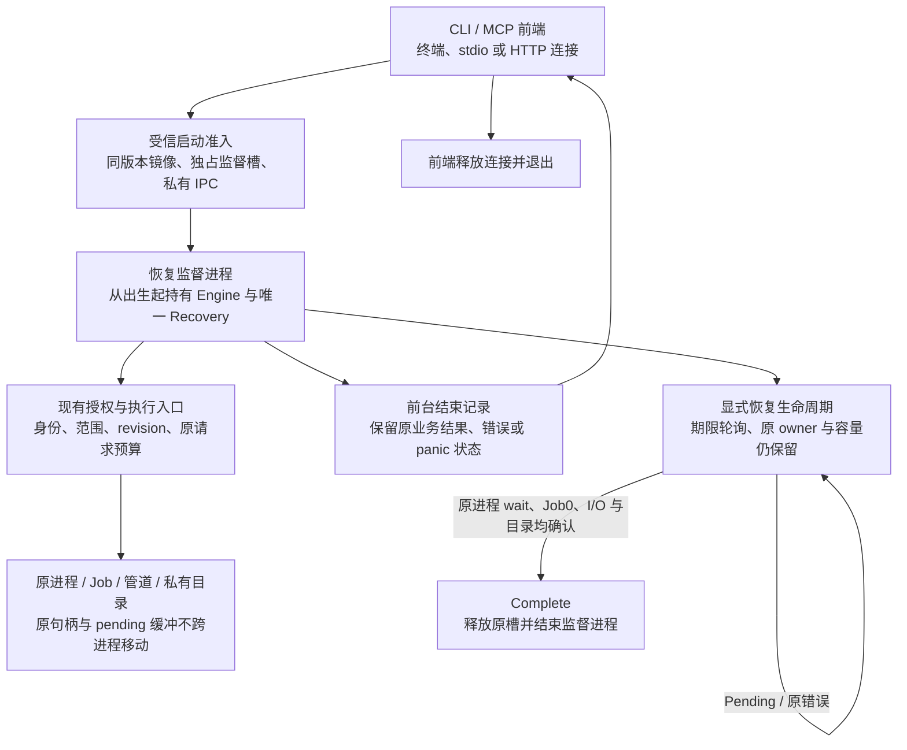

# 只读 CLI/MCP 的前端退出与恢复监督设计

状态：实施设计，未实现、未验收。属于既有 `implement-diskgraph-platform`，不建立第二套规格事实源。依照 `physical-scan-process.md` 的“有限清理与未完成恢复责任”合同；不改变原身份、期限、权限、容量或 upstream pin。

## 已确认的缺口

`CliEngineHost::execute`、`scan_worker_shutdown::finish/finish_probe` 在原 owner 无法完成清理时无限重试。`ScanWorkerRecovery::drain_until` 和 `ProbeRecovery::drain_until` 已提供保留责任的有界轮询，不能据此允许前端丢弃最后 Recovery 后退出。线程返回和 OS 进程退出是两个验收门禁。

Windows pending I/O 包含 event、OVERLAPPED 和其缓冲的原地址责任。不能在超时后序列化 owner、复制一个句柄或移动缓冲到另一个进程，声称完成原 I/O 的交接。监督进程必须在 Engine、探针会话和子进程出生之前就存在；所有原 owner 从开始到最终回收都处于同一监督地址空间。

## 目标生命周期

该图是目标设计，不是已交付架构。前端退出不会被汇报为资源全部回收。监督状态必须可观察，不能藏成无限全局 reaper。

## 安全与接口边界

1. 前端只传递经过现有解析的请求或协议帧。监督进程使用现有 CLI/MCP 业务入口，远程授权仍由不可变请求上下文、token 与数据库实时授权交集决定。内部模式不能授予远程管理员权限，也不能启用危险工具。
2. IPC 必须为出生时绑定的私有通道，使用有限帧、累计字节、原绝对期限和取消；不接受任意 helper 路径、可执行命令、对象句柄数字或扩大的容量。控制消息与 stdout/MCP wire 分离，不能把内部确认写入公开协议。
3. `ForegroundComplete`、`CleanupPending`、`CleanupComplete` 是独立状态。前台结果保留现有退出码、wire 字段、stdout/stderr 分界。CleanupPending 不改成业务成功或资源完成；原业务失败不能被清理诊断覆盖。
4. panic 的原 payload 留在监督地址空间，先记录前台失败，再继续原责任恢复和原 panic 收敛。不得通过伪造一个新 panic、吞掉原错误或 `mem::forget` 跳过恢复。
5. 监督容量在任何 Engine/子进程创建之前取得跨进程独占槽；前端断开不释放它。不能通过并发 CLI 启动无限监督进程。需要真实 macOS/Linux/Windows 跨进程原生锁及双进程准入验收，不能仅依赖进程内 Mutex、可过期 PID 字符串或心跳租约。
6. 监督异常死亡必须留下未确认状态。OS 关闭句柄或锁释放不能被写成 CleanupComplete；后续准入仍须面对未确认恢复记录，不能通过宽泛目录清理、PID 重用或同名对象替代原身份。只读查询与新出生工作的准入状态应分开。
7. GUI/FFI 和可信库接口保留直接持有 Recovery 的语义。本增量首先实现已选定的三桌面只读 CLI/MCP，不把新进程生命周期推定为移动端、GUI 或写操作验收。
8. 同版本受信监督镜像、固定入口角色及控制协议必须进入包清单和平台准入。macOS 的固定安装/签名、Linux 的原镜像准入、Windows 的原镜像身份/策略均需真实验收。不得通过 PATH、临时环境或邻接自声明摘要建立执行信任，也不静默安装服务。

## 必须先解决的实现边界

| 边界 | 所需行为与证据 |
|---|---|
| 标准输出的真实 EOF | 前端退出时公共 stdout/stderr 管道必须实际结束；监督进程仍持有其复制句柄会令 Command.output/communicate 和 MCP 客户端继续等待。验收必须同时观察前端实际退出、公共 EOF、监督仍存活及原恢复槽占用。 |
| HTTP 监听生命周期 | 原认证/Origin/连接读写循环应在监督地址空间使用原运输实现；停止时真实关闭 listener 和 SSE/未完成请求连接。私有控制通道不能替代公共 socket 停止验收。 |
| 跨进程原期限 | Rust Instant 不能当作稳定 wire 表示，墙钟不能用来续期。新增 IPC 不能把原请求剩余额度重新变成完整默认预算；必须证明在传输/排队耗尽原预算后，真实授权/执行不继续。 |
| 恢复日志 | 前台公共管道结束后，清理诊断走有界、可观察的私有记录；不得向已关闭管道无限写入、因 BrokenPipe 丢 owner，或通过无界文件接替无界 stderr。 |
| panic 与前台错误 | 保留实际原 panic/错误的处理顺序；控制确认必须在保留恢复责任之后发出。监督进程尚未确认原资源结束时不能以普通正常退出代替原 panic 收敛。 |
| 监督槽复用 | 真实原 wait/Job/I/O/目录确认完成才可释放容量；监督死亡或锁意外释放仍为未确认。不能只检查 PID 不存在就宣称清理完成。 |

这些边界未实现。需要先取得真实失败测试，再接入生产入口；不能仅新增未被入口使用的消息类型或状态机，就计为生产能力。

## 实施顺序与 TDD 门禁

- [ ] 定义有限内部控制帧和状态机；测试乱序、重复完成、伪造回收、超预算及旧版本拒绝。stdout/MCP 公开字段不改变。
- [ ] 实现跨进程监督槽及异常死亡状态；真实双进程竞争证明仅一方出生，未确认记录阻止复用，不能把锁释放当资源回收。
- [ ] 实现受信监督启动和原私有 IPC；角色/版本/镜像身份拒绝、父端失败、出生阶段错误和取消均保留责任。
- [ ] CLI 从监督执行实际业务，在前台结束通知后实际退出；原业务错误/Windows 完整退出码保持，监督进程持有原子进程、目录和 pending I/O。
- [ ] MCP 复用原认证、Origin 和运输处理，连接停止与前台退出沿原期限；同一主体配额、撤权、SSE 连接和记录归属不退化。
- [ ] 用真实阻碍清理的原句柄验证：前端有限退出、监督仍存活、原容量不能复用；释放阻碍后沿同一 owner 完成实际回收并退出。分别覆盖正常、错误、panic、cancel、disconnect。
- [ ] 覆盖持续阻碍、监督死亡、双前端竞争、控制帧截断及身份替换；证据不得用布尔假 owner 或后台线程替代原生行为。
- [ ] 将监督镜像、准入和控制协议接入三平台实际包、升级/回滚、CLI/MCP socket 及同 SHA 全量门禁；测量新增进程/IPC 的 p50/p95、RSS 和退出耗时。

所有阶段仍未完成。单独完成控制协议、库 API 或本机测试不能关闭有限前端退出及全平台生产门禁。同步 OS 单调用仍不承诺严格硬墙钟上限；可观察的前端退出期限与监督恢复状态必须分别测量。

## 控制通知模块的实现边界

控制通知独立于前端命令：仅接收已认证监督方的单向私有通道；版本 1、出生时的 32 字节会话绑定、从 0 开始的连续 u64 序列。4 字节大端正文长度前缀，正文为拒绝未知/重复字段的 JSON；每帧最多 4096 字节、原累计流最多 65536 字节和 64 帧。部分帧、无效帧及重复 Pending 都扣原预算；每次输入和完整解码前后检查同一绝对 Instant，不刷新期限。超限/协议错误/期限失败锁存；声明长度验证先于正文分配。

合法阶段为 Ready → ForegroundEnded → CleanupPending（可重复）→ CleanupComplete，允许在前台结束后直接确认完成。ForegroundEnded 保留完整 i32 退出码及 panic 标志，但不序列化原 panic payload。断开、部分 EOF、仅前台结束和 Pending 都是 Unconfirmed，不允许根据这些状态释放监督槽。通知仍不是原生 wait/Job/I/O/目录完成证据；真实监督实现须在原资源确认后才能发送 CleanupComplete。随机会话号不代替私有 IPC 对端认证，不能接受前端发送回收确认。

`diskgraph-engine::recovery_control` 已提供编码和增量接收器，尚未接入 CLI/MCP 或监督进程，亦未实现容量锁、受信出生或原 owner 证明。只作为控制解析子组件，第一阶段总体及其余实施门禁仍不勾选。UnixStream::pair 的真实分片/EOF 测试只证明本地私有 socket 的控制语义，不能代替前端实际退出或 Windows 原生管道验收。

## 监督槽预留子组件

可信本地启动层先提供唯一、未克隆、读写可用的 held 普通文件及稳定受保护的槽命名空间；本组件不接收路径、不建立 owner/ACL/目录身份资格，不得从远程参数获取此能力。使用非阻塞原生文件独占锁；新槽或精确 CLEAN 记录才能预留。锁内写入固定 8 字节 RESERVED 并 sync_all，原期限贯穿各 OS 操作。任何未知、截断或既有 RESERVED/ACTIVE 记录保持未确认，拒绝工作出生且不改写。

预留类型在工作出生前可显式取消，写入 CLEAN 并同步后释放原锁；进入 ACTIVE 必须先同步 ACTIVE，消费预留类型。公开 ACTIVE 类型不提供清除记录/释放容量的完成接口。Drop、异常死亡和 OS 自动释放锁都保留未确认记录，不根据 PID、时间或空锁猜测 Complete。库内 SupervisorOwner 已提供原绑定及退休子接口（见下节），仍不能将此组件当作已完成的监督生命周期。

真实子进程资格需覆盖原锁阻止另一进程、出生前取消后的重新认领、ACTIVE 子进程直接退出后锁已释放但记录拒绝复用、异常记录非破坏拒绝及原期限耗尽。只在隔离临时文件验证锁/记录，不能代替受保护命名空间、实际 Engine/Job/I/O 清理、三平台受信安装或 CLI/MCP 退出验收。

## 原资源池关闭准入

退休必须先永久关闭原扫描 registry 的新预留及原探针 pool 的新 session。关闭与预留共用同一状态锁，不能在锁外检查“空”后再允许新工作出生。已取得的原预留/session 仍计入占用并沿原生命周期完成，关闭不丢弃它们、不把 CLOSED 当作 Complete，也不扩张容量。重复关闭幂等；关闭后请求新槽返回 Conflict，现有资源仍由原 Recovery drain_until 持有并恢复。

关闭仅提供退休的必要前提；必须继续证明原资源归零、所绑定 Recovery 属于原 Engine、原 supervisor 槽及其受保护文件身份不变后，才可清除 ACTIVE。该组合退休与 CLI/MCP 入口尚未接入。旧原生资格源码需要新关闭接口才能编译时，只允许添加明确 Unsupported 的旧接口适配并记录使用标记；旧基线绝不能借用新成功关闭行为，任何目标资格执行该适配都必须拒绝作为行为 RED。

本轮准入关闭子组件在 macOS arm64 的真实容量回归已获得 RED 0/2、GREEN 2/0；原扫描资源回归 7/0，源码规范 6/0、Clippy 通过。Windows 原会话测试仍待原生 CI，不勾选整体阶段。日志和源码指纹见 `docs/benchmarks/admission_seal_644/`。

## 原 Engine 恢复绑定与退休

可信监督层将原 Engine、原扫描/探针 Recovery 与原 ACTIVE 槽整体移动到同一责任对象。绑定以原 Arc 身份逐项核对 Engine 已配置的资源池；缺失、额外或外国恢复责任均拒绝，错误返回所有原材料，不能 Drop 后再用新池替代。未配置任何受管理资源池的 Engine 不作为监督能力准入。

退休先检查原期限并关闭两个原池的新准入；使用 Arc::try_unwrap 取得原 Engine 的唯一所有权，外部强引用尚存时保持 Pending，失败还回同一 Arc，不用引用计数观察代替原子所有权取得。成功后销毁 Engine（旧 Weak 不能再升级），Recovery 继续持有原资源表。按同一期限实际 drain_until；Pending/错误均保留原 owner 和 ACTIVE 锁，不能从布尔外部消息推定完成。两个原池实际 Complete 后才允许在原锁内写 CLEAN、sync_all、精确回读，并关闭原锁。

CLEAN 同步失败仍持有原锁；仅此对象已开始的退休可重试精确 ACTIVE/CLEAN，未知或部分记录拒绝，不覆盖修复。此次能力仅约束原资源和容量的库内退休，不代表实际 runner join、原生监督进程退出、受信镜像/IPC/公共 EOF 已完成；这些原门禁保持打开。

库内 `SupervisorParts` / `SupervisorOwner` / `SupervisorRecoveryError` 已实现上述原绑定及退休子能力；本机真实绑定 RED 5/2 → GREEN 9/0，真实 Unix 原 fd 写入异常 1/0。Windows 两项原会话/外国池验收仍待 CI；原生子进程/I/O 监督执行、受保护命名空间及 CLI/MCP 退出阶段均保持未完成。证据见 `docs/benchmarks/supervisor_binding_b3a/`。

## 同出生私有通道的跨进程原期限

禁止序列化 Rust Instant、UTC 或在接收端重新签发完整 Duration。发送端先读本机原生时钟，再从原 Instant 扣除已消耗时间，生成绝对计数截止值；接收端先采本地 Instant，再读原生计数，只有相同 clock domain 才可换算剩余预算，扣除原生精度余量（Unix 一纳秒；Windows 向上取整的一 QPC tick 加一纳秒），且不得超过显式接收策略上限。每次采用都重新扣除真实传输/排队时间；过期、未知版本、时钟域不符、溢出、原生读取失败均拒绝。

Linux 使用与 Rust Instant 同源的 CLOCK_MONOTONIC，并绑定真实 nsfs 的时间命名空间 device/inode；在采样前后核对 namespace，跨 namespace 拒绝。macOS 使用 CLOCK_UPTIME_RAW，与 Rust 1.97 的时钟源一致。Windows 使用本机 QPC 并绑定实际频率，所有换算做 checked 整数运算。身份认证和同一次出生/boot 由原私有通道另行证明；此时间材料不是 token、对端认证或跨机器/重启有效的凭据，不接收远程客户端提供的期限材料。

真实另一个进程测试须证明正额度能采用，等待后过期材料被拒绝，而非重获发送时剩余额度；这仍不能替代受信监督启动、IPC 对端身份和公开前端退出验收。

`native_deadline::ClockStamp` 原期限桥接子组件已实现，原型 RED 2/3 → 本机 macOS arm64 GREEN 5/0；真实另一进程过期/正额度测试均执行。Linux 实际 time namespace 门禁已接入 CI，但本机未运行，Windows/QPC 与 macOS Intel 也仍待原生验收。不勾选监督启动或私有通信总体阶段；证据见 `docs/benchmarks/native_deadline_739/`。

## 4000a85 原生 CI 终态复核

Windows stable/MSRV 的真实终态均暴露两个测试生命周期错误：来源 root 首次改名成功，但在原 GitView 仍持有来源捕获时强制恢复改名得到 OS32；以及 Deadline 返回携带未完成清理时，在原 NativeProbeTestBudget/外部 Recovery 尚存且未排空前就断言后代心跳停止。修复测试顺序：保持原 terminal 验证，再 complete/drop 原 view 与预算后恢复隔离名称；保持原 Deadline 主错误断言，再 drop 原预算、由既有原 Recovery 实际完成 drain 后观察心跳。不得放宽分享标志、吞清理错误或跳过真实心跳。

另有 Windows stable 原私有目录显式恢复产生未知 NT INVALID_PARAMETER/OS87，MSRV 原观察钩子未在原 3 秒 token 到期前到达，以及 Linux stable 200k 性能旧基线失败；保留原失败门禁，尚未关闭。Linux MSRV 与 arm64 的 4000a85 全量 CI 成功不替代这些缺口。

## 原目录恢复的显式多次尝试验收

Windows private Git panic/cancel 验收保留原真实出生、一次清理失败、同目录身份及占用断言；显式恢复改为在同一固定 10 秒期限内重复原 `Recovery::drain_until`。Pending 或原错误均保留诊断，每次核验原槽仍占用且新 session 被 ResourceExhausted 拒绝；禁止换池、移除原目录或将 OS87 推定 absent。只有原进程 wait、Job0、原通知和目录实际回收最终完成才算通过，超期/永久失败仍失败。此测试合同调整不修复或放宽生产 ID 查询，Windows 本轮原生结果仍待 CI。

## Unix 私有通知的有界写入

Linux/macOS 原已认证 UnixStream 能力的通知写入必须使用单次 send 的 DONTWAIT/NOSIGNAL，构造前必须提供唯一未克隆的私有 stream 能力，并明确设置原 socket 非阻塞模式，不继承公共 stdout/stderr。写入前后及每次重试检查原绝对期限/取消；原版本、会话、序列、状态、累计帧/字节通过同一控制解析门禁。部分写入或 I/O 错误后锁存 Unconfirmed，不重发帧、不刷新期限、不释放原 Recovery/槽。调用者仍持有原资源。背压期限、对端断开、取消及完整真实 socket 传输须验证。此 API 不认证对端、不启动监督进程、不能代替 Windows 原管道及 CLI/MCP 实际接入。

## 前端兼容退出的准入关闭

CLI 命令正常/失败/panic 后与 MCP runner 停止并 join 后，兼容恢复循环先沿同一 Recovery 关闭原资源池准入，再调用原 drain。关闭失败保留原责任并重试，禁止仅凭暂时空槽退出后仍允许新工作出生。Windows 探针池同样处理。此处仍使用原无限兼容回收，不声明有限退出；监督出生、公开 EOF 和私有 IPC 总体验收保持打开。

Windows 前端退休必须先尝试关闭扫描与探针两类原池，然后才开始任意 drain；一个池关闭失败也不跳过另一池的关闭尝试。MCP 使用单一组合恢复入口，保留两个原 Recovery，不将扫描 Pending 当成忽略探针错误的理由。CLI 保持原命令结果与 panic 顺序。Unix 空原池回归只能证明准入关闭，Windows 原 pending 及有限退出仍待真实平台验收。

Unix 原私有控制通道读取必须逐次非阻塞检查原期限与取消，使用固定读取缓冲及既有累计解析预算。已解码待交付帧也不得在原期限耗尽后返回；只有实际 EOF 且完整 CleanupComplete 协议结束才能返回协议结束。部分 EOF、仅 ForegroundEnded、错误会话/序列、预算和 I/O 错误均锁存。读取端不提供认证或原资源完成证明，不能替代监督角色与前端入口集成。

## 出生前 socketpair 的身份限制

macOS 真子进程诊断确认：出生前 socketpair 的 LOCAL_PEERPID 在前端观察仍为 pair 创建者 PID，不是继承端点的子进程 PID。不能据此接受监督身份，也不能通过期待 child PID 错误拒绝合法定向继承。监督认证必须沿同一受信角色镜像、原生出生返回的原 PID/进程能力和出生时唯一 FD 定向继承证明；会话值和 PID 单独都不授予资格。原生启动实现须禁止非目标进程继承该私有能力，并保留实际 owner；本诊断不证明这一出生链已实现。探针仅用独立 Python 真进程，不作为产品启动器或有限退出验收；Linux 对应 SO_PEERCRED 尚待原生环境核验。

## Windows 源名称恢复的固定观察窗口

`324311b` 的 Windows stable 全 workspace 作业显示 engine 569 passed/1 failed/3 ignored，唯一失败仍为 scoped 根改名测试在释放 view/原预算后恢复源名称的 OS32。恢复只作用于隔离夹具：保留捕获前的完整原生目录身份，终态结果固定且原资源回收后，另设固定 10 秒夹具观察期限，每轮核验原目录身份与目标确实不存在，仅 OS32 重试，恢复后再核验原身份。该期限不进入原业务预算、不重新捕获、不放宽权限/发布或将占用推定 absent；永久共享冲突及未知错误仍失败。Windows 修复结果须由新提交实际 CI 证明，不能以 macOS 通过代替。

`324311b` Windows MSRV engine 568 passed/2 failed/3 ignored，另一失败是原生观察前 3 秒 token 已到期并被正确 PermissionDenied。观察后过期夹具的初始 exp 明确改为入队前固定 30 秒；原 ctx/控制库 authority 前后完全相等，真实观察必须在原 exp 前发生，再等待真实原 exp 后验证确切 PermissionDenied 及 staging/revision 均无发布。没有运行中续租 token、回写 exp、替换时钟或修改生产 token 策略；新测试仍须真实平台执行，不能将观察前拒绝替代观察后验收。
