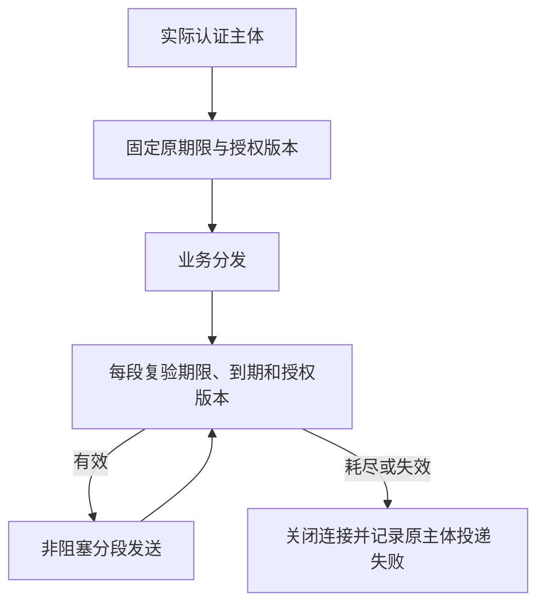

# 现代 HTTP 响应投递硬化

状态：实施中，未完成。

响应发送使用一次创建的单调绝对deadline，授权锁等待、SQL、部分写入、WouldBlock重试和结果检查共用，不因进展续期。分段发送前检查实际入站RequestContext的原到期时间及分发前固定的授权generation；授权变化或无法确认时拒绝继续发送。只允许内部可信兼容入口保留原API，远程服务必须接入新路径。已经进入内核的字节无法撤回，不承诺任意OS调度下硬实时。

验收：原deadline耗尽及授权检查耗尽deadline时首字节不得发送；真实socket慢读/不读不得续期；generation变化和token到期不能启动或继续旧结果；正常响应wire兼容、同连接下一请求读取不受临时非阻塞模式影响；投递失败审计绑定原主体。未接线的发送原语测试不代替远程路径验收。

## 当前验证（2026-10-08）

macOS 实际认证远程路径 6/6、发送原语 9/9。隔离 Linux 对照使用 e8333b3 的 HTTP 实现，仅合入有界 session header 并挂载当前测试模块；不读、慢读、撤权、到期四项均因目标行为失败。修复版相同四项通过。库回归首次漏传原生 worker 配置，143 通过、34 个扫描相关夹具 Unsupported；保留失败，补配置后 Linux MCP 库测试 177/177、主程序测试 7/7 通过；不代替 workspace 或平台验收。原始日志及候选源码摘要见 docs/benchmarks/http_response_delivery_2026_10_08/receipt.json。

短 ASCII Session ID 保持兼容；长或 Unicode 请求 ID 派生固定 SHA-256 不透明头值，JSON-RPC ID 不变。授权 generation 是控制库全局版本，其他主体的授权变化也会保守中断投递，需要重试；不代表图 revision 归属更改自动进入该版本。原可信 writer、早期响应及 SSE 握手仍有独立路径。已进入内核的字节无法撤回。Unix 大响应夹具不能代替 Windows 原生验收；最终审查、CI 和交付未完成。

最终双审：代码 APPROVE、架构 CLEAR。fmt、diff check、MCP all-target Clippy -D warnings、macOS 布局 11/11 通过。Linux 集成首次 Unicode 调试测试出现 ConnectionReset；单项重测及后续 signal/legacy/layout 组通过，但首次异常根因未确认，保留日志，不以重测覆盖。上一提交 Windows Rust 1.97 CI 失败待定位；本候选尚未提交。

进一步重复原信号夹具复现 SIGTERM 非正常退出。原 readiness 只连接释放后的端口，无法证明是本 child 的 listener；现改为本 child stderr 确认绑定后再探测，原信号退出断言不变。初次测试编辑遗漏 URL scheme 导致 0/3，纠正后连续 10 轮共 30 项通过；端口串用仍是待证假设，不宣称产品信号缺陷已修复。Windows 失败已定位 Engine late capability 断言第516行，增加实际结果诊断，未放宽标准。

补诊断后的 Windows 失败同名测试在隔离 Linux 通过 1/1；这不关闭 Windows 失败，后续同版本原生 CI 必须确认实际错误与结果。最终格式及 Clippy 检查通过。
