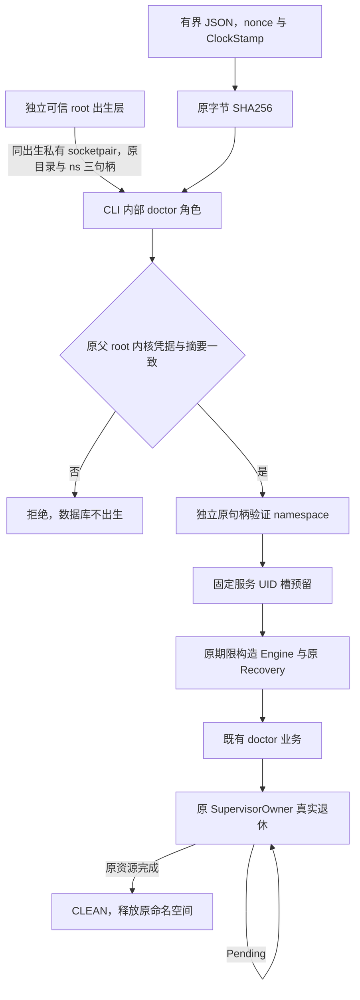

# Linux 监督 doctor 出生接线

状态：已接入 Engine/CLI 构造，macOS 上执行共享解析回归与兼容 CLI 回归；新 Linux 条件代码尚未在原生环境编译和验收。新增隔离原生验收脚本与 CI 门禁，尚无通过证据。不关闭监督服务父项。

两个内部环境值只指定原启动 JSON 和唯一继承的私有 FD。环境自身不授予资格：JSON 原字节 SHA 必须由原父进程的真实 root UID/GID/PID 内核消息凭据确认，接收身份必须为已绑定的非 root 专用 UID。JSON 限4KiB，字段严格拒绝未知键，固定版本、不同服务/前端 UID、64位十六进制 nonce/摘要、绝对无别名定位与64MiB镜像上限。所有认证和身份失败在 Engine/数据库之前拒绝；既有普通本地入口保持兼容，配置内部角色后的错误绝不回退。

私有描述符须为已连接未命名 AF_UNIX datagram，拒绝 stdio、普通文件、stream 和其他 socket domain，采用后立即恢复 CLOEXEC。原 ClockStamp 采用两次扣除实际认证成本；之后构造仍取调用方原期限的较小值。namespace 及三原对象在预留、构造、出生前撤销和 SupervisorOwner 退休完整期间保留。root 出生材料指定镜像与数据目录，不采用旧环境镜像配置，客户端 argv 不得替换数据目录。内部角色当前仅接既有 `--json doctor`，禁止转交 serve 或其他命令。

root 内核凭据不代替固定 broker 的发行、镜像与生命周期信任。当前没有公共 broker、全局 bootstrap owner、退休私有确认协议或有限前端退出；仍等原资源退休再返回。不得把本构造组件称为独立服务已部署或恢复完成。本轮不安装桌面服务。

证据：`docs/benchmarks/linux_supervisor_birth_constructor/receipt.json`。旧0e90二进制在Linux隔离专用UID运行时忽略新角色标记，创建了数据库，为新协议缺失RED，不把它报告成旧CLI提权漏洞。八场景在旧二进制实际执行1通过/7拒绝失败，全部原child已wait、原容器已移除；此处只证明新协议缺失。共享解析真实RED1/2→GREEN3/0；macOS兼容host9/0、两包全目标Clippy通过。这些不编译Linux条件分支、不替代Linux验收。新增原生脚本对当前实际镜像完成CLEAN、ACTIVE、伪造角色、错误session、非root实际发送者、过期材料、错误镜像、数据定位替换八个场景；只有它在当前Linux源码构建后运行通过才能关闭对应子门禁。
