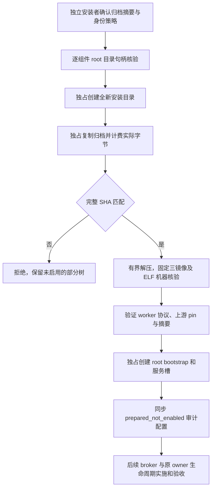

# Linux 监督安装准备组件

状态：准备组件已实现，Linux ARM64 隔离 root 夹具验收完成。它不启动服务、不建立 broker 信任，也不关闭 `frontend_recovery_supervisor.md` 的监督产品链和三平台父任务。

`scripts/prepare_linux_supervisor_installation.py` 接受独立可信安装者提供的归档 SHA256、全新受保护安装目录、专用服务 UID/GID 和前端 UID 集合。发行信任来自安装者独立确认的 SHA，不来自归档邻接 sidecar 或镜像自声明。服务账号必须由可信部署者独立预置；组件不创建 OS 账号，不证明已有账号是专用账号。

处理顺序：

镜像以0555独占发布，namespace为root控制的0755目录，bootstrap为root的0600普通文件，服务槽为专用服务UID的0600普通文件。所有槽只在全新安装中初始化CLEAN；已存在目录始终拒绝，不覆盖ACTIVE、RESERVED或已有配置。失败不自动删除旧历史或重置恢复记录。source归档先复制到root独占对象，后续解析只使用已核验副本，避免在两次核验间直接解析可被原地修改的源文件。

预算：压缩输入与实际展开输入分别最多256MiB，单镜像64MiB，manifest16KiB，最多128个归档条目。拒绝重复条目、路径逃逸、链接、非普通对象、额外镜像及机器不匹配。这里只做ELF64首块和机器核验；运行加载、安全策略和发行签名不是由ELF首块证明的。

审计回执的device/inode不签发持久运行信任。未来broker必须保留独立可信启动产生的原目录/ns和child owner，出生时认证交付；不能从这些数字重新打开候选路径来自认证，也不能把prepared状态当作服务已启用。

证据：`docs/benchmarks/linux_supervisor_installation_preparation/summary.json`。身份校验实际7个失败断言与ELF两项失败分别保留；最终13测试通过。使用已有固定镜像、关闭网络、覆盖entrypoint为Python的Linux ARM64容器完成8项真实root/UID1000/UID1001检查；MySQL和任何服务均未启动，三个原容器均已移除。保留UID/GID哨兵UINT32_MAX也明确拒绝，chown后重新核对实际owner。原ACTIVE字节保留测试是安装准备保护测试，不是原生job owner或资源退休验收。

未完成：root broker→服务UID监督→既有CLI doctor产品接线，原全局bootstrap寿命，认证角色及私有IPC，真实Pending下前端退出/EOF与容量保留，MCP生命周期，Linux服务激活产物，以及macOS/Windows对应安装与原生验收。不得用本组件勾选这些门禁。

## English status

The Linux preparation tool verifies an independently expected archive digest, copies fixed ELF role images into a fresh protected directory, and creates distinct root/bootstrap and dedicated-service slot files. Existing installations are refused without resetting their records. The result is explicitly **prepared_not_enabled**; no service is registered or started. Numeric audit identities are not runtime trust material. The retained Linux ARM64 fixture demonstrates installation permissions and preservation only; authenticated broker launch, original-owner retirement, finite frontend exit, MCP supervision and the macOS/Windows deployment paths remain unimplemented and unqualified.
