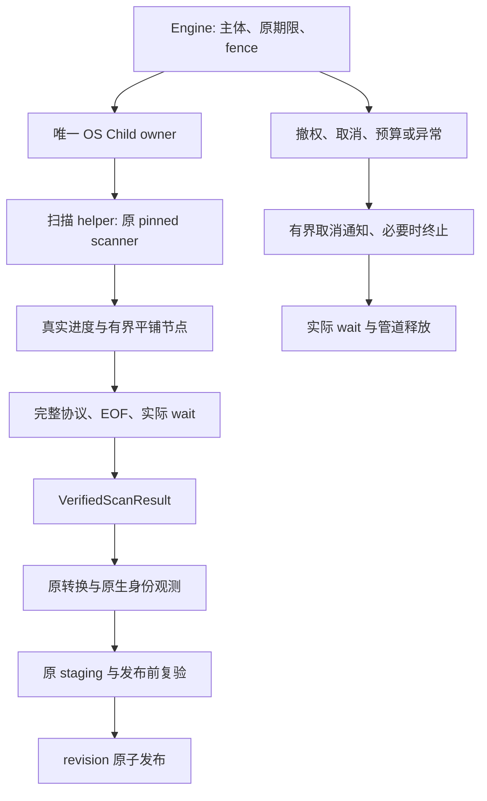

# 扫描进程真实退场实施阶段

本阶段继续同一变更的 PF-06、9.2、15.4 与相关资源／发布验收，不新建规格事实源，不关闭现有父任务。

## 源码依据与决定

固定上游 `ScanHandle` 丢弃实际线程句柄；结果发送后仍不能证明线程清理结束。上游还持有静态扫描线程池和 Windows MFT 释放线程。外层 Engine runner 的真实 join 不覆盖这些线程。

在三桌面系统将一次已成功认领的扫描放入受控 helper 进程。上游 pin、源码和14份摘要保持不变；正常结束必须完整接收结果、排空管道并实际 OS wait/reap。此证明是进程内扫描活动已停止，不承诺每个上游 TLS 析构优雅执行。

## 不变约束

- helper 不持有数据库、请求主体、token、owner 或 fencing；父 Engine 保留原 claim 时钟、20ms 检查、5s 续租及实时授权。
- 父端在原位置建立并保留 Linux/Windows 根与祖先身份租约。先保持准确绝对 root 与完整 ScanOptions，不用改变挂载排除语义的相对路径替换。
- 平铺记录迭代传输并保留原 Node 全部字段及子节点顺序；先检查帧长再分配，累计检查节点／深度／原始输出上界和完整 End。协议字节不是 staging 编码成本，不改变默认2GiB staging预算，也不双扣。
- 全字段与顺序保真指 **同一次实际 pinned 扫描交付的 Node 树**。上游 `aggregate_deduped` 在浅层并行聚合中用 `Seen` 先到者计费；同一 inode 的计费名称及其影响的大小排序不承诺在两次独立扫描间固定。不得修改上游或把所有 bytes／顺序字段全局忽略。跨扫描配对分层验收：唯一 inode 夹具的全部选项矩阵保持全字段／顺序精确；含别名且关闭去重时同样精确；开启去重时仅真实共享 inode 组的计费名称及其必然排序位置允许变化，仍须精确核对单份真实大小、唯一非零计费、每条路径身份及其余字段、父关系、根汇总和各次结果自身的 metric／name 排序。每次结果自身 codec 往返仍须全字段／顺序精确。
- 此澄清的证据边界：首次 helper／独立 pinned 配对实际出现不同计费名称，且与上述源码路径一致；后续固定八次 pinned 表征全部同次 codec 精确，但八次 **未观察到 winner 变化**。后者既不作为实际变化的证明，也不承诺跨运行确定性；不得重试直到得到希望的调度结果。
- 类型化帧必须拒绝未知 variant 与未知字段，包括无业务字段的 Cancel；公开 `Frame::Cancel` 的构造方式与 `{"type":"cancel"}` 序列化形状保持不变。真实有界 FrameReader 遇到未知 Cancel 字段应返回 InvalidData，并锁存该流失败，不得继续消费后续合法帧。此约束同时覆盖公开 codec 与独立 helper 执行协议，不以任一协议通过代替另一协议的验收。
- 业务结果、End、EOF、finished 或消息不能代替实际 OS 退出。正常 wait 不额外取消；异常／unwind 终止并回收，保留原错误及清理错误，不持数据库或 registry 锁等待。
- 正常回收还须确认自有组／Job 无活动；Unix 在此之前保留 leader，回收后禁止再操作旧数字 PGID。Windows 不以 leader 句柄 signaled 或 Job 句柄信号代替活动计数归零。现有 terminate+leader wait 不能单独证明整组退出。
- Linux 进程视图隐藏、权限不足、枚举截断或未知状态不能解释为空组。可信固定 helper 的不主动逃逸条件与观察资格须有明确证据；独立 session、两次快照或 PGID 本身不称为强沙箱，主动逃逸和源读取隔离继续单独验收。
- 共用 OS-child 层机械复用既有 Unix 保留 leader 身份与 Windows 启动前 Job／句柄 allowlist、非阻塞管道。原探针仍借原账本；扫描借自己的原账本，不伪造 ProbeBudget 或重新计时。
- helper 由受信安装／宿主配置定位并核验版本、架构及完整性，不查 PATH／工作目录、不下载、不允许远程工具提供 executable／argv，不隐藏退回 detached scanner。
- 物理退出不证明源读取隔离、云占位不下载、签名或设备能力；相应原生验收继续开放。同步内核清理可能超过业务期限，不承诺严格墙钟或 RSS 上限。

## 实施与实际验收顺序

1. 共用 Child owner：抽取现 OS 句柄／管道逻辑，保持旧探针全部错误与检查位置，补控制管道、正常回收和终止回收；执行原原生负控。
2. worker lib/bin：单向依赖 Core／pinned，不依赖 Engine／Store；有界平铺协议、真实进度、取消及全部扫描选项，执行真实 pinned 扫描配对。
3. Engine 接入：仅替换 walk/poll 段，结果须经实际退出许可后进入原转换、原生身份补充、staging 和原子发布；旧公开构造签名保留，受信 helper 配置为增量入口。
4. 打包与宿主：CLI／MCP／FFI 同版本 helper、安装 manifest 与真实宿主定位；缺失／错架构／篡改明确拒绝，不能把握手字符串当可信执行文件证明。
5. release 测量：20k／200k、宽／深目录及并发查询，报告父与 helper 的内存及采样合计、p50/p95、扫描时间、数据库／WAL增量；不以单个进程 RSS冒充整次扫描成本。

先以真实 helper 退出屏障验证：pinned 扫描结果已送达但 helper 进程仍活着，阻塞 result/drain 不完成；释放后真实 wait。屏障观察 helper 自身退场，不伪造上游 TLS。

再验真实扫描取消、撤权、预算、坏帧／早 EOF、执行失败与父 unwind：停止／回收、句柄与管道释放、零新 revision、既有错误语义。根／祖先替换及旧 leaf 移回仍精确拒绝发布，合法 sibling 活动成功。

与原扫描配对全部字段／顺序、硬链接、hidden、depth、links、one_filesystem、挂载排除及 Windows drive-root/MFT。平台未运行的行为、真实 provider、Swift/Kotlin owner 接入、Android/iOS 包／设备与签名保持未验收；桌面 helper 不替代移动 provider。

## Linux 固定 helper 的派生约束与真实线程退出资格（实施前合同）

普通进程组的动态 `/proc` 枚举继续单独验收，不能以两份相同快照宣称强沙箱。固定扫描 helper 可以采用新增的受限启动入口：在内部 fresh session 建立后、exec 前安装不可放宽的内核过滤器，拒绝普通进程派生和 session/group 迁移，保留 pinned scanner 所需的真实线程创建。旧探针和旧启动入口不偷偷继承新限制。

- 安装失败、未知 syscall ABI、线程条件不能可靠核验或缺少 pidfd 时明确拒绝，不回退到未受限 helper。x86_64 的 x32 syscall 编号不能绕过过滤；aarch64 使用对应真实 ABI，不假设不同平台的 syscall 编号相同。
- `fork`、`vfork` 与非线程 `clone` 必须实际失败；`clone3` 的兼容拒绝须允许 libc 的既有线程回退，并以真实线程扫描证明。拒绝 `unshare`、`setsid` 和 `setpgid`，不把当前源码没有调用这些函数当作内核约束证据。额外内核异步派生机制是否需要禁止，须有明确边界和测试。
- 受限启动与 pidfd 只能属于同一唯一 Child owner，成功建立过滤器的事实不允许客户端、协议字段或任意布尔参数伪造。正常完成仍须完整协议、双 EOF、控制端确实关闭、实际整个线程组退出与原 leader wait；主线程 `Z` 和 End 都不够。
- 真实反控必须使用进程 main 退出而其它原线程仍持续 heartbeat，观察 pidfd 尚未退出；自然释放之后才观察真实 pidfd 退出和 wait。不能使用救援 kill、模拟状态或刷新期限获得正常许可。
- namespace、hidepid、记录 overmount 等资格探针保留实际 errno 和阶段。能力不足输出 `QUALIFICATION_NOT_PROVEN`，不把测试框架的 return/pass 计为该原生能力通过。

该入口只约束固定 helper 的进程派生与会话归属，不证明文件读取隔离、云占位不下载、可信安装、动态装载环境或恶意特权宿主防护。只有原生 x86_64/aarch64 测试、完整扫描选项配对和父 Engine 接线验证通过后，才能声明本子能力完成；PF-06 及平台父任务仍依各自完整验收关闭。

## 父端组装检查点

完整 End/EOF 后的节点计数、子节点空间准备、合并与顺序恢复同样属于原请求执行期限。新增组装入口借用原请求检查函数，至多每 256 次节点或边操作检查一次，不刷新期限；取消或撤权保留原错误对象，不交付部分树，解码器失败锁存。组装中的深树必须由迭代清理 owner 接管，检查点失败不能触发递归 Drop。旧无检查点 codec API 保持兼容。单次分配、OS 调度与异常迭代清理不构成严格 20ms 响应或 RSS 上限承诺。

## Linux 首次握手前的原子进程身份

受限扫描进程在任何 child 握手之前就必须由父端持有内核绑定的原进程句柄。子进程自己打开 pidfd 后经 SCM_RIGHTS 回传，不能覆盖回传前外部终止的出生窗口，也不能作为此项完成证明。

- 使用内核原子返回 pidfd 的出生接口；限定 x86_64/aarch64 的真实 ABI。原生接口或策略拒绝保留原 errno，不通过普通 fork、数字 PID 再打开或未受限入口降级。
- 父端接管原 pidfd 后才允许分配、执行外部检查函数或进入可展开代码。Ready 前自然死亡、外部终止、初始化失败、取消及 panic 均以该原句柄终止/实际 wait；不得发送信号给可能复用的数字 PID。
- 多线程宿主的 child 分支只允许已审查的异步信号安全原生调用和固定栈状态；不调用分配器、锁、Rust 析构、宿主 handler 或 atfork 回调。信号 mask 恢复及 handler 重置按各原生 ABI 验证，不用当前 macOS 编译替代 Linux 行为。
- argv、环境、描述符和错误通道先准备；无关描述符关闭须有实际能力及错误验收。held ELF 按句柄执行，替换原路径不能改变实际执行镜像；此机制仍不单独证明安装内容可信或动态装载环境受限。
- 同一原期限与授权检查通过后才发送 ACK。Ready、错误通道 EOF 或成功 exec 不能代替完整协议、双输出 EOF 和整个线程组实际退出许可。

原生验收场景包含首 Ready 前外部终止与自然死亡、原句柄消耗后 ECHILD、其它活进程不受影响、多线程信号/atfork 负控、held 镜像路径替换、close_range 拒绝、出生接口拒绝以及两种架构的实际调用约定。独立 C 探针仅证明机制与环境资格；Rust 生产入口必须再次通过对应行为，不以探针成功或接口缺失编译失败宣称安全修复完成。无法实际制造 PID 复用时，该项单独标为未验证。

## 执行输入与扫描响应的独立字节账本

Request 与 Cancel 采用 helper 实际接收端相同的固定输入约束：单帧正文最多 1 MiB、累计输入最多 2 MiB。父端在序列化期间按该上限准入，不能用客户端选择的扫描响应额度扩大输入分配；Cancel 消费原输入剩余量。响应中的 max_frame_bytes/max_stream_bytes 字段及 stdout/stderr 共用账本保持原值，不能反向限制合法 Request 的序列化。回归分别验证大响应额度不能放行超大 Request，以及小响应额度不会提前拒绝符合输入合同的 Request。两者为序列化预算行为，不作为 OS 执行或文件路径资格证明。

## 原生失败的类型化传播

真实 OS I/O 失败在 Child owner 层保留原 io::Error 对象、ErrorKind 与 raw_os_error；复制错误状态共享原对象，不先格式化为文本再在上层恢复。原生主错误与实际清理失败分别保留，调用方检查点的业务类型不被清理诊断覆盖。原探针对既有字符串显示的兼容投影保持原内容，但不能把此显示投影作为新的扫描入口原生分类依据。验收以真实失败的 OS 调用和自定义原 I/O payload 检查 source 链、原码、原类别及复制后的对象身份；原探针分类与显示继续回归。

### 主错误与清理错误的产品分类

Engine 增量错误包装同时持有原主错误与实际清理 I/O 失败，不能用 secondary 覆盖主错误，也不能将组合误判为成功。CLI/MCP/FFI 的既有稳定错误码依据最内层原主错误分类；嵌套包装的 primary 解析采用借用迭代，不克隆或格式化业务错误。原 Business/Store/Io 对象、source 链及清理诊断保留；未发生清理失败时返回原 variant。用权限拒绝、预算超限、原 I/O 和存储失败分别验证三入口稳定结果，新增包装不扩大任何操作授权。

## 同版本 helper 包与安装清单

桌面只读 CLI/MCP 的构建、归档、私有包和 Linux 安装包必须携带同一版本的第三个可执行文件 diskgraph-scan-worker（Windows 使用 .exe），不能以库代码存在代替已安装 helper。bin 目录的 scan-worker-manifest.json 使用有限的 schema_version=1，记录 package_version、target、protocol_version=2、pinned_scanner_revision、scanner_source_manifest_sha256，以及固定 basename 的 executable.name/bytes/sha256。清单引用未修改的 vendored UPSTREAM_DIGESTS.txt；缺失 helper、清单不一致或复制后的摘要改变时包装与验收必须失败。清单不携带扫描 root、主体、token、argv 或宿主环境。

生成与验证程序只能在隔离构建/安装 artifact 上操作，拒绝目录、链接和未知字段，读取及哈希按固定块处理。读取期间文件身份、尺寸和高精度修改信息变化时拒绝生成完整摘要。清单是安装完整性材料；相邻可写 helper 与清单不能互相证明信任，未来 Engine 仍须由受信宿主的预期摘要或签名根锚定，校验实际执行镜像并固定平台装载环境后，才发送含 root 的 Request。Hello 与清单成功均不授予执行、扫描或发布许可。

验收分别覆盖真实归档包含三个 artifact、摘要/尺寸/版本/target/protocol/pin 一致，缺失及改写 helper 拒绝，以及原 stdio/HTTP/升级/回退验收保留。包装组成单元夹具不证明原生可执行能力；必须在原生 runner 用实际 release binary 复核。FFI 桌面 bundle 的 helper 定位和 Android/iOS provider 不由这组 CLI/MCP 包验收替代，父任务保持未完成。

### 受信宿主的已打开镜像材料

宿主入口接收独立可信来源提供的完整 SHA-256 与准确长度，并消费已经打开的普通 File；不得从邻接清单、远程请求、Hello 或显示路径自动建立预期值。预期配置字段不可由协议反序列化。核验最多接收128MiB镜像，按64KiB栈缓冲与剩余长度读取，原请求绝对期限和原检查点贯穿准入、定位、每次读取及末检；超限或未完整读完不得交付摘要。

核验前后比较实际句柄的完整身份、尺寸及高精度修改/change信息。Unix使用dev/inode及纳秒时间；Windows使用卷与128位file ID、creation/last-write/change时间，无法可靠捕获时拒绝。错误保留原类型与source，不从字符串恢复。成功材料唯一持有原File，不Clone；消费材料仍转移此File，名称替换不能使它重新打开另一镜像。

本入口只验证同一打开镜像的安装材料。后续原生启动还须保证真正执行该镜像（及从验证至执行期间的内容稳定、装载环境约束），并完成原子进程身份、EOF/实际退出及Engine发布门禁。材料返回不授予执行或发布，不作为平台父任务完成证明。

### Linux 执行镜像的密封副本

Linux 启动入口将原 held File 的实际读取字节复制到新建的 `memfd_create(MFD_CLOEXEC | MFD_ALLOW_SEALING)` 镜像，并对同一批复制字节核验独立可信预期长度及完整 SHA-256。复制沿用128MiB上限、64KiB固定缓冲、剩余字节预算、原绝对期限及原授权检查点；比较原句柄读取前后的身份与高精度修改信息。不能先核验源文件再复制未核验内容，也不能重新按名称打开源文件。

交付前实际添加并通过 `F_GET_SEALS` 确认 `F_SEAL_WRITE | F_SEAL_GROW | F_SEAL_SHRINK | F_SEAL_SEAL` 全部成立。唯一密封 File 直接交给原子启动入口，通过原文件描述符执行；chmod、建议锁、路径前后 stat、Hello 或伪造状态不代替内核密封。创建、复制、摘要、身份、期限、授权或密封任一失败均禁止执行。此副本不证明动态装载器和系统依赖受信，也不承诺严格 RSS 上限；启动仍须约束装载环境并完成原有协议、进程回收及发布验收。

验收在真实 Linux x86_64/aarch64 覆盖名称替换、原地改写、读取期间源身份变化、原期限与原检查点错误传播，以及对成功镜像实际 write/truncate 被内核拒绝。未执行对应原生测试不能声明此能力完成，桌面父任务不因材料或类型存在而关闭。

### 协议额度错误的类型传递

父端真实节点、深度及声明总量超额由协议检查点产生明确类型，投影为 `BudgetExceeded`；普通 `InvalidData`、拓扑错误或含预算字样的文本不能获得该分类。helper 输出阶段的同类真实错误使用附加固定代码 `output_budget`，保留既有 Error 帧字段、`InvalidData` 类别、无 OS 码及原消息。新接收端继续接受原阶段代码；`output_budget` 必须在 Hello 之后且具有上述类别／OS 码组合，未知代码及伪造组合仍拒绝。旧接收端对不认识的代码保持拒绝，不把它解释为成功。

验收必须消费真实写端额度错误的序列化帧和父端实际解码结果，并由 runtime 使用集中类型投影；禁止依赖消息、泛化所有输出错误或只修内存测试。足额树、坏拓扑、普通输出 I/O、原 OS 错误码及清理责任分别保留对照；真实 CLI 的节点额度断言仍须经完整扫描宿主验证。

额度验收还必须覆盖真实原生树输出调用中的名称拥有前检查、节点／深度准备、帧正文及含头部的累计流字节限制；TreeState 的类型通过不能替代 FlatNodes、PayloadBuffer 或执行期 WorkerOutput 的验收。错误帧继续计入同一原始账本；字节余额耗尽或写端已锁存失败时，不得重建写端、重置额度或发送无界诊断以获取预算分类。真实下游写入错误及分配失败不能通过文本或宽泛 IO 类别伪装为额度错误。

序列化 sink 的首个真实追加失败必须独立锁存：即使自定义 Serialize 吞掉错误或返回成功，发布前仍返回该首错、保持输出与已完成字节账本不变，并拒绝后续帧。分配失败保持 Other/frame allocation failed，不改标额度错误；验收用真实单次分配拒绝和未武装完整输出对照。

执行请求的响应额度准入必须覆盖当前构建 target/pin 的真实 Hello 与六种固定额度错误中最大的完整终帧，包含两帧各自的四字节头部。单帧额度必须容纳其中最大的正文；累计额度必须容纳两帧之和。父端 `WorkerRequest::scan` 和外来请求 `into_scan` 共用实际有界编码检查，不足时在扫描准备前拒绝，不扩大四项原额度；输出端使用同一准备逻辑和原累计账本，直接提交已准备的 Hello，不重复序列化。

验收覆盖双入口的一字节不足拒绝、精确边界原额度不变，以及六种真实终帧与 Hello 在同一账本上的完整编码和解码。该准入不改变 Request/Cancel 的独立输入额度、通用解码器或既有非法请求在 Hello 前的 protocol-error 响应，也不保证任意长非额度错误消息均可写出；它不能替代原生进程启动、回收或 Engine/CLI/MCP 端到端验收。

### 失败时唯一进程 owner 的显式处置

启动或父端驱动失败后，主错误与真实清理失败分别保留。若终止或原 wait 未完成，错误返回必须同时移交唯一原 child owner；物理停止、EOF 和清理报错均不能冒充已消费 wait。不可只投影错误文本、舍弃 owner，或对数值 PID 重新打开/发送信号。移交 owner 仅用于停止与回收，不授予继续扫描或发布。

父端构造失败、协议/授权/期限失败和 panic 分别验收。检查点 panic 的原 payload 继续展开前，未完成处置的 owner 必须进入 catch_unwind 外仍存活的显式宿主处置槽；不得使用 mem::forget、无界隐藏全局 reaper 或替换 panic payload 充数。处置槽计入宿主有限活动进程容量，未完成回收不能释放槽位并无限启动新工作。清理拒绝需要实际 OS 反控；本机无法制造的条件标为未验证，不能用假布尔状态代替原生证据。

正常完成的许可保持完整协议、控制写端关闭、双 EOF、原进程/线程组退出与实际 wait。异常处置成功不转为正常完成；异常处置失败仍阻止 revision 发布。Linux 使用原子出生 pidfd 的原 owner，不能回退到旧 Unix/SCM 启动路径。

### Linux 扫描名称复核的临时解析竞态（12f4551 复现）

原始 run 37541399150 / artifact 11449342615 的 200000-wide-round2-candidate 在 openat2 名称复核返回 errno=11；扫描失败且未发布节点。EAGAIN 不足以证明缺少平台能力。仅扫描 namespace 的打开/复核可对原生 EAGAIN 最多尝试 8 次，保持完全相同的 parent、name、flags 和 resolve；每次前后执行原授权、取消、期限检查，不创建新预算。持续 EAGAIN 返回 Conflict，不能发布；其他 errno 不重试，符号链接和祖先替换的拒绝行为保留。typed io::Error 必须在失败现场取得，不依赖后续 last_os_error。

验收：瞬时错误后真实受约束打开可成功；持续竞态有限失败；等待期间撤权/取消/超时停止；其他错误立即返回；成功后检查失败必须丢弃句柄。策略单测与 Linux 真正 openat2/名称替换测试、20k/200k 配对扫描门禁分别记录，不相互替代。原始失败 ZIP 应保持可追溯。
