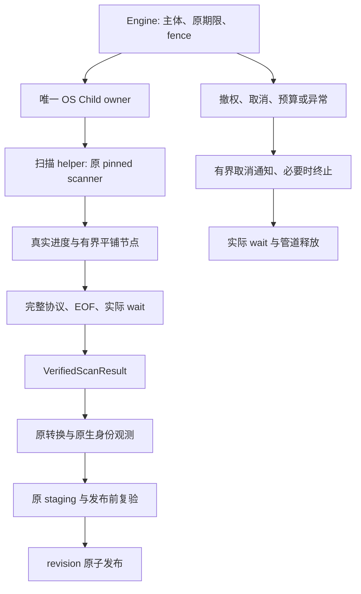

# 扫描进程真实退场实施阶段

本阶段继续同一变更的 PF-06、9.2、15.4 与相关资源／发布验收，不新建规格事实源，不关闭现有父任务。

## 源码依据与决定

固定上游 `ScanHandle` 丢弃实际线程句柄；结果发送后仍不能证明线程清理结束。上游还持有静态扫描线程池和 Windows MFT 释放线程。外层 Engine runner 的真实 join 不覆盖这些线程。

在三桌面系统将一次已成功认领的扫描放入受控 helper 进程。上游 pin、源码和14份摘要保持不变；正常结束必须完整接收结果、排空管道并实际 OS wait/reap。此证明是进程内扫描活动已停止，不承诺每个上游 TLS 析构优雅执行。

## 不变约束

- helper 不持有数据库、请求主体、token、owner 或 fencing；父 Engine 保留原 claim 时钟、20ms 检查、5s 续租及实时授权。
- 父端在原位置建立并保留 Linux/Windows 根与祖先身份租约。先保持准确绝对 root 与完整 ScanOptions，不用改变挂载排除语义的相对路径替换。
- 平铺记录迭代传输并保留原 Node 全部字段及子节点顺序；先检查帧长再分配，累计检查节点／深度／原始输出上界和完整 End。协议字节不是 staging 编码成本，不改变默认2GiB staging预算，也不双扣。
- 全字段与顺序保真指 **同一次实际 pinned 扫描交付的 Node 树**。上游 `aggregate_deduped` 在浅层并行聚合中用 `Seen` 先到者计费；同一 inode 的计费名称及其影响的大小排序不承诺在两次独立扫描间固定。不得修改上游或把所有 bytes／顺序字段全局忽略。跨扫描配对分层验收：唯一 inode 夹具的全部选项矩阵保持全字段／顺序精确；含别名且关闭去重时同样精确；开启去重时仅真实共享 inode 组的计费名称及其必然排序位置允许变化，仍须精确核对单份真实大小、唯一非零计费、每条路径身份及其余字段、父关系、根汇总和各次结果自身的 metric／name 排序。每次结果自身 codec 往返仍须全字段／顺序精确。
- 此澄清的证据边界：首次 helper／独立 pinned 配对实际出现不同计费名称，且与上述源码路径一致；后续固定八次 pinned 表征全部同次 codec 精确，但八次 **未观察到 winner 变化**。后者既不作为实际变化的证明，也不承诺跨运行确定性；不得重试直到得到希望的调度结果。
- 类型化帧必须拒绝未知 variant 与未知字段，包括无业务字段的 Cancel；公开 `Frame::Cancel` 的构造方式与 `{"type":"cancel"}` 序列化形状保持不变。真实有界 FrameReader 遇到未知 Cancel 字段应返回 InvalidData，并锁存该流失败，不得继续消费后续合法帧。此约束同时覆盖公开 codec 与独立 helper 执行协议，不以任一协议通过代替另一协议的验收。
- 业务结果、End、EOF、finished 或消息不能代替实际 OS 退出。正常 wait 不额外取消；异常／unwind 终止并回收，保留原错误及清理错误，不持数据库或 registry 锁等待。
- 正常回收还须确认自有组／Job 无活动；Unix 在此之前保留 leader，回收后禁止再操作旧数字 PGID。Windows 不以 leader 句柄 signaled 或 Job 句柄信号代替活动计数归零。现有 terminate+leader wait 不能单独证明整组退出。
- Linux 进程视图隐藏、权限不足、枚举截断或未知状态不能解释为空组。可信固定 helper 的不主动逃逸条件与观察资格须有明确证据；独立 session、两次快照或 PGID 本身不称为强沙箱，主动逃逸和源读取隔离继续单独验收。
- 共用 OS-child 层机械复用既有 Unix 保留 leader 身份与 Windows 启动前 Job／句柄 allowlist、非阻塞管道。原探针仍借原账本；扫描借自己的原账本，不伪造 ProbeBudget 或重新计时。
- helper 由受信安装／宿主配置定位并核验版本、架构及完整性，不查 PATH／工作目录、不下载、不允许远程工具提供 executable／argv，不隐藏退回 detached scanner。
- 物理退出不证明源读取隔离、云占位不下载、签名或设备能力；相应原生验收继续开放。同步内核清理可能超过业务期限，不承诺严格墙钟或 RSS 上限。

## 实施与实际验收顺序

1. 共用 Child owner：抽取现 OS 句柄／管道逻辑，保持旧探针全部错误与检查位置，补控制管道、正常回收和终止回收；执行原原生负控。
2. worker lib/bin：单向依赖 Core／pinned，不依赖 Engine／Store；有界平铺协议、真实进度、取消及全部扫描选项，执行真实 pinned 扫描配对。
3. Engine 接入：仅替换 walk/poll 段，结果须经实际退出许可后进入原转换、原生身份补充、staging 和原子发布；旧公开构造签名保留，受信 helper 配置为增量入口。
4. 打包与宿主：CLI／MCP／FFI 同版本 helper、安装 manifest 与真实宿主定位；缺失／错架构／篡改明确拒绝，不能把握手字符串当可信执行文件证明。
5. release 测量：20k／200k、宽／深目录及并发查询，报告父与 helper 的内存及采样合计、p50/p95、扫描时间、数据库／WAL增量；不以单个进程 RSS冒充整次扫描成本。

先以真实 helper 退出屏障验证：pinned 扫描结果已送达但 helper 进程仍活着，阻塞 result/drain 不完成；释放后真实 wait。屏障观察 helper 自身退场，不伪造上游 TLS。

再验真实扫描取消、撤权、预算、坏帧／早 EOF、执行失败与父 unwind：停止／回收、句柄与管道释放、零新 revision、既有错误语义。根／祖先替换及旧 leaf 移回仍精确拒绝发布，合法 sibling 活动成功。

与原扫描配对全部字段／顺序、硬链接、hidden、depth、links、one_filesystem、挂载排除及 Windows drive-root/MFT。平台未运行的行为、真实 provider、Swift/Kotlin owner 接入、Android/iOS 包／设备与签名保持未验收；桌面 helper 不替代移动 provider。
