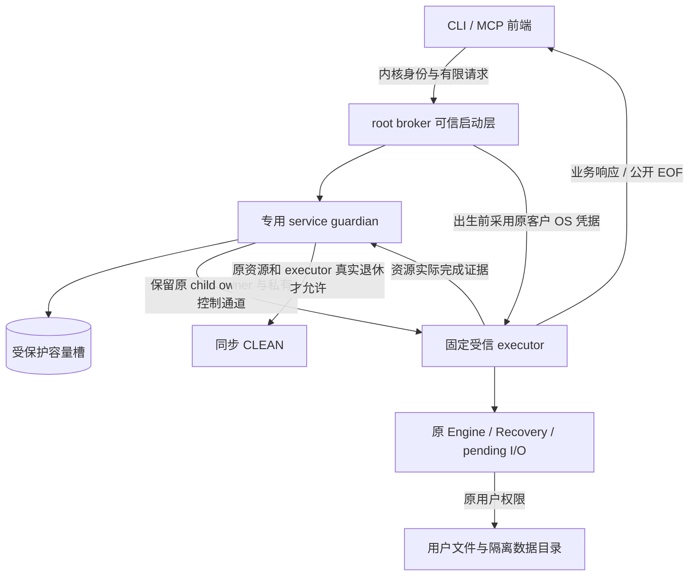

# 监督产品接线的 OS 权限保真审查

状态：架构审查与待确认职责调整，尚未实施，不替代现有验收。事实源仍为 implement-diskgraph-platform。

## 当前缺口

frontend_recovery_supervisor.md 的已确认 Linux 纵向链让专用 service UID 的监督直接持 CliEngineHost。当前 CliEngineHost 未提供原客户完整 OS 凭据执行边界。因此专用服务 UID 与前端 UID 分离虽然阻止前端伪造持久槽，却不能证明用户0700目录/0600文件的读取语义保真；服务身份自身权限也不应变成客户权限。doctor 无文件读取的启动验收不能证明此项。独立架构审查对作为全功能生产方案的直接接线给出 BLOCK，已有槽库组件继续有效。

## 建议职责调整（待确认）

root只承担启动及身份配置，业务读取前降权；不使用root Engine或DAC绕过能力，不要求用户修改文件权限。原Engine/Recovery/pending缓冲始终保留在最初executor地址空间，guardian不接收序列化owner。同UID进程不能通过伪造完成消息清槽。

客户凭据须由可信启动层获取并绑定UID/GID、有效辅助组和适用安全上下文，不能信任客户字段。镜像完整性、反同UID注入、白名单继承、私有IPC、原child/resource owner与异常死亡保持未确认是实施前置。MCP token主体与OS执行身份分别绑定；应用授权仍取token与实时数据库权限交集。

验收必须覆盖：用户0700/0600可读；仅service可读而用户不可读的路径拒绝；辅助组/ACL/链接/非UTF8语义；前端退出和EOF后原executor仍恢复且槽占用；实际资源退休后才清CLEAN；异常死亡不释放容量。三平台各自验证，不以Linux容器替代macOS/Windows。

其他候选是服务内可靠凭据模拟，但需要线程、异步任务、子进程和组权限全面隔离。临时fsuid不作为未经验证的跨平台方案。职责分离是推荐方向。本文不授予安装桌面服务，不声明这些机制已经实现，不勾选生产任务。
