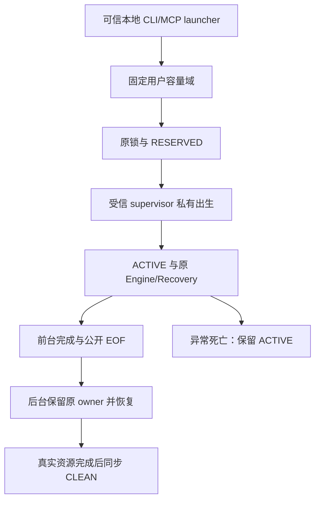

# 可信本地 supervisor 的生产接入

事实源仍为 implement-diskgraph-platform。正式 Q-02 将本地 CLI 视为 trusted local；root broker/独立服务 UID 是后续未批准的额外加固选择，不能仅凭设计稿成为产品必选依赖。保留原远程 token∩DB、固定受信镜像、出生绑定私有 IPC、原期限、跨进程容量、异常 ACTIVE 保留与真实恢复完成条件。此方案不声明抵御任意恶意同 UID 本地进程，也不安装系统服务。

## 容量域的增量验收

- 可信本地 launcher 为同一用户的相关入口提供同一持久目录句柄；目录定位不能来自远程请求或每个数据目录，launcher 的统一路由仍待实现。
- Unix 首期固定四槽，不接受请求扩大；目录必须为当前有效用户所有、0700。槽文件逐个通过原目录句柄 openat，禁止链接、多链接、异常类型和错误 owner/0600，设置 CLOEXEC，继承须另经私有出生协议。
- 每槽使用已有 SlotReservation 的真实原锁和 RESERVED/ACTIVE/CLEAN 协议。四槽实际占用时第五次 Busy；异常关闭留下原未确认记录，不能因锁已释放而重用；正常出生前 abort 可以复用。
- 不清除外来文件，不重写异常记录，不自动删除未确认目录。非法项或无法验证的平台明确拒绝。
- 真实双进程须通过同一持久目录竞争四槽，子进程退出后 ACTIVE 仍阻止复用。Windows 原目录/ACL 与锁生命周期另行实施，不以 Unix 通过替代。

当前仍未完成：统一 launcher 路由、监督原角色接管、公共 EOF/HTTP停止、Windows容量域及同 SHA 全平台验收。四槽数是本地部署默认容量，不是每主体SSE配额；不能混用两者。

## CLI 宿主启动与原退休接入候选

Linux/macOS 的受管理 CLI 入口已接到固定当前 OS 用户目录：通过 getpwuid_r 取得 home，不采用 HOME 或 data_dir；逐组件 held-directory openat/O_NOFOLLOW 打开 `.local/state/diskgraph/recovery`，只创建缺失目录，不修复已有权限，拒绝其他用户所有或组/其他可写祖先。最终域须 current euid／0700；四槽仍采用原持久锁协议。

容量预留发生在 Engine 构造前。原受信扫描镜像的验证顺序不变；构造自身不启动 runner/原生工作，也不交出 Engine。构造失败只在原期限内显式 abort_before_birth，失败保留原主错误与取消诊断；构造成功后先同步 ACTIVE，再交消费者。execute 的正常业务失败沿原 SupervisorOwner 绑定和退休，原 Arc 必须真正退休，原 Recovery 完成后才能 CLEAN。错误绑定和 Pending 保留全部原材料。

隔离测试红灯确证旧顺序的未确认槽拒绝发生在数据库出生后；修正顺序后 CLI 宿主8/0、容量域6/0/1（正常父用例显式调用子夹具）、目录定位3/0，Engine/CLI all-target Clippy 通过。普通库镜像夹具仅验证容量与空原池绑定，不执行该镜像，不宣称真实扫描/产品二进制验收。macOS APFS 不接受无效 UTF-8 目录创建，因此该夹具使用合法名字；Linux 无损非UTF路径用例仍待原生 CI。

单元测试的容量目录显式隔离，真实镜像验证仍走同一产品路径；不让并行测试占用用户产品全局域。此测试注入只存在 cfg(test)，没有生产参数或远程输入。当前进程仍同步等待原退休，不具备有限前台退出；MCP、Windows及真实监督出生／IPC尚未接入，父门禁保持打开。

最新分类回归先确认损坏槽错误被错误映射而失败，再复用 EngineError::from(SlotError) 后通过：损坏记录 needs_attention，异常 RESERVED/ACTIVE recovery_unconfirmed；二者均在数据库出生前拒绝并保留原记录。目录夹具通过 getpwuid_r 的真实 home 创建隔离子目录并从根逐组件打开，当前 macOS 默认 home 正控3/0；不创建产品容量域，也不将本机结果推广为所有链接 home 的兼容性证明。

## Unix MCP 实际入口接入

MCP binary 在镜像与传输安全校验后、数据库/bootstrap之前预留同一当前用户固定四槽域；同一原启动deadline覆盖准入和构造，迟到时不交出服务启动runner。构造失败仅尝试原deadline取消原RESERVED，保留主错误与清理错误；成功ACTIVE后启动原runner。协议catch外保留同一service clone，协议service实际释放和runner实际join后，消费原clone，将原Engine/Recovery/ACTIVE交SupervisorOwner，原引用或资源Pending时不能CLEAN。stdio本地管理引导与HTTP/SSE远程默认拒绝保持；Unix启动业务错误按原分类exit_code返回。

实际准入先后顺序和期限耗尽回归均在缺检查版本失败，最终MCP binary测试7/0，覆盖真实ACTIVE四槽拒绝、本地/远程授权、构造失败原取消以及原service clone阻止退休。普通三字节镜像仅为构造生命周期夹具，不执行原生child；不声称真实产品socket或scanner资格。all-target Clippy通过。Windows路径保留，独立监督出生、私有IPC及有限公开EOF仍未完成，不勾选父任务。

## 新增源码组织门禁补验

6029b83 的 Linux stable job112764052987 实际失败目标为 engine/source_layout：本批恢复域对象缺中文来源，home的两个pub(super)函数缺参数/返回契约。已补齐注释，原规范门禁与生产行为不改。当前本地engine门禁5/1，仅剩受保护未提交Linux候选四处文档缺项，不能称全通过；本批三处报错已消失。MCP测试path覆盖改为标准managed_service_host/tests.rs挂载，原测试内容不变；service_source_layout11/0、binary行为7/0。两个独立审查批准；提交后的完整源码门禁仍须新CI证明。
