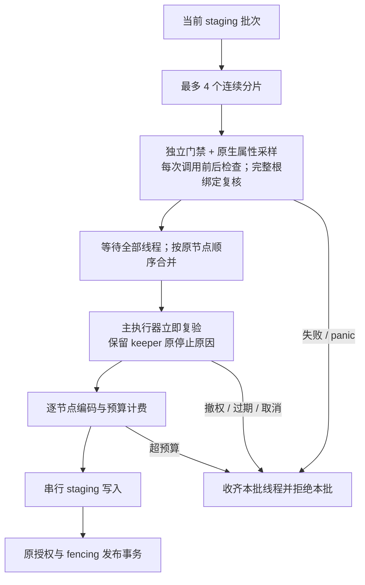

# Windows 有界并发属性采样

同次扫描按现有 write_batch_nodes 划分批次，每批最多4个连续分片/工作线程，输出按原节点顺序合并。每个线程使用同一 job、owner/fence、原始开始时间、权限和取消标记创建独立采样门禁，每次原生调用前后检查，持久状态复验仍为最多20ms。保留所有逐组件属性读取、每节点前后根名称绑定核验、云非物化策略；不改 vendored scanner、任务总期限或300秒验收门禁。

原 keeper 原因槽只由主执行器消费；线程取消不能提前取走原错误。主执行器收齐线程后、解码计费/暂存前立即复验，取消/撤权/fence失效不产生暂存或发布。线程任一失败整批拒绝，panic由原父执行链接管。采样额外结果最多当前批次，不建立无界队列；其内存和同步I/O协作取消不构成严格RSS或硬抢占保证。每节点实际元数据编码、预算计费、串行写入与最终发布fence保持。

先验证实际重叠、最多4线程、稳定顺序、空批次、原错误与panic传播，再接入Windows，执行原生撤权/取消/期限/替换回归和Release实际负载。未取得相应证据前不关闭200k/300秒、跨平台最终门禁或生产监督生命周期。

纯Rust串行对照先出现真实红灯：2通过/1失败，四分片重叠只观察到1个工作者；实现后3/3，实际Cargo Engine目标同为3/3。Windows首轮13项为9通过/4失败，四项在NativeScanEngine构造时因未绑定产品worker材料返回Unsupported，未进入被测行为；原失败日志保留。补齐先前真实Cargo产品worker与driver绑定，并验证其原摘要后，同一源码原生采样/期限13、根/链接/身份13、keeper原错误4均通过，Engine全targets Clippy拒绝警告通过。未改断言、期限、并发设置或生产权限。Windows三个实际源码摘要与本机一致，详见docs/benchmarks/windows_parallel_observation_2026_10_08/native_regressions.json；这些定向结果不替代默认并发全量或Release性能。

## Release 实测与验收边界

台式机 Windows 11、i7-13700K、32 GiB，Rust 1.99.0 MSVC。同一台机器原串行扫描两次为72.011秒和73.057秒；当前候选20k扫描32.914秒，完整流程59.031秒、6/6通过。夹具创建9.779秒、清理11.085秒，32次查询/4客户端的p50为63.258毫秒、p95为71.834毫秒，数据库与WAL合计54,996,992字节。该候选仅一次实测，不能据此宣称稳定性能分位数或长期运行通过。

根绑定仍执行40,003次、每次8个链句柄；诊断累计73.853秒为四个采样线程各次调用耗时之和，可能超过扫描墙钟时间，不表示CPU用时。采样与编码阶段墙钟19.972秒、暂存写入0.443秒。真实构建材料、源码/程序摘要和阶段日志保存在 `docs/benchmarks/windows_parallel_observation_2026_10_08/release20k.json`。

本机Engine采样目标3/3、Engine全targets Clippy、工作区包格式检查与OpenSpec严格校验通过。Windows额外授权回归、默认并发全量和200k完整300秒流程仍待候选验证。远程隧道中断时200k启动请求返回连接失败，未取得Job句柄，不能标为运行中或通过。当前候选为基础9ade861e加明确源码摘要，尚不代表最终提交的跨平台验收。

